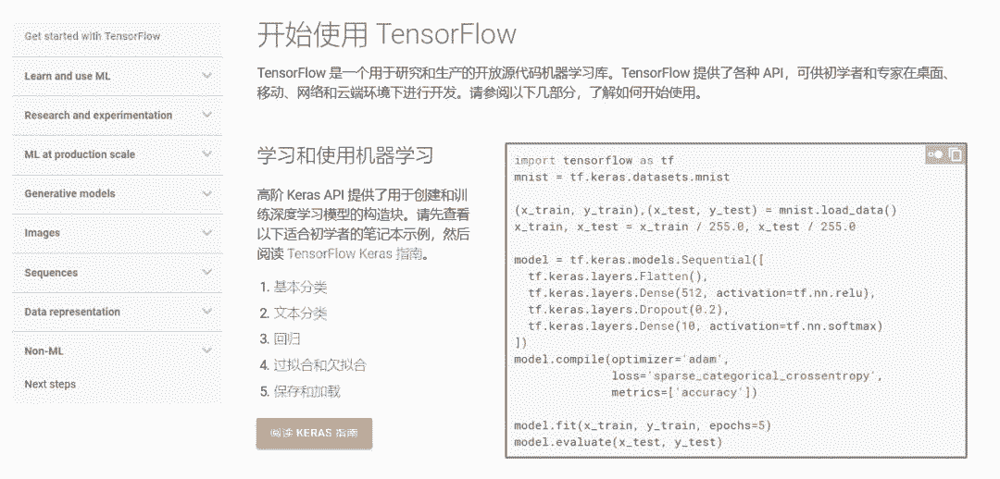
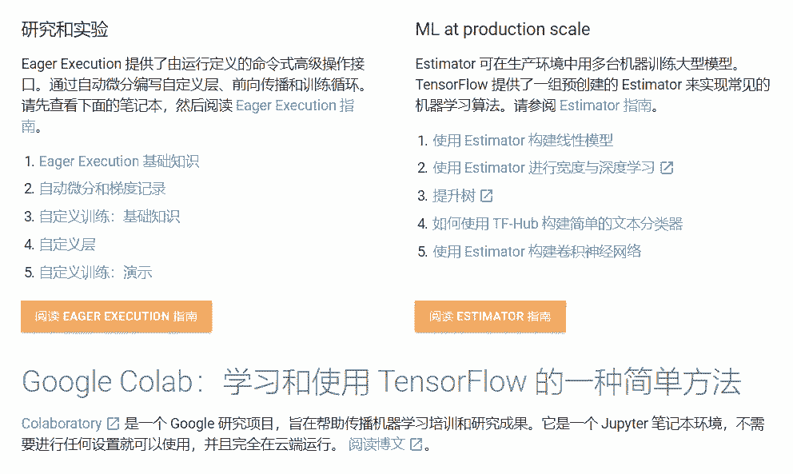

# 资源 | 英语不行？你可以试试 TensorFlow 官方中文版教程

机器之心编辑

**参与：思源**

> 现在 TensorFlow 有官方中文版教程啦，以前的英文版 Tutorials 有了对应的中文翻译。各位还在 TensorFlow 门前徘徊的开发者们，现在可以对着中文教程学习各种流行模型啦。

<mp-miniprogram class="miniprogram_element" data-miniprogram-appid="wxf424e2f3e2f94500" data-miniprogram-path="pages/technology/technology?id=58170354-4618-4a25-a2fe-c4ed169f2177&amp;from=weapp" data-miniprogram-nickname="机器之心 Synced" data-miniprogram-avatar="http://mmbiz.qpic.cn/mmbiz_png/f3g058loLBj0Pib4UhuCFagffSB1RHImwskFzvic6mSp2LDhuerbXxeqqv0b63wSt2Pas7MicNWIcia358rlnhiaVag/640?wx_fmt=png&amp;wxfrom=200" data-miniprogram-title="TensorFlow" data-miniprogram-imageurl="http://mmbiz.qpic.cn/mmbiz_jpg/KmXPKA19gW8aQfbUpicJiaAH0COiaYYTIuwVCbs3tKkBxl7o9u0PJtp2Cg9qH0VEWvBY99Tag1qFJePQ9z7Q9KYHg/0?wx_fmt=jpeg"></mp-miniprogram>

TensorFlow 最近提供了官方中文版教程（Tutorials）和中文版指南（Guide）。其中教程主要介绍了 TensorFlow 的基本概念，以及各种基础模型的简单实现方法，这些模型基本上都是用 Keras 等易于理解的高阶 API 完成。而指南则深入介绍了 TensorFlow 的工作原理，包括高阶 API、Estimator、低阶 API 和 TensorBoard 等。

项目地址：https://tensorflow.google.cn/tutorials/?hl=zh-cn

**中文版教程**

TensorFlow 是一个用于研究和生产的开源机器学习库。TensorFlow 提供了各种 API，可供初学者和专家在台式电脑、移动设备或云端环境下进行开发。而中文版教程的目的是希望能为初学者提供了解及入门 TensorFlow 的知识，包括用 Keras 实现最基本的分类和回归模型、使用 Eager Execution 构建定制化神经网络、使用 Estimator 构建大规模机器学习等。

如上展示了 TensorFlow 第一步学习的一些内容，其中第一个基本分类介绍了如何使用全连接网络处理 Fashion-MNIST 数据集，这一教程完整地介绍了 TensorFlow 的主要流程，剩下的 4 个初步教程也会一步步教你怎样使用它。

除了入门的 Keras，用于研究的 Eager Execution 和用于大规模训练的 Estimator 也都有中文介绍。不过它们同样会提供一些 Github 项目，这些项目大多数还都是保留英文，这两部分只有介绍性的文章会提供中文。

后面剩下的就是大量前沿模型了，这些模型很多都提供的是对应 Github 地址或 Colab 教程地址，因此它们大部分也都是英文的，不过既然入了门，再理解这些模型也就没问题了。总体而言，这些教程可以分为生成模型、视觉模型、序列模型和数据表征等 18 种模型。

最后，教程部分还提供了后续学习计划，包括详细了解 TensorFlow 和机器学习两部分。其中 TensorFlow 提供了指南、TensorFlow.js 和 TFLite 等学习路径，机器学习提供了 CS231n、机器学习速成课程、CS 20 等课程推荐。

**中文指南**

如果读者本来就有比较好的基础，那么我们在实践中可能会遇到很多具体问题，例如调用 TPU、使用静态计算图、或者使用 TensorBoard 进行可视化等。当遇到这些特定问题时，我们可以看一看 TensorFlow 指南，它可能会提供详细的介绍。

中文指南主要分为以下部分，这些内容都有中文介绍，所以阅读性还是挺高的。

**高阶 API**

*   Keras：用于构建和训练深度学习模型的 TensorFlow 高阶 API。

*   Eager Execution：一个以命令方式编写 TensorFlow 代码的 API，就像使用 NumPy 一样。

*   Estimator：一个高阶 API，可以提供已准备好执行大规模训练和生产的完全打包的模型。

*   导入数据：简单的输入管道，用于将您的数据导入 TensorFlow 程序。

**Estimator**

*   Estimator：了解如何将 Estimator 用于机器学习。

*   预创建的 Estimator：预创建的 Estimator 的基础知识。

*   检查点：保存训练进度并从保存的地方继续训练或推断。

*   特征列：在不对模型做出更改的情况下处理各种类型的输入数据。

*   Estimator 的数据集：使用 tf.data 输入数据。

*   创建自定义 Estimator：编写自己的 Estimator。

**加速器**

*   使用 GPU：介绍了 TensorFlow 如何将操作分配给设备，以及如何手动更改此类分配。

*   使用 TPU：介绍了如何修改 Estimator 程序以便在 TPU 上运行。

**低阶 API**

*   简介：介绍了如何使用高阶 API 之外的低阶 TensorFlow API 的基础知识。

*   张量：介绍了如何创建、操作和访问张量（TensorFlow 中的基本对象）。

*   变量：详细介绍了如何在程序中表示共享持久状态。

*   数据流图：这是 TensorFlow 将计算表示为操作之间的依赖关系的一种表示法。

*   会话：TensorFlow 跨一个或多个本地或远程设备运行数据流图的机制。如果您使用低阶 TensorFlow API 编程，请务必阅读并理解本单元的内容。如果您使用高阶 TensorFlow API（例如 Estimator 或 Keras）编程，则高阶 API 会为您创建和管理图和会话，但是理解图和会话依然对您有所帮助。

*   保存和恢复：介绍了如何保存和恢复变量及模型。********

****本文为机器之心编辑，**转载请联系本公众号获得授权****。**

✄------------------------------------------------

**加入机器之心（全职记者 / 实习生）：hr@jiqizhixin.com**

**投稿或寻求报道：**content**@jiqizhixin.com**

**广告 & 商务合作：bd@jiqizhixin.com**