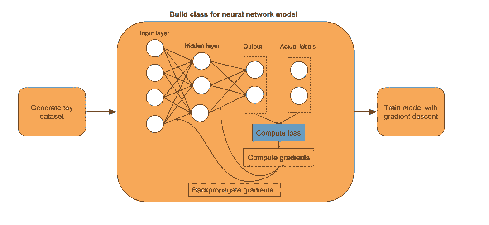
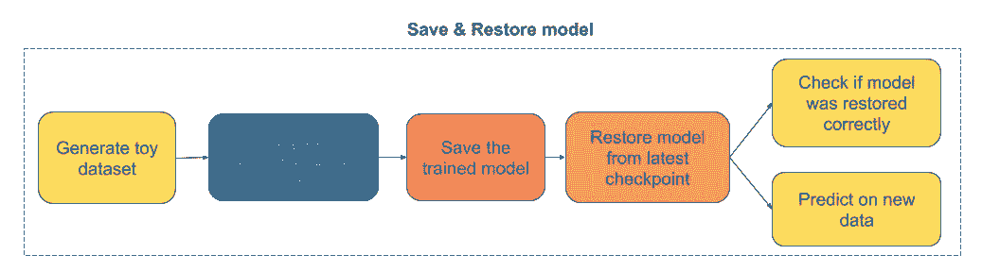
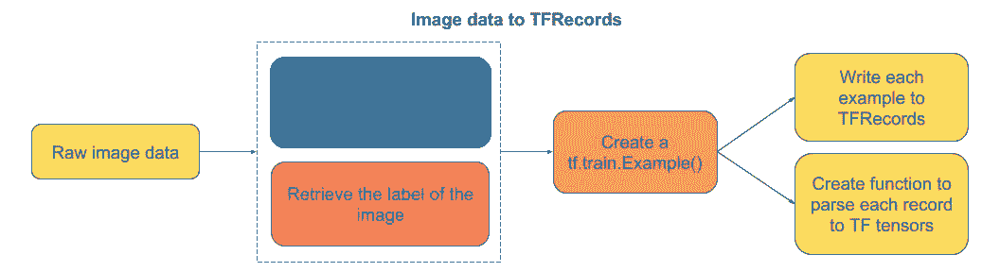
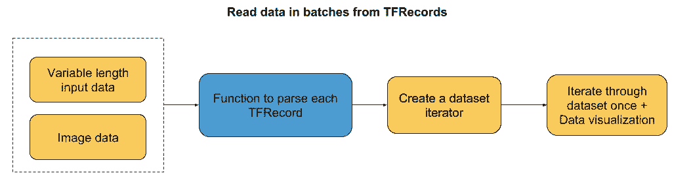
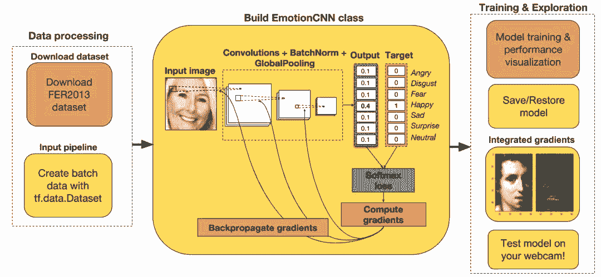
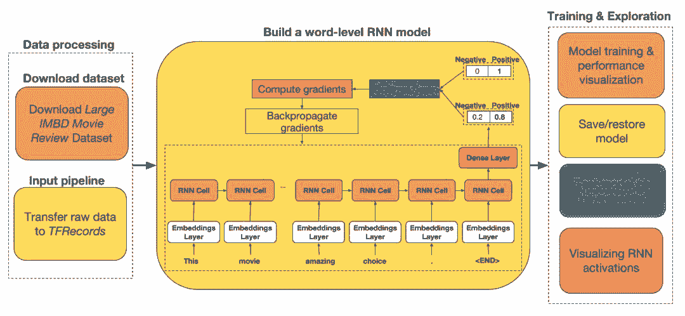
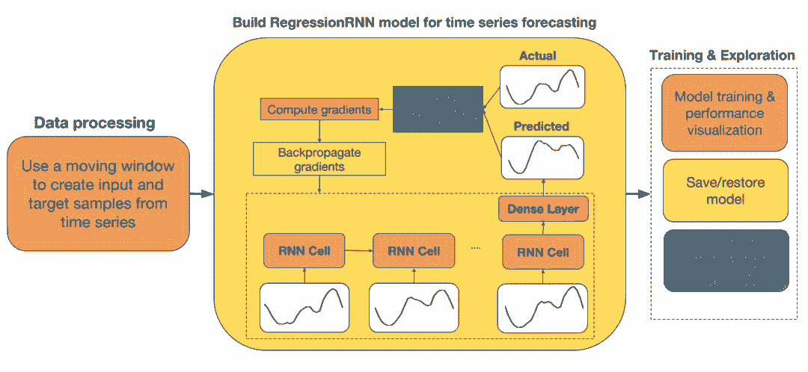

# 入门 | TensorFlow 的动态图工具 Eager 怎么用？这是一篇极简教程

选自 Github

**作者：****Madalina Buzau**

****机器之心编译****

**参与：王淑婷、泽南**

> > > 去年 11 月，Google Brain 团队发布了 Eager Execution，一个由运行定义的新接口，为 TensorFlow 这一最为流行的深度学习框架引入了动态图机制。Eager 的出现使得开发变得更为直观，从而让 TensorFlow 的入门难度大为降低。本文介绍了使用 TensorFlow Eager 构建神经网络的简单教程。
> > 
> > 项目链接：https://github.com/madalinabuzau/tensorflow-eager-tutorials
> > 
> > 本文旨在帮助那些希望通过 TensorFlow Eager 模式获得深度学习实践经验的人。TensorFlow Eager 可以让你像使用 Numpy 那样轻松地构建神经网络，其巨大优势是提供了自动微分（无需再手书反向传播，(*^▽^*)！）。它还可以在 GPU 上运行，使神经网络训练速度明显加快。
> > 
> > 谷歌大脑的开发团队曾表示，Eager Execution 的主要优点如下：
> > 
> > *   快速调试即刻的运行错误并通过 Python 工具进行整合
> >     
> >     
> > *   借助易于使用的 Python 控制流支持动态模型
> >     
> >     
> > *   为自定义和高阶梯度提供强大支持
> >     
> >     
> > *   适用于几乎所有可用的 TensorFlow 运算
> >     
> >     
> > 
> > 我会努力让每个人都能理解这份教程，因此我将尽量在无需 GPU 处理的前提下解决问题。
> > 
> > 教程中使用的 TensorFlow 版本为 1.7 版。
> > 
> > **开始**
> > 
> > 01\. 构建一个简单的神经网络——下图将教你如何在一个合成生成的数据集上用 TensorFlow Eager 模式构建和训练一个单隐藏层神经网络。
> > 
> > 
> > 
> > 02\. 在 Eager 模式中使用度量——下图将教你针对三种不同的机器学习问题（多分类、不平衡数据集和回归），如何使用与 Eager 模式兼容的度量。
> > 
> > **简单但实用的知识**
> > 
> > 03\. 保存和恢复训练好的模型——下图将教你如何保存训练好的模型并随后恢复它以对新数据进行预测。
> > 
> > 
> > 
> > 04\. 将文本数据传输到 TFRecords——下图将教你如何把可变序列长度的文本数据存储到 TFRecords 中。当使用迭代器读取数据集时，数据可以在批处理中快速填充。
> > 
> > 
> > 
> > 05\. 将图像数据传输到 TFRecords——下图将教你如何把图像数据及其元数据传输到 TFRecords 上。
> > 
> > 
> > 
> > 06\. 如何批量读取 TFRecords 数据——下图将教你如何从 TFRecords 中批量读取可变序列长度数据或图像数据。
> > 
> > 
> > 
> > **卷积神经网络（CNN）**
> > 
> > 07\. 构建一个用于情绪识别的 CNN 模型——下图将教你使用 TensorFlow Eager API 和 FER2013 数据集从零开始构建一个 CNN 模型。在完成以后，你将能使用网络摄像头试验自己构建的神经网络，这是一个很棒的尝试！
> > 
> > 
> > 
> > **循环神经网络（RNN）**
> > 
> > 08\. 构建一个序列分类的动态 RNN——学习如何使用可变序列输入数据。下图将介绍如何使用 TensorFlow Eager API 和 Stanford Large Movie Review Dataset 来构建动态 RNN。
> > 
> > 
> > 
> > 09\. 构建一个时序回归 RNN——下图展示了如何为时序预测构建一个 RNN 模型。
> > 
> > 
> > 
> > ****本文为机器之心编译，**转载请联系本公众号获得授权****。**
> > 
> > ✄------------------------------------------------
> > 
> > **加入机器之心（全职记者 / 实习生）：hr@jiqizhixin.com**
> > 
> > **投稿或寻求报道：**content**@jiqizhixin.com**
> > 
> > **广告 & 商务合作：bd@jiqizhixin.com**