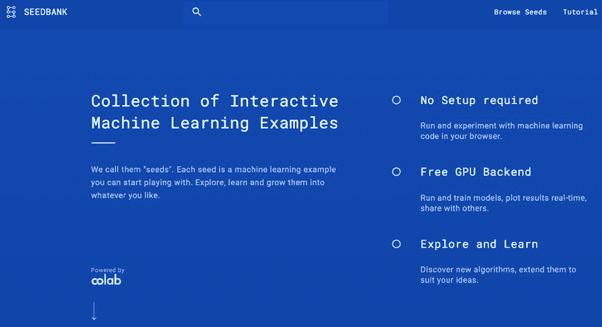
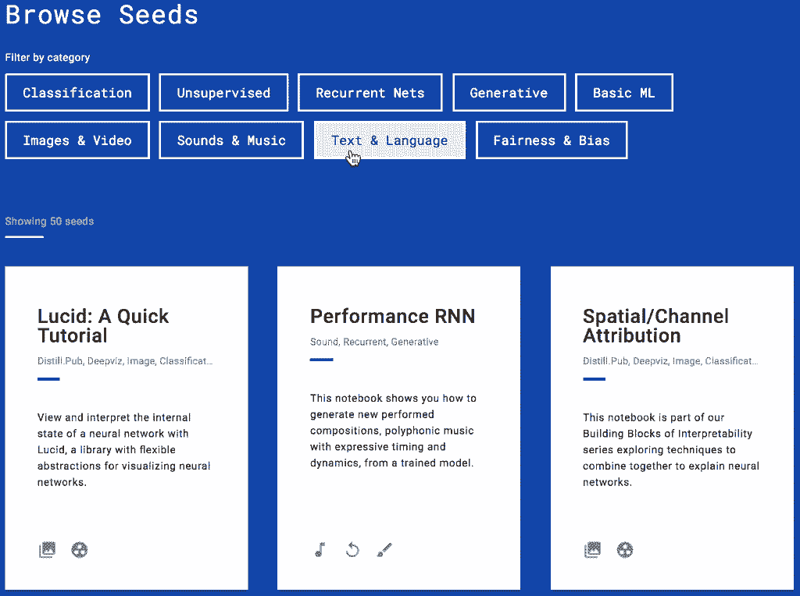
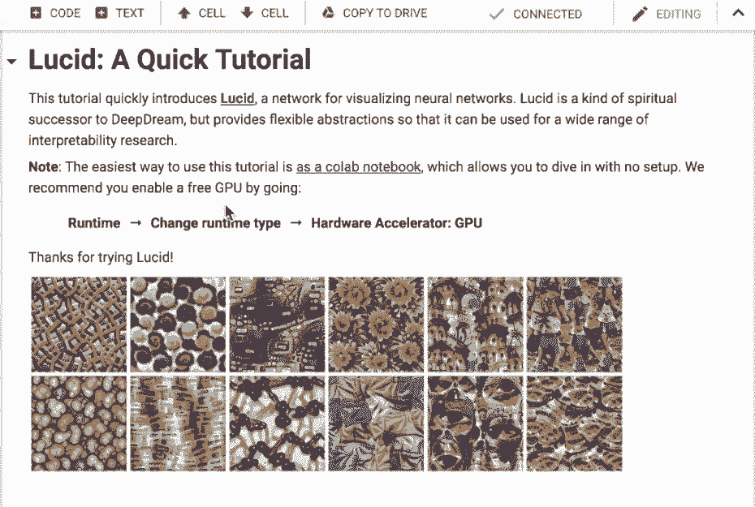
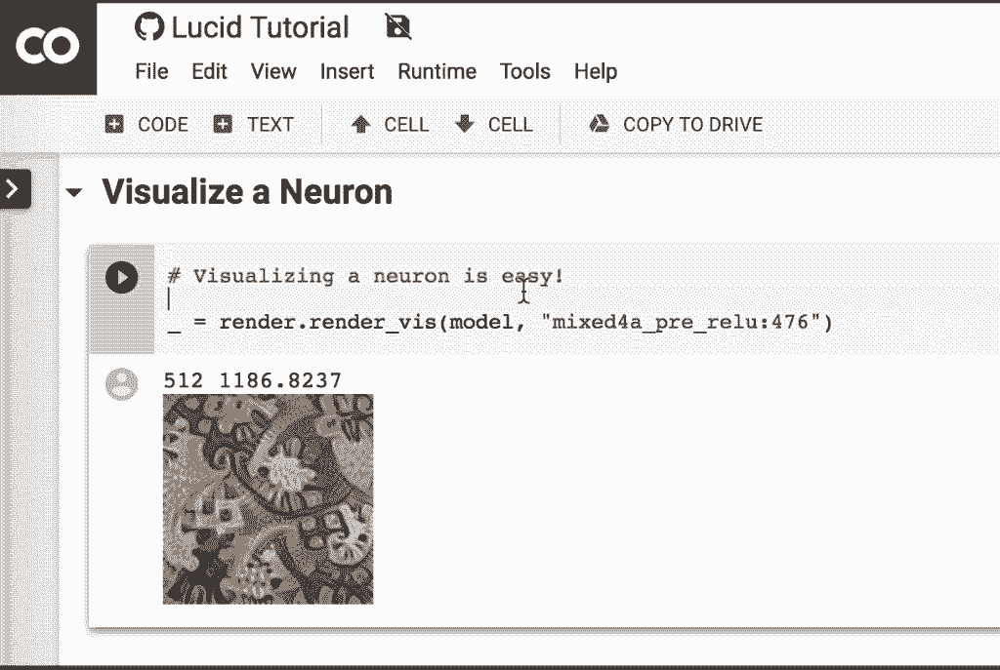

# 资源 | TensorFlow 推出新工具 Seedbank：即刻使用的预训练模型库

选自 TensorFlow

**作者****：Michael Tyka**

**机器之心编译**

**参与：路、王淑婷**

> 今日，TensorFlow 推出新工具 Seedbank，用户可在该平台上查找大量机器学习示例（包括教程、研究文章等等），这些示例还具备相应的 Colab notebook，使应用更加简单明了。

*   工具链接：http://tools.google.com/seedbank/

发现并开始新的机器学习项目有点艰难。也许你有一个关于项目的模糊想法，正在寻找从何处入手。或者你正在寻找灵感，看看有哪些可能。

今天，TensorFlow 推出 Seedbank，这是一个发现交互式机器学习示例的地方，你可以直接从浏览器运行，无需其他设置。每个示例都是启发你的一颗小种子，你可以对其进行编辑、扩展，甚至将其融入自己的项目和想法中，例如数据分析问题、艺术项目等等。

近期谷歌以 Colab notebook 的形式发布了很多机器学习代码示例。Colaboratory 是谷歌的 Jupyter notebook 环境，允许用户使用谷歌提供的免费 GPU 通过浏览器直接运行代码，无需任何设置。

这些示例包括在 tensorflow.org 上的新入门经验、机器学习速成教程、distill.pub 上的研究文章，以及 tensorflow.org 上越来越多的教程（如神经机器翻译教程）。TF Hub 还提供多种可直接应用的预训练机器学习模块，它们通常具备 Colab notebook 来说明如何应用，使操作更加简单。

现在 Seedbank 提供了一个平台来搜索 Colab 支持的机器学习示例。你可以使用最高级类别（top-level category）来缩小探索范围，在 notebook 中搜索关键词。每个种子都有一个预览，可以让你快速评估是否想要继续探索。一旦你点击前往 Colab notebook，你将立刻被连接到一个 GPU 核，然后就可以通过示例或教程开始工作。现在，Seedbank 只能追踪谷歌发布的 notebook，不过未来会索引用户创建的内容。TensorFlow 的工作人员将尽己所能定期更新 Seedbank，并确保更新 TensorFlow.org 上的新内容。

但最好的一点是 Colab 可以让你编辑 notebook、将副本保存到 Google Drive，并与朋友或在社交媒体上共享那些衍生品，以及可以一直使用 Colab GPU 进行快速训练和推断。你还可以从 Google Drive 中读取数据，使用 Google Drive 导入大型数据集也只是一瞬间的事儿。查看该网址：https://tools.google.com/seedbank/seed/5646239437684736，在 Seedbank 上查看进行此类操作的示例。

希望大家能够更快地找到自己的 idea，并且种下美妙想法的种子。**

*原文链接：https://medium.com/tensorflow/seedbank-discover-machine-learning-examples-2ff894542b57*

****本文为机器之心编译，**转载请联系本公众号获得授权****。**

✄------------------------------------------------

**加入机器之心（全职记者 / 实习生）：hr@jiqizhixin.com**

**投稿或寻求报道：**content**@jiqizhixin.com**

**广告 & 商务合作：bd@jiqizhixin.com**