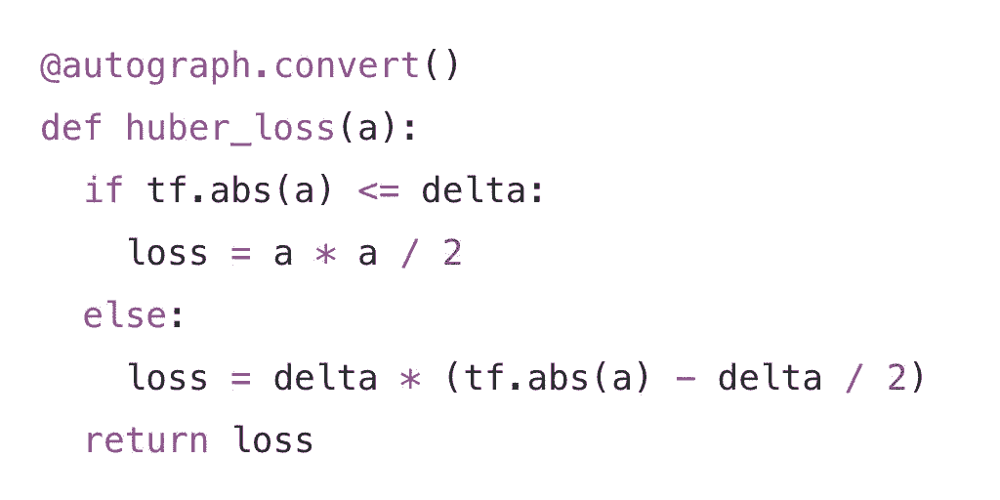

# TensorFlow 发布重要更新 AutoGraph，自动将 Python 转化为 TF 计算图

选自 Medium

**作者：Alex Wiltschko、Dan Moldovan、Wolff Dobson**

**机器之心编辑部**

> 近日，谷歌发布了一项新的 TensorFlow 工具「AutoGraph」，能将 print() 函数和其它 Python 代码转化为纯 TensorFlow 计算图代码。这一工具极大地加强了 TensorFlow 在调用纯 Python 语句时的性能，开发者可以轻松在 TensorFlow 上实现更好的模型性能。

项目地址：https://github.com/tensorflow/tensorflow/tree/master/tensorflow/contrib/autograph



一般而言，在写 TensorFlow 代码时，我们需要构建整个算法的计算图，或者规划所有数据流的计算过程，然后再投入数据并快速执行整个或局部计算图。当然因为当前 PyTorch 和 Keras 等动态计算图的流行，TensorFlow 也发布了 Eager Execution，它可以帮助用户自动构建计算图。但一般的 TensorFlow 还是常使用静态计算图的方式，因为它的构建逻辑与部署都非常有优势。

然而对于入门开发者而言，理解静态计算图是比较困难的，因此很容易引起开发者的困惑。尤其是在一些涉及更复杂模型场景中，例如使用 if 和 while 等 Python 语句，或使用 print() 与接受结构化输入等，它们都会引起我们对计算图的困惑。

所以为什么 TensorFlow 需要使用计算图呢？计算图允许各种各样的优化，例如移除公共的子表达式和内核融合等。此外，计算图简化了分布式训练和部署时的环境配置，因此它们可被视为一种独立于平台的模型计算形式。这一特性对于在多 GPU 或 TPU 上的分布式训练极其重要，当然基于 TensorFlow Lite 在移动端和 IoT 上部署模型也非常重要。

以下是一个非常简单的操作示例：

```py
def huber_loss(a):
  if tf.abs(a) <= delta:
    loss = a * a / 2
  else:
    loss = delta * (tf.abs(a) - delta / 2)
  return loss
```

使用 Eager Execution，这只是「正确运行」而已，但是此类操作可能会比较慢，因为 Python 解释器众所周知在实现地比较慢，且需要的计算比较复杂，这会令它错过许多程序优化的机会。

为了给图执行做好准备，你需要重写代码，使用 tf.cond() 等语句，但是这很繁琐且难以实现。AutoGraph 可以自动完成该转换，保持 Eager 编程的简易性，同时还提升了计算图执行的性能。

在该示例中，我们可以使用 autograph.convert() 布置我们的函数，AutoGraph 将自动生成图可用的代码。

使用 AutoGraph，由于 decorator，下列代码：

```py
@autograph.convert()
def huber_loss(a):
  if tf.abs(a) <= delta:
    loss = a * a / 2
  else:
    loss = delta * (tf.abs(a) - delta / 2)
  return loss
```

在执行时变成如下代码：

```py
def tf__huber_loss(a):
  with tf.name_scope('huber_loss'):

    def if_true():
      with tf.name_scope('if_true'):
        loss = a * a / 2
        return loss,

    def if_false():
      with tf.name_scope('if_false'):
        loss = delta * (tf.abs(a) - delta / 2)
        return loss,
    loss = ag__.utils.run_cond(tf.less_equal(tf.abs(a), delta), if_true,
        if_false)
    return loss 
```

接下来，你可以调用你的代码，就像使用一般的 TensorFlow op 一样：

```py
with tf.Graph().as_default():  
  x_tensor = tf.constant(9.0)

  # The converted function works like a regular op: tensors in, tensors out.
  huber_loss_tensor = huber_loss(x_tensor)

  with tf.Session() as sess:
    print('TensorFlow result: %2.2f\n' % sess.run(huber_loss_tensor)) 
```

如你所见，AutoGraph 连接起 Eager execution 和 Graph。AutoGraph 使用 Eager-style 的 Python 代码，然后将其转换成图生成代码。

AutoGraph 不只是有用宏命令的集合，它还可以使用源代码转换来覆写 Python 语言的任意部分，包括控制流、函数应用和分配，生成样板代码，重构惯用 Python，以使转换成图的过程变得简单。

使用任意编译器，都会对错误信息可读性产生担忧；为此，AutoGraph 可以创建错误信息，并堆叠揭示原始源代码中错误来源的多个轨迹，而不是仅仅显示生成代码的 reference。

**可运行示例**

那么，AutoGraph 可以为我们做什么呢？以下有一些示例代码，它们可以直接转换为图代码而不需要任何的改写。如果你想实际运行这些操作，谷歌在这个 GitHub 的 Colab 中提供了一个 notebook 可供使用。

GitHub：https://github.com/tensorflow/models/blob/master/samples/core/guide/autograph.ipynb

Colab：https://colab.research.google.com/github/tensorflow/models/blob/master/samples/core/guide/autograph.ipynb

以下我们使用循环和分支来测试「科拉兹猜想」。注意，考虑到多样性，我们将不使用 decorator，而使用 AutoGraph 的.to_graph() 函数将其转换为图。

```py
def collatz(a):
    counter = 0
    while a != 1:
        if a % 2 == 0:
            a = a // 2
        else:
            a = 3 * a + 1
        counter = counter + 1
    return counter

graph_mode_collatz = autograph.to_graph(collatz)
# The code is human-readable, too
print(autograph.to_code(collatz))

collatz_tensor = graph_mode_collatz(tf.constant(n)) 
```

AutoGraph 可以支持任意的嵌套控制流，例如：

```py
def f(n):
  if n >= 0:
    while n < 5:
      n += 1
      print(n)
  return n 
```

AutoGraph 允许你在循环中添加元素到数组中。为了让其工作，我们使用一些 AutoGraph 辅助工具，set_element_type 和 stack。

```py
def f(n):
  z = []
  # We ask you to tell us the element dtype of the list
  autograph.set_element_type(z, tf.int32)
  for i in range(n):
    z.append(i)
  # when you're done with the list, stack it
  # (this is just like np.stack)
  return autograph.stack(z) 
```

我们还支持 break、continue，甚至 print 和 assert 等语句。当转换完成后，这个片段的 Python assert 使用合适的 tf.Assert 将其转换为 TensorFlow 计算图。

```py
def f(x):
  assert x != 0, 'Do not pass zero!'
  return x * x 
```

具备轻易地添加循环、控制流等到图上的能力意味着可以很容易将训练循环转移到图中。可以在这个 Colab 的 notebook 中找到一个示例，其中使用了一个 RNN 训练循环，并用一个 sess.run() 调用来执行它。当你需要传递一个完整的训练循环到加速器时，这很有用，比通过 CPU 控制器管理训练过程更好。

AutoGraph 打开了构建和训练模型的新思路。谷歌在未来将基于开发者社区建议尝试添加更多的功能到 AutoGraph 上，请提出你的建议吧！

提建议：https://github.com/tensorflow/tensorflow/issues

**Graph Performance 对比 Eager Execution**

Eager Execution 相当合用，但图更快。尽管对比基准较为复杂（由应用以及硬件配置决定），但在一些简单示例中我们可以看到，当从 Eager 转换到 AutoGraph 代码时有极大的加速，使用了大量 if 和 while 等语句。

最终，AutoGraph 让你可以在 GPU 和 Cloud TPU 这样的加速器硬件上使用动态和流控制极严模型，这对在大量数据上训练大型模型非常有帮助。

**AutoGraph 和 Eager Execution**

虽然使用 Eager Execution，你也能通过 tf.contrib.eager.defun 对部分代码根据计算图执行。但这需要你使用 tf.cond() 这样计算图类的 TensorFlow ops。未来，AutoGraph 将无缝与 defun 融合，让你用简单的 eager-style Python 编写图代码。当成为现实时，通过选择性的把 eager 代码转换到图分段，你就可以期待使用 AutoGraph 加速热点了。

**结论**

AutoGraph 能够让你轻松的建立在 TensorFlow 图中轻松运行的直观性、复杂模型。这是目前在 contrib 中运行的实验性工具，但我们期望能够尽快把它加入到 TensorFlow 核心模块。

*原文链接：https://medium.com/tensorflow/autograph-converts-python-into-tensorflow-graphs-b2a871f87ec7*

****本文为机器之心编译，**转载请联系原作者获得授权****。**

✄------------------------------------------------

**加入机器之心（全职记者 / 实习生）：hr@jiqizhixin.com**

**投稿或寻求报道：**content**@jiqizhixin.com**

**广告 & 商务合作：bd@jiqizhixin.com**