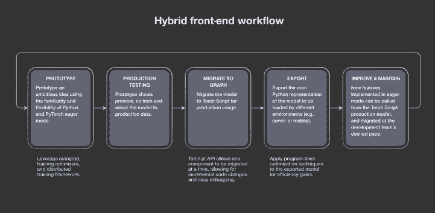
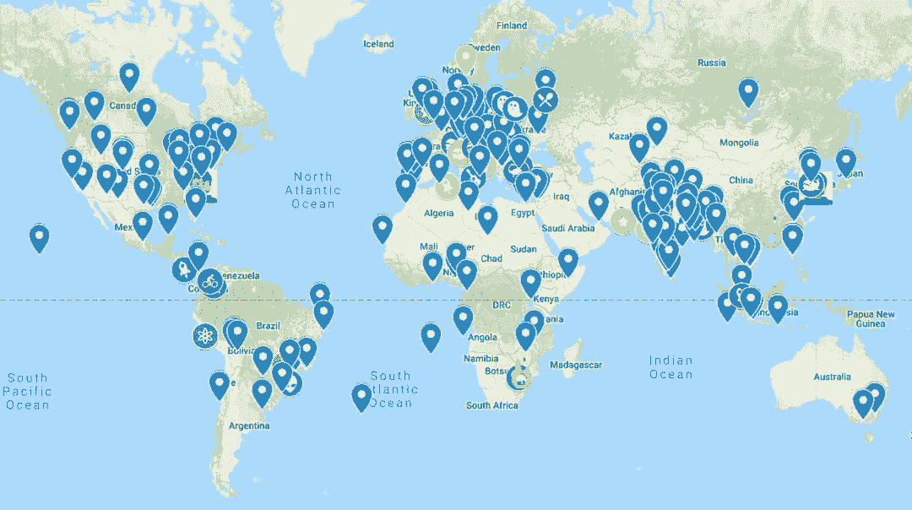

# PyTorch 1.0 正式版发布了！

选自 code.fb

**作者：****ZACH DEVITO、YANGQING JIA、DMYTRO DZHULGAKOV、SOUMITH CHINTALA、JOSEPH SPISAK**

****机器之心编译****

> 在今年 10 月举办的首届 PyTorch 开发者大会上，Facebook 宣布了有关该框架生态的一系列更新，包括软件、硬件和教育方面的合作。同时放出了 [PyTorch 1.0 预览版](http://mp.weixin.qq.com/s?__biz=MzA3MzI4MjgzMw==&mid=2650749442&idx=1&sn=ca773e5a904e4a024e52ae6b998cf97f&chksm=871afe7cb06d776a52a4f8ace7f39cf3130bb2f7a4e256e7acf18bba8b06f9ab02ead7fb085c&scene=21#wechat_redirect)。近日，在 NeurIPS 2018 大会上，Facebook 官方宣布 PyTorch 1.0 正式版发布了。

GitHub 地址：https://github.com/pytorch/pytorch/releases/tag/v1.0.0

PyTorch 1.0 同时面向产品化 AI 和突破性研究的发展，「我们在 PyTorch1.0 发布前解决了几大问题，包括可重用、性能、编程语言和可扩展性。」Facebook 人工智能副总裁 Jerome Pesenti 曾在 PyTorch 开发者大会上表示。

随着 PyTorch 生态系统及社区中有趣新项目及面向开发者的教育资源不断增加，今天 Facebook 在 NeurIPS 大会上发布了 PyTorch 1.0 稳定版。该版本具备生产导向的功能，同时还可以获得主流云平台的支持。

现在，研究人员及工程师可以轻松利用这一开源深度学习框架的新功能，包括可在 eager execution 和 graph execution 模式之间无缝转换的混合前端、改进的分布式训练、用于高性能研究的纯 C++ 前端，以及与云平台的深度集成。

PyTorch 1.0 将加速 AI 从原型到生产部署的工作流程，并使这一进程更加容易开始。仅仅在过去的几个月里，就不断有人通过广泛普及的新教学课程上手 PyTorch，一些专家还构建了创新型项目，将这一框架扩展到从自然语言处理到概率编程的多个领域。

**不断壮大的 PyTorch 社区**

PyTorch 于 2017 年初[首发](http://mp.weixin.qq.com/s?__biz=MzA3MzI4MjgzMw==&mid=2650722553&idx=1&sn=ce635e60fa8f1cc16982c5d6a9a6931b&chksm=871b1487b06c9d9180d7f881784e68d4b9785481c38aa86eccc183aed8254b2a452e073a0c9b&scene=21#wechat_redirect)，之后迅速成为 AI 研究者广泛使用的框架。PyTorch 灵活、动态的编程环境及对用户友好的界面使其非常适用于快速实验。其社区的迅速壮大有目共睹。如今，PyTorch 已经成为 GitHub 上增长第二快的开源项目，在过去的 12 个月里贡献者增加了 1.8 倍。

为对社区做出回馈，Facebook 将继续提供简单易学的教育课程，通过这些课程帮助开发者掌握用 PyTorch 创建、训练及部署机器学习模型的技巧。

**教育课程将 AI 开发者凝聚在一起**

去年，Udacity 和 Facebook 上线了一门新课程《Introduction to Deep Learning with PyTorch》和 PyTorch 挑战赛（PyTorch Challenge Program），它为持续 AI 教育提供奖学金。在课程发布后的短短几周内，数万学生积极参与该在线项目。此外，该教育课程开始通过现实世界的会面（meet-up）使开发者社区变得更有凝聚力，这种 meet-up 在全世界展开，从英国到印度尼西亚都有这样的开发者聚会。

完整课程可在 Udacity 网站上免费获取，之后开发者可以在更高级的 AI 纳米学位项目中继续 PyTorch 学习。

除了在线教育课程，fast.ai 等组织还提供过软件库，支持开发者学习如何使用 PyTorch 构建神经网络。fastai 库（简化了训练快速、准确的神经网络的流程）在发布两个月后即在 GitHub 获得 10000 星。

**新项目拓展 PyTorch **

PyTorch 已被应用到从图像识别到机器翻译的多个用例中。因此可以看到开发者社区各种项目对 PyTorch 开发的拓展和支持。其中一些项目有：

*   Horovod：分布式训练框架，让开发人员可以轻松地使用单个 GPU 程序，并快速在多个 GPU 上训练。

*   PyTorch Geometry：PyTorch 的几何计算机视觉库，提供一组路径和可区分的模块。

*   TensorBoardX：一个将 PyTorch 模型记录到 TensorBoard 的模块，允许开发者使用可视化工具训练模型。

此外，Facebook 内部团队还构建并开源了多个 PyTorch 项目，如 Translate（用于训练基于 Facebook 机器翻译系统的序列到序列模型的库）。对于想要快速启动特定领域研究的 AI 开发者来说，PyTorch 支持项目的生态系统使他们能够轻松了解行业前沿研究。希望随着 PyTorch 不断发展，社区能够出现更多新的项目。

**从云端启动**

为了使 PyTorch 更加易于获取且对用户友好，PyTorch 团队继续深化与云平台和云服务的合作，如 AWS、谷歌云平台、微软 Azure。最近，AWS 上线了 Amazon SageMaker Neo，支持 PyTorch，允许开发者使用 PyTorch 构建机器学习模型，训练模型，然后将它们部署在云端或边缘设备，且性能提升高达 2 倍。开发者现在可以在谷歌云平台上创建一个新的深度学习虚拟机实例来尝试使用 PyTorch 1.0，参见：https://cloud.google.com/deep-learning-vm/docs/pytorch_start_instance。

此外，微软 Azure 机器学习服务现在也可以广泛使用了，它允许数据科学家在 Azure 上无缝训练、管理和部署 PyTorch 模型。使用 Azure 服务的 Python SDK，Python 开发者可以利用所需的分布式计算能力，使用 PyTorch 1.0 规模化训练模型，并加速从训练到生产的过程。

AI 开发者可通过云服务或本地安装来轻松使用 PyTorch 1.0，并遵循 PyTorch 官网上更新版分步教程执行任务，比如使用混合前端部署序列到序列模型，训练简单的 chatbot 等等。PyTorch 1.0 版本说明参见 PyTorch GitHub：https://github.com/pytorch/pytorch/releases。********

*原文链接：https://code.fb.com/ai-research/pytorch-developer-ecosystem-expands-1-0-stable-release/*

