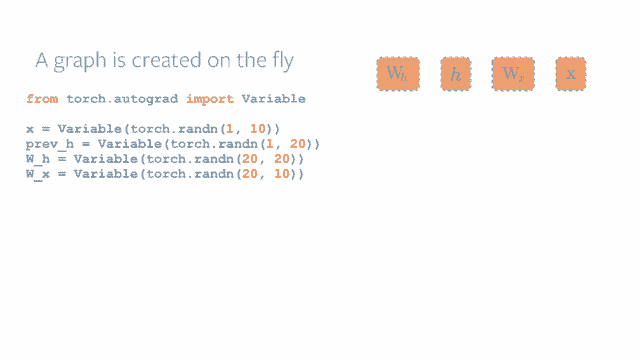
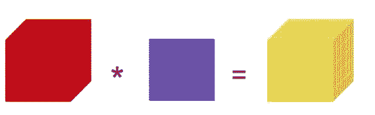
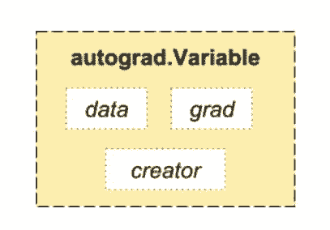
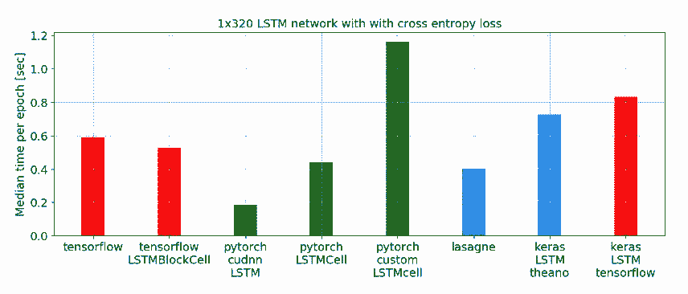
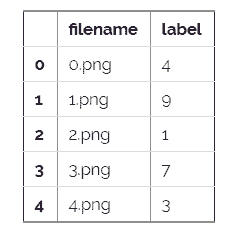

# 从基础概念到实现，小白如何快速入门 PyTorch

选自 analyticsvidhya

**机器之心编译**

**参与：思源**

> PyTorch 是一个有潜力能改变深度学习实现面貌的 Python 库，它的使用非常灵活与轻松。在本文中，我们将以更实用的方式探索 PyTorch，包括基础知识和案例研究等。此外，本文还将比较使用 NumPy 和 PyTorch 从头构建神经网络的方式，以了解它们在实现中的相似之处。

PyTorch 的构建者表明，PyTorch 的哲学是解决当务之急，也就是说即时构建和运行我们的计算图。这恰好适合 Python 的编程方法，因为我们不需等待整个代码都被写入才能知道是否起作用。我们很容易运行部分代码，并实时检查它。

PyTorch 是一个基于 Python 的库，旨在为深度学习提供一个灵活的开发平台。PyTorch 的工作流程非常接近于 Python 的科学计算库 NumPy。那么为什么我们需要使用 PyTorch 构建深度学习模型？以下作者根据实际经验提供了三个理由：

*   便于使用的 API：它的使用如同 Python 那样简单。

*   支持 Python：正如上文所述，PyTorch 可以平滑地与 Python 数据科学栈相结合。它与 NumPy 一样简单，甚至我们都感觉不出它们的区别。

*   动态计算图：PyTorch 不再采用特定的函数预定义计算图，而是提供构建动态计算图的框架，甚至我们可以在运行时修正它们。这种动态框架在我们不知道所构建的神经网络需要多少内存时非常有用。

其它一些使用 PyTorch 的优点还有多 GPU 支持、自定义数据加载器和极简的预处理过程等。自从它在 2016 年 1 月份发布以来，许多研究者将其采用为标准的实现库，因为它构建新颖的、极其复杂的计算图同样非常简单。即使这样，PyTorch 被主流数据科学家和研究员接收还是花了很长时间，因为它目前仍然是新的项目，且还有很多地方需要构建与完善。

**PyTorch 基础**

在讨论 PyTorch 的各个组件前，我们需要了解它的工作流。PyTorch 使用一种称之为 imperative / eager 的范式，即每一行代码都要求构建一个图以定义完整计算图的一个部分。即使完整的计算图还没有完成构建，我们也可以独立地执行这些作为组件的小计算图，这种动态计算图被称为「define-by-run」方法。



更多介绍请查看：http://pytorch.org/about/

安装 PyTorch 非常简单，我们可以按照自己的系统跟随官方文档的步骤轻松完成。例如以下选择在 Linux、Python 3.5 和 CUDA 9.1 的环境下安装 PyTorch：


conda install pytorch torchvision cuda91 -c pytorch

我们在基础部分主要需要了解的 PyTorch 元素有 PyTorch 张量、数学运算、自动求导模块、最优化模块和神经网络模块。下面本文会依次对这些模块进行简要的介绍：

**PyTorch 张量**

正如 PyTorch 文档所说，如果我们熟悉 NumPy 的多维数组，那么 Torch 张量的很多操作我们能轻易地掌握。PyTorch 提供了 CPU 张量和 GPU 张量，并且极大地加速了计算的速度。



从张量的构建与运行就能体会到 PyTorch 相比 TensorFLow 需要声明张量、初始化张量要简洁地多。以下语句将随机初始化一个 5×3 的二维张量，因为 PyTorch 是一种动态图，所以它声明和真实赋值是同时进行的。

```py
torch.Tensor(5, 3)

---------------------------------------

2.4878e+04  4.5692e-41  2.4878e+04

4.5692e-41 -2.9205e+19  4.5691e-41

1.2277e-02  4.5692e-41 -4.0170e+19

4.5691e-41  1.2277e-02  4.5692e-41

0.0000e+00  0.0000e+00  0.0000e+00

[torch.FloatTensor of size 5x3] 
```

若我们希望随机初始化的张量服从某些分布，那么我们可以直接对张量对象使用一些方法。如下初始化的张量将服从均匀分布：

```py
torch.Tensor(5, 3).uniform_(-1, 1)

---------------------------------------------

-0.2767 -0.1082 -0.1339

-0.6477  0.3098  0.1642

-0.1125 -0.2104  0.8962

-0.6573  0.9669 -0.3806

0.8008 -0.3860  0.6816

[torch.FloatTensor of size 5x3] 
```

在 PyTorch 中，torch.Tensor 是一种多维矩阵，其中每个元素都是一个单一的数据类型，且该构造函数默认的为 torch.FloatTensor。以下是具体张量的类型：


除了直接定义维度，一般我们还可以从 Python 列表或 NumPy 数组中创建张量。而且根据 Python 列表和元组等数据结构的习惯，我们可以使用相似的索引方式进行取值或赋值等。以下通过 Python 列表创建一个 Torch 张量，并通过索引赋值：

```py
>>> torch.FloatTensor([[1, 2, 3], [4, 5, 6]])

1  2  3

4  5  6

[torch.FloatTensor of size 2x3]

>>> print(x[1][2])

6.0

>>> x[0][1] = 8

>>> print(x)

1  8  3

4  5  6

[torch.FloatTensor of size 2x3] 
```

若 x 为我们定义的 5×3 Torch 张量，且初始化数值服从-1 到 1 的均匀分布，那么我们可以执行很多基础的数学运算。以下执行了一个简单的矩阵间对应元素乘积。

```py
 x = torch.Tensor(5, 3).uniform_(-1, 1)

y = x * torch.randn(5, 3)

print(y)

---------------------------------------------

0.2200 -0.0368  0.4494

-0.2577 -0.0343  0.1587

-0.7503 -0.1729  0.0453

0.9296 -0.1067 -0.6402

-0.3276  0.0158 -0.0552

[torch.FloatTensor of size 5x3] 
```

PyTorch 同样支持广播（Broadcasting）操作，一般它会隐式地把一个数组的异常维度调整到与另一个算子相匹配的维度以实现维度兼容。为了定义两个形状是否是可兼容的，PyTorch 会从最后开始往前逐个比较它们的维度大小。在这个过程中，如果两者的对应维度相同，或者其一（或者全是）等于 1，则继续进行比较，直到最前面的维度。若不满足这两个条件，程序就会报错。如下展示了 PyTorch 的广播操作：

```py
 print (x.size())

y = x + torch.randn(5, 1)

print(y)

---------------------------------------------

torch.Size([5, 3])

0.1919 -0.5006 -1.2410

-0.8080  0.1407 -0.6193

-1.6629 -0.1580 -0.3921

1.0395  0.7069 -0.1459

1.9027  1.4343  1.2299

[torch.FloatTensor of size 5x3] 
```

正如 PyTorch 在官网上所说，PyTorch 是一个张量和动态神经网络 Python 库，它有着极其强大的 GPU 加速性能。我们一般可以直接定义 GPU 张量，也可以由 CPU 张量转化为 GPU 张量。如下，我们定义了两个 GPU 张量，并对这两个张量执行矩阵乘法。当然，我们也可以如下所示将 CPU 张量转换为 GPU 张量。

```py
x = torch.cuda.HalfTensor(5, 3).uniform_(-1, 1)

y = torch.cuda.HalfTensor(3, 5).uniform_(-1, 1)

torch.matmul(x, y)

-----------------------------------------------------

0.2456  1.1543  0.5376  0.4358 -0.0369

0.8247 -0.4143 -0.7188  0.3953  0.2573

-0.1346  0.7329  0.5156  0.0864 -0.1349

-0.3555  0.3135  0.3921 -0.1428 -0.1368

-0.4385  0.5601  0.6533 -0.2793 -0.5220

[torch.cuda.HalfTensor of size 5x5 (GPU 0)]

# 以下转化 CPU 张量为 GPU 张量

x = torch.FloatTensor(5, 3).uniform_(-1, 1)

print(x)

x = x.cuda(device=0)

print(x)

x = x.cpu()

print(x) 
```

**数学运算**

如 NumPy 一样，高效地实现数学函数对于科学计算库至关重要。PyTorch 提供了一个简单的接口，并支持 200 多种数学运算，以下是 PyTorch 实现简单加运算的过程：

```py
a = torch.FloatTensor([2])
b = torch.FloatTensor([3])

a + b
 5
[torch.FloatTensor of size 1]
```

这种运算与 Python 非常像，我们可以在定义的 PyTorch 张量上执行多种矩阵运算。例如我们可以转置二维张量：

```py
matrix = torch.randn(3, 3)
matrix
-1.3531 -0.5394  0.8934
 1.7457 -0.6291 -0.0484
-1.3502 -0.6439 -1.5652
[torch.FloatTensor of size 3x3]
matrix.t()
-2.1139  1.8278  0.1976
 0.6236  0.3525  0.2660
-1.4604  0.8982  0.0428
[torch.FloatTensor of size 3x3] 
```

**AutoGrad 模块**

TensorFlow、Caffe 和 CNTK 等大多数框架都是使用的静态计算图，开发者必须建立或定义一个神经网络，并重复使用相同的结构来执行模型训练。改变网络的模式就意味着我们必须从头开始设计并定义相关的模块。

但 PyTorch 使用的技术为自动微分（automatic differentiation）。在这种机制下，系统会有一个 Recorder 来记录我们执行的运算，然后再反向计算对应的梯度。这种技术在构建神经网络的过程中十分强大，因为我们可以通过计算前向传播过程中参数的微分来节省时间。

```py
from torch.autograd import Variable

x = Variable(train_x)
y = Variable(train_y, requires_grad=False) 
```

从概念上来说，Autograd 会维护一个图并记录对变量执行的所有运算。这会产生一个有向无环图，其中叶结点为输入向量，根结点为输出向量。通过从根结点到叶结点追踪图的路径，我们可以轻易地使用链式法则自动计算梯度。



在内部，Autograd 将这个图表征为 Function 对象的图，并且可以应用 apply() 计算评估图的结果。在计算前向传播中，当 Autograd 在执行请求的计算时，它还会同时构建一个表征梯度计算的图，且每个 Variable 的 .grad_fn 属性就是这个图的输入单元。在前向传播完成后，我们可以在后向传播中根据这个动态图来计算梯度。

以下展示了通过 backward() 和 torch.autograd.grad 计算梯度的方法，其中 torch.eq() 评估表达式是不是相等，即 x.grad 的计算结果是不是等于 2x。

```py
x = Variable(torch.Tensor(5, 3).uniform_(-1, 1), requires_grad=True)

y = Variable(torch.Tensor(5, 3).uniform_(-1, 1), requires_grad=True)

z = x ** 2 + 3 * y

z.backward(gradient=torch.ones(5, 3))

# eq computes element-wise equality

torch.eq(x.grad, 2 * x)

----------------------------------------------------------------------

Variable containing:

1  1  1

1  1  1

1  1  1

1  1  1

1  1  1

[torch.ByteTensor of size 5x3] 
```

以下展示了对 y 求导的结果，即 dz/dy。从上面 z 的定义可知结果应该是 3，那么以下展示了该计算过程：

```py
y.grad

-------------------------------

Variable containing:

3  3  3

3  3  3

3  3  3

3  3  3

3  3  3

[torch.FloatTensor of size 5x3] 
```

前面是使用 backward() 求解变量的梯度，后面我们也可以使用 torch.autograd.grad 计算梯度。如下所示，我们使用另外一种方式求解同一个函数的梯度。

```py
x = Variable(torch.Tensor(5, 3).uniform_(-1, 1), requires_grad=True)

y = Variable(torch.Tensor(5, 3).uniform_(-1, 1), requires_grad=True)

z = x ** 2 + 3 * y

dz_dx = torch.autograd.grad(z, x, grad_outputs=torch.ones(5, 3))

dz_dy = torch.autograd.grad(z, y, grad_outputs=torch.ones(5, 3)) 
```

**最优化模块**

torch.optim 是实现神经网络中多种优化算法的模块，它目前已经支持大多数一般的方法，所以我们不需要从头构建优化算法。以下展示了使用 Adam 优化器的基本代码：

```py
optimizer = torch.optim.Adam(model.parameters(), lr=learning_rate) 
```

**神经网络模块**

PyTorch AutoGrad 使得计算图的定义和梯度的计算十分简单，但原版的 AutoGrad 可能对定义复杂的神经网络显得太底层，因此我们需要神经网络模块帮助简化工作。该 nn 包定义了一组函数，我们可以将其视为有一些可训练权重的神经网络层级。我们也可以将该神经网络模块视为类似于 Keras 的 PyTorch 组件。

我们一般可以使用 torch.nn 包构建神经网络，下面提供了一些 API 的表达及意义：

*   线性层- nn.Linear、nn.Bilinear

*   卷积层 - nn.Conv1d、nn.Conv2d、nn.Conv3d、nn.ConvTranspose2d

*   非线性激活函数- nn.Sigmoid、nn.Tanh、nn.ReLU、nn.LeakyReLU

*   池化层 - nn.MaxPool1d、nn.AveragePool2d

*   循环网络 - nn.LSTM、nn.GRU

*   归一化 - nn.BatchNorm2d

*   Dropout - nn.Dropout、nn.Dropout2d

*   嵌入 - nn.Embedding

*   损失函数 - nn.MSELoss、nn.CrossEntropyLoss、nn.NLLLoss

```py
import torch

# define model
model = torch.nn.Sequential(
 torch.nn.Linear(input_num_units, hidden_num_units),
 torch.nn.ReLU(),
 torch.nn.Linear(hidden_num_units, output_num_units),
)
loss_fn = torch.nn.CrossEntropyLoss() 
```

以上就是 PyTorch 的基本组件，我们可以使用它们快速构建神经网络。当然以上只是简单的概念介绍，每一个模块都有非常多的函数与方法，读者可详细查阅 PyTorch 文档了解更多。

**构建神经网络（NumPy vs. PyTorch）**

在这一部分中，我们分别使用 NumPy 和 PyTorch 构建简单的神经网络以实现二元分类问题，本文的后面会对这一部分的代码进行解释。

```py
## Neural network in numpy

import numpy as np

#Input array
X=np.array([[1,0,1,0],[1,0,1,1],[0,1,0,1]])

#Output
y=np.array([[1],[1],[0]])

#Sigmoid Function
def sigmoid (x):
 return 1/(1 + np.exp(-x))

#Derivative of Sigmoid Function
def derivatives_sigmoid(x):
 return x * (1 - x)

#Variable initialization
epoch=5000 #Setting training iterations
lr=0.1 #Setting learning rate
inputlayer_neurons = X.shape[1] #number of features in data set
hiddenlayer_neurons = 3 #number of hidden layers neurons
output_neurons = 1 #number of neurons at output layer

#weight and bias initialization
wh=np.random.uniform(size=(inputlayer_neurons,hiddenlayer_neurons))
bh=np.random.uniform(size=(1,hiddenlayer_neurons))
wout=np.random.uniform(size=(hiddenlayer_neurons,output_neurons))
bout=np.random.uniform(size=(1,output_neurons))

for i in range(epoch):
  #Forward Propogation
  hidden_layer_input1=np.dot(X,wh)
  hidden_layer_input=hidden_layer_input1 + bh
  hiddenlayer_activations = sigmoid(hidden_layer_input)
  output_layer_input1=np.dot(hiddenlayer_activations,wout)
  output_layer_input= output_layer_input1+ bout
  output = sigmoid(output_layer_input)

  #Backpropagation
  E = y-output
  slope_output_layer = derivatives_sigmoid(output)
  slope_hidden_layer = derivatives_sigmoid(hiddenlayer_activations)
  d_output = E * slope_output_layer
  Error_at_hidden_layer = d_output.dot(wout.T)
  d_hiddenlayer = Error_at_hidden_layer * slope_hidden_layer
  wout += hiddenlayer_activations.T.dot(d_output) *lr
  bout += np.sum(d_output, axis=0,keepdims=True) *lr
  wh += X.T.dot(d_hiddenlayer) *lr
  bh += np.sum(d_hiddenlayer, axis=0,keepdims=True) *lr

print('actual :\n', y, '\n')
print('predicted :\n', output) 
```

现在，我们会发现使用 PyTorch 实现相同的网络会非常简单。以下的代码同样也用粗体表示出它与 NumPy 的不同之处：

```py
## neural network in pytorch*import torch*

#Input array
X = *torch.Tensor*([[1,0,1,0],[1,0,1,1],[0,1,0,1]])

#Output
y = *torch.Tensor*([[1],[1],[0]])

#Sigmoid Function
def sigmoid (x):
  return 1/(1 + *torch.exp*(-x))

#Derivative of Sigmoid Function
def derivatives_sigmoid(x):
  return x * (1 - x)

#Variable initialization
epoch=5000 #Setting training iterations
lr=0.1 #Setting learning rate
inputlayer_neurons = X.shape[1] #number of features in data set
hiddenlayer_neurons = 3 #number of hidden layers neurons
output_neurons = 1 #number of neurons at output layer

#weight and bias initialization
wh=*torch.randn*(inputlayer_neurons, hiddenlayer_neurons)*.type(torch.FloatTensor)*
bh=*torch.randn*(1, hiddenlayer_neurons)*.type(torch.FloatTensor)*
wout=*torch.randn*(hiddenlayer_neurons, output_neurons)
bout=*torch.randn*(1, output_neurons)

for i in range(epoch):

  #Forward Propogation
  hidden_layer_input1 = *torch.mm*(X, wh)
  hidden_layer_input = hidden_layer_input1 + bh
  hidden_layer_activations = sigmoid(hidden_layer_input)

  output_layer_input1 = *torch.mm*(hidden_layer_activations, wout)
  output_layer_input = output_layer_input1 + bout
  output = sigmoid(output_layer_input1)

  #Backpropagation
  E = y-output
  slope_output_layer = derivatives_sigmoid(output)
  slope_hidden_layer = derivatives_sigmoid(hidden_layer_activations)
  d_output = E * slope_output_layer
  Error_at_hidden_layer = *torch.mm*(d_output, wout.t())
  d_hiddenlayer = Error_at_hidden_layer * slope_hidden_layer
  wout += *torch.mm*(hidden_layer_activations.t(), d_output) *lr
  bout += d_output.sum() *lr
  wh += *torch.mm*(X.t(), d_hiddenlayer) *lr
  bh += d_output.sum() *lr

print('actual :\n', y, '\n')
print('predicted :\n', output) 
```

**对比其它深度学习库**

在一份基准脚本中，它展示出 PyTorch 在训练长短期记忆（LSTM）网络上比其它主要框架的表现都要好，因为它运行一个 Epoch 有最少的中位数时间。

PyTorch 中的数据加载 API 经过了优良的设计，接口是针对特定数据集、采样器和数据加载器而构建的。对比于 TensorFlow 的数据加载工具（readers, queues 等），我发现 PyTorch 的数据加载模块更易于使用。同时它们还能无缝对接神经网络构建模块，所以我们不需要第三方高级库。

然而，我并不推荐使用使用 PyTorch 部署模型，因为 PyTorch 仍然不是那么成熟。正如 PyTorch 开发者所说：「我们经常看到用户首先创建一个 PyTorch 模型来测试是否可行，然后当需要部署模型到生产中时，他们会转化为 Caffe 2 等其他框架，并将其部署到移动端或其它平台。」



**案例研究**

前面我们已经了解了 PyTorch 的基本组成元素与特性，下面我们会通过线性回归与手写字体识别两个具体的案例探讨如何使用 PyTorch 构建高效地模型。

**PyTorch 线性回归**

定义数据：

```py
import torch

from torch.autograd import Variable

x_data = Variable(torch.Tensor([[1.0], [2.0], [3.0]]))

y_data = Variable(torch.Tensor([[2.0], [4.0], [6.0]])) 
```

定义模型，在 PyTorch 中，我们可以使用高级 API 来定义相关的模型或层级。如下定义了「torch.nn.Linear(1, 1)」，即一个输入变量和一个输出变量。

```py
class Model(torch.nn.Module):

   def __init__(self):

       """

       In the constructor we instantiate two nn.Linear module

       """

       super(Model, self).__init__()

       self.linear = torch.nn.Linear(1, 1)  # One in and one out

   def forward(self, x):

       """

       In the forward function we accept a Variable of input data and we must return

       a Variable of output data. We can use Modules defined in the constructor as

       well as arbitrary operators on Variables.

       """

       y_pred = self.linear(x)

       return y_pred 
```

构建损失函数和优化器，构建损失函数也可以直接使用「torch.nn.MSELoss(size_average=False)」调用均方根误差函数。优化器可以使用「torch.optim.SGD()」提到用随机梯度下降，其中我们需要提供优化的目标和学习率等参数。

```py
# Construct our loss function and an Optimizer. The call to model.parameters()

# in the SGD constructor will contain the learnable parameters of the two

# nn.Linear modules which are members of the model.

criterion = torch.nn.MSELoss(size_average=False)

optimizer = torch.optim.SGD(model.parameters(), lr=0.01) 
```

训练模型，执行前向传播计算损失函数，并优化参数：

```py
# Training loop

for epoch in range(500):

       # Forward pass: Compute predicted y by passing x to the model

   y_pred = model(x_data)

   # Compute and print loss

   loss = criterion(y_pred, y_data)

   print(epoch, loss.data[0])

   # Zero gradients, perform a backward pass, and update the weights.

   optimizer.zero_grad()

   loss.backward()

   optimizer.step() 
```

**用 PyTorch 解决图像识别问题**

为了进一步熟悉 PyTorch，我们将使用它解决 Analytics Vidhya 的深度学习实践问题：识别手写数字。我们的问题是给定一张 28 x 28 的图像，利用模型识别其所代表的手写数字。

所以首先我们需要下载训练集与测试集，数据集包含了一个压缩文件以储存所有的图像。其中 train.csv 和 test.csv 分别储存了训练和测试图像，且图像的格式为 png。下面我们将一步步构建简单的神经网络以实现手写数字识别功能。

**第 0 步：准备工作**

a）导入必要的函数库

```py
# import modules
%pylab inline
import os
import numpy as np
import pandas as pd
from scipy.misc import imread
from sklearn.metrics import accuracy_score 
```

b）设置随机的 Seed，因此我们能控制模型产生的随机数基本不变（伪随机数）。

```py
# To stop potential randomness
seed = 128
rng = np.random.RandomState(seed) 
```

c）设置工作目录的路径。

```py
root_dir = os.path.abspath('.')
data_dir = os.path.join(root_dir, 'data')

# check for existence
os.path.exists(root_dir), os.path.exists(data_dir) 
```

**第 1 步：加载与预处理数据**

a）现在读取 CSV 格式的数据集，并获取文件名与对应的标注。

```py
# load dataset
train = pd.read_csv(os.path.join(data_dir, 'Train', 'train.csv'))
test = pd.read_csv(os.path.join(data_dir, 'Test.csv'))

sample_submission = pd.read_csv(os.path.join(data_dir, 'Sample_Submission.csv'))

train.head() 
```



b）接下来可以打印准备好的图片。

```py
# print an image
img_name = rng.choice(train.filename)
filepath = os.path.join(data_dir, 'Train', 'Images', 'train', img_name)

img = imread(filepath, flatten=True)

pylab.imshow(img, cmap='gray')
pylab.axis('off')
pylab.show() 
```

c）对于更简单的数据操作，我们可以储存所有的图像作为 NumPy 数组。

```py
# load images to create train and test set
temp = []
for img_name in train.filename:
  image_path = os.path.join(data_dir, 'Train', 'Images', 'train', img_name)
  img = imread(image_path, flatten=True)
  img = img.astype('float32')
  temp.append(img)

train_x = np.stack(temp)

train_x /= 255.0
train_x = train_x.reshape(-1, 784).astype('float32')

temp = []
for img_name in test.filename:
  image_path = os.path.join(data_dir, 'Train', 'Images', 'test', img_name)
  img = imread(image_path, flatten=True)
  img = img.astype('float32')
  temp.append(img)

test_x = np.stack(temp)

test_x /= 255.0
test_x = test_x.reshape(-1, 784).astype('float32')

train_y = train.label.values 
```

d）因为这个是一个典型的机器学习问题，所以我们可以创建验证集以监控模型的运行情况。下面我们以 7:3 的比例分割训练集与验证集。

```py
# create validation set
split_size = int(train_x.shape[0]*0.7)

train_x, val_x = train_x[:split_size], train_x[split_size:]
train_y, val_y = train_y[:split_size], train_y[split_size:] 
```

**第 2 步：构建模型**

a）下面是模型的主体，我们定义的神经网络共有三层，即输入层、隐藏层和输出层。输入层和输出层的神经元数量是固定的，即 28 x 28 和 10 x 1，它们分别代表了输入图像的像素和类别。我们在隐藏层采用了 50 个神经元，并采用 Adam 作为最优化算法。

```py
import torch
from torch.autograd import Variable
# number of neurons in each layer
input_num_units = 28*28
hidden_num_units = 500
output_num_units = 10

# set remaining variables
epochs = 5
batch_size = 128
learning_rate = 0.001 
```

b）以下将开始训练模型。

```py
# define model
model = torch.nn.Sequential(
  torch.nn.Linear(input_num_units, hidden_num_units),
  torch.nn.ReLU(),
  torch.nn.Linear(hidden_num_units, output_num_units),
)
loss_fn = torch.nn.CrossEntropyLoss()

# define optimization algorithm
optimizer = torch.optim.Adam(model.parameters(), lr=learning_rate)
## helper functions
# preprocess a batch of dataset
def preproc(unclean_batch_x):
  """Convert values to range 0-1"""
  temp_batch = unclean_batch_x / unclean_batch_x.max()

  return temp_batch

# create a batch
def batch_creator(batch_size):
  dataset_name = 'train'
  dataset_length = train_x.shape[0]

  batch_mask = rng.choice(dataset_length, batch_size)

  batch_x = eval(dataset_name + '_x')[batch_mask]
  batch_x = preproc(batch_x)

  if dataset_name == 'train':
    batch_y = eval(dataset_name).ix[batch_mask, 'label'].values

  return batch_x, batch_y
# train network
total_batch = int(train.shape[0]/batch_size)

for epoch in range(epochs):
  avg_cost = 0
  for i in range(total_batch):
    # create batch
    batch_x, batch_y = batch_creator(batch_size)

    # pass that batch for training
    x, y = Variable(torch.from_numpy(batch_x)), Variable(torch.from_numpy(batch_y), requires_grad=False)
    pred = model(x)

    # get loss
    loss = loss_fn(pred, y)

    # perform backpropagation
    loss.backward()
    optimizer.step()
    avg_cost += loss.data[0]/total_batch

  print(epoch, avg_cost)
# get training accuracy
x, y = Variable(torch.from_numpy(preproc(train_x))), Variable(torch.from_numpy(train_y), requires_grad=False)
pred = model(x)

final_pred = np.argmax(pred.data.numpy(), axis=1)

accuracy_score(train_y, final_pred)
# get validation accuracy
x, y = Variable(torch.from_numpy(preproc(val_x))), Variable(torch.from_numpy(val_y), requires_grad=False)
pred = model(x)
final_pred = np.argmax(pred.data.numpy(), axis=1)

accuracy_score(val_y, final_pred) 
```

*   训练准确度为：0.8779008746355685

*   测试准确度为：0.867482993197279

这些分数非常令人满意，因为我们只是用简单的神经网络训练了 5 个 Epoch。以上，本文介绍了简单的 PyTorch 入门概念，并利用简单的案例熟悉 PyTorch 的使用。读者可以继续阅读 PyTorch 的文档以了解更多信息。

*原文链接：https://www.analyticsvidhya.com/blog/2018/02/pytorch-tutorial/*

****本文为机器之心编译，**转载请联系本公众号获得授权****。**

✄------------------------------------------------

**加入机器之心（全职记者/实习生）：hr@jiqizhixin.com**

**投稿或寻求报道：editor@jiqizhixin.com**

**广告&商务合作：bd@jiqizhixin.com**