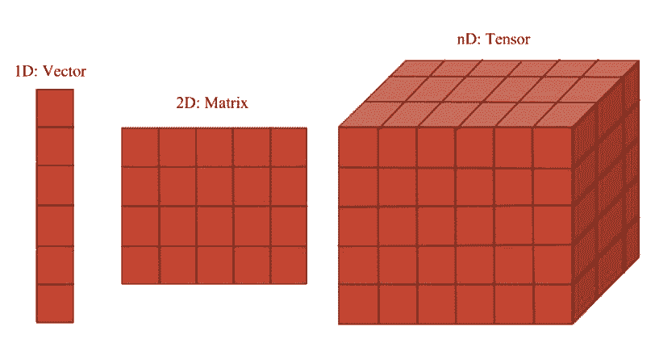
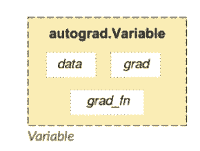
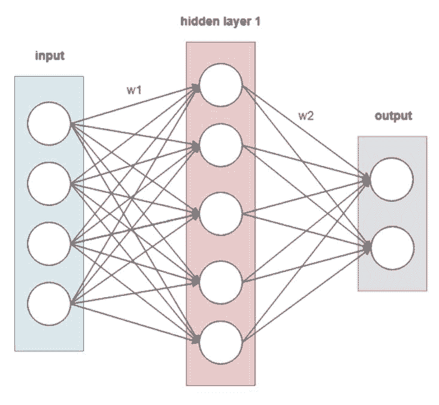
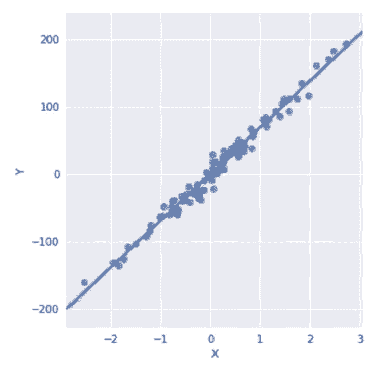
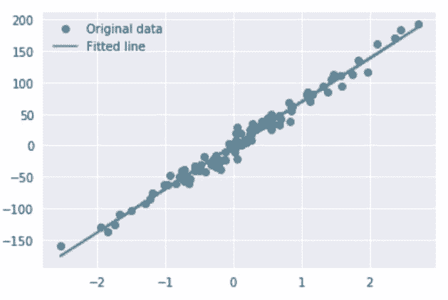
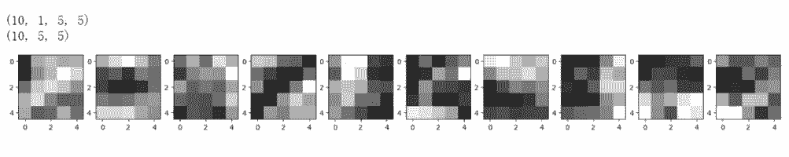

# 教程 | 从头开始了解 PyTorch 的简单实现

选自 GitHub

**机器之心编译**

**参与：****路**

> 本教程展示了如何从了解张量开始到使用 PyTorch 训练简单的神经网络，是非常基础的 PyTorch 入门资源。PyTorch 建立在 Python 和 Torch 库之上，并提供了一种类似 Numpy 的抽象方法来表征张量（或多维数组），它还能利用 GPU 来提升性能。本教程的代码并不完整，详情请查看原 Jupyter Notebook 文档。

PyTorch 使入门深度学习变得简单，即使你这方面的背景知识不太充足。至少，知道多层神经网络模型可视为由权重连接的节点图就是有帮助的，你可以基于前向和反向传播，利用优化过程（如梯度计算）从数据中估计权重。

*   必备知识：该教程假设读者熟悉 Python 和 NumPy。

*   必备软件：在运行原 Jupyter Notebook 之前你需要安装 PyTorch。原 Notebook 有代码单元格可供验证你是否做好准备。

*   必备硬件：你需要安装 NVIDIA GPU 和 CUDA SDK。据报告此举可能实现 10-100 的加速。当然，如果你没有进行此设置，那么你仍然可以在仅使用 CPU 的情况下运行 PyTorch。但是，记住，在训练神经网络模型时，生命苦短！所以还是尽可能使用 GPU 吧！

项目地址：https://github.com/hpcgarage/accelerated_dl_pytorch

**1\. 必要的 PyTorch 背景**

*   PyTorch 是一个建立在 Torch 库之上的 Python 包，旨在加速深度学习应用。

*   PyTorch 提供一种类似 NumPy 的抽象方法来表征张量（或多维数组），它可以利用 GPU 来加速训练。

 **

**1.1 PyTorch 张量**

PyTorch 的关键数据结构是张量，即多维数组。其功能与 NumPy 的 ndarray 对象类似，如下我们可以使用 torch.Tensor() 创建张量。

```py
# Generate a 2-D pytorch tensor (i.e., a matrix)
pytorch_tensor = torch.Tensor(10, 20)
print("type: ", type(pytorch_tensor), " and size: ", pytorch_tensor.shape )

```

如果你需要一个兼容 NumPy 的表征，或者你想从现有的 NumPy 对象中创建一个 PyTorch 张量，那么就很简单了。

```py
# Convert the pytorch tensor to a numpy array:
numpy_tensor = pytorch_tensor.numpy()
print("type: ", type(numpy_tensor), " and size: ", numpy_tensor.shape)

# Convert the numpy array to Pytorch Tensor:
print("type: ", type(torch.Tensor(numpy_tensor)), " and size: ", torch.Tensor(numpy_tensor).shape)

```

**1.2 PyTorch vs. NumPy**

PyTorch 并不是 NumPy 的简单替代品，但它实现了很多 NumPy 功能。其中有一个不便之处是其命名规则，有时候它和 NumPy 的命名方法相当不同。我们来举几个例子说明其中的区别：

1 张量创建

```py
t = torch.rand(2, 4, 3, 5)
a = np.random.rand(2, 4, 3, 5)

```

2 张量分割

```py
t = torch.rand(2, 4, 3, 5)
a = t.numpy()
pytorch_slice = t[0, 1:3, :, 4]
numpy_slice =  a[0, 1:3, :, 4]
print ('Tensor[0, 1:3, :, 4]:\n', pytorch_slice)
print ('NdArray[0, 1:3, :, 4]:\n', numpy_slice)

-------------------------------------------------------------------------
Tensor[0, 1:3, :, 4]:

 0.2032  0.1594  0.3114
 0.9073  0.6497  0.2826
[torch.FloatTensor of size 2x3]

NdArray[0, 1:3, :, 4]:
 [[ 0.20322084  0.15935552  0.31143939]
 [ 0.90726137  0.64966112  0.28259504]]

```

3 张量 Masking

```py
t = t - 0.5
a = t.numpy()
pytorch_masked = t[t > 0]
numpy_masked = a[a > 0]

```

4 张量重塑

```py
pytorch_reshape = t.view([6, 5, 4])
numpy_reshape = a.reshape([6, 5, 4])

```

**1.3 PyTorch 变量**

*   PyTorch 张量的简单封装

*   帮助建立计算图

*   Autograd（自动微分库）的必要部分

*   将关于这些变量的梯度保存在 .grad 中



结构图：



计算图和变量：在 PyTorch 中，神经网络会使用相互连接的变量作为计算图来表示。PyTorch 允许通过代码构建计算图来构建网络模型；之后 PyTorch 会简化估计模型权重的流程，例如通过自动计算梯度的方式。

举例来说，假设我们想构建两层模型，那么首先要为输入和输出创建张量变量。我们可以将 PyTorch Tensor 包装进 Variable 对象中：

```py
from torch.autograd import Variable
import torch.nn.functional as F

x = Variable(torch.randn(4, 1), requires_grad=False)
y = Variable(torch.randn(3, 1), requires_grad=False)

```

我们把 requires_grad 设置为 True，表明我们想要自动计算梯度，这将用于反向传播中以优化权重。

现在我们来定义权重：

```py
w1 = Variable(torch.randn(5, 4), requires_grad=True)
w2 = Variable(torch.randn(3, 5), requires_grad=True)

```

训练模型：

```py
def model_forward(x):
    return F.sigmoid(w2 @ F.sigmoid(w1 @ x))

print (w1)
print (w1.data.shape)
print (w1.grad) # Initially, non-existent

-------------------------------------------------------------------------
Variable containing:
 1.6068 -1.3304 -0.6717 -0.6097
-0.3414 -0.5062 -0.2533  1.0260
-0.0341 -1.2144 -1.5983 -0.1392
-0.5473  0.0084  0.4054  0.0970
 0.3596  0.5987 -0.0324  0.6116
[torch.FloatTensor of size 5x4]

torch.Size([5, 4])
None
**1.4 PyTorch 反向传播**

```

这样我们有了输入和目标、模型权重，那么是时候训练模型了。我们需要三个组件：

损失函数：描述我们模型的预测距离目标还有多远；

```py
import torch.nn as nn
criterion = nn.MSELoss()

```

优化算法：用于更新权重；

```py
import torch.optim as optim
optimizer = optim.SGD([w1, w2], lr=0.001)

```

反向传播步骤：

```py
for epoch in range(10):
    loss = criterion(model_forward(x), y)
    optimizer.zero_grad() # Zero-out previous gradients
    loss.backward() # Compute new gradients
    optimizer.step() # Apply these gradients

print (w1)

-------------------------------------------------------------------------
Variable containing:
 1.6067 -1.3303 -0.6717 -0.6095
-0.3414 -0.5062 -0.2533  1.0259
-0.0340 -1.2145 -1.5983 -0.1396
-0.5476  0.0085  0.4055  0.0976
 0.3597  0.5986 -0.0324  0.6113
[torch.FloatTensor of size 5x4]

```

**1.5 PyTorch CUDA 接口**

PyTorch 的优势之一是为张量和 autograd 库提供 CUDA 接口。使用 CUDA GPU，你不仅可以加速神经网络训练和推断，还可以加速任何映射至 PyTorch 张量的工作负载。

你可以调用 torch.cuda.is_available() 函数，检查 PyTorch 中是否有可用 CUDA。

```py
cuda_gpu = torch.cuda.is_available()
if (cuda_gpu):
    print("Great, you have a GPU!")
else:
    print("Life is short -- consider a GPU!")

```

很好，现在你有 GPU 了。

.cuda()

之后，使用 cuda 加速代码就和调用一样简单。如果你在张量上调用 .cuda()，则它将执行从 CPU 到 CUDA GPU 的数据迁移。如果你在模型上调用 .cuda()，则它不仅将所有内部储存移到 GPU，还将整个计算图映射至 GPU。

要想将张量或模型复制回 CPU，比如想和 NumPy 交互，你可以调用 .cpu()。

```py
if cuda_gpu:
    x = x.cuda()
    print(type(x.data))

x = x.cpu()
print(type(x.data))

-------------------------------------------------------------------------
<class 'torch.cuda.FloatTensor'>
<class 'torch.FloatTensor'>
我们来定义两个函数（训练函数和测试函数）来使用我们的模型执行训练和推断任务。该代码同样来自 PyTorch 官方教程，我们摘选了所有训练／推断的必要步骤。

```

对于训练和测试网络，我们需要执行一系列动作，这些动作可直接映射至 PyTorch 代码：

1\. 我们将模型转换到训练／推断模式；

2\. 我们通过在数据集上成批获取图像，以迭代训练模型；

3\. 对于每一个批量的图像，我们都要加载数据和标注，运行网络的前向步骤来获取模型输出；

4\. 我们定义损失函数，计算每一个批量的模型输出和目标之间的损失；

5\. 训练时，我们初始化梯度为零，使用上一步定义的优化器和反向传播，来计算所有与损失有关的层级梯度；

6\. 训练时，我们执行权重更新步骤。

```py
def train(model, epoch, criterion, optimizer, data_loader):
    model.train()
    for batch_idx, (data, target) in enumerate(data_loader):
        if cuda_gpu:
            data, target = data.cuda(), target.cuda()
            model.cuda()
        data, target = Variable(data), Variable(target)
        output = model(data)

        optimizer.zero_grad()
        loss = criterion(output, target)
        loss.backward()
        optimizer.step()
        if (batch_idx+1) % 400 == 0:
            print('Train Epoch: {} [{}/{} ({:.0f}%)]\tLoss: {:.6f}'.format(
                epoch, (batch_idx+1) * len(data), len(data_loader.dataset),
                100\. * (batch_idx+1) / len(data_loader), loss.data[0]))

def test(model, epoch, criterion, data_loader):
    model.eval()
    test_loss = 0
    correct = 0
    for data, target in data_loader:
        if cuda_gpu:
            data, target = data.cuda(), target.cuda()
            model.cuda()
        data, target = Variable(data), Variable(target)
        output = model(data)
        test_loss += criterion(output, target).data[0]
        pred = output.data.max(1)[1] # get the index of the max log-probability
        correct += pred.eq(target.data).cpu().sum()

    test_loss /= len(data_loader) # loss function already averages over batch size
    acc = correct / len(data_loader.dataset)
    print('\nTest set: Average loss: {:.4f}, Accuracy: {}/{} ({:.0f}%)\n'.format(
        test_loss, correct, len(data_loader.dataset), 100\. * acc))
    return (acc, test_loss)

```

现在介绍完毕，让我们开始这次数据科学之旅吧！

**2\. 使用 PyTorch 进行数据分析** 

*   使用 torch.nn 库构建模型

*   使用 torch.autograd 库训练模型

*   将数据封装进 torch.utils.data.Dataset 库

*   使用 NumPy interface 连接你的模型、数据和你最喜欢的工具

在查看复杂模型之前，我们先来看个简单的：简单合成数据集上的线性回归，我们可以使用 sklearn 工具生成这样的合成数据集。

```py
from sklearn.datasets import make_regression
import seaborn as sns
import pandas as pd
import matplotlib.pyplot as plt

sns.set()

x_train, y_train, W_target = make_regression(n_samples=100, n_features=1, noise=10, coef = True)

df = pd.DataFrame(data = {'X':x_train.ravel(), 'Y':y_train.ravel()})

sns.lmplot(x='X', y='Y', data=df, fit_reg=True)
plt.show()

x_torch = torch.FloatTensor(x_train)
y_torch = torch.FloatTensor(y_train)
y_torch = y_torch.view(y_torch.size()[0], 1)

```



PyTorch 的 nn 库中有大量有用的模块，其中一个就是线性模块。如名字所示，它对输入执行线性变换，即线性回归。

```py
class LinearRegression(torch.nn.Module):
    def __init__(self, input_size, output_size):
        super(LinearRegression, self).__init__()
        self.linear = torch.nn.Linear(input_size, output_size)  

    def forward(self, x):
        return self.linear(x)

model = LinearRegression(1, 1)

```

要训练线性回归，我们需要从 nn 库中添加合适的损失函数。对于线性回归，我们将使用 MSELoss()——均方差损失函数。

我们还需要使用优化函数（SGD），并运行与之前示例类似的反向传播。本质上，我们重复上文定义的 train() 函数中的步骤。不能直接使用该函数的原因是我们实现它的目的是分类而不是回归，以及我们使用交叉熵损失和最大元素的索引作为模型预测。而对于线性回归，我们使用线性层的输出作为预测。

```py
criterion = torch.nn.MSELoss()
optimizer = torch.optim.SGD(model.parameters(), lr=0.1)  

for epoch in range(50):
    data, target = Variable(x_torch), Variable(y_torch)
    output = model(data)

    optimizer.zero_grad()
    loss = criterion(output, target)
    loss.backward()
    optimizer.step()

predicted = model(Variable(x_torch)).data.numpy()

```

现在我们可以打印出原始数据和适合 PyTorch 的线性回归。

```py
plt.plot(x_train, y_train, 'o', label='Original data')
plt.plot(x_train, predicted, label='Fitted line')
plt.legend()
plt.show()

```



为了转向更复杂的模型，我们下载了 MNIST 数据集至「datasets」文件夹中，并测试一些 PyTorch 中可用的初始预处理。PyTorch 具备数据加载器和处理器，可用于不同的数据集。数据集下载好后，你可以随时使用。你还可以将数据包装进 PyTorch 张量，创建自己的数据加载器类别。

批大小（batch size）是机器学习中的术语，指一次迭代中使用的训练样本数量。批大小可以是以下三种之一：

*   batch 模式：批大小等于整个数据集，因此迭代和 epoch 值一致；

*   mini-batch 模式：批大小大于 1 但小于整个数据集的大小。通常，数量可以是能被整个数据集整除的值。

*   随机模式：批大小等于 1。因此梯度和神经网络参数在每个样本之后都要更新。

```py
from torchvision import datasets, transforms

batch_num_size = 64

train_loader = torch.utils.data.DataLoader(
    datasets.MNIST('data',train=True, download=True, transform=transforms.Compose([
        transforms.ToTensor(),
        transforms.Normalize((0.1307,), (0.3081,))
    ])), 
    batch_size=batch_num_size, shuffle=True)

test_loader = torch.utils.data.DataLoader(
    datasets.MNIST('data',train=False, transform=transforms.Compose([
        transforms.ToTensor(),
        transforms.Normalize((0.1307,), (0.3081,))
    ])), 
    batch_size=batch_num_size, shuffle=True)

```

**3\. PyTorch 中的 LeNet 卷积神经网络（CNN）**

现在我们从头开始创建第一个简单神经网络。该网络要执行图像分类，识别 MNIST 数据集中的手写数字。这是一个四层的卷积神经网络（CNN），一种分析 MNIST 数据集的常见架构。该代码来自 PyTorch 官方教程，你可以在这里（http://pytorch.org/tutorials/）找到更多示例。

我们将使用 torch.nn 库中的多个模块：

1\. 线性层：使用层的权重对输入张量执行线性变换；

2\. Conv1 和 Conv2：卷积层，每个层输出在卷积核（小尺寸的权重张量）和同样尺寸输入区域之间的点积；

3\. Relu：修正线性单元函数，使用逐元素的激活函数 max(0,x)；

4\. 池化层：使用 max 运算执行特定区域的下采样（通常 2x2 像素）；

5\. Dropout2D：随机将输入张量的所有通道设为零。当特征图具备强相关时，dropout2D 提升特征图之间的独立性；

6\. Softmax：将 Log(Softmax(x)) 函数应用到 n 维输入张量，以使输出在 0 到 1 之间。

```py
class LeNet(nn.Module):
    def __init__(self):
        super(LeNet,self).__init__()
        self.conv1 = nn.Conv2d(1,10,kernel_size=5)
        self.conv2 = nn.Conv2d(10,20,kernel_size=5)
        self.conv2_drop = nn.Dropout2d()
        self.fc1 = nn.Linear(320,50)
        self.fc2 = nn.Linear(50,10)

    def forward(self,x):
        x = F.relu(F.max_pool2d(self.conv1(x),2))
        x = F.relu(F.max_pool2d(self.conv2_drop(self.conv2(x)),2))
        x = x.view(-1, 320)
        x = F.relu(self.fc1(x))
        x = F.dropout(x, training=self.training)
        x = self.fc2(x)
        return F.log_softmax(x, dim=1)

```

创建 LeNet 类后，创建对象并移至 GPU：

```py
model = LeNet()
if cuda_gpu:
    model.cuda()

print ('MNIST_net model:\n')
print (model)

-------------------------------------------------------------------------
MNIST_net model:

LeNet(
  (conv1): Conv2d(1, 10, kernel_size=(5, 5), stride=(1, 1))
  (conv2): Conv2d(10, 20, kernel_size=(5, 5), stride=(1, 1))
  (conv2_drop): Dropout2d(p=0.5)
  (fc1): Linear(in_features=320, out_features=50, bias=True)
  (fc2): Linear(in_features=50, out_features=10, bias=True)
)

```

要训练该模型，我们需要使用带动量的 SGD，学习率为 0.01，momentum 为 0.5。

```py
criterion = nn.CrossEntropyLoss()  
optimizer = optim.SGD(model.parameters(),lr = 0.005, momentum = 0.9)

```

仅仅需要 5 个 epoch（一个 epoch 意味着你使用整个训练数据集来更新训练模型的权重），我们就可以训练出一个相当准确的 LeNet 模型。这段代码检查可以确定文件中是否已有预训练好的模型。有则加载；无则训练一个并保存至磁盘。

```py
import os 

epochs = 5
if (os.path.isfile('pretrained/MNIST_net.t7')):
    print ('Loading model')
    model.load_state_dict(torch.load('pretrained/MNIST_net.t7', map_location=lambda storage, loc: storage))
    acc, loss = test(model, 1, criterion, test_loader)
else:
    print ('Training model')
    for epoch in range(1, epochs + 1):
        train(model, epoch, criterion, optimizer, train_loader)
        acc, loss = test(model, 1, criterion, test_loader)
    torch.save(model.state_dict(), 'pretrained/MNIST_net.t7')

-------------------------------------------------------------------------
Loading model
Test set: Average loss: 0.0471, Accuracy: 9859/10000 (99%)

```

现在我们来看下模型。首先，打印出该模型的信息。打印函数显示所有层（如 Dropout 被实现为一个单独的层）及其名称和参数。同样有一个迭代器在模型中所有已命名模块之间运行。当你具备一个包含多个「内部」模型的复杂 DNN 时，这有所帮助。在所有已命名模块之间的迭代允许我们创建模型解析器，可读取模型参数、创建与该网络类似的模块。

```py
print ('Internal models:')
for idx, m in enumerate(model.named_modules()):
    print(idx, '->', m)
    print ('-------------------------------------------------------------------------')

#输出：
Internal models:
0 -> ('', LeNet(
  (conv1): Conv2d(1, 10, kernel_size=(5, 5), stride=(1, 1))
  (conv2): Conv2d(10, 20, kernel_size=(5, 5), stride=(1, 1))
  (conv2_drop): Dropout2d(p=0.5)
  (fc1): Linear(in_features=320, out_features=50, bias=True)
  (fc2): Linear(in_features=50, out_features=10, bias=True)
))
-------------------------------------------------------------------------
1 -> ('conv1', Conv2d(1, 10, kernel_size=(5, 5), stride=(1, 1)))
-------------------------------------------------------------------------
2 -> ('conv2', Conv2d(10, 20, kernel_size=(5, 5), stride=(1, 1)))
-------------------------------------------------------------------------
3 -> ('conv2_drop', Dropout2d(p=0.5))
-------------------------------------------------------------------------
4 -> ('fc1', Linear(in_features=320, out_features=50, bias=True))
-------------------------------------------------------------------------
5 -> ('fc2', Linear(in_features=50, out_features=10, bias=True))
-------------------------------------------------------------------------

```

你可以使用 .cpu() 方法将张量移至 CPU（或确保它在那里）。或者，当 GPU 可用时（torch.cuda. 可用），使用 .cuda() 方法将张量移至 GPU。你可以看到张量是否在 GPU 上，其类型为 torch.cuda.FloatTensor。如果张量在 CPU 上，则其类型为 torch.FloatTensor。

```py
print (type(t.cpu().data))
if torch.cuda.is_available():
    print ("Cuda is available")
    print (type(t.cuda().data))
else:
    print ("Cuda is NOT available")

-------------------------------------------------------------------------
<class 'torch.FloatTensor'>
Cuda is available
<class 'torch.cuda.FloatTensor'>
如果张量在 CPU 上，我们可以将其转换成 NumPy 数组，其共享同样的内存位置，改变其中一个就会改变另一个。

```

```py
if torch.cuda.is_available():
    try:
        print(t.data.numpy())
    except RuntimeError as e:
        "you can't transform a GPU tensor to a numpy nd array, you have to copy your weight tendor to cpu and then get the numpy array"

print(type(t.cpu().data.numpy()))
print(t.cpu().data.numpy().shape)
print(t.cpu().data.numpy())

```

现在我们了解了如何将张量转换成 NumPy 数组，我们可以利用该知识使用 matplotlib 进行可视化！我们来打印出第一个卷积层的卷积滤波器。

```py
data = model.conv1.weight.cpu().data.numpy()
print (data.shape)
print (data[:, 0].shape)

kernel_num = data.shape[0]

fig, axes = plt.subplots(ncols=kernel_num, figsize=(2*kernel_num, 2))

for col in range(kernel_num):
    axes[col].imshow(data[col, 0, :, :], cmap=plt.cm.gray)
plt.show()

```



以上是简要的教程资源，还有更多的内容和实验可以查看原项目了解更多。

****本文为机器之心编译，**转载请联系本公众号获得授权****。**

✄------------------------------------------------

**加入机器之心（全职记者/实习生）：hr@jiqizhixin.com**

**投稿或寻求报道：editor@jiqizhixin.com**

**广告&商务合作：bd@jiqizhixin.com****