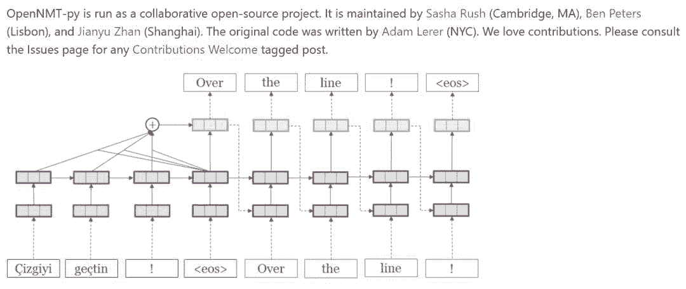
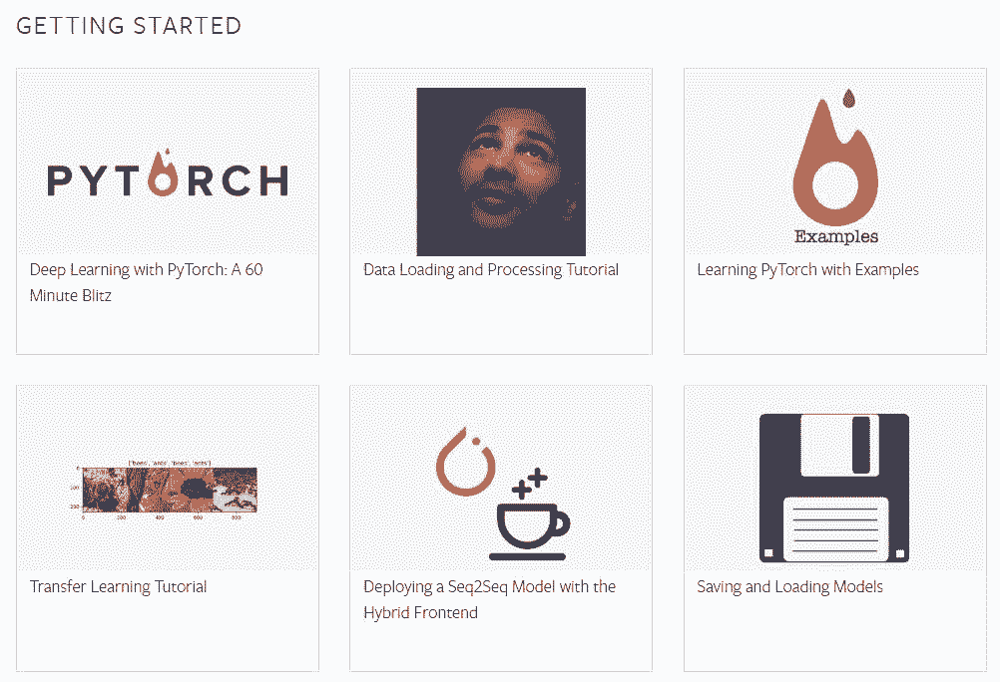
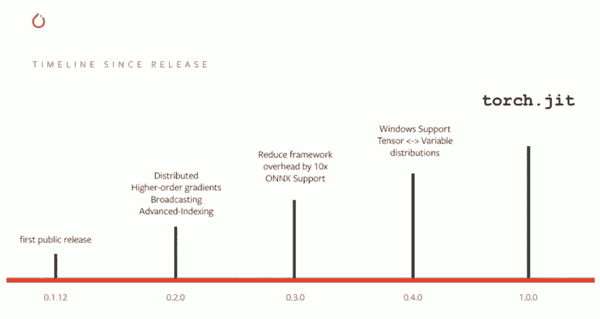
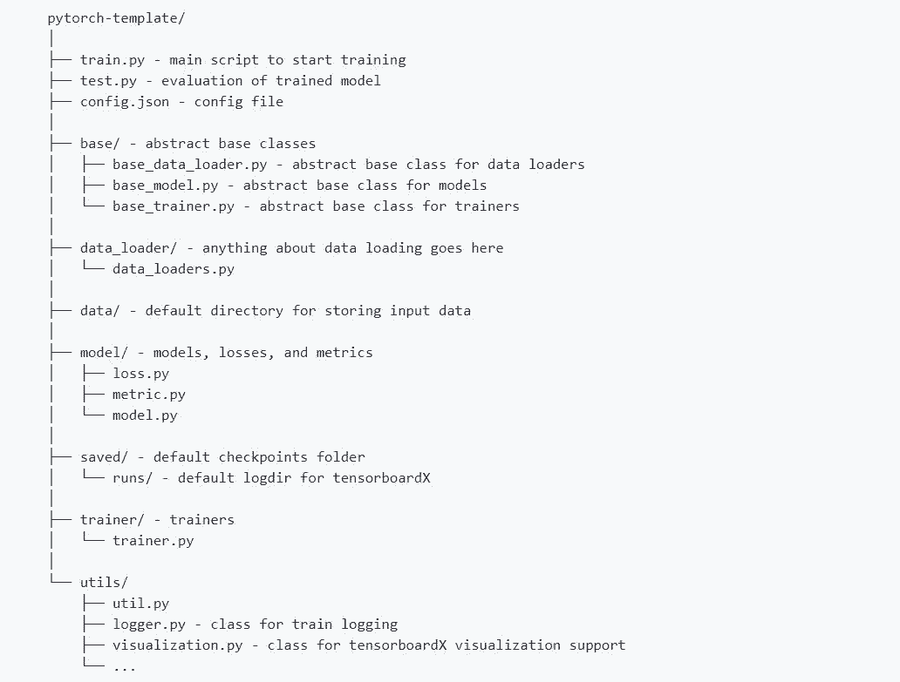

# 库、教程、论文实现，这是一份超全的 PyTorch 资源列表（Github 2.2K 星）

选自 Github

**作者：****bharathgs**

**机器之心编译**

> 机器之心发现了一份极棒的 PyTorch 资源列表，该列表包含了与 PyTorch 相关的众多库、教程与示例、论文实现以及其他资源。在本文中，机器之心对各部分资源进行了介绍，感兴趣的同学可收藏、查用。

项目地址：https://github.com/bharathgs/Awesome-pytorch-list

列表结构：

*   NLP 与语音处理

*   计算机视觉

*   概率/生成库

*   其他库

*   教程与示例

*   论文实现

*   PyTorch 其他项目

**自然语言处理和语音处理**

该部分项目涉及语音识别、多说话人语音处理、机器翻译、共指消解、情感分类、词嵌入/表征、语音生成、文本语音转换、视觉问答等任务，其中有一些是具体论文的 PyTorch 复现，此外还包括一些任务更广泛的库、工具集、框架。

这些项目有很多是官方的实现，其中 FAIR 居多，一般会有系统的使用说明，包含安装、加载、训练、测试、演示等多方面的详细解释。例如哈佛大学的 OpenNMT 项目，它是非常流行的神经机器翻译工具包。从导入自定义数据集、加载词嵌入向量到完成神经机器翻译模型的训练，OpenNMT 能支持整个流程，并且官方也一直在更新。

1.pytorch text：Torch 文本相关的内容。

项目地址：https://github.com/pytorch/text

2.pytorch-seq2seq：在 PyTorch 中实现序列到序列（seq2seq）模型的框架。

项目地址：https://github.com/IBM/pytorch-seq2seq

3.anuvada：PyTorch 中实现的 NLP 的可解释模型。

项目地址：https://github.com/Sandeep42/anuvada

4.audio：PyTorch 的简单音频 I/O。

项目地址：https://github.com/pytorch/audio

5.loop：用于生成多个说话人语音的方法。

项目地址：https://github.com/facebookresearch/loop

6.fairseq-py：用 Python 写的 Facebook AI 研究院提出的序列到序列工具集。

项目地址：https://github.com/facebookresearch/fairseq-py

7.speech：PyTorch ASR 实现。

项目地址：https://github.com/awni/speech

8.OpenNMT-py：开源 PyTorch 神经机器翻译。

项目地址：https://github.com/OpenNMT/OpenNMT-py

9.neuralcoref：基于神经网络和 spaCy 的当前最佳共指消解。

项目地址：https://github.com/huggingface/neuralcoref

10.sentiment-discovery：用于鲁棒情感分类的大规模无监督语言建模。

项目地址：https://github.com/NVIDIA/sentiment-discovery

11.MUSE：用于多语言无监督/监督词向量的库。

项目地址：https://github.com/facebookresearch/MUSE

12.nmtpytorch：PyTorch 神经机器翻译框架。

项目地址：https://github.com/lium-lst/nmtpytorch

13.pytorch-wavenet：快速语音生成 WaveNet 的实现。

项目地址：https://github.com/vincentherrmann/pytorch-wavenet

14.Tacotron-pytorch：端到端语音合成的 PyTorch 实现。

项目地址：https://github.com/soobinseo/Tacotron-pytorch

15.AllenNLP：开源 NLP 研究库，基于 PyTorch。

项目地址：https://github.com/allenai/allennlp

16.PyTorch_NLP：用于 PyTorch pytorchnlp.readthedocs.io 的文本实用程序和数据集。

项目地址：https://github.com/PetrochukM/PyTorch-NLP

17.quick_nlp：基于 FastAI 的 PyTorch NLP 库。

项目地址：https://github.com/outcastofmusic/quick-nlp

18.TTS：Text2Speech 的深度学习实现。

项目地址：https://github.com/mozilla/TTS

19.LASER：语言无关的句子表征的 PyTorch 实现。

项目地址：https://github.com/facebookresearch/LASER

20.pyannote-audio：说话人追踪的神经构建块：语音激活检测、说话人变化检测、说话人嵌入。

项目地址：https://github.com/pyannote/pyannote-audio

**计算机视觉**

该部分项目涉及神经风格迁移、图像分类、人脸对齐、语义分割、RoI 计算、图像增强等任务，还有一些特殊的 CNN 架构，例如第 5、6 和 13 个项目，以及一些预训练模型的集合。其中第 4 个项目可以用于将你的定制图像分类模型和当前最佳模型进行对比，快速知道你的项目到底有没有希望，作者戏称该项目为「Project Killer」。

1.pytorch vision：计算机视觉领域的数据集、转换和模型。

项目地址：https://github.com/pytorch/vision

2.pt-styletransfer：PyTorch 实现的神经分割迁移，作为一个类。

项目地址：https://github.com/tymokvo/pt-styletransfer

3.OpenFacePyTorch：使用 OpenFace's nn4.small2.v1.t7 模型的 PyTorch 模块。

项目地址：https://github.com/thnkim/OpenFacePytorch

4.img_classification_pk_pytorch：快速对比你的图像分类模型和当前最佳模型（例如 DenseNet、ResNet，等）。

项目地址：https://github.com/felixgwu/img_classification_pk_pytorch

5.SparseConvNet：子流形稀疏卷积网络。

项目地址：https://github.com/facebookresearch/SparseConvNet

6.Convolution_LSTM_pytorch：多层卷积 LSTM 模块。

项目地址：https://github.com/automan000/Convolution_LSTM_pytorch

7.face-alignment：基于 PyTorch 的 2D 和 3D 人脸对齐库。

项目地址：https://github.com/1adrianb/face-alignment

8.pytorch-semantic-segmentation：语义分割的 PyTorch 实现。

项目地址：https://github.com/ZijunDeng/pytorch-semantic-segmentation

9.RoIAlign.pytorch：这是一个 PyTorch 版本的 RoIAlign。这个实现基于 crop_and_resize，并支持 CPU 和 GPU 上的前向传播、反向传播。

项目地址：https://github.com/longcw/RoIAlign.pytorch

10.pytorch-cnn-finetune：PyTorch 实现的微调预训练卷积神经网络。

项目地址：https://github.com/creafz/pytorch-cnn-finetune

11.detectorch：PyTorch 实现的 detectron 图像分割模型。

项目地址：https://github.com/ignacio-rocco/detectorch

12.Augmentor：Python 图像增强库。

项目地址：https://github.com/mdbloice/Augmentor

13.s2cnn：这个库包含一个用于球面信号（例如，全向摄像机、地球信号等）的 SO(3) 等变 CNN 的 PyTorch 实现。

项目地址：https://github.com/jonas-koehler/s2cnn

**概率/生成库**

<mp-miniprogram class="miniprogram_element" data-miniprogram-appid="wxf424e2f3e2f94500" data-miniprogram-path="pages/technology/technology?id=bfbadbc0-b9a9-48c1-8e14-983351e0603f&amp;from=weapp" data-miniprogram-nickname="机器之心 Synced" data-miniprogram-avatar="http://mmbiz.qpic.cn/mmbiz_png/f3g058loLBj0Pib4UhuCFagffSB1RHImwskFzvic6mSp2LDhuerbXxeqqv0b63wSt2Pas7MicNWIcia358rlnhiaVag/640?wx_fmt=png&amp;wxfrom=200" data-miniprogram-title="概率模型" data-miniprogram-imageurl="http://mmbiz.qpic.cn/mmbiz_jpg/KmXPKA19gWibTGiaq0ml0EjRvyGcNTibKdDg21iabxSdQNI00n3ERqOh6DylQwmH8ZicFAVQ2ZWN8gzMdrejicJ0tD5Q/0?wx_fmt=jpeg"></mp-miniprogram>

该部分项目主要涉及概率编程、统计推理和生成模型。

1.ptstat：PyTorch 上的概率编程和统计推理。

项目地址：https://github.com/stepelu/ptstat

2.pyro：基于 PyTorch 和 Python 的深度全局概率编程。

项目地址：https://github.com/uber/pyro

3.probtorch：Probabilistic Torch 是深度生成模型的 PyTorch 扩展库。

项目地址：https://github.com/probtorch/probtorch

4.paysage：Python/PyTorch 中的无监督学习和生成模型。

项目地址：https://github.com/drckf/paysage

5.pyvarinf：Python 包，方便在 PyTorch 中利用变分推理执行贝叶斯深度学习方法。

项目地址：https://github.com/ctallec/pyvarinf

6.pyprob：一个基于 PyTorch 的概率编程和推理编译库。

项目地址：https://github.com/probprog/pyprob

7.mia：对机器学习模型运行成员推理攻击的库。

项目地址：https://github.com/spring-epfl/mia

**教程和示例**

这一部分包含了很多 PyTorch 教程，它不仅有官方教程与示例，同时还包含很多开发者在学习过程的经验与理解。从难易程度上看，它们首先介绍了如何入门 PyTorch 这一个框架，并使用 MNIST 等简单数据集展示了一般搭建模型的方法，这些都非常适合初学者入门机器学习。其次会有一些练习题及示例脚本，这些资源可以帮助更好地理解机器学习与 PyTorch 框架。最后就是一些具体任务与模型架构的实现，例如基于 ImageNet 实现 Inception_v3 或 ResNet_50 等。

这里值得注意的是 PyTorch 官方教程，基本上初学者只要跟着官方教程走就行了，它们非常丰富与具体。PyTorch 的教程确实很完美，它不仅从入门基础、计算机视觉、文本处理、生成模型和产品部署等方面全面覆盖了 DL 的使用范围，同时每一个教程不仅解释了模型原理，还注释了大多数的代码。小编感觉相对于 TensorFlow 的教程解释（需要大量查找文档），PyTorch 更加具体。如下展示了 PyTorch 的入门主题：

1.Practical Pytorch：解释不同 RNN 模型的教程。

地址：https://github.com/spro/practical-pytorch

2.DeepLearningForNLPInPytorch：基于 IPython Notebook 的深度学习教程，关注于自然语言处理。

地址：https://github.com/rguthrie3/DeepLearningForNLPInPytorch

3.pytorch-tutorial：为研究者准备的 PyTorch 深度学习教程。

地址：https://github.com/yunjey/pytorch-tutorial

4.pytorch-exercises：PyTorch 练习题集。

地址：https://github.com/keon/pytorch-exercises

5.pytorch tutorials：各种官方 PyTorch 教程。

地址：https://github.com/pytorch/tutorials

6.pytorch examples：通过示例展示如何使用 PyTorch 的项目。

地址：https://github.com/pytorch/examples

7.pytorch practice：一些 PyTorch 脚本示例。

地址：https://github.com/napsternxg/pytorch-practice

8.pytorch mini tutorials：根据 Alec Radford's Theano 教程改编的极简教程。

地址：https://github.com/vinhkhuc/PyTorch-Mini-Tutorials

9.pytorch text classification：基于文本分类任务的简单 CNN 实现。

地址：https://github.com/xiayandi/Pytorch_text_classification

10.cats vs dogs：用于 kaggle 竞赛 Dogs vs. Cats Redux 的模型，该解决方案目前总排名第 27。

地址：https://github.com/desimone/pytorch-cat-vs-dogs

11.convnet：在各种数据集上（ImageNet、Cifar10、 Cifar100 和 MNIST）使用深度卷积神经网络的完整示例。

地址：https://github.com/eladhoffer/convNet.pytorch

12.pytorch-generative-adversarial-networks：简单的生成对抗网络实现。

地址：https://github.com/mailmahee/pytorch-generative-adversarial-networks

13.T-SNE in pytorch：基于 PyTorch 的 t 分布随机近邻嵌入（t-SNE）实现。

地址：https://github.com/cemoody/topicsne

14.AAE_pytorch：对抗自编码器。

地址：https://github.com/fducau/AAE_pytorch

15.Kind_PyTorch_Tutorial：很容易的 PyTorch 入门教程。

地址：https://github.com/GunhoChoi/Kind_PyTorch_Tutorial

16.pytorch-poetry-gen：实现字符级的 RNN 模型。

地址：https://github.com/justdark/pytorch-poetry-gen

17.pytorch-REINFORCE：REINFORCE 的 PyTorch 实现，该项目支持 OpenAI gym 中的连续型和离散型环境。

地址：https://github.com/JamesChuanggg/pytorch-REINFORCE

18.PyTorch-Tutorial：快速上手搭建神经网络。

地址：https://github.com/MorvanZhou/PyTorch-Tutorial

19.pytorch-intro：展示如何执行卷积神经网络和循环神经网络的一些脚本。

地址：https://github.com/joansj/pytorch-intro

**论文实现**

最近 Frankensteinian 等开发者爬取并统计了 ICLR 2019 提交论文提及不同框架的论文数量，其中 TensorFlow 的论文数量从 2018 年的 228 篇略微提升到了 266 篇，Keras 从 42 升到 56，但 Pytorch 的数量从 87 篇提升到了 252 篇。从这里可以看出来 PyTorch 在研究中有非常广泛的应用，很多研究论文都采用 PyTorch 作为首选框架。

因为动态计算图的便利，很多原本使用 TensorFlow 实现的论文都有 PyTorch 复现版，例如下面的高速公路网络和多人实时姿态估计（CVPR'17）等。而更多的是本来就由 PyTorch 实现的论文，包括 DiscoGAN、AnimeGAN 和 TCN 等。这一部分收录了 273 篇论文实现，但是限于长度，我们只展示了前 20 个项目，读者可查阅原项目了解更多。

1.google_evolution ：该项目实现了 Esteban Real 等人完成的图像分类器大规模演化结果。

地址：https://github.com/neuralix/google_evolution

2.pyscatwave：通过 CuPy/PyTorch 实现的 Fast Scattering Transform。

地址：https://github.com/edouardoyallon/pyscatwave

3.scalingscattering：论文《Scaling The Scattering Transform : Deep Hybrid Networks》的实现

地址：https://github.com/edouardoyallon/scalingscattering

4.deep-auto-punctuation：PyTorch 实现字符级的自动标点符号模型。

地址：https://github.com/episodeyang/deep-auto-punctuation

5.Realtime_Multi-Person_Pose_Estimation ：GitHub 项目 Realtime_Multi-Person_Pose_Estimation 的 PyTorch 版。

地址：https://github.com/tensorboy/pytorch_Realtime_Multi-Person_Pose_Estimation

6.PyTorch-value-iteration-networks：价值迭代网络（NIPS'16 论文）的 PyTorch 实现。

地址：https://github.com/onlytailei/PyTorch-value-iteration-networks

7.pytorch_Highway：基于 PyTorch 实现的高速公路网络。

地址：https://github.com/analvikingur/pytorch_Highway

8.pytorch_NEG_loss : 实现 NEG 损失函数。

地址：https://github.com/analvikingur/pytorch_NEG_loss

9.pytorch_RVAE：实现生成序列数据的循环变分自编码器（Recurrent Variational Autoencoder）。

地址：https://github.com/analvikingur/pytorch_RVAE

10.pytorch_TDNN ：时延神经网络（Time Delayed NN）的实现。

地址：https://github.com/analvikingur/pytorch_TDNN

11.eve.pytorch：Eve Optimizer 的实现，该最优化器在论文《proposed in Imploving Stochastic Gradient Descent with Feedback》中提出。

地址：https://github.com/moskomule/eve.pytorch

12.e2e-model-learning：基于任务的端到端模型学习。

地址：https://github.com/locuslab/e2e-model-learning

13.pix2pix-pytorch：使用条件对抗网络实现图像到图像的转换。

地址：https://github.com/mrzhu-cool/pix2pix-pytorch

14.Single Shot MultiBox Detector ：单次多框检测器的 PyTorch 实现。

地址：https://github.com/amdegroot/ssd.pytorch

15.DiscoGAN：论文《Learning to Discover Cross-Domain Relations with Generative Adversarial Networks》的 PyTorch 实现

地址：https://github.com/carpedm20/DiscoGAN-pytorch

16.official DiscoGAN implementation：论文《Learning to Discover Cross-Domain Relations with Generative Adversarial Networks》的官方实现。

地址：https://github.com/SKTBrain/DiscoGAN

17.pytorch-es：进化策略的 PyTorch 实现。

地址：https://github.com/atgambardella/pytorch-es

18.piwise : 基于 VOC2012 数据集实现逐像素的分割。

地址：https://github.com/bodokaiser/piwise

19.pytorch-dqn：实现深度 Q 学习。

地址：https://github.com/transedward/pytorch-dqn

20.neuraltalk2-pytorch：实现图像描述模型，其中 CNN 根据任务可微调。

地址：https://github.com/ruotianluo/neuraltalk2.pytorch

**PyTorch 其它项目**

这一部分主要介绍了 PyTorch 其它各种资源，包括教程论文列表、个人的学习经验与实践、好用的 PyTorch 插件等。这一部分相对于其它部分比较散，但是有一些项目还是非常有意思的，例如在 PyTorch 项目模板中，其介绍了构建 PyTorch 项目一般所采用的结构，包括文件夹及文件结构、各文件的编写规范和示例等。这个项目一直在更新，下图展示了构建 PyTorch 项目的一般文件结构：

1.the-incredible-pytorch：包含 PyTorch 各种教程、论文、项目和社区的项目。

地址：https://github.com/ritchieng/the-incredible-pytorch

2.generative models：收集 TensorFlow、Keras 和 PyTorch 的生成模型，即 GAN 和 VAE。

地址：https://github.com/wiseodd/generative-models)

3.pytorch vs tensorflow：reddit 上 PyTorch 与 TensorFlow 对比。

地址：https://github.com/wiseodd/generative-models

4.Pytorch discussion forum：PyTorch 论坛。

地址：https://discuss.pytorch.org/

5.pytorch notebook: docker-stack ：类似于 Jupyter Notebook 的项目。

地址：https://hub.docker.com/r/escong/pytorch-notebook/

6.drawlikebobross：使用神经网络做图象风格迁移。

地址：https://github.com/kendricktan/drawlikebobross

7.pytorch-tvmisc：PyTorch 个人实现项目。

地址：https://github.com/t-vi/pytorch-tvmisc

8.pytorch-a3c-mujoco：在 Mujoco gym 环境下实现 A3C 项目。

地址：https://github.com/andrewliao11/pytorch-a3c-mujoco

9.pytorch_chatbot：使用 PyTorch 实现 ChatBot。

地址：https://github.com/jinfagang/pytorch_chatbot

10.sketchnet：输入图像并生成处理源码，其可以再生成改图像。

地址：https://github.com/jtoy/sketchnet

11.Deep-Learning-Boot-Camp：非赢利公司，5 天的深度学习训练营。

地址：https://github.com/QuantScientist/Deep-Learning-Boot-Camp

12.Amazon_Forest_Computer_Vision：使用 PyTorch 或 Keras 的卫星图像标注代码，它有非常多 PyTorch 技巧。

地址：https://github.com/mratsim/Amazon_Forest_Computer_Vision

13.AlphaZero_Gomoku：用于五子棋的 AlphaZero 算法实现。

地址：https://github.com/junxiaosong/AlphaZero_Gomoku

14.pytorch-cv：目标检测、语义分割和姿态识别的实现项目。

地址：https://github.com/youansheng/pytorch-cv

15.deep-person-reid：深度人脸再识别 PyTorch 实现项目。

地址：https://github.com/KaiyangZhou/deep-person-reid

16.pytorch-template：PyTorch 项目模板。

地址：https://github.com/victoresque/pytorch-template

17.Deep Learning With Pytorch TextBook：使用 PyTorch 构建基于文本或视觉方面的神经网络指南。

地址：https://www.packtpub.com/big-data-and-business-intelligence/deep-learning-pytorch

18.compare-tensorflow-pytorch：对比使用 TensorFlow 写的模型和用 PyTorch 写的模型。

地址：https://github.com/jalola/compare-tensorflow-pytorch

****本文为机器之心编译，**转载请联系本公众号获得授权****。**

✄------------------------------------------------

**加入机器之心（全职记者 / 实习生）：hr@jiqizhixin.com**

**投稿或寻求报道：**content**@jiqizhixin.com**

**广告 & 商务合作：bd@jiqizhixin.com**