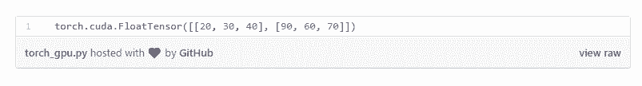
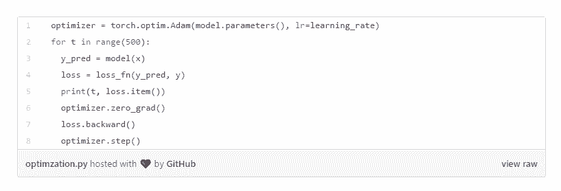

# 还不会使用 PyTorch 框架进行深度学习的小伙伴，看过来

选自 heartbeat.fritz.ai

**作者：****Derrick Mwiti**

****机器之心编译****

**参与：Geek AI、王淑婷**

> 这是一篇关于使用 PyTorch 框架进行深度学习的教程，读完以后你可以轻松地将该框架应用于深度学习模型。

今年初，Facebook 推出了 PyTorch 1.0，该框架集成了谷歌云、AWS 和 Azure 机器学习。学习本教程之前，你需要很熟悉 Scikit-learn，Pandas，NumPy 和 SciPy。这些程序包是使用本教程的重要先决条件。

**教程大纲**

*   何为深度学习？

*   Pytorch 简介

*   相较于其它 Python 深度学习库，Pytorch 有何优势？

*   Pytorch 的张量

*   Pytorch Autograd 机制

*   Pytorch 的 nn 模块

*   Pytorch optim 包

*   Pytorch 中的自定义 nn 模块

*   总结和延伸阅读

**何为深度学习？**

深度学习是机器学习的一个子领域，其算法受到了人类大脑工作机制的启发。这些算法被称为人工神经网络。这样的神经网络包括用于图像分类的卷积神经网络、人工神经网络和循环神经网络。

**Pytorch 简介**

Pytorch 是一个基于 Torch 的 Python 机器学习包，而 Torch 则是一个基于编程语言 Lua 的开源机器学习包。Pytorch 有两个主要的特点：

*   利用强大的 GPU 加速进行张量计算（如 NumPy）

*   用于构建和训练神经网络的自动微分机制

**相较于其它 Python 深度学习库，Pytorch 有何优势？**

相比其它深度学习库，Pytorch 具有以下两点优势：

1\. 与 TensorFlow 等其它在运行模型之前必须先定义整个计算图的库不同，PyTorch 允许动态定义图。

2\. PyTorch 也非常适合深度学习研究，提供了最大的灵活性和运行速度。

PyTorch Tensors

**Pytorch 张量**

PyTorch 张量与 NumPy 数组非常相似，而且它们可以在 GPU 上运行。这一点很重要，因为它有助于加速数值计算，从而可以将神经网络的速度提高 50 倍甚至更多。为了使用 PyTorch，你需要先访问其官网并安装 PyTorch。如果你正在使用 Conda，你可以通过运行以下简单命令来安装 PyTorch：

为了定义 PyTorch 张量，首先需要导入 torch 包。PyTorch 允许你定义两种类型的张量，即 CPU 和 GPU 张量。在本教程中，假设你运行的是使用 CPU 进行深度学习运算的机器，但我也会向你展示如何在 GPU 中定义张量：

PyTorch 的默认张量类型是一个浮点型张量，定义为「torch.FloatTensor」。例如，你可以根据 Python 的 list 数据结构创建张量：

如果你使用的是支持 GPU 的机器，你可以通过以下方法定义张量：

你也可以使用 PyTorch 张量执行加法和减法等数学运算：

你还可以定义矩阵并执行矩阵运算。我们来看看如何定义一个矩阵然后将其转置：

**Pytorch Autograd 机制**

PyTorch 使用了一种叫做「自动微分」的技术，它可以对函数的导数进行数值估计。自动微分在神经网络中计算反向传递（backward pass）。在训练过程中，神经网络的权重被随机初始化为接近零但不是零的数。「反向传递」是指从右到左调整权重的过程，而正向传递则是从左到右调整权重的过程。

「torch.autograd」是 PyTorch 中支持自动微分的库。这个包的核心类是「torch.Tensor」。如果你想要跟踪这个类的所有操作，请将「.requires_grad」设置为 True。如果要计算所有的梯度，请调用「.backward()」。这个张量的梯度将在「.grad」属性中积累。

如果你想要从计算历史中分离出一个张量，请调用「.detach()」函数。这也可以防止将来对张量的计算被跟踪。另一种防止历史跟踪的方法是用「torch.no_grad()」方法封装代码。

你可以将张量「Tensor」和函数「Function」类相连接，构建一个编码了完整计算历史的无环图。张量的「.grad_fn」属性会引用创建了这个张量的「Function」。如果你要计算导数，可以调用张量的「.backward()」。如果该张量包含一个元素，你不需要为「backward()」函数指定任何参数。如果张量包含多个元素，你需要指定一个规模（shape）相匹配的张量的梯度。

例如，你可以创建两个张量，将其中一个张量的「requires_grad」设定为 True，将另一个的设定为 False。接着你可以用这两个张量来执行加法和求和运算。然后你可以计算其中一个张量的梯度。

在「b」上调用「.grad」的返回值为空，因为你没有将它的「requires_grad」设置为 True。

**Pytorch 的 nn 模块**

这是在 Pytorch 中构建神经网络的模块。「nn」模块依赖于「autograd」来定义模型并对其进行微分处理。首先，定义训练一个神经网络的过程：

1\. 用一些可学习的参数（即权重）定义神经网络

2\. 在输入的数据集上进行迭代

3 通过网络处理输入

4\. 将预测结果和实际值进行比较，并测量误差

5\. 将梯度传播回网络的参数中

6\. 使用简单的更新规则更新网络的权重：

weight = weight—learning_rate * gradient

现在，你可以使用「nn」程序包创建一个双层的神经网络：

在这里我们将解释一下上面用到的参数：

*   N 是批处理大小。批处理大小是观测数据的数量，观测之后权重将被更新。

*   D_in 是输入的维度

*   H 是隐藏层的维度

*   D_out 是输出层的维度

*   torch.randn 定义了指定维度的矩阵

*   torch.nn.Sequential 初始化了神经网络层的线性堆栈

*   torch.nn.Linear 对输入数据应用了线性变换 

*   torch.nn.ReLU 在元素层级上应用了线性整流函数

*   torch.nn.MSELoss 创建了一个标准来度量输入 x 和目标 y 中 n 个元素的均方误差

**PyTorch optim 包**

接下来，你要使用 optim 包来定义一个优化器，该优化器将为你更新权重。optim 包抽象出了优化算法的思想，并提供了常用优化算法（如 AdaGrad、RMSProp 和 Adam）的实现。我们将使用 Adam 优化器，它是最流行的优化器之一。

该优化器接受的第一个参数是张量，这些张量需要更新。在正向传递中，你要通过向模型传递 x 来计算出预测的 y。然后，计算并显示出损失。在运行反向传递之前，你要将使用优化器更新的所有变量的梯度设置为零。这样做的原因是，默认情况下，在调用「.backward()」方法时，梯度不会被重写。然后，你需要在优化器上调用「step」函数，该步骤会更新其参数。具体的实现代码如下所示：

**PyTorch 中自定义的 nn 模块**

有时你需要构建自己的自定义模块。这种情况下，你需要创建「nn.Module」的子类，然后定义一个接收输入张量并产生输出张量的 forward。使用「nn.Module」实现双层网络的方法如下图所示。这个模型与上面的模型非常相似，但不同之处在于你要使用「torch.nn.Module」创建神经网络。另一个区别是这个模型会使用 stochastic gradient descent optimizer 而不是 Adam。你可以使用下面的代码实现一个自定义的 nn 模块：

**总结和延伸阅读**

Pytorch 允许你实现不同类型的神经网络层，例如：卷积层、循环层、线性层。你可以从其官方文档中了解更多关于 Pytorch 的信息。

你还可以在「Hacker News」和「Reddit」上讨论这篇博客。

如果你想知道更多关于 PyTorch 如何为机器学习项目赋能的信息，可以查看下面的 Heartbeat 资源：

*   通过 Pytorch 实现神经网络风格迁移

*   地址：https://heartbeat.fritz.ai/neural-style-transfer-with-pytorch-49e7c1fe3bea

*   通过 Pytorch 实现基本的图像分类

*   地址：https://heartbeat.fritz.ai/basics-of-image-classification-with-pytorch-2f8973c51864

*   通过「TensorFlow Mobile」在安卓系统上部署 Pytorch 和 Keras

*   地址：https://heartbeat.fritz.ai/deploying-pytorch-and-keras-models-to-android-with-tensorflow-mobile-a16a1fb83f2

*   想要入门移动机器学习吗？加入 Heartbeat 的 Slack 小组吧！

*   地址：https://heartbeat.fritz.ai/join-the-conversation-heartbeats-new-slack-community-620000da5819

*原文链接：https://heartbeat.fritz.ai/introduction-to-pytorch-for-deep-learning-5b437cea90ac*

****本文为机器之心编译，**转载请联系本公众号获得授权****。**

✄------------------------------------------------

**加入机器之心（全职记者 / 实习生）：hr@jiqizhixin.com**

**投稿或寻求报道：**content**@jiqizhixin.com**

**广告 & 商务合作：bd@jiqizhixin.com**