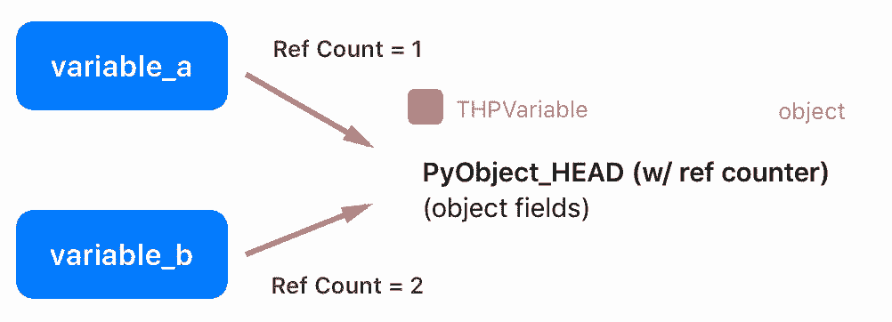
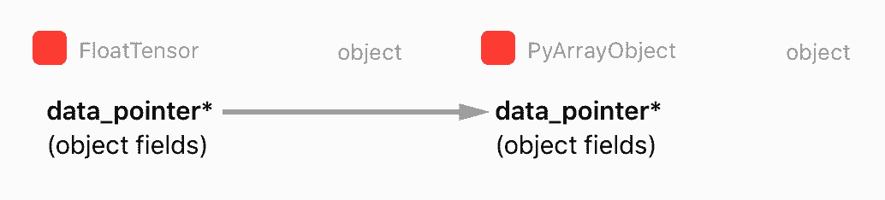
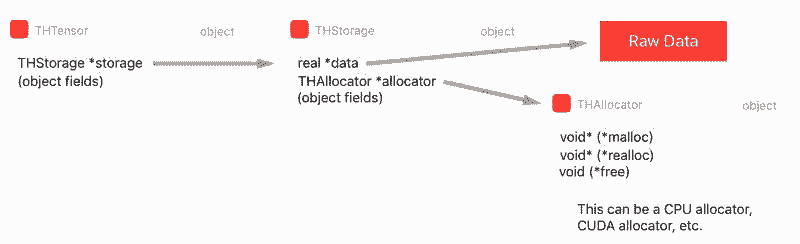

# PyTorch 为何如此高效好用？来探寻深度学习框架的内部架构

选自 blog.christianperone

**作者：****Christian S. Perone**

**机器之心编译**

**参与：思源、黄小天、李泽南**

> 作为 Facebook 人工智能团队（FAIR）提供支持的深度学习框架，PyTorch 自 2017 年 1 月推出以来立即成为了一种流行开发工具。其在调试、编译等方面的优势使其受到了学界研究者们的普遍欢迎。本文中，来自蒙特利尔综合理工学院的研究员 Christian S. Perone 将为我们介绍这种神经网络框架的内部架构，揭开 PyTorch 方便好用的真正原因。

**前言**

本文主要介绍了 PyTorch 代码库，旨在为 PyTorch 及其内部架构设计提供指导，核心目标是为那些想了解 API 知识之外的人提供有益的帮助，并给出之前教程所没有的新内容。注意：PyTorch 构建系统需要大量使用代码设置，因此其他人的描述我将不再重复。如果你感兴趣，请参考原文提供的扩展资料。

**C/C++中 Python 扩展对象的简介**

你可能知道可以借助 C/C++扩展 Python，并开发所谓的「扩展」。PyTorch 的所有繁重工作由 C/C++实现，而不是纯 Python。为了定义 C/C++中一个新的 Python 对象类型，你需要定义如下实例的一个类似结构： 

```py
// Python object that backs torch.autograd.Variable
struct THPVariable {
    PyObject_HEAD
    torch::autograd::Variable cdata;
    PyObject* backward_hooks;
};
```

如上，在定义的开始有一个称之为 PyObject_HEAD 的宏，其目标是标准化 Python 对象，并扩展至另一个结构，该结构包含一个指向类型对象的指针，以及一个带有引用计数的字段。



Python API 中有两个额外的宏，分别称为 Py_INCREF() 和 Py_DECREF()，可用于增加和减少 Python 对象的引用计数。多实体可以借用或拥有其他对象的引用（因此引用计数被增加），而只有当引用计数达到零，Python 才会自动删除那个对象的内存。想了解更多有关 Python C/++扩展的知识，请参见：https://docs.python.org/3/extending/newtypes.html。

有趣的事实：使用小的整数作为索引、计数等在很多应用中非常见。为了提高效率，官方 CPython 解释器缓存从-5 到 256 的整数。正由于此，声明 a = 200; b = 200; a is b 为真，而声明 a = 300; b = 300; a is b 为假。

**Zero-copy PyTorch 张量到 Numpy，反之亦然**

PyTorch 有专属的张量表征，分离 PyTorch 的内部表征和外部表征。但是，由于 Numpy 数组的使用非常普遍，尤其是当数据加载源不同时，我们确实需要在 Numpy 和 PyTorch 张量之间做转换。正由于此，PyTorch 给出了两个方法（from_numpy() 和 numpy()），从而把 Numpy 数组转化为 PyTorch 数组，反之亦然。如果我们查看把 Numpy 数组转化为 PyTorch 张量的调用代码，就可以获得有关 PyTorch 内部表征的更多洞见：

```py
at::Tensor tensor_from_numpy(PyObject* obj) {
  if (!PyArray_Check(obj)) {
    throw TypeError("expected np.ndarray (got %s)", Py_TYPE(obj)->tp_name);
  }

  auto array = (PyArrayObject*)obj;
  int ndim = PyArray_NDIM(array);
  auto sizes = to_aten_shape(ndim, PyArray_DIMS(array));
  auto strides = to_aten_shape(ndim, PyArray_STRIDES(array));
  // NumPy strides use bytes. Torch strides use element counts.
  auto element_size_in_bytes = PyArray_ITEMSIZE(array);
  for (auto& stride : strides) {
    stride /= element_size_in_bytes;
  }

  // (...) - omitted for brevity

  void* data_ptr = PyArray_DATA(array);
  auto& type = CPU(dtype_to_aten(PyArray_TYPE(array)));
  Py_INCREF(obj);
  return type.tensorFromBlob(data_ptr, sizes, strides, obj {
    AutoGIL gil;
    Py_DECREF(obj);
  });
}
```

*代码摘自（tensor_numpy.cpp：https://github.com/pytorch/pytorch/blob/master/torch/csrc/utils/tensor_numpy.cpp#L88）*

正如你在这段代码中看到的，PyTorch 从 Numpy 表征中获取所有信息（数组元数据），并创建自己的张量。但是，正如你从被标注的第 18 行所看到的，PyTorch 保留一个指向内部 Numpy 数组原始数据的指针，而不是复制它。这意味着 PyTorch 将拥有这一数据，并与 Numpy 数组对象共享同一内存区域。



还有一点很重要：当 Numpy 数组对象越出范围并获得零引用（zero reference）计数，它将被当作垃圾回收并销毁，这就是为什么 Numpy 数组对象的引用计数在第 20 行有增加。该行之后，PyTorch 将从这一 Numpy 数据 blob 中创建一个新的张量对象，并且在创建这一新张量的过程中，PyTorch 将会传递内存数据指针，连同内存大小、步幅以及稍后张量存储将会使用的函数（我们将会在下节讨论），从而通过减少 Numpy 数组对象的引用计数并使 Python 关心这一对象内存管理而释放数据。

tensorFromBlob() 方法将创建一个新张量，但只有在为这一张量创建一个新「存储」之后。存储是指存储数据指针的地方，它并不在张量结构内部。张量存储正是我们下一节要讨论的内容。

**张量存储**

张量的实际原始数据并不是立即保存在张量结构中，而是保存在我们称之为「存储（Storage）」的地方，它是张量结构的一部分。

正如我们前面在 tensor_from_numpy() 中看到的代码，它调用了 tensorFromBlob() 函数以从原始数据 Blob 中创建一个张量。tensorFromBlob() 函数在内部会调用另一个名为 storageFromBlob() 函数，该函数主要根据类型为数据创建一个存储。例如在 CPU 浮点型的情况下，它会返回一个新的 CPUFloatStorage 实例。

CPUFloatStorage 基本上是包含 utility 函数的包装类（wrapper），且实际存储结构如下所示称为 THFloatStorage：

```py
typedef struct THStorage
{
    real *data;
    ptrdiff_t size;
    int refcount;
    char flag;
    THAllocator *allocator;
    void *allocatorContext;
    struct THStorage *view;
} THStorage;
```

如上所示，THStorage 有一个指向原始数据、原始数据大小、flags 和 allocator 的指针，我们会在后面详细地讨论它们。值得注意的是，THStorage 不包含如何解释内部数据的元数据，这是因为存储对保存的内容「无处理信息的能力」，只有张量才知道如何「查看」数据。

因此，你可能已经意识到多个张量可以指向相同的存储，而仅仅对数据采用不同的解析。这也就是为什么我们以不同的形状或维度，查看相同元素数量的张量会有很高的效率。下面的 Python 代码表明，在改变张量的形状后，存储中的数据指针将得到共享。

```py
>>> tensor_a = torch.ones((3, 3))
>>> tensor_b = tensor_a.view(9)
>>> tensor_a.storage().data_ptr() == tensor_b.storage().data_ptr()
True
```

如 THFloatStorage 结构中的第七行代码所示，它有一个指向 THAllocator 结构的指针。它因为给分配器（allocator）带来灵活性而显得十分重要，其中 allocator 可以用来分配存储数据。

```py
typedef struct THAllocator
{
  void* (*malloc)(void*, ptrdiff_t);
  void* (*realloc)(void*, void*, ptrdiff_t);
  void (*free)(void*, void*);
} THAllocator;
```

*代码摘自（THAllocator.h：https://github.com/pytorch/pytorch/blob/master/aten/src/TH/THAllocator.h#L16）*

如上所述，该结构有三个函数指针字段来定义分配器的意义：malloc、realloc 和 free。对于分配给 CPU 的内存，这些函数当然与传统的 malloc/realloc/free POSIX 函数相关。然而当我们希望分配存储给 GPU，我们最终会使用如 cudaMallocHost() 那样的 CUDA 分配器，我们可以在下面的 THCudaHostAllocator malloc 函数中看到这一点。

```py
static void *THCudaHostAllocator_malloc(void* ctx, ptrdiff_t size) {
  void* ptr;
  if (size < 0) THError("Invalid memory size: %ld", size);
  if (size == 0) return NULL;
  THCudaCheck(cudaMallocHost(&ptr, size));
  return ptr;
}
```

*代码摘自（THCAllocator.c：https://github.com/pytorch/pytorch/blob/master/aten/src/THC/THCAllocator.c#L3）*

如上所示，分配器调用了一个 cudaMallocHost() 函数。你可能已经注意到版本库组织中有缩写的表示模式，在浏览版本库时记住这些约定非常重要，它们在 PyTorch README 文件中有所总结：

*   TH = TorcH

*   THC = TorcH Cuda

*   THCS = TorcH Cuda Sparse

*   THCUNN = TorcH CUda Neural Network

*   THD = TorcH Distributed

*   THNN = TorcH Neural Network

*   THS = TorcH Sparse

该约定同样存在于函数/类别名和其它对象中，因此了解它们十分重要。你可以在 TH 代码中找到 CPU 分配器，在 THC 代码中找到 CUDA 分配器。最后，我们可以看到主张量 THTensor 结构的组成：

```py
typedef struct THTensor
{
    int64_t *size;
    int64_t *stride;
    int nDimension;
    THStorage *storage;
    ptrdiff_t storageOffset;
    int refcount;
    char flag;
} THTensor;
```

如上，THTensor 的主要结构为张量数据保留了 size/strides/dimensions/offsets/等，同时还有存储 THStorage。我们可以将所有这些结构总结为以下图表：



现在，如果我们有多重处理的需求，且希望在多个不同的进程中共享张量数据，那么我们需要一个共享内存的方法。否则每次另一个进程需要张量或我们希望实现 Hogwild 训练过程以将所有不同的进程写入相同的内存区域时，我们就需要在进程间创建副本，这是非常低效的。因此，我们将在下一节讨论共享内存的特定存储方法。

**共享内存**

共享内存可以用很多种不同的方法实现（依赖于支持的平台）。PyTorch 支持部分方法，但为了简单起见，我将讨论在 MacOS 上使用 CPU（而不是 GPU）的情况。由于 PyTorch 支持多种共享内存的方法，由于代码中包含很多级的间接性，这部分会有点困难。

PyTorch 为 Python multiprocessing 模块提供了一个封装器，可以从 torch.multiprocessing 导入。他们对该封装器中的实现做出了一些变动，以确保每当一个 Tensor 被放在队列上或和其它进程共享时，PyTorch 可以确保仅有一个句柄的共享内存会被共享，而不会共享 Tensor 的完整新副本。现在，很多人都不知道 PyTorch 中的 Tensor 方法是 share_memory_()，然而，该函数正好可以触发那个特定 Tensor 的保存内存的完整重建。该方法的执行过程是创建共享内存的一个区域，其可以在不同的进程中使用。最终，该函数可以调用以下的函数：

```py
static THStorage* THPStorage_(newFilenameStorage)(ptrdiff_t size)
{
  int flags = TH_ALLOCATOR_MAPPED_SHAREDMEM | TH_ALLOCATOR_MAPPED_EXCLUSIVE;
  std::string handle = THPStorage_(__newHandle)();
  auto ctx = libshm_context_new(NULL, handle.c_str(), flags);
  return THStorage_(newWithAllocator)(size, &THManagedSharedAllocator, (void*)ctx);
}
```

如上所示，该函数使用了一个特殊的分类器 THManagedSharedAllocator 来创建另一个存储。它首先定义了一些 flags，然后创建了一个格式为 /torch_ [process id] _ [random number] 的字符串句柄，最后在使用特殊的 THManagedSharedAllocator 创建新的存储。该分配器有一个指向 PyTorch 内部库 libshm 的函数指针，它将实现名为 Unix Domain Socket 的通信以共享特定 quyu 的内存句柄。这种分配器实际上是「smart allocator」的特例，因为它包含通信控制逻辑单元，并使用了另一个称之为 THRefcountedMapAllocator 的分配器，它将创建市级共享内存区域并调用 mmp() 以将该区域映射到进程虚拟地址空间。

现在我们可以通过手动交换共享内存句柄而将分配给另一个进程的张量分配给一个进程，如下为 Python 示例：

```py
>>> import torch
>>> tensor_a = torch.ones((5, 5))
>>> tensor_a

 1  1  1  1  1
 1  1  1  1  1
 1  1  1  1  1
 1  1  1  1  1
 1  1  1  1  1
[torch.FloatTensor of size 5x5]

>>> tensor_a.is_shared()
False
>>> tensor_a = tensor_a.share_memory_()
>>> tensor_a.is_shared()
True
>>> tensor_a_storage = tensor_a.storage()
>>> tensor_a_storage._share_filename_()
(b'/var/tmp/tmp.0.yowqlr', b'/torch_31258_1218748506', 25)
```

在这段代码中，执行进程 A，我们就创建了一个 5×5，被 1 所填充的张量。在此之后，我们将其共享，并打印 Unix Domain Socket 地址和句柄的元组。现在我们可以从另一个进程 B 中接入这一内存区域了：

进程 B 执行代码：

```py
>>> import torch
>>> tensor_a = torch.Tensor()
>>> tuple_info = (b'/var/tmp/tmp.0.yowqlr', b'/torch_31258_1218748506', 25)
>>> storage = torch.Storage._new_shared_filename(*tuple_info)
>>> tensor_a = torch.Tensor(storage).view((5, 5))

 1  1  1  1  1
 1  1  1  1  1
 1  1  1  1  1
 1  1  1  1  1
 1  1  1  1  1
[torch.FloatTensor of size 5x5]
```

如你所见，使用 Unix Domain Socket 地址和句柄的元组信息，我们可以接入另一个进程的张量存储内容。如果你在进程 B 改变张量，你会看到改动也会反映在进程 A 中，因为张量之间共享着同样的存储区域。

**DLPack：深度学习框架 Babel 的希望**

现在让我们来看看 PyTorch 代码库最新的一些内容——DLPack（https://github.com/dmlc/dlpack）。DLPack 是一个内存张量结构的开放标准，允许张量数据在框架之间交换。非常有趣的是，这种内存表示是标准化的——与大多数框架已经在使用的内存表示方法非常类似，这就允许我们可以在框架之间共享，且完全无需复制数据。鉴于目前我们还没有内部通信的工具，DLPack 是一个非常了不起的创造。

它无疑会帮助我们解决今天存在于 MXNet、PyTorch 等框架上「孤岛」一样的张量表示，并允许开发者在多个深度学习框架之间自由操作，享受标准化为框架带来的优势。

DLPack 的核心结构 DLTensor 非常简单，如下所示：

```py
/*!
 * \brief Plain C Tensor object, does not manage memory.
 */
typedef struct {
  /*!
   * \brief The opaque data pointer points to the allocated data.
   *  This will be CUDA device pointer or cl_mem handle in OpenCL.
   *  This pointer is always aligns to 256 bytes as in CUDA.
   */
  void* data;
  /*! \brief The device context of the tensor */
  DLContext ctx;
  /*! \brief Number of dimensions */
  int ndim;
  /*! \brief The data type of the pointer*/
  DLDataType dtype;
  /*! \brief The shape of the tensor */
  int64_t* shape;
  /*!
   * \brief strides of the tensor,
   *  can be NULL, indicating tensor is compact.
   */
  int64_t* strides;
  /*! \brief The offset in bytes to the beginning pointer to data */
  uint64_t byte_offset;
} DLTensor;
```

*代码来自 https://github.com/dmlc/dlpack/blob/master/include/dlpack/dlpack.h*

如你所见，这里有一个未加工数据的数据指针，以及形态/步幅/偏移/GPU 或 CPU，以及其他 DLTensor 指向的元信息。

这里还有一个被称为 DLManagedTensor 的受管理版本，其中框架可以提供一个环境，以及「删除」函数，后者可以从借用张量来通知其他框架不再需要资源。

在 PyTorch 中，如果你想要转换到 DLTensor 格式，或从 DLTensor 格式转换，你可以找到 C/C++的方法，甚至 Python 方法来做这件事：

```py
import torch
from torch.utils import dlpack

t = torch.ones((5, 5))
dl = dlpack.to_dlpack(t)
```

这个 Python 函数会从 ATen 调用 toDLPack 函数，如下所示：

```py
DLManagedTensor* toDLPack(const Tensor& src) {
  ATenDLMTensor * atDLMTensor(new ATenDLMTensor);
  atDLMTensor->handle = src;
  atDLMTensor->tensor.manager_ctx = atDLMTensor;
  atDLMTensor->tensor.deleter = &deleter;
  atDLMTensor->tensor.dl_tensor.data = src.data_ptr();
  int64_t device_id = 0;
  if (src.type().is_cuda()) {
    device_id = src.get_device();
  }
  atDLMTensor->tensor.dl_tensor.ctx = getDLContext(src.type(), device_id);
  atDLMTensor->tensor.dl_tensor.ndim = src.dim();
  atDLMTensor->tensor.dl_tensor.dtype = getDLDataType(src.type());
  atDLMTensor->tensor.dl_tensor.shape = const_cast<int64_t*>(src.sizes().data());
  atDLMTensor->tensor.dl_tensor.strides = const_cast<int64_t*>(src.strides().data());
  atDLMTensor->tensor.dl_tensor.byte_offset = 0;
  return &(atDLMTensor->tensor);
}
```

如上所示，这是一个非常简单的转换，它可以将元数据的 PyTorch 格式转换为 DLPack 格式，并将指针指向内部张量的数据表示。

我们都希望更多的深度学习框架可以学习这种标准，这会让整个生态系统受益。希望本文能够对你有所帮助。

*原文链接：http://blog.christianperone.com/2018/03/pytorch-internal-architecture-tour/*

**点击阅读原文，从技术到产品体验搜狗机器翻译**

