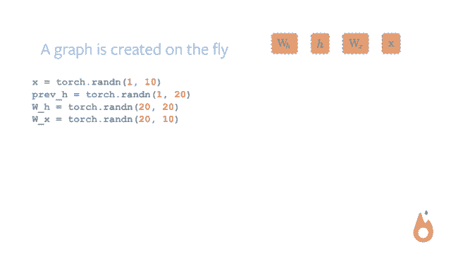
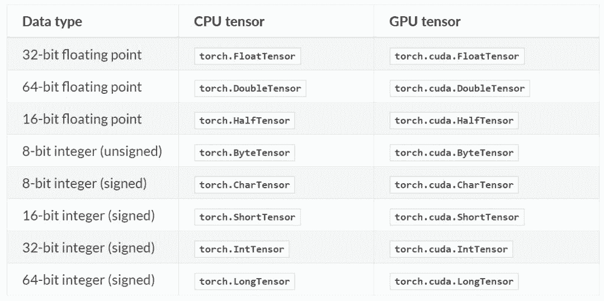
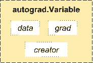

# 教程 | PyTorch 经验指南：技巧与陷阱

选自 GitHub

**作者：****Kaixhin**

**机器之心编译**

> PyTorch 的构建者表明，PyTorch 的哲学是解决当务之急，也就是说即时构建和运行计算图。目前，PyTorch 也已经借助这种即时运行的概念成为最受欢迎的框架之一，开发者能快速构建模型与验证想法，并通过神经网络交换格式 ONNX 在多个框架之间快速迁移。本文从基本概念开始介绍了 PyTorch 的使用方法、训练经验与技巧，并展示了可能出现的问题与解决方案。

项目地址：https://github.com/Kaixhin/grokking-pytorch

PyTorch 是一种灵活的深度学习框架，它允许通过动态神经网络（例如利用动态控流——如 if 语句或 while 循环的网络）进行自动微分。它还支持 GPU 加速、分布式训练以及各类优化任务，同时还拥有许多更简洁的特性。以下是作者关于如何利用 PyTorch 的一些说明，里面虽然没有包含该库的所有细节或最优方法，但可能会对大家有所帮助。

神经网络是计算图的一个子类。计算图接收输入数据，数据被路由到对数据执行处理的节点，并可能被这些节点转换。在深度学习中，神经网络中的神经元（节点）通常利用参数或可微函数转换数据，这样可以优化参数以通过梯度下降将损失最小化。更广泛地说，函数是随机的，图结构可以是动态的。所以说，虽然神经网络可能非常适合数据流式编程，但 PyTorch 的 API 却更关注命令式编程——一种编程更常考虑的形式。这令读取代码和推断复杂程序变得简单，而无需损耗不必要的性能；PyTorch 速度很快，且拥有大量优化，作为终端用户你毫无后顾之忧。

本文其余部分写的是关于 grokking PyTorch 的内容，都是基于 MINIST 官网实例，应该要在学习完官网初学者教程后再查看。为便于阅读，代码以块状形式呈现，并带有注释，因此不会像纯模块化代码一样被分割成不同的函数或文件。

**Pytorch 基础**

PyTorch 使用一种称之为 imperative / eager 的范式，即每一行代码都要求构建一个图，以定义完整计算图的一个部分。即使完整的计算图还没有构建好，我们也可以独立地执行这些作为组件的小计算图，这种动态计算图被称为「define-by-run」方法。



**PyTorch 张量**

正如 PyTorch 文档所说，如果我们熟悉 NumPy 的多维数组，那么 Torch 张量的很多操作我们能轻易地掌握。PyTorch 提供了 CPU 张量和 GPU 张量，并且极大地加速了计算的速度。

从张量的构建与运行就能体会，相比 TensorFLow，在 PyTorch 中声明张量、初始化张量要简洁地多。例如，使用 torch.Tensor(5, 3) 语句就能随机初始化一个 5×3 的二维张量，因为 PyTorch 是一种动态图，所以它声明和真实赋值是同时进行的。

在 PyTorch 中，torch.Tensor 是一种多维矩阵，其中每个元素都是单一的数据类型，且该构造函数默认为 torch.FloatTensor。以下是具体的张量类型：



除了直接定义维度，一般我们还可以从 Python 列表或 NumPy 数组中创建张量。而且根据使用 Python 列表和元组等数据结构的习惯，我们可以使用相似的索引方式进行取值或赋值。PyTorch 同样支持广播（Broadcasting）操作，一般它会隐式地把一个数组的异常维度调整到与另一个算子相匹配的维度，以实现维度兼容。

**自动微分模块**

TensorFlow、Caffe 和 CNTK 等大多数框架都使用静态计算图，开发者必须建立或定义一个神经网络，并重复使用相同的结构来执行模型训练。改变网络的模式就意味着我们必须从头开始设计并定义相关的模块。

但 PyTorch 使用的技术为自动微分（automatic differentiation）。在这种机制下，系统会有一个 Recorder 来记录我们执行的运算，然后再反向计算对应的梯度。这种技术在构建神经网络的过程中十分强大，因为我们可以通过计算前向传播过程中参数的微分来节省时间。

从概念上来说，Autograd 会维护一个图并记录对变量执行的所有运算。这会产生一个有向无环图，其中叶结点为输入向量，根结点为输出向量。通过从根结点到叶结点追踪图的路径，我们可以轻易地使用链式法则自动计算梯度。



在内部，Autograd 将这个图表征为 Function 对象的图，并且可以应用 apply() 计算评估图的结果。在计算前向传播中，当 Autograd 在执行请求的计算时，它还会同时构建一个表征梯度计算的图，且每个 Variable 的 .grad_fn 属性就是这个图的输入单元。在前向传播完成后，我们可以在后向传播中根据这个动态图来计算梯度。

PyTorch 还有很多基础的模块，例如控制学习过程的最优化器、搭建深度模型的神经网络模块和数据加载与处理等。这一节展示的张量与自动微分模块是 PyTorch 最为核心的概念之一，读者可查阅 PyTorch 文档了解更详细的内容。

下面作者以 MNIST 为例从数据加载到模型测试具体讨论了 PyTorch 的使用、思考技巧与陷阱。

**PyTorch 实用指南**

**导入**

```py
import argparse
import torch
from torch import nn, optim
from torch.nn import functional as F
from torch.utils.data import DataLoader
from torchvision import datasets, transforms
```

除了用于计算机视觉问题的 torchvision 模块外，这些都是标准化导入。

**设置**

```py
parser = argparse.ArgumentParser(description='PyTorch MNIST Example')
parser.add_argument('--batch-size', type=int, default=64, metavar='N',
 help='input batch size for training (default: 64)')
parser.add_argument('--epochs', type=int, default=10, metavar='N',
 help='number of epochs to train (default: 10)')
parser.add_argument('--lr', type=float, default=0.01, metavar='LR',
 help='learning rate (default: 0.01)')
parser.add_argument('--momentum', type=float, default=0.5, metavar='M',
 help='SGD momentum (default: 0.5)')
parser.add_argument('--no-cuda', action='store_true', default=False,
 help='disables CUDA training')
parser.add_argument('--seed', type=int, default=1, metavar='S',
 help='random seed (default: 1)')
parser.add_argument('--save-interval', type=int, default=10, metavar='N',
 help='how many batches to wait before checkpointing')
parser.add_argument('--resume', action='store_true', default=False,
 help='resume training from checkpoint')
args = parser.parse_args()

use_cuda = torch.cuda.is_available() and not args.no_cuda
device = torch.device('cuda' if use_cuda else 'cpu')
torch.manual_seed(args.seed)
if use_cuda:
 torch.cuda.manual_seed(args.seed)
```

argparse 是在 Python 中处理命令行参数的一种标准方式。

编写与设备无关的代码（可用时受益于 GPU 加速，不可用时会倒退回 CPU）时，选择并保存适当的 torch.device, 不失为一种好方法，它可用于确定存储张量的位置。关于与设备无关代码的更多内容请参阅官网文件。PyTorch 的方法是使用户能控制设备，这对简单示例来说有些麻烦，但是可以更容易地找出张量所在的位置——这对于 a）调试很有用，并且 b）可有效地使用手动化设备。

对于可重复实验，有必要为使用随机数生成的任何数据设置随机种子（如果也使用随机数，则包括随机或 numpy）。要注意，cuDNN 用的是非确定算法，可以通过语句 torch.backends.cudnn.enabled = False 将其禁用。

**数据**

```py
train_data = datasets.MNIST('data', train=True, download=True,
 transform=transforms.Compose([
 transforms.ToTensor(),
 transforms.Normalize((0.1307,), (0.3081,))]))
test_data = datasets.MNIST('data', train=False, transform=transforms.Compose([
 transforms.ToTensor(),
 transforms.Normalize((0.1307,), (0.3081,))]))

train_loader = DataLoader(train_data, batch_size=args.batch_size,
 shuffle=True, num_workers=4, pin_memory=True)
test_loader = DataLoader(test_data, batch_size=args.batch_size,
 num_workers=4, pin_memory=True)
```

torchvision.transforms 对于单张图像有非常多便利的转换工具，例如裁剪和归一化等。

DataLoader 包含非常多的参数，除了 batch_size 和 shuffle，num_workers 和 pin_memory 对于高效加载数据同样非常重要。例如配置 num_workers > 0 将使用子进程异步加载数据，而不是使用一个主进程块加载数据。参数 pin_memory 使用固定 RAM 以加速 RAM 到 GPU 的转换，且在仅使用 CPU 时不会做任何运算。

**模型**

```py
class Net(nn.Module):
 def __init__(self):
 super(Net, self).__init__()
 self.conv1 = nn.Conv2d(1, 10, kernel_size=5)
 self.conv2 = nn.Conv2d(10, 20, kernel_size=5)
 self.conv2_drop = nn.Dropout2d()
 self.fc1 = nn.Linear(320, 50)
 self.fc2 = nn.Linear(50, 10)

 def forward(self, x):
 x = F.relu(F.max_pool2d(self.conv1(x), 2))
 x = F.relu(F.max_pool2d(self.conv2_drop(self.conv2(x)), 2))
 x = x.view(-1, 320)
 x = F.relu(self.fc1(x))
 x = self.fc2(x)
 return F.log_softmax(x, dim=1)

model = Net().to(device)
optimiser = optim.SGD(model.parameters(), lr=args.lr, momentum=args.momentum)

if args.resume:
 model.load_state_dict(torch.load('model.pth'))
 optimiser.load_state_dict(torch.load('optimiser.pth'))
```

神经网络初始化一般包括变量、包含可训练参数的层级、可能独立的可训练参数和不可训练的缓存器。随后前向传播将这些初始化参数与 F 中的函数结合，其中该函数为不包含参数的纯函数。有些开发者喜欢使用完全函数化的网络（如保持所有参数独立，使用 F.conv2d 而不是 nn.Conv2d），或者完全由 layers 函数构成的网络（如使用 nn.ReLU 而不是 F.relu）。

在将 device 设置为 GPU 时，.to(device) 是一种将设备参数（和缓存器）发送到 GPU 的便捷方式，且在将 device 设置为 CPU 时不会做任何处理。在将网络参数传递给优化器之前，把它们传递给适当的设备非常重要，不然的话优化器不能正确地追踪参数。

神经网络（nn.Module）和优化器（optim.Optimizer）都能保存和加载它们的内部状态，而.load_state_dict(state_dict) 是完成这一操作的推荐方法，我们可以从以前保存的状态字典中加载两者的状态并恢复训练。此外，保存整个对象可能会出错。

这里没讨论的一些注意事项即前向传播可以使用控制流，例如一个成员变量或数据本身能决定 if 语句的执行。此外，在前向传播的过程中打印张量也是可行的，这令 debug 更加简单。最后，前向传播可以使用多个参数。以下使用间断的代码块展示这一点：

```py
def forward(self, x, hx, drop=False):
 hx2 = self.rnn(x, hx)
 print(hx.mean().item(), hx.var().item())
 if hx.max.item() > 10 or self.can_drop and drop:
 return hx
 else:
 return hx2
```

**训练**

```py
model.train()
train_losses = []

for i, (data, target) in enumerate(train_loader):
 data, target = data.to(device), target.to(device)
 optimiser.zero_grad()
 output = model(data)
 loss = F.nll_loss(output, target)
 loss.backward()
 train_losses.append(loss.item())
 optimiser.step()

 if i % 10 == 0:
 print(i, loss.item())
 torch.save(model.state_dict(), 'model.pth')
 torch.save(optimiser.state_dict(), 'optimiser.pth')
 torch.save(train_losses, 'train_losses.pth')
```

网络模块默认设置为训练模式，这影响了某些模块的工作方式，最明显的是 dropout 和批归一化。最好用.train() 对其进行手动设置，这样可以把训练标记向下传播到所有子模块。

在使用 loss.backward() 收集一系列新的梯度以及用 optimiser.step() 做反向传播之前，有必要手动地将由 optimiser.zero_grad() 优化的参数梯度归零。默认情况下，PyTorch 会累加梯度，在单次迭代中没有足够资源来计算所有需要的梯度时，这种做法非常便利。

PyTorch 使用一种基于 tape 的自动化梯度（autograd）系统，它收集按顺序在张量上执行的运算，然后反向重放它们来执行反向模式微分。这正是为什么 PyTorch 如此灵活并允许执行任意计算图的原因。如果没有张量需要做梯度更新（当你需要为该过程构建一个张量时，你必须设置 requires_grad=True），则不需要保存任何图。然而，网络倾向于包含需要梯度更新的参数，因此任何网络输出过程中执行的计算都将保存在图中。因此如果想保存在该过程中得到的数据，你将需要手动禁止梯度更新，或者，更常见的做法是将其保存为一个 Python 数（通过一个 Python 标量上的.item()）或者 NumPy 数组。更多关于 autograd 的细节详见官网文件。

截取计算图的一种方式是使用.detach()，当通过沿时间的截断反向传播训练 RNN 时，数据流传递到一个隐藏状态可能会应用这个函数。当对损失函数求微分（其中一个成分是另一个网络的输出）时，也会很方便。但另一个网络不应该用「loss - examples」的模式进行优化，包括在 GAN 训练中从生成器的输出训练判别器，或使用价值函数作为基线（例如 A2C）训练 actor-critic 算法的策略。另一种在 GAN 训练（从判别器训练生成器）中能高效阻止梯度计算的方法是在整个网络参数上建立循环，并设置 param.requires_grad=False，这在微调中也很常用。

除了在控制台/日志文件里记录结果以外，检查模型参数（以及优化器状态）也是很重要的。你还可以使用 torch.save() 来保存一般的 Python 对象，但其它标准选择还包括内建的 pickle。

**测试**

```py
model.eval()
test_loss, correct = 0, 0

with torch.no_grad():
 for data, target in test_loader:
 data, target = data.to(device), target.to(device)
 output = model(data)
 test_loss += F.nll_loss(output, target, size_average=False).item()
 pred = output.argmax(1, keepdim=True)
 correct += pred.eq(target.view_as(pred)).sum().item()

test_loss /= len(test_data)
acc = correct / len(test_data)
print(acc, test_loss)
```

为了早点响应.train()，应利用.eval() 将网络明确地设置为评估模式。

正如前文所述，计算图通常会在使用网络时生成。通过 with torch.no_grad() 使用 no_grad 上下文管理器，可以防止这种情况发生。

**其它**

内存有问题？可以查看官网文件获取帮助。

CUDA 出错？它们很难调试，而且通常是一个逻辑问题，会在 CPU 上产生更易理解的错误信息。如果你计划使用 GPU，那最好能够在 CPU 和 GPU 之间轻松切换。更普遍的开发技巧是设置代码，以便在启动合适的项目（例如准备一个较小/合成的数据集、运行一个 train + test epoch 等）之前快速运行所有逻辑来检查它。如果这是一个 CUDA 错误，或者你没法切换到 CPU，设置 CUDA_LAUNCH_BLOCKING=1 将使 CUDA 内核同步启动，从而提供更详细的错误信息。

torch.multiprocessing，甚至只是一次运行多个 PyTorch 脚本的注意事项。因为 PyTorch 使用多线程 BLAS 库来加速 CPU 上的线性代数计算，所以它通常需要使用多个内核。如果你想一次运行多个任务，在具有多进程或多个脚本的情况下，通过将环境变量 OMP_NUM_THREADS 设置为 1 或另一个较小的数字来手动减少线程，这样做减少了 CPU thrashing 的可能性。官网文件还有一些其它注意事项，尤其是关于多进程。

****本文为机器之心编译，**转载请联系本公众号获得授权****。**

✄------------------------------------------------

**加入机器之心（全职记者 / 实习生）：hr@jiqizhixin.com**

**投稿或寻求报道：**content**@jiqizhixin.com**

**广告 & 商务合作：bd@jiqizhixin.com**