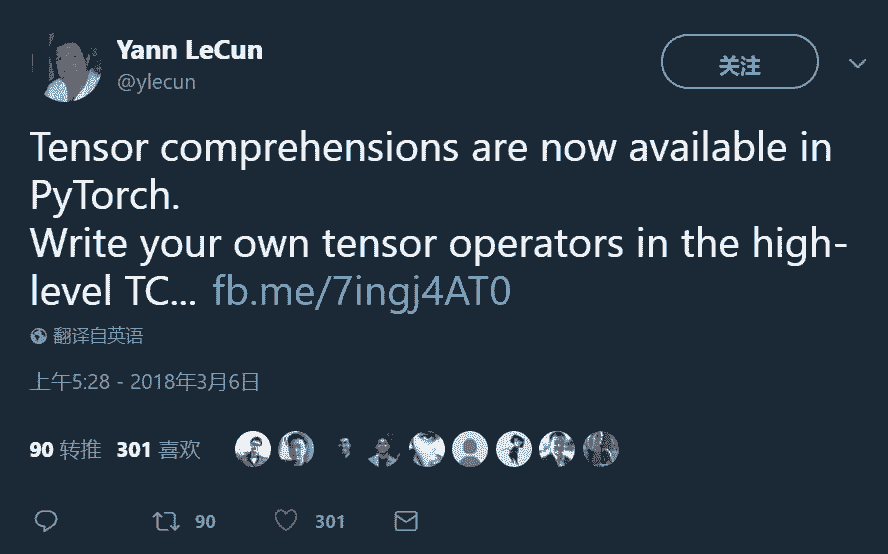

# 教程 | 如何通过 PyTorch 上手 Tensor Comprehensions？

选自 pytorch

**作者：****Priya Goyal 等**

**机器之心编译**

**参与：乾树、黄小天**

> Tensor Comprehensions 是一个降低高性能代码编写门槛的工具，可以将高级语言代码直接生成 GPU 代码并针对特定输入自动调整代码。本文作者将展示 TC 如何在 PyTorch 中无缝使用，并与 PyTorch Tensors 和 nn Variables 进行互操作。



Tensor Comprehensions (TC) 是一个降低高性能代码编写门槛的工具，可以将高级语言代码直接生成 GPU 代码并针对特定输入自动调整代码。本文强烈推荐你首先阅读 Tensor Comprehensions 发布博文（详见 [Facebook 发布 Tensor Comprehensions：自动编译高性能机器学习核心的 C++库](http://mp.weixin.qq.com/s?__biz=MzA3MzI4MjgzMw==&mid=2650737949&idx=2&sn=73fba487380973257f1b171a23ecda0f&chksm=871ac963b06d4075a1264d23ca8bb18d9c43e5a45d463ba1c98fd95a75799ac7eac563f9281f&scene=21#wechat_redirect)）。

如果你面临如下任一场景，TC 将会帮到你。

*   你的 Pytorch 层又大又慢，你打算为此写一段 C++ 或者 CUDA 的优化代码，但是你又不擅长。

*   你写好了 CUDA 代码，但是你还要花费大量时间去优化。你希望可以在最短时间内搞定这些。

*   为了加速，你想在网络中融合多个层，例如 Conv-ReLU-BatchNorm 或者 Linear-ReLU-Linear-ReLU。但是这很难理解。

*   你的研究涉及 CuDNN 和 MKL 未能优化的不寻常的张量。例如，你要使用 13 x 24 的卷积核对 143 x 55 的输入图像进行卷积。你试着用 CUDNN 跑，并且发现它慢的超乎想象。

*   通过调整 Tensors 以适应特定的内存布局，你的代码会变慢。你希望编写在你的输入布局上高效运行的自定义代码很容易。

TC 可以在 PyTorch 中无缝使用，与 PyTorch Tensors 和 nn Variables 进行互操作。

教程现在开始！

**1\. 安装包**

```py
conda install -c pytorch -c tensorcomp tensor_comprehensions
```

此次我们只提供在 Ubuntu 16.04 和 CentOS7 上测试过的 Linux-64 二进制包。TC 依赖于大型 C++ 项目，如 Halide、Tapir-LLVM 及 ISL。因此，我们使用 Anaconda 来可靠地分配这些依赖。因此 TC 不提供 PyPI 安装包。

**2\. 导入 Python 包**

```py
import tensor_comprehensions as tc 
```

**3\. 定义 TC 表达式并创建一个 Python 函数**

```py
lang = """
def fcrelu(float(B,M) I, float(N,M) W1, float(N) B1) -> (O1) {
    O1(b, n) +=! I(b, m) * W1(n, m)
    O1(b, n) = O1(b, n) + B1(n)
    O1(b, n) = fmax(O1(b, n), 0)
}
"""fcrelu = tc.define(lang, name="fcrelu")
```

fcrelu 以 PyTorch Tensors 为输入并返回一个 PyTorch Tensor。输入 inputI、权重 W1、偏置项 B1 并返回一个 O1。

**4\. 创建一些虚拟输入张量**

```py
B, M, N = 100, 128, 100I, W1, B1 = torch.randn(B, M).cuda(), torch.randn(N, M).cuda(), torch.randn(N).cuda() 
```

**5\. 自动调节函数以适用你的输入大小**

```py
fcrelu.autotune(I, W1, B1, cache="fcrelu_100_128_100.tc")
```

自动调节器是你最好的朋友。你通常在调用 tc 函数前都会先自动调节它。当自动调节开始运行，则会显示当前的最佳性能。如果你满足于当前结果或时间耗完了，请按 Ctrl + C 终止调节进程。


cache 保留自动自动调节的核搜索结果并存到 fcrelu_100_128_100.tc 文件中。下一次再调用这句代码时，它就会自动加载已调节的结果而无需再计算。

自动调节器有几个超参数 (就像你的卷积网络有学习率，层数等等）。我们预设了一些缺省项，但是你可以在这里了解如何使用高级选项。

**6\. 调用函数并传参，返回你的结果**

```py
out = fcrelu(I, W1, B1)
```

现在，我们来看看怎么写 TC 表达式。

**TC 语言快速入门**

TC 符号关注层的数学本质，将性能优化交给使用 Halide 和 polyhedral 编译技术的后端代码，这些技术累积了数十年来最先进的 Loop Nest Optimization（LNO）研究成果。

TC 和 np.einsum 很像。我们用一个实例快速展开学习。

```py
lang = """
def matmul(float(M,N) A, float(N,K) B) -> (output) {
  output(i, j) +=! A(i, kk) * B(kk, j)
}
"""
```

我们定义了这个实例中的一个函数，它接受两个输入 M x N 的 A 和 N x K 的Ｂ并返回一个结果。output 的尺寸由 TC 语言自动推导得出 (下面展开讨论）。看看这行代码：

```py
output(i, j) +=! A(i, kk) * B(kk, j)
```

意思是:

*   output(i, j) 表示输出是 2 维的

*   对于每个坐标 output(i, j), 加上 (+=) A(i, kk) * B(kk, j)

*   i 是 A 中 dim=0 的所有坐标, 即，i 在 range(0, M) 里

*   j 是 B dim = 1 中的所有坐标，即，j 在 range(0, K) 里

*   kk 是由 0 到 N 推断出的所有坐标

output 的尺寸由 i 和 j 可取的最大值推理而来，也就是 M 和 K，所以 output 的尺寸就是 M x K。

! 符号用 0.0 初始化，相当于：

```py
output(i, j) = 0
output(i, j) += A(i, kk) * B(kk, j)
```

标量输入和范围约束：实现 AvgPool2d

```py
"""

def avgpool(float(B, C, H, W) input) -> (output) {{
    output(b, c, h, w) += input(b, c, h * {sH} + kh, w * {sW} + kw) where kh in 0:{kH}, kw in 0:{kW}
}}

"""avgpool = tc.define(LANG, name="avgpool", constants={"sH":1, "sW":1, "kH":2, "kW":2})
```

这里 where 关键字可以选取取值范围来进行运算。0:{kH} 类似与 Python 中的 range(kH）。

注意：传入标量的语法在下一版本中可能会发生变化。

**torch.nn 层**

我们对 TC 的基本 PyTorch 集成进行了封装，以便通过定义正向和反向 TC 表达式并有 Variable 输入/输出来轻松地将 TC 集成到更大的 torch.nn 模块。这里有一个用 TC 定义卷积操作的实例。

**你可能忽略的基础知识 (这正是我们在做的）**

**自动调节变量长度序列**

TC 自动调节器要求预先自动调节好所有的输入尺寸。例如，如果你有一批输入图像 I1，调节器想要知道 I1 的确切尺寸以便生成优化的卷积核。你不能指定：高度介于 200 到 300 之间的图像。这对于如 NLP 之类的序列数据更为重要，NLP 每个语句可以具有不同的长度。

自动调节器不参数化是因为自动调整参数约束越来越难，并且这是一项热门研究。由于这是首次发布，我们决定主动提供工具，并保证其良好工作。

作为解决方法，如果你事先知道有一些要用到的特定尺寸，则可以输入它们运行自动调节器。

```py
relu = tc.define(LANG, name="relu")batch, channels = 16, 3tc.autotune((batch, channels, 32, 32)) # image of size 32 x 32tc.autotune((batch, channels, 48, 48)) # image of size 48 x 48tc.autotune((batch, channels, 64, 64)) # image of size 64 x 64
```

当前的自动调节器自动调节三个特定的图片尺寸： 32x32、48x48 和 64x64。

**缺少循环**

如果你想写一个 RNN，很容易把它视作相对于时间的 for 循环。但是，TC 语言目前还没有循环结构。如果你真的想写 RNN，可以试着把它展开。

**Strided-Tensors**

TC 后台暂不支持不连续的张量。如果你输入的张量不连续，TC 在传递到后台代码前会作连续化处理。

**使用 TC 表达式进行张量变形**

在 TC 中你不能这么写操作：torch.matmul(...).view(...).mean(...)。任何时候都需要一个 view 来改变输入张量的尺寸，你必须获取到输出张量，在 PyTorch 级别上 view 它。

**如何开始**

*   《Walk through Tutorial》会帮助你理解并上手入门 TC PyTorch 包。

*   超过 20 个实例含有 TC 写的不同的 ML 层，包括 avgpool、maxpool、matmul、matmul - give output buffers、batch-matmul、convolution、strided-convolution、batchnorm、copy、cosine similarity、Linear、Linear + ReLU、group-convolutions、strided group-convolutions、indexing、Embedding (lookup table)、small-mobilenet、softmax、tensordot、transpose。

*   有关 TC 的详细文档以及与 PyTorch 的整合。

*原文链接：http://pytorch.org/2018/03/05/tensor-comprehensions.html*

****本文为机器之心编译，**转载请联系本公众号获得授权****。**

✄------------------------------------------------

**加入机器之心（全职记者/实习生）：hr@jiqizhixin.com**

**投稿或寻求报道：editor@jiqizhixin.com**

**广告&商务合作：bd@jiqizhixin.com**