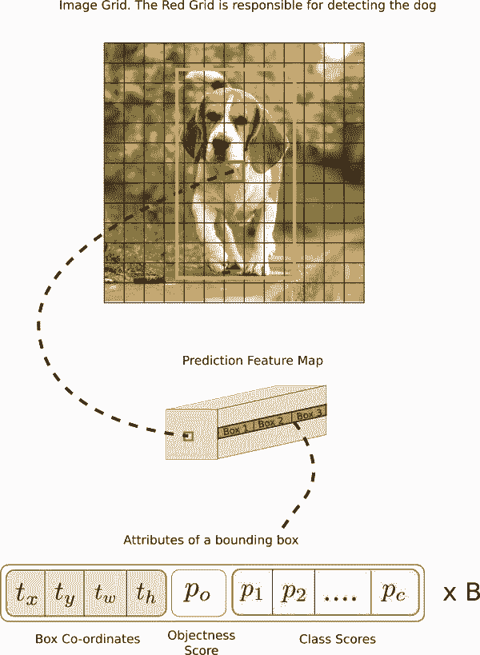
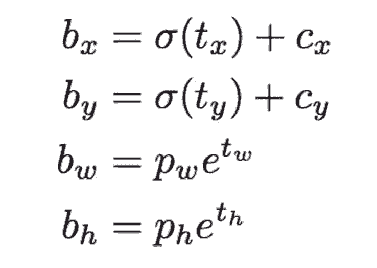
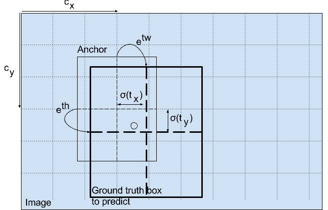
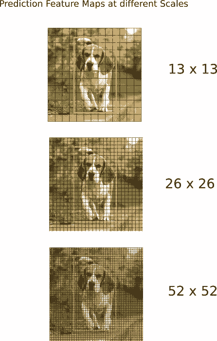
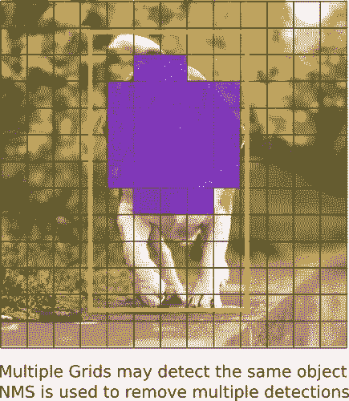
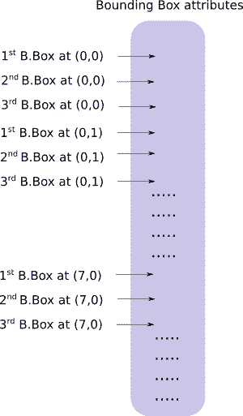

# 从零开始 PyTorch 项目：YOLO v3 目标检测实现

选自 Medium

**作者：****Ayoosh Kathuria**

**机器之心编译**

> 目标检测是深度学习近期发展过程中受益最多的领域。随着技术的进步，人们已经开发出了很多用于目标检测的算法，包括 YOLO、SSD、Mask RCNN 和 RetinaNet。在本教程中，我们将使用 PyTorch 实现基于 YOLO v3 的目标检测器，后者是一种快速的目标检测算法。该教程一共有五个部分，本文包含其中的前三部分。

在过去几个月中，我一直在实验室中研究提升目标检测的方法。在这之中我获得的最大启发就是意识到：学习目标检测的最佳方法就是自己动手实现这些算法，而这正是本教程引导你去做的。

在本教程中，我们将使用 PyTorch 实现基于 YOLO v3 的目标检测器，后者是一种快速的目标检测算法。

本教程使用的代码需要运行在 Python 3.5 和 PyTorch 0.3 版本之上。你可以在以下链接中找到所有代码：

https://github.com/ayooshkathuria/YOLO_v3_tutorial_from_scratch 

**本教程包含五个部分：**

1\. YOLO 的工作原理

2\. 创建 YOLO 网络层级

3\. 实现网络的前向传播

4\. objectness 置信度阈值和非极大值抑制

5\. 设计输入和输出管道

**所需背景知识**

在学习本教程之前，你需要了解：

*   卷积神经网络的工作原理，包括残差块、跳过连接和上采样；

*   目标检测、边界框回归、IoU 和非极大值抑制；

*   基础的 PyTorch 使用。你需要能够轻松地创建简单的神经网络。

**什么是 YOLO？**

YOLO 是 You Only Look Once 的缩写。它是一种使用深度卷积神经网络学得的特征来检测对象的目标检测器。在我们上手写代码之前，我们必须先了解 YOLO 的工作原理。

**全卷积神经网络**

YOLO 仅使用卷积层，这就使其成为全卷积神经网络（FCN）。它拥有 75 个卷积层，还有跳过连接和上采样层。它不使用任何形式的池化，使用步幅为 2 的卷积层对特征图进行下采样。这有助于防止通常由池化导致的低级特征丢失。

作为 FCN，YOLO 对于输入图像的大小并不敏感。然而，在实践中，我们可能想要持续不变的输入大小，因为各种问题只有在我们实现算法时才会浮现出来。

这其中的一个重要问题是：如果我们希望按批次处理图像（批量图像由 GPU 并行处理，这样可以提升速度），我们就需要固定所有图像的高度和宽度。这就需要将多个图像整合进一个大的批次（将许多 PyTorch 张量合并成一个）。

YOLO 通过被步幅对图像进行上采样。例如，如果网络的步幅是 32，则大小为 416×416 的输入图像将产生 13×13 的输出。通常，网络层中的任意步幅都指层的输入除以输入。

**解释输出**

典型地（对于所有目标检测器都是这种情况），卷积层所学习的特征会被传递到分类器/回归器，从而进行预测（边界框的坐标、类别标签等）。

在 YOLO 中，预测是通过卷积层完成的（它是一个全卷积神经网络，请记住！）其核心尺寸为：

1×1×（B×（5+C））

现在，首先要注意的是我们的输出是一个特征图。由于我们使用了 1×1 的卷积，所以预测图的大小恰好是之前特征图的大小。在 YOLO v3（及其更新的版本）上，预测图就是每个可以预测固定数量边界框的单元格。

> 虽然形容特征图中单元的正确术语应该是「神经元」，但本文中为了更为直观，我们将其称为单元格（cell）。

深度方面，特征图中有 (B x (5 + C))* *个条目。B 代表每个单元可以预测的边界框数量。根据 YOLO 的论文，这些 B 边界框中的每一个都可能专门用于检测某种对象。每个边界框都有 5+C 个属性，分别描述每个边界框的中心坐标、维度、objectness 分数和 C 类置信度。YOLO v3 在每个单元中预测 3 个边界框。

如果对象的中心位于单元格的感受野内，你会希望特征图的每个单元格都可以通过其中一个边界框预测对象。（感受野是输入图像对于单元格可见的区域。）

这与 YOLO 是如何训练的有关，只有一个边界框负责检测任意给定对象。首先，我们必须确定这个边界框属于哪个单元格。

因此，我们需要切分输入图像，把它拆成维度等于最终特征图的网格。

让我们思考下面一个例子，其中输入图像大小是 416×416，网络的步幅是 32。如之前所述，特征图的维度会是 13×13。随后，我们将输入图像分为 13×13 个网格。



输入图像中包含了真值对象框中心的网格会作为负责预测对象的单元格。在图像中，它是被标记为红色的单元格，其中包含了真值框的中心（被标记为黄色）。

现在，红色单元格是网格中第七行的第七个。我们现在使特征图中第七行第七个单元格（特征图中的对应单元格）作为检测狗的单元。

现在，这个单元格可以预测三个边界框。哪个将会分配给狗的真值标签？为了理解这一点，我们必须理解锚点的概念。

请注意，我们在这里讨论的单元格是预测特征图上的单元格，我们将输入图像分隔成网格，以确定预测特征图的哪个单元格负责预测对象。

**锚点框（Anchor Box）**

预测边界框的宽度和高度看起来非常合理，但在实践中，训练会带来不稳定的梯度。所以，现在大部分目标检测器都是预测对数空间（log-space）变换，或者预测与预训练默认边界框（即锚点）之间的偏移。

然后，这些变换被应用到锚点框来获得预测。YOLO v3 有三个锚点，所以每个单元格会预测 3 个边界框。

回到前面的问题，负责检测狗的边界框的锚点有最高的 IoU，且有真值框。

**预测**

下面的公式描述了网络输出是如何转换，以获得边界框预测结果的。



**中心坐标**

注意：我们使用 sigmoid 函数进行中心坐标预测。这使得输出值在 0 和 1 之间。原因如下：

正常情况下，YOLO 不会预测边界框中心的确切坐标。它预测：

*   与预测目标的网格单元左上角相关的偏移；

*   使用特征图单元的维度（1）进行归一化的偏移。

以我们的图像为例。如果中心的预测是 (0.4, 0.7)，则中心在 13 x 13 特征图上的坐标是 (6.4, 6.7)（红色单元的左上角坐标是 (6,6)）。

但是，如果预测到的 x,y 坐标大于 1，比如 (1.2, 0.7)。那么中心坐标是 (7.2, 6.7)。注意该中心在红色单元右侧的单元中，或第 7 行的第 8 个单元。这打破了 YOLO 背后的理论，因为如果我们假设红色框负责预测目标狗，那么狗的中心必须在红色单元中，不应该在它旁边的网格单元中。

因此，为了解决这个问题，我们对输出执行 sigmoid 函数，将输出压缩到区间 0 到 1 之间，有效确保中心处于执行预测的网格单元中。

**边界框的维度**

我们对输出执行对数空间变换，然后乘锚点，来预测边界框的维度。



*检测器输出在最终预测之前的变换过程，图源：http://christopher5106.github.io/*

得出的预测 bw 和 bh 使用图像的高和宽进行归一化。即，如果包含目标（狗）的框的预测 bx 和 by 是 (0.3, 0.8)，那么 13 x 13 特征图的实际宽和高是 (13 x 0.3, 13 x 0.8)。

**Objectness 分数**

Object 分数表示目标在边界框内的概率。红色网格和相邻网格的 Object 分数应该接近 1，而角落处的网格的 Object 分数可能接近 0。

objectness 分数的计算也使用 sigmoid 函数，因此它可以被理解为概率。

**类别置信度**

类别置信度表示检测到的对象属于某个类别的概率（如狗、猫、香蕉、汽车等）。在 v3 之前，YOLO 需要对类别分数执行 softmax 函数操作。

但是，YOLO v3 舍弃了这种设计，作者选择使用 sigmoid 函数。因为对类别分数执行 softmax 操作的前提是类别是互斥的。简言之，如果对象属于一个类别，那么必须确保其不属于另一个类别。这在我们设置检测器的 COCO 数据集上是正确的。但是，当出现类别「女性」（Women）和「人」（Person）时，该假设不可行。这就是作者选择不使用 Softmax 激活函数的原因。

**在不同尺度上的预测**

YOLO v3 在 3 个不同尺度上进行预测。检测层用于在三个不同大小的特征图上执行预测，特征图步幅分别是 32、16、8。这意味着，当输入图像大小是 416 x 416 时，我们在尺度 13 x 13、26 x 26 和 52 x 52 上执行检测。

该网络在第一个检测层之前对输入图像执行下采样，检测层使用步幅为 32 的层的特征图执行检测。随后在执行因子为 2 的上采样后，并与前一个层的特征图（特征图大小相同）拼接。另一个检测在步幅为 16 的层中执行。重复同样的上采样步骤，最后一个检测在步幅为 8 的层中执行。

在每个尺度上，每个单元使用 3 个锚点预测 3 个边界框，锚点的总数为 9（不同尺度的锚点不同）。



作者称这帮助 YOLO v3 在检测较小目标时取得更好的性能，而这正是 YOLO 之前版本经常被抱怨的地方。上采样可以帮助该网络学习细粒度特征，帮助检测较小目标。

**输出处理**

对于大小为 416 x 416 的图像，YOLO 预测 ((52 x 52) + (26 x 26) + 13 x 13)) x 3 = 10647 个边界框。但是，我们的示例中只有一个对象——一只狗。那么我们怎么才能将检测次数从 10647 减少到 1 呢？

目标置信度阈值：首先，我们根据它们的 objectness 分数过滤边界框。通常，分数低于阈值的边界框会被忽略。

非极大值抑制：非极大值抑制（NMS）可解决对同一个图像的多次检测的问题。例如，红色网格单元的 3 个边界框可以检测一个框，或者临近网格可检测相同对象。



**实现**

YOLO 只能检测出属于训练所用数据集中类别的对象。我们的检测器将使用官方权重文件，这些权重通过在 COCO 数据集上训练网络而获得，因此我们可以检测 80 个对象类别。

该教程的第一部分到此结束。这部分详细讲解了 YOLO 算法。如果你想深度了解 YOLO 的工作原理、训练过程和与其他检测器的性能规避，可阅读原始论文：

1\. YOLO V1: You Only Look Once: Unified, Real-Time Object Detection (https://arxiv.org/pdf/1506.02640.pdf)

2\. YOLO V2: YOLO9000: Better, Faster, Stronger (https://arxiv.org/pdf/1612.08242.pdf)

3\. YOLO V3: An Incremental Improvement (https://pjreddie.com/media/files/papers/YOLOv3.pdf)

4\. Convolutional Neural Networks (http://cs231n.github.io/convolutional-networks/)

5\. Bounding Box Regression (Appendix C) (https://arxiv.org/pdf/1311.2524.pdf)

6\. IoU (https://www.youtube.com/watch?v=DNEm4fJ-rto)

7\. Non maximum suppresion (https://www.youtube.com/watch?v=A46HZGR5fMw)

8\. PyTorch Official Tutorial (http://pytorch.org/tutorials/beginner/deep_learning_60min_blitz.html)

**第二部分：创建 YOLO 网络层级**

以下是从头实现 YOLO v3 检测器的第二部分教程，我们将基于前面所述的基本概念使用 PyTorch 实现 YOLO 的层级，即创建整个模型的基本构建块。

这一部分要求读者已经基本了解 YOLO 的运行方式和原理，以及关于 PyTorch 的基本知识，例如如何通过 nn.Module、nn.Sequential 和 torch.nn.parameter 等类来构建自定义的神经网络架构。

**开始旅程**

首先创建一个存放检测器代码的文件夹，然后再创建 Python 文件 darknet.py。Darknet 是构建 YOLO 底层架构的环境，这个文件将包含实现 YOLO 网络的所有代码。同样我们还需要补充一个名为 util.py 的文件，它会包含多种需要调用的函数。在将所有这些文件保存在检测器文件夹下后，我们就能使用 git 追踪它们的改变。

**配置文件**

官方代码（authored in C）使用一个配置文件来构建网络，即 cfg 文件一块块地描述了网络架构。如果你使用过 caffe 后端，那么它就相当于描述网络的.protxt 文件。

我们将使用官方的 cfg 文件构建网络，它是由 YOLO 的作者发布的。我们可以在以下地址下载，并将其放在检测器目录下的 cfg 文件夹下。

配置文件下载：https://github.com/pjreddie/darknet/blob/master/cfg/yolov3.cfg

当然，如果你使用 Linux，那么就可以先 cd 到检测器网络的目录，然后运行以下命令行。

```py
mkdir cfg
cd cfg
wget https://raw.githubusercontent.com/pjreddie/darknet/master/cfg/yolov3.cfg
```

如果你打开配置文件，你将看到如下一些网络架构：

```py
[convolutional]
batch_normalize=1
filters=64
size=3
stride=2
pad=1
activation=leaky

[convolutional]
batch_normalize=1
filters=32
size=1
stride=1
pad=1
activation=leaky

[convolutional]
batch_normalize=1
filters=64
size=3
stride=1
pad=1
activation=leaky

[shortcut]
from=-3
activation=linear
```

我们看到上面有四块配置，其中 3 个描述了卷积层，最后描述了 ResNet 中常用的捷径层或跳过连接。下面是 YOLO 中使用的 5 种层级：

1\. 卷积层

```py
[convolutional]
batch_normalize=1 
filters=64 
size=3 
stride=1 
pad=1 
activation=leaky
```

2\. 跳过连接

```py
[shortcut]
from=-3 
activation=linear 
```

跳过连接与残差网络中使用的结构相似，参数 from 为-3 表示捷径层的输出会通过将之前层的和之前第三个层的输出的特征图与模块的输入相加而得出。

3.上采样

```py
[upsample]
stride=2
```

通过参数 stride 在前面层级中双线性上采样特征图。

4.路由层（Route）

```py
[route]
layers = -4

[route]
layers = -1, 61
```

路由层需要一些解释，它的参数 layers 有一个或两个值。当只有一个值时，它输出这一层通过该值索引的特征图。在我们的实验中设置为了-4，所以层级将输出路由层之前第四个层的特征图。

当层级有两个值时，它将返回由这两个值索引的拼接特征图。在我们的实验中为-1 和 61，因此该层级将输出从前一层级（-1）到第 61 层的特征图，并将它们按深度拼接。

5.YOLO

```py
[yolo]
mask = 0,1,2
anchors = 10,13, 16,30, 33,23, 30,61, 62,45, 59,119, 116,90, 156,198, 373,326
classes=80
num=9
jitter=.3
ignore_thresh = .5
truth_thresh = 1
random=1
```

YOLO 层级对应于上文所描述的检测层级。参数 anchors 定义了 9 组锚点，但是它们只是由 mask 标签使用的属性所索引的锚点。这里，mask 的值为 0、1、2 表示了第一个、第二个和第三个使用的锚点。而掩码表示检测层中的每一个单元预测三个框。总而言之，我们检测层的规模为 3，并装配总共 9 个锚点。

Net

```py
[net]
# Testing
batch=1
subdivisions=1
# Training
# batch=64
# subdivisions=16
width= 320
height = 320
channels=3
momentum=0.9
decay=0.0005
angle=0
saturation = 1.5
exposure = 1.5
hue=.1
```

配置文件中存在另一种块 net，不过我不认为它是层，因为它只描述网络输入和训练参数的相关信息，并未用于 YOLO 的前向传播。但是，它为我们提供了网络输入大小等信息，可用于调整前向传播中的锚点。

**解析配置文件**

在开始之前，我们先在 darknet.py 文件顶部添加必要的导入项。

```py
from __future__ import division

import torch 
import torch.nn as nn
import torch.nn.functional as F 
from torch.autograd import Variable
import numpy as np
```

我们定义一个函数 parse_cfg，该函数使用配置文件的路径作为输入。

```py
def parse_cfg(cfgfile):
 """
 Takes a configuration file

 Returns a list of blocks. Each blocks describes a block in the neural
 network to be built. Block is represented as a dictionary in the list

 """
```

这里的思路是解析 cfg，将每个块存储为词典。这些块的属性和值都以键值对的形式存储在词典中。解析过程中，我们将这些词典（由代码中的变量 block 表示）添加到列表 blocks 中。我们的函数将返回该 block。

我们首先将配置文件内容保存在字符串列表中。下面的代码对该列表执行预处理：

```py
file = open(cfgfile, 'r')
lines = file.read().split('\n') # store the lines in a list
lines = [x for x in lines if len(x) > 0] # get read of the empty lines 
lines = [x for x in lines if x[0] != '#'] # get rid of comments
lines = [x.rstrip().lstrip() for x in lines] # get rid of fringe whitespaces
```

然后，我们遍历预处理后的列表，得到块。

```py
block = {}
blocks = []

for line in lines:
 if line[0] == "[": # This marks the start of a new block
 if len(block) != 0: # If block is not empty, implies it is storing values of previous block.
 blocks.append(block) # add it the blocks list
 block = {} # re-init the block
 block["type"] = line[1:-1].rstrip() 
 else:
 key,value = line.split("=") 
 block[key.rstrip()] = value.lstrip()
blocks.append(block)

return blocks
```

**创建构建块**

现在我们将使用上面 parse_cfg 返回的列表来构建 PyTorch 模块，作为配置文件中的构建块。

列表中有 5 种类型的层。PyTorch 为 convolutional 和 upsample 提供预置层。我们将通过扩展 nn.Module 类为其余层写自己的模块。

create_modules 函数使用 parse_cfg 函数返回的 blocks 列表：

```py
def create_modules(blocks):
 net_info = blocks[0] #Captures the information about the input and pre-processing 
 module_list = nn.ModuleList()
 prev_filters = 3
 output_filters = []
```

在迭代该列表之前，我们先定义变量 net_info，来存储该网络的信息。

nn.ModuleList

我们的函数将会返回一个 nn.ModuleList。这个类几乎等同于一个包含 nn.Module 对象的普通列表。然而，当添加 nn.ModuleList 作为 nn.Module 对象的一个成员时（即当我们添加模块到我们的网络时），所有 nn.ModuleList 内部的 nn.Module 对象（模块）的 parameter 也被添加作为 nn.Module 对象（即我们的网络，添加 nn.ModuleList 作为其成员）的 parameter。

当我们定义一个新的卷积层时，我们必须定义它的卷积核维度。虽然卷积核的高度和宽度由 cfg 文件提供，但卷积核的深度是由上一层的卷积核数量（或特征图深度）决定的。这意味着我们需要持续追踪被应用卷积层的卷积核数量。我们使用变量 prev_filter 来做这件事。我们将其初始化为 3，因为图像有对应 RGB 通道的 3 个通道。

路由层（route layer）从前面层得到特征图（可能是拼接的）。如果在路由层之后有一个卷积层，那么卷积核将被应用到前面层的特征图上，精确来说是路由层得到的特征图。因此，我们不仅需要追踪前一层的卷积核数量，还需要追踪之前每个层。随着不断地迭代，我们将每个模块的输出卷积核数量添加到 output_filters 列表上。

现在，我们的思路是迭代模块的列表，并为每个模块创建一个 PyTorch 模块。

```py
 for index, x in enumerate(blocks[1:]):
 module = nn.Sequential()

 #check the type of block
 #create a new module for the block
 #append to module_list
```

nn.Sequential 类被用于按顺序地执行 nn.Module 对象的一个数字。如果你查看 cfg 文件，你会发现，一个模块可能包含多于一个层。例如，一个 convolutional 类型的模块有一个批量归一化层、一个 leaky ReLU 激活层以及一个卷积层。我们使用 nn.Sequential 将这些层串联起来，得到 add_module 函数。例如，以下展示了我们如何创建卷积层和上采样层的例子：

```py
 if (x["type"] == "convolutional"):
 #Get the info about the layer
 activation = x["activation"]
 try:
 batch_normalize = int(x["batch_normalize"])
 bias = False
 except:
 batch_normalize = 0
 bias = True

 filters= int(x["filters"])
 padding = int(x["pad"])
 kernel_size = int(x["size"])
 stride = int(x["stride"])

 if padding:
 pad = (kernel_size - 1) // 2
 else:
 pad = 0

 #Add the convolutional layer
 conv = nn.Conv2d(prev_filters, filters, kernel_size, stride, pad, bias = bias)
 module.add_module("conv_{0}".format(index), conv)

 #Add the Batch Norm Layer
 if batch_normalize:
 bn = nn.BatchNorm2d(filters)
 module.add_module("batch_norm_{0}".format(index), bn)

 #Check the activation. 
 #It is either Linear or a Leaky ReLU for YOLO
 if activation == "leaky":
 activn = nn.LeakyReLU(0.1, inplace = True)
 module.add_module("leaky_{0}".format(index), activn)

 #If it's an upsampling layer
 #We use Bilinear2dUpsampling
 elif (x["type"] == "upsample"):
 stride = int(x["stride"])
 upsample = nn.Upsample(scale_factor = 2, mode = "bilinear")
 module.add_module("upsample_{}".format(index), upsample)
```

路由层/捷径层

接下来，我们来写创建路由层（Route Layer）和捷径层（Shortcut Layer）的代码：

```py
 #If it is a route layer
 elif (x["type"] == "route"):
 x["layers"] = x["layers"].split(',')
 #Start of a route
 start = int(x["layers"][0])
 #end, if there exists one.
 try:
 end = int(x["layers"][1])
 except:
 end = 0
 #Positive anotation
 if start > 0: 
 start = start - index
 if end > 0:
 end = end - index
 route = EmptyLayer()
 module.add_module("route_{0}".format(index), route)
 if end < 0:
 filters = output_filters[index + start] + output_filters[index + end]
 else:
 filters= output_filters[index + start]

 #shortcut corresponds to skip connection
 elif x["type"] == "shortcut":
 shortcut = EmptyLayer()
 module.add_module("shortcut_{}".format(index), shortcut)
```

创建路由层的代码需要做一些解释。首先，我们提取关于层属性的值，将其表示为一个整数，并保存在一个列表中。

然后我们得到一个新的称为 EmptyLayer 的层，顾名思义，就是空的层。

```py
route = EmptyLayer()
```

其定义如下：

```py
class EmptyLayer(nn.Module):
 def __init__(self):
 super(EmptyLayer, self).__init__()
```

等等，一个空的层？

现在，一个空的层可能会令人困惑，因为它没有做任何事情。而 Route Layer 正如其它层将执行某种操作（获取之前层的拼接）。在 PyTorch 中，当我们定义了一个新的层，我们在子类 nn.Module 中写入层在 nn.Module 对象的 forward 函数的运算。

对于在 Route 模块中设计一个层，我们必须建立一个 nn.Module 对象，其作为 layers 的成员被初始化。然后，我们可以写下代码，将 forward 函数中的特征图拼接起来并向前馈送。最后，我们执行网络的某个 forward 函数的这个层。

但拼接操作的代码相当地短和简单（在特征图上调用 torch.cat），像上述过程那样设计一个层将导致不必要的抽象，增加样板代码。取而代之，我们可以将一个假的层置于之前提出的路由层的位置上，然后直接在代表 darknet 的 nn.Module 对象的 forward 函数中执行拼接运算。（如果感到困惑，我建议你读一下 nn.Module 类在 PyTorch 中的使用）。

在路由层之后的卷积层会把它的卷积核应用到之前层的特征图（可能是拼接的）上。以下的代码更新了 filters 变量以保存路由层输出的卷积核数量。

```py
if end < 0:
 #If we are concatenating maps
 filters = output_filters[index + start] + output_filters[index + end]
else:
 filters= output_filters[index + start]
```

捷径层也使用空的层，因为它还要执行一个非常简单的操作（加）。没必要更新 filters 变量，因为它只是将前一层的特征图添加到后面的层上而已。

**YOLO 层**

最后，我们将编写创建 YOLO 层的代码：

```py
 #Yolo is the detection layer
 elif x["type"] == "yolo":
 mask = x["mask"].split(",")
 mask = [int(x) for x in mask]

 anchors = x["anchors"].split(",")
 anchors = [int(a) for a in anchors]
 anchors = [(anchors[i], anchors[i+1]) for i in range(0, len(anchors),2)]
 anchors = [anchors[i] for i in mask]

 detection = DetectionLayer(anchors)
 module.add_module("Detection_{}".format(index), detection)
```

我们定义一个新的层 DetectionLayer 保存用于检测边界框的锚点。

检测层的定义如下：

```py
class DetectionLayer(nn.Module):
 def __init__(self, anchors):
 super(DetectionLayer, self).__init__()
 self.anchors = anchors
```

在这个回路结束时，我们做了一些统计（bookkeeping.）。

```py
 module_list.append(module)
 prev_filters = filters
 output_filters.append(filters) 
```

这总结了此回路的主体。在 create_modules 函数后，我们获得了包含 net_info 和 module_list 的元组。

```py
return (net_info, module_list)
```

**测试代码**

你可以在 darknet.py 后通过输入以下命令行测试代码，运行文件。

```py
blocks = parse_cfg("cfg/yolov3.cfg")
print(create_modules(blocks))
```

你会看到一个长列表（确切来说包含 106 条），其中元素看起来如下所示：

```py
 (9): Sequential(
 (conv_9): Conv2d (128, 64, kernel_size=(1, 1), stride=(1, 1), bias=False)
 (batch_norm_9): BatchNorm2d(64, eps=1e-05, momentum=0.1, affine=True)
 (leaky_9): LeakyReLU(0.1, inplace)
 )
 (10): Sequential(
 (conv_10): Conv2d (64, 128, kernel_size=(3, 3), stride=(1, 1), padding=(1, 1), bias=False)
 (batch_norm_10): BatchNorm2d(128, eps=1e-05, momentum=0.1, affine=True)
 (leaky_10): LeakyReLU(0.1, inplace)
 )
 (11): Sequential(
 (shortcut_11): EmptyLayer(
 )
 ) 
```

**第三部分：实现网络的前向传播**

第二部分中，我们实现了 YOLO 架构中使用的层。这部分，我们计划用 PyTorch 实现 YOLO 网络架构，这样我们就能生成给定图像的输出了。

我们的目标是设计网络的前向传播。

**先决条件**

*   阅读本教程前两部分；

*   PyTorch 基础知识，包括如何使用 nn.Module、nn.Sequential 和 torch.nn.parameter 创建自定义架构；

*   在 PyTorch 中处理图像。

**定义网络**

如前所述，我们使用 nn.Module 在 PyTorch 中构建自定义架构。这里，我们可以为检测器定义一个网络。在 darknet.py 文件中，我们添加了以下类别：

```py
class Darknet(nn.Module):
 def __init__(self, cfgfile):
 super(Darknet, self).__init__()
 self.blocks = parse_cfg(cfgfile)
 self.net_info, self.module_list = create_modules(self.blocks)
```

这里，我们对 nn.Module 类别进行子分类，并将我们的类别命名为 Darknet。我们用 members、blocks、net_info 和 module_list 对网络进行初始化。

**实现该网络的前向传播**

该网络的前向传播通过覆写 nn.Module 类别的 forward 方法而实现。

forward 主要有两个目的。一，计算输出；二，尽早处理的方式转换输出检测特征图（例如转换之后，这些不同尺度的检测图就能够串联，不然会因为不同维度不可能实现串联）。

```py
def forward(self, x, CUDA):
 modules = self.blocks[1:]
 outputs = {} #We cache the outputs for the route layer
```

forward 函数有三个参数：self、输入 x 和 CUDA（如果是 true，则使用 GPU 来加速前向传播）。

这里，我们迭代 self.block[1:] 而不是 self.blocks，因为 self.blocks 的第一个元素是一个 net 块，它不属于前向传播。

由于路由层和捷径层需要之前层的输出特征图，我们在字典 outputs 中缓存每个层的输出特征图。关键在于层的索引，且值对应特征图。

正如 create_module 函数中的案例，我们现在迭代 module_list，它包含了网络的模块。需要注意的是这些模块是以在配置文件中相同的顺序添加的。这意味着，我们可以简单地让输入通过每个模块来得到输出。

```py
write = 0 #This is explained a bit later
for i, module in enumerate(modules): 
 module_type = (module["type"])
```

卷积层和上采样层

如果该模块是一个卷积层或上采样层，那么前向传播应该按如下方式工作：

```py
 if module_type == "convolutional" or module_type == "upsample":
 x = self.module_listi
```

路由层／捷径层

如果你查看路由层的代码，我们必须说明两个案例（正如第二部分中所描述的）。对于第一个案例，我们必须使用 torch.cat 函数将两个特征图级联起来，第二个参数设为 1。这是因为我们希望将特征图沿深度级联起来。（在 PyTorch 中，卷积层的输入和输出的格式为`B X C X H X W。深度对应通道维度）。

```py
 elif module_type == "route":
 layers = module["layers"]
 layers = [int(a) for a in layers]

 if (layers[0]) > 0:
 layers[0] = layers[0] - i

 if len(layers) == 1:
 x = outputs[i + (layers[0])]

 else:
 if (layers[1]) > 0:
 layers[1] = layers[1] - i

 map1 = outputs[i + layers[0]]
 map2 = outputs[i + layers[1]]

 x = torch.cat((map1, map2), 1)

 elif module_type == "shortcut":
 from_ = int(module["from"])
 x = outputs[i-1] + outputs[i+from_]
```

YOLO（检测层）

YOLO 的输出是一个卷积特征图，包含沿特征图深度的边界框属性。边界框属性由彼此堆叠的单元格预测得出。因此，如果你需要在 (5,6) 处访问单元格的第二个边框，那么你需要通过 map[5,6, (5+C): 2*(5+C)] 将其编入索引。这种格式对于输出处理过程（例如通过目标置信度进行阈值处理、添加对中心的网格偏移、应用锚点等）很不方便。

另一个问题是由于检测是在三个尺度上进行的，预测图的维度将是不同的。虽然三个特征图的维度不同，但对它们执行的输出处理过程是相似的。如果能在单个张量而不是三个单独张量上执行这些运算，就太好了。

为了解决这些问题，我们引入了函数 predict_transform。

**变换输出**

函数 predict_transform 在文件 util.py 中，我们在 Darknet 类别的 forward 中使用该函数时，将导入该函数。

在 util.py 顶部添加导入项：

```py
from __future__ import division

import torch 
import torch.nn as nn
import torch.nn.functional as F 
from torch.autograd import Variable
import numpy as np
import cv2 
```

predict_transform 使用 5 个参数：prediction（我们的输出）、inp_dim（输入图像的维度）、anchors、num_classes、CUDA flag（可选）。

```py
def predict_transform(prediction, inp_dim, anchors, num_classes, CUDA = True):
```

predict_transform 函数把检测特征图转换成二维张量，张量的每一行对应边界框的属性，如下所示：



上述变换所使用的代码：

```py
 batch_size = prediction.size(0)
 stride = inp_dim // prediction.size(2)
 grid_size = inp_dim // stride
 bbox_attrs = 5 + num_classes
 num_anchors = len(anchors)

 prediction = prediction.view(batch_size, bbox_attrs*num_anchors, grid_size*grid_size)
 prediction = prediction.transpose(1,2).contiguous()
 prediction = prediction.view(batch_size, grid_size*grid_size*num_anchors, bbox_attrs)
```

锚点的维度与 net 块的 height 和 width 属性一致。这些属性描述了输入图像的维度，比检测图的规模大（二者之商即是步幅）。因此，我们必须使用检测特征图的步幅分割锚点。

```py
 anchors = [(a[0]/stride, a[1]/stride) for a in anchors]
```

现在，我们需要根据第一部分讨论的公式变换输出。

对 (x,y) 坐标和 objectness 分数执行 Sigmoid 函数操作。

```py
 #Sigmoid the centre_X, centre_Y. and object confidencce
 prediction[:,:,0] = torch.sigmoid(prediction[:,:,0])
 prediction[:,:,1] = torch.sigmoid(prediction[:,:,1])
 prediction[:,:,4] = torch.sigmoid(prediction[:,:,4])
```

将网格偏移添加到中心坐标预测中：

```py
 #Add the center offsets
 grid = np.arange(grid_size)
 a,b = np.meshgrid(grid, grid)

 x_offset = torch.FloatTensor(a).view(-1,1)
 y_offset = torch.FloatTensor(b).view(-1,1)

 if CUDA:
 x_offset = x_offset.cuda()
 y_offset = y_offset.cuda()

 x_y_offset = torch.cat((x_offset, y_offset), 1).repeat(1,num_anchors).view(-1,2).unsqueeze(0)

 prediction[:,:,:2] += x_y_offset
```

将锚点应用到边界框维度中：

```py
 #log space transform height and the width
 anchors = torch.FloatTensor(anchors)

 if CUDA:
 anchors = anchors.cuda()

 anchors = anchors.repeat(grid_size*grid_size, 1).unsqueeze(0)
 prediction[:,:,2:4] = torch.exp(prediction[:,:,2:4])*anchors
```

将 sigmoid 激活函数应用到类别分数中：

```py
 prediction[:,:,5: 5 + num_classes] = torch.sigmoid((prediction[:,:, 5 : 5 + num_classes]))
```

最后，我们要将检测图的大小调整到与输入图像大小一致。边界框属性根据特征图的大小而定（如 13 x 13）。如果输入图像大小是 416 x 416，那么我们将属性乘 32，或乘 stride 变量。

```py
prediction[:,:,:4] *= stride
```

loop 部分到这里就大致结束了。

函数结束时会返回预测结果：

```py
 return prediction
```

**重新访问的检测层**

我们已经变换了输出张量，现在可以将三个不同尺度的检测图级联成一个大的张量。注意这必须在变换之后进行，因为你无法级联不同空间维度的特征图。变换之后，我们的输出张量把边界框表格呈现为行，级联就比较可行了。

一个阻碍是我们无法初始化空的张量，再向其级联一个（不同形态的）非空张量。因此，我们推迟收集器（容纳检测的张量）的初始化，直到获得第一个检测图，再把这些检测图级联起来。

注意 write = 0 在函数 forward 的 loop 之前。write flag 表示我们是否遇到第一个检测。如果 write 是 0，则收集器尚未初始化。如果 write 是 1，则收集器已经初始化，我们只需要将检测图与收集器级联起来即可。

现在，我们具备了 predict_transform 函数，我们可以写代码，处理 forward 函数中的检测特征图。

在 darknet.py 文件的顶部，添加以下导入项：

```py
from util import * 
```

然后在 forward 函数中定义：

```py
 elif module_type == 'yolo': 

 anchors = self.module_list[i][0].anchors
 #Get the input dimensions
 inp_dim = int (self.net_info["height"])

 #Get the number of classes
 num_classes = int (module["classes"])

 #Transform 
 x = x.data
 x = predict_transform(x, inp_dim, anchors, num_classes, CUDA)
 if not write: #if no collector has been intialised. 
 detections = x
 write = 1

 else: 
 detections = torch.cat((detections, x), 1)

 outputs[i] = x
```

现在，只需返回检测结果。

```py
 return detections
```

**测试前向传播**

下面的函数将创建一个伪造的输入，我们可以将该输入传入我们的网络。在写该函数之前，我们可以使用以下命令行将这张图像保存到工作目录：

```py
wget https://github.com/ayooshkathuria/pytorch-yolo-v3/raw/master/dog-cycle-car.png
```

也可以直接下载图像：https://github.com/ayooshkathuria/pytorch-yolo-v3/raw/master/dog-cycle-car.png

现在，在 darknet.py 文件的顶部定义以下函数：

```py
def get_test_input():
 img = cv2.imread("dog-cycle-car.png")
 img = cv2.resize(img, (416,416)) #Resize to the input dimension
 img_ = img[:,:,::-1].transpose((2,0,1)) # BGR -> RGB | H X W C -> C X H X W 
 img_ = img_[np.newaxis,:,:,:]/255.0 #Add a channel at 0 (for batch) | Normalise
 img_ = torch.from_numpy(img_).float() #Convert to float
 img_ = Variable(img_) # Convert to Variable
 return img_
```

我们需要键入以下代码：

```py
model = Darknet("cfg/yolov3.cfg")
inp = get_test_input()
pred = model(inp)
print (pred)
```

你将看到如下输出：

```py
( 0 ,.,.) = 
 16.0962 17.0541 91.5104 ... 0.4336 0.4692 0.5279
 15.1363 15.2568 166.0840 ... 0.5561 0.5414 0.5318
 14.4763 18.5405 409.4371 ... 0.5908 0.5353 0.4979
 ⋱ ... 
 411.2625 412.0660 9.0127 ... 0.5054 0.4662 0.5043
 412.1762 412.4936 16.0449 ... 0.4815 0.4979 0.4582
 412.1629 411.4338 34.9027 ... 0.4306 0.5462 0.4138
[torch.FloatTensor of size 1x10647x85]
```

张量的形状为 1×10647×85，第一个维度为批量大小，这里我们只使用了单张图像。对于批量中的图像，我们会有一个 100647×85 的表，它的每一行表示一个边界框（4 个边界框属性、1 个 objectness 分数和 80 个类别分数）。

现在，我们的网络有随机权重，并且不会输出正确的类别。我们需要为网络加载权重文件，因此可以利用官方权重文件。

**下载预训练权重**

下载权重文件并放入检测器目录下，我们可以直接使用命令行下载：

```py
wget https://pjreddie.com/media/files/yolov3.weights
```

也可以通过该地址下载：https://pjreddie.com/media/files/yolov3.weights

**理解权重文件**

官方的权重文件是一个二进制文件，它以序列方式储存神经网络权重。

我们必须小心地读取权重，因为权重只是以浮点形式储存，没有其它信息能告诉我们到底它们属于哪一层。所以如果读取错误，那么很可能权重加载就全错了，模型也完全不能用。因此，只阅读浮点数，无法区别权重属于哪一层。因此，我们必须了解权重是如何存储的。

首先，权重只属于两种类型的层，即批归一化层（batch norm layer）和卷积层。这些层的权重储存顺序和配置文件中定义层级的顺序完全相同。所以，如果一个 convolutional 后面跟随着 shortcut 块，而 shortcut 连接了另一个 convolutional 块，则你会期望文件包含了先前 convolutional 块的权重，其后则是后者的权重。

当批归一化层出现在卷积模块中时，它是不带有偏置项的。然而，当卷积模块不存在批归一化，则偏置项的「权重」就会从文件中读取。下图展示了权重是如何储存的。


**加载权重**

我们写一个函数来加载权重，它是 Darknet 类的成员函数。它使用 self 以外的一个参数作为权重文件的路径。

```py
def load_weights(self, weightfile):
```

第一个 160 比特的权重文件保存了 5 个 int32 值，它们构成了文件的标头。

```py
 #Open the weights file
 fp = open(weightfile, "rb")

 #The first 5 values are header information 
 # 1\. Major version number
 # 2\. Minor Version Number
 # 3\. Subversion number 
 # 4,5\. Images seen by the network (during training)
 header = np.fromfile(fp, dtype = np.int32, count = 5)
 self.header = torch.from_numpy(header)
 self.seen = self.header[3] 
```

之后的比特代表权重，按上述顺序排列。权重被保存为 float32 或 32 位浮点数。我们来加载 np.ndarray 中的剩余权重。

```py
 weights = np.fromfile(fp, dtype = np.float32) 
```

现在，我们迭代地加载权重文件到网络的模块上。

```py
 ptr = 0
 for i in range(len(self.module_list)):
 module_type = self.blocks[i + 1]["type"]

 #If module_type is convolutional load weights
 #Otherwise ignore.
```

在循环过程中，我们首先检查 convolutional 模块是否有 batch_normalize（True）。基于此，我们加载权重。

```py
 if module_type == "convolutional":
 model = self.module_list[i]
 try:
 batch_normalize = int(self.blocks[i+1]["batch_normalize"])
 except:
 batch_normalize = 0

 conv = model[0]
```

我们保持一个称为 ptr 的变量来追踪我们在权重数组中的位置。现在，如果 batch_normalize 检查结果是 True，则我们按以下方式加载权重：

```py
 if (batch_normalize):
 bn = model[1]

 #Get the number of weights of Batch Norm Layer
 num_bn_biases = bn.bias.numel()

 #Load the weights
 bn_biases = torch.from_numpy(weights[ptr:ptr + num_bn_biases])
 ptr += num_bn_biases

 bn_weights = torch.from_numpy(weights[ptr: ptr + num_bn_biases])
 ptr += num_bn_biases

 bn_running_mean = torch.from_numpy(weights[ptr: ptr + num_bn_biases])
 ptr += num_bn_biases

 bn_running_var = torch.from_numpy(weights[ptr: ptr + num_bn_biases])
 ptr += num_bn_biases

 #Cast the loaded weights into dims of model weights. 
 bn_biases = bn_biases.view_as(bn.bias.data)
 bn_weights = bn_weights.view_as(bn.weight.data)
 bn_running_mean = bn_running_mean.view_as(bn.running_mean)
 bn_running_var = bn_running_var.view_as(bn.running_var)

 #Copy the data to model
 bn.bias.data.copy_(bn_biases)
 bn.weight.data.copy_(bn_weights)
 bn.running_mean.copy_(bn_running_mean)
 bn.running_var.copy_(bn_running_var)
```

如果 batch_normalize 的检查结果不是 True，只需要加载卷积层的偏置项。

```py
 else:
 #Number of biases
 num_biases = conv.bias.numel()

 #Load the weights
 conv_biases = torch.from_numpy(weights[ptr: ptr + num_biases])
 ptr = ptr + num_biases

 #reshape the loaded weights according to the dims of the model weights
 conv_biases = conv_biases.view_as(conv.bias.data)

 #Finally copy the data
 conv.bias.data.copy_(conv_biases)
```

最后，我们加载卷积层的权重。

```py
#Let us load the weights for the Convolutional layers
num_weights = conv.weight.numel()

#Do the same as above for weights
conv_weights = torch.from_numpy(weights[ptr:ptr+num_weights])
ptr = ptr + num_weights

conv_weights = conv_weights.view_as(conv.weight.data)
conv.weight.data.copy_(conv_weights)
```

该函数的介绍到此为止，你现在可以通过调用 darknet 对象上的 load_weights 函数来加载 Darknet 对象中的权重。

```py
model = Darknet("cfg/yolov3.cfg")
model.load_weights("yolov3.weights")
```

通过模型构建和权重加载，我们终于可以开始进行目标检测了。未来，我们还将介绍如何利用 objectness 置信度阈值和非极大值抑制生成最终的检测结果。

*原文链接：https://medium.com/paperspace/tutorial-on-implementing-yolo-v3-from-scratch-in-pytorch-part-1-a0054d38ec78*

****本文为机器之心编译，**转载请联系本公众号获得授权****。**

✄------------------------------------------------

**加入机器之心（全职记者/实习生）：hr@jiqizhixin.com**

**投稿或寻求报道：editor@jiqizhixin.com**

**广告&商务合作：bd@jiqizhixin.com**