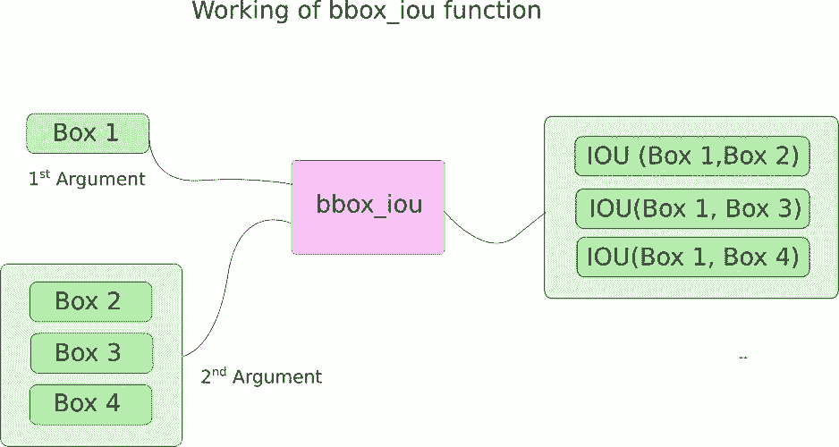
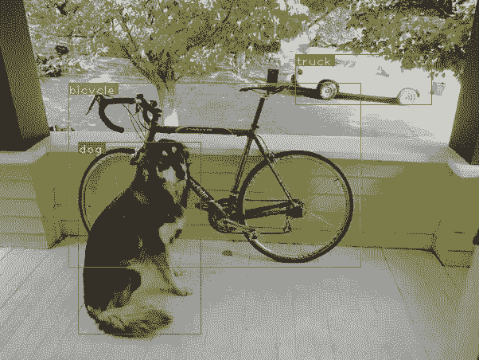

# 教程 | 从零开始 PyTorch 项目：YOLO v3 目标检测实现（下）

选自 Medium

**作者：****Ayoosh Kathuria**

**机器之心编译**

**参与：Panda**

> > 前几日，机器之心编译介绍了《[从零开始 PyTorch 项目：YOLO v3 目标检测实现](http://mp.weixin.qq.com/s?__biz=MzA3MzI4MjgzMw==&mid=2650741259&idx=1&sn=03dfb0fa3396e5464fc358b5a803e7bf&chksm=871ade75b06d5763a45f3c5da1ca62023a13c5cf7ce52a0a23e6c320f129f79bb9b3be4d2da0&scene=21#wechat_redirect)》的前 3 部分，介绍了 YOLO 的工作原理、创建 YOLO 网络层级和实现网络的前向传播的方法。本文包含了该教程的后面两个部分，将介绍「置信度阈值设置和非极大值抑制」以及「设计输入和输出流程」的方法。总体而言，本教程的目的是使用 PyTorch 实现基于 YOLO v3 的目标检测器，后者是一种快速的目标检测算法。
> 
> 本教程使用的代码需要运行在 Python 3.5 和 PyTorch 0.3 版本之上。你可以在以下链接中找到所有代码：https://github.com/ayooshkathuria/YOLO_v3_tutorial_from_scratch 
> 
> **所需背景知识**
> 
> 1. 本教程 1-3 部分
> 
> 2. 了解 PyTorch 基本工作方式，包括使用 nn.Module、nn.Sequential 和 torch.nn.parameter 类创建自定义架构的方式
> 
> 3. NumPy 基本知识
> 
> 4. OpenCV 基本知识
> 
> 如果你缺少这些预备知识，可参阅文末扩展阅读部分了解。
> 
> **置信度阈值设置和非极大值抑制**
> 
> 在前面 3 部分中，我们已经构建了一个能为给定输入图像输出多个目标检测结果的模型。具体来说，我们的输出是一个形状为 B x 10647 x 85 的张量；其中 B 是指一批（batch）中图像的数量，10647 是每个图像中所预测的边界框的数量，85 是指边界框属性的数量。
> 
> 但是，正如第 1 部分所述，我们必须使我们的输出满足 objectness 分数阈值和非极大值抑制（NMS），以得到后文所说的「真实（true）」检测结果。要做到这一点，我们将在 util.py 文件中创建一个名为 write_results 的函数。
> 
> ```py
> def write_results(prediction, confidence, num_classes, nms_conf = 0.4): 
> ```
> 
> 该函数的输入为预测结果、置信度（objectness 分数阈值）、num_classes（我们这里是 80）和 nms_conf（NMS IoU 阈值）。
> 
> **目标置信度阈值**
> 
> 我们的预测张量包含有关 B x 10647 边界框的信息。对于有低于一个阈值的 objectness 分数的每个边界框，我们将其每个属性的值（表示该边界框的一整行）都设为零。
> 
> ```py
>  conf_mask = (prediction[:,:,4] > confidence).float().unsqueeze(2)
>     prediction = prediction*conf_mask 
> ```
> 
> **执行非极大值抑制**
> 
> 注：我假设你已经理解 IoU（Intersection over union）和非极大值抑制（Non-maximum suppression）的含义了。如果你还不理解，请参阅文末提供的链接。
> 
> 我们现在拥有的边界框属性是由中心坐标以及边界框的高度和宽度决定的。但是，使用每个框的两个对角坐标能更轻松地计算两个框的 IoU。所以，我们可以将我们的框的 (中心 x, 中心 y, 高度, 宽度) 属性转换成 (左上角 x, 左上角 y, 右下角 x, 右下角 y)。
> 
> ```py
>  box_corner = prediction.new(prediction.shape)
>     box_corner[:,:,0] = (prediction[:,:,0] - prediction[:,:,2]/2)
>     box_corner[:,:,1] = (prediction[:,:,1] - prediction[:,:,3]/2)
>     box_corner[:,:,2] = (prediction[:,:,0] + prediction[:,:,2]/2) 
>     box_corner[:,:,3] = (prediction[:,:,1] + prediction[:,:,3]/2)
>     prediction[:,:,:4] = box_corner[:,:,:4] 
> ```
> 
> 每张图像中的「真实」检测结果的数量可能存在差异。比如，一个大小为 3 的 batch 中有 1、2、3 这 3 张图像，它们各自有 5、2、4 个「真实」检测结果。因此，一次只能完成一张图像的置信度阈值设置和 NMS。也就是说，我们不能将所涉及的操作向量化，而且必须在预测的第一个维度（包含一个 batch 中图像的索引）上循环。
> 
> ```py
>  batch_size = prediction.size(0)
> 
>     write = False
> 
>     for ind in range(batch_size):
>         image_pred = prediction[ind]          #image Tensor
>            #confidence threshholding 
>            #NMS 
> ```
> 
> 如前所述，write 标签是用于指示我们尚未初始化输出，我们将使用一个张量来收集整个 batch 的「真实」检测结果。
> 
> 进入循环后，我们再更清楚地说明一下。注意每个边界框行都有 85 个属性，其中 80 个是类别分数。此时，我们只关心有最大值的类别分数。所以，我们移除了每一行的这 80 个类别分数，并且转而增加了有最大值的类别的索引以及那一类别的类别分数。
> 
> ```py
>  max_conf, max_conf_score = torch.max(image_pred[:,5:5+ num_classes], 1)
>         max_conf = max_conf.float().unsqueeze(1)
>         max_conf_score = max_conf_score.float().unsqueeze(1)
>         seq = (image_pred[:,:5], max_conf, max_conf_score)
>         image_pred = torch.cat(seq, 1) 
> ```
> 
> 记得我们将 object 置信度小于阈值的边界框行设为零了吗？让我们摆脱它们。
> 
> ```py
>  non_zero_ind =  (torch.nonzero(image_pred[:,4]))
>         try:
>             image_pred_ = image_pred[non_zero_ind.squeeze(),:].view(-1,7)
>         except:
>             continue
> 
>         #For PyTorch 0.4 compatibility
>         #Since the above code with not raise exception for no detection 
>         #as scalars are supported in PyTorch 0.4
>         if image_pred_.shape[0] == 0:
>             continue 
> ```
> 
> 其中的 try-except 模块的目的是处理无检测结果的情况。在这种情况下，我们使用 continue 来跳过对本图像的循环。
> 
> 现在，让我们获取一张图像中所检测到的类别。
> 
> ```py
>  #Get the various classes detected in the image
>         img_classes = unique(image_pred_[:,-1]) # -1 index holds the class index
> ```
> 
> 因为同一类别可能会有多个「真实」检测结果，所以我们使用一个名叫 unique 的函数来获取任意给定图像中存在的类别。
> 
> ```py
>  def unique(tensor):
>     tensor_np = tensor.cpu().numpy()
>     unique_np = np.unique(tensor_np)
>     unique_tensor = torch.from_numpy(unique_np)
> 
>     tensor_res = tensor.new(unique_tensor.shape)
>     tensor_res.copy_(unique_tensor)
>     return tensor_res 
> ```
> 
> 然后，我们按照类别执行 NMS。
> 
> ```py
>  for cls in img_classes:
>             #perform NMS 
> ```
> 
> 一旦我们进入循环，我们要做的第一件事就是提取特定类别（用变量 cls 表示）的检测结果。
> 
> 注意，以下代码在原始代码文件中有 3 格缩进，但因为页面空间有限，这里没有缩进。
> 
> ```py
>  #get the detections with one particular class
> cls_mask = image_pred_*(image_pred_[:,-1] == cls).float().unsqueeze(1)
> class_mask_ind = torch.nonzero(cls_mask[:,-2]).squeeze()
> image_pred_class = image_pred_[class_mask_ind].view(-1,7)
> 
> #sort the detections such that the entry with the maximum objectness
> s#confidence is at the top
> conf_sort_index = torch.sort(image_pred_class[:,4], descending = True )[1]
> image_pred_class = image_pred_class[conf_sort_index]
> idx = image_pred_class.size(0)   #Number of detections 
> ```
> 
> 现在，我们执行 NMS。
> 
> ```py
>  for i in range(idx):
>     #Get the IOUs of all boxes that come after the one we are looking at 
>     #in the loop
>     try:
>         ious = bbox_iou(image_pred_class[i].unsqueeze(0), image_pred_class[i+1:])
>     except ValueError:
>         break
> 
>     except IndexError:
>         break
> 
>     #Zero out all the detections that have IoU > treshhold
>     iou_mask = (ious < nms_conf).float().unsqueeze(1)
>     image_pred_class[i+1:] *= iou_mask       
> 
>     #Remove the non-zero entries
>     non_zero_ind = torch.nonzero(image_pred_class[:,4]).squeeze()
>     image_pred_class = image_pred_class[non_zero_ind].view(-1,7) 
> ```
> 
> 这里，我们使用了函数 bbox_iou。第一个输入是边界框行，这是由循环中的变量 i 索引的。bbox_iou 的第二个输入是多个边界框行构成的张量。bbox_iou 函数的输出是一个张量，其中包含通过第一个输入代表的边界框与第二个输入中的每个边界框的 IoU。
> 
> 
> 
> 如果我们有 2 个同样类别的边界框且它们的 IoU 大于一个阈值，那么就去掉其中类别置信度较低的那个。我们已经对边界框进行了排序，其中有更高置信度的在上面。
> 
> 在循环部分，下面的代码给出了框的 IoU，其中通过 i 索引所有索引排序高于 i 的边界框。
> 
> ```py
>  ious = bbox_iou(image_pred_class[i].unsqueeze(0), image_pred_class[i+1:]) 
> ```
> 
> 每次迭代时，如果有边界框的索引大于 i 且有大于阈值 nms_thresh 的 IoU（与索引为 i 的框），那么就去掉那个特定的框。
> 
> ```py
> #Zero out all the detections that have IoU > treshhold
> iou_mask = (ious < nms_conf).float().unsqueeze(1)
> image_pred_class[i+1:] *= iou_mask       
> 
> #Remove the non-zero entries
> non_zero_ind = torch.nonzero(image_pred_class[:,4]).squeeze()
> image_pred_class = image_pred_class[non_zero_ind] 
> ```
> 
> 还要注意，我们已经将用于计算 ious 的代码放在了一个 try-catch 模块中。这是因为这个循环在设计上是为了运行 idx 次迭代（image_pred_class 中的行数）。但是，当我们继续循环时，一些边界框可能会从 image_pred_class 移除。这意味着，即使只从 image_pred_class 中移除了一个值，我们也不能有 idx 次迭代。因此，我们可能会尝试索引一个边界之外的值（IndexError），片状的 image_pred_class[i+1:] 可能会返回一个空张量，从而指定触发 ValueError 的量。此时，我们可以确定 NMS 不能进一步移除边界框，然后跳出循环。
> 
> **计算 IoU**
> 
> 这里是 bbox_iou 函数。
> 
> ```py
> def bbox_iou(box1, box2):
>     """
>     Returns the IoU of two bounding boxes 
> 
>     """
>     #Get the coordinates of bounding boxes
>     b1_x1, b1_y1, b1_x2, b1_y2 = box1[:,0], box1[:,1], box1[:,2], box1[:,3]
>     b2_x1, b2_y1, b2_x2, b2_y2 = box2[:,0], box2[:,1], box2[:,2], box2[:,3]
> 
>     #get the corrdinates of the intersection rectangle
>     inter_rect_x1 =  torch.max(b1_x1, b2_x1)
>     inter_rect_y1 =  torch.max(b1_y1, b2_y1)
>     inter_rect_x2 =  torch.min(b1_x2, b2_x2)
>     inter_rect_y2 =  torch.min(b1_y2, b2_y2)
> 
>     #Intersection area
>     inter_area = (inter_rect_x2 - inter_rect_x1 + 1)*(inter_rect_y2 - inter_rect_y1 + 1)
> 
>     #Union Area
>     b1_area = (b1_x2 - b1_x1 + 1)*(b1_y2 - b1_y1 + 1)
>     b2_area = (b2_x2 - b2_x1 + 1)*(b2_y2 - b2_y1 + 1)
> 
>     iou = inter_area / (b1_area + b2_area - inter_area)
> 
>     return iou 
> ```
> 
> **写出预测**
> 
> write_results 函数输出一个形状为 Dx8 的张量；其中 D 是所有图像中的「真实」检测结果，每个都用一行表示。每一个检测结果都有 8 个属性，即：该检测结果所属的 batch 中图像的索引、4 个角的坐标、objectness 分数、有最大置信度的类别的分数、该类别的索引。
> 
> 如之前一样，我们没有初始化我们的输出张量，除非我们有要分配给它的检测结果。一旦其被初始化，我们就将后续的检测结果与它连接起来。我们使用 write 标签来表示张量是否初始化了。在类别上迭代的循环结束时，我们将所得到的检测结果加入到张量输出中。
> 
> ```py
>  batch_ind = image_pred_class.new(image_pred_class.size(0), 1).fill_(ind)      
>             #Repeat the batch_id for as many detections of the class cls in the image
>             seq = batch_ind, image_pred_class
> 
>             if not write:
>                 output = torch.cat(seq,1)
>                 write = True
>             else:
>                 out = torch.cat(seq,1)
>                 output = torch.cat((output,out)) 
> ```
> 
> 在该函数结束时，我们会检查输出是否已被初始化。如果没有，就意味着在该 batch 的任意图像中都没有单个检测结果。在这种情况下，我们返回 0。
> 
> ```py
>  try:
>         return output
>     except:
>         return 0
> ```
> 
> 这部分就到此为止了。在这部分结束时，我们终于有了一个张量形式的预测结果，其中以行的形式列出了每个预测。现在还剩下：创造一个从磁盘读取图像的输入流程，计算预测结果，在图像上绘制边界框，然后展示/写入这些图像。这是下一部分要介绍的内容。
> 
> **设计输入和输出流程**
> 
> 在这一部分，我们将为我们的检测器构建输入和输出流程。这涉及到从磁盘读取图像，做出预测，使用预测结果在图像上绘制边界框，然后将它们保存到磁盘上。我们也会介绍如何让检测器在相机馈送或视频上实时工作。我们将引入一些命令行标签，以便能使用该网络的各种超参数进行一些实验。接下来就开始吧。
> 
> 注：这部分需要安装 OpenCV 3。
> 
> 在我们的检测器文件中创建一个 detector.py 文件，在上面导入必要的库。
> 
> ```py
>  from __future__ import division
> import time
> import torch 
> import torch.nn as nn
> from torch.autograd import Variable
> import numpy as np
> import cv2 
> from util import *
> import argparse
> import os 
> import os.path as osp
> from darknet import Darknet
> import pickle as pkl
> import pandas as pd
> import random 
> ```
> 
> **创建命令行参数**
> 
> 因为 detector.py 是我们运行我们的检测器的文件，所以有一些可以传递给它的命令行参数会很不错，我使用了 Python 的 ArgParse 来做这件事。
> 
> ```py
>  def arg_parse():
>     """
>     Parse arguements to the detect module
> 
>     """
> 
>     parser = argparse.ArgumentParser(description='YOLO v3 Detection Module')
> 
>     parser.add_argument("--images", dest = 'images', help = 
>                         "Image / Directory containing images to perform detection upon",
>                         default = "imgs", type = str)
>     parser.add_argument("--det", dest = 'det', help = 
>                         "Image / Directory to store detections to",
>                         default = "det", type = str)
>     parser.add_argument("--bs", dest = "bs", help = "Batch size", default = 1)
>     parser.add_argument("--confidence", dest = "confidence", help = "Object Confidence to filter predictions", default = 0.5)
>     parser.add_argument("--nms_thresh", dest = "nms_thresh", help = "NMS Threshhold", default = 0.4)
>     parser.add_argument("--cfg", dest = 'cfgfile', help = 
>                         "Config file",
>                         default = "cfg/yolov3.cfg", type = str)
>     parser.add_argument("--weights", dest = 'weightsfile', help = 
>                         "weightsfile",
>                         default = "yolov3.weights", type = str)
>     parser.add_argument("--reso", dest = 'reso', help = 
>                         "Input resolution of the network. Increase to increase accuracy. Decrease to increase speed",
>                         default = "416", type = str)
> 
>     return parser.parse_args()
> 
> args = arg_parse()
> images = args.images
> batch_size = int(args.bs)
> confidence = float(args.confidence)
> nms_thesh = float(args.nms_thresh)
> start = 0
> CUDA = torch.cuda.is_available() 
> ```
> 
> 在这些参数中，重要的标签包括 images（用于指定输入图像或图像目录）、det（保存检测结果的目录）、reso（输入图像的分辨率，可用于在速度与准确度之间的权衡）、cfg（替代配置文件）和 weightfile。
> 
> **加载网络**
> 
> 从这里下载 coco.names 文件：https://raw.githubusercontent.com/ayooshkathuria/YOLO_v3_tutorial_from_scratch/master/data/coco.names。这个文件包含了 COCO 数据集中目标的名称。在你的检测器目录中创建一个文件夹 data。如果你使用的 Linux，你可以使用以下命令实现：
> 
> ```py
>  mkdir data
> cd data
> wget https://raw.githubusercontent.com/ayooshkathuria/YOLO_v3_tutorial_from_scratch/master/data/coco.names 
> ```
> 
> 然后，将类别文件载入到我们的程序中。
> 
> ```py
> num_classes = 80    #For COCO
> classes = load_classes("data/coco.names") 
> ```
> 
> load_classes 是在 util.py 中定义的一个函数，其会返回一个字典——将每个类别的索引映射到其名称的字符串。
> 
> ```py
> def load_classes(namesfile):
>     fp = open(namesfile, "r")
>     names = fp.read().split("\n")[:-1]
>     return names 
> ```
> 
> 初始化网络并载入权重。
> 
> ```py
> #Set up the neural network
> print("Loading network.....")
> model = Darknet(args.cfgfile)
> model.load_weights(args.weightsfile)
> print("Network successfully loaded")
> 
> model.net_info["height"] = args.reso
> inp_dim = int(model.net_info["height"])
> assert inp_dim % 32 == 0 
> assert inp_dim > 32
> 
> #If there's a GPU availible, put the model on GPU
> if CUDA:
>     model.cuda()
> 
> #Set the model in evaluation mode
> model.eval() 
> ```
> 
> **读取输入图像**
> 
> 从磁盘读取图像或从目录读取多张图像。图像的路径存储在一个名为 imlist 的列表中。
> 
> ```py
> read_dir = time.time()
> #Detection phase
> try:
>     imlist = [osp.join(osp.realpath('.'), images, img) for img in os.listdir(images)]
> except NotADirectoryError:
>     imlist = []
>     imlist.append(osp.join(osp.realpath('.'), images))
> except FileNotFoundError:
>     print ("No file or directory with the name {}".format(images))
>     exit() 
> ```
> 
> read_dir 是一个用于测量时间的检查点。（我们会遇到多个检查点）
> 
> 如果保存检测结果的目录（由 det 标签定义）不存在，就创建一个。
> 
> ```py
> if not os.path.exists(args.det):
>     os.makedirs(args.det) 
> ```
> 
> 我们将使用 OpenCV 来加载图像。
> 
> ```py
> load_batch = time.time()
> loaded_ims = [cv2.imread(x) for x in imlist]
> ```
> 
> load_batch 又是一个检查点。
> 
> OpenCV 会将图像载入为 numpy 数组，颜色通道的顺序为 BGR。PyTorch 的图像输入格式是（batch x 通道 x 高度 x 宽度），其通道顺序为 RGB。因此，我们在 util.py 中写了一个函数 prep_image 来将 numpy 数组转换成 PyTorch 的输入格式。
> 
> ```py
> def prep_image(img, inp_dim):
>     """
>     Prepare image for inputting to the neural network. 
> 
>     Returns a Variable 
>     """
> 
>     img = cv2.resize(img, (inp_dim, inp_dim))
>     img = img[:,:,::-1].transpose((2,0,1)).copy()
>     img = torch.from_numpy(img).float().div(255.0).unsqueeze(0)
>     return img 
> ```
> 
> 除了转换后的图像，我们也会维护一个原始图像的列表，以及一个包含原始图像的维度的列表 im_dim_list。
> 
> ```py
> #PyTorch Variables for images
> im_batches = list(map(prep_image, loaded_ims, [inp_dim for x in range(len(imlist))]))
> 
> #List containing dimensions of original images
> im_dim_list = [(x.shape[1], x.shape[0]) for x in loaded_ims]
> im_dim_list = torch.FloatTensor(im_dim_list).repeat(1,2)
> 
> if CUDA:
>     im_dim_list = im_dim_list.cuda() 
> ```
> 
> **创建 batch**
> 
> ```py
> leftover = 0
> if (len(im_dim_list) % batch_size):
>    leftover = 1
> 
> if batch_size != 1:
>    num_batches = len(imlist) // batch_size + leftover            
>    im_batches = [torch.cat((im_batches[i*batch_size : min((i +  1)*batch_size,
>                        len(im_batches))]))  for i in range(num_batches)] 
> ```
> 
> **检测循环**
> 
> 我们在 batch 上迭代，生成预测结果，将我们必须执行检测的所有图像的预测张量（形状为 Dx8，write_results 函数的输出）连接起来。
> 
> 对于每个 batch，我们都会测量检测所用的时间，即测量获取输入到 write_results 函数得到输出之间所用的时间。在 write_prediction 返回的输出中，其中一个属性是 batch 中图像的索引。我们对这个特定属性执行转换，使其现在能代表 imlist 中图像的索引，该列表包含了所有图像的地址。
> 
> 在那之后，我们 print 每个检测结果所用的时间以及每张图像中检测到的目标。
> 
> 如果 write_results 函数在 batch 上的输出是一个 int 值（0），也就是说没有检测结果，那么我们就继续跳过循环的其余部分。
> 
> ```py
> write = 0
> start_det_loop = time.time()
> for i, batch in enumerate(im_batches):
>     #load the image 
>     start = time.time()
>     if CUDA:
>         batch = batch.cuda()
> 
>     prediction = model(Variable(batch, volatile = True), CUDA)
> 
>     prediction = write_results(prediction, confidence, num_classes, nms_conf = nms_thesh)
> 
>     end = time.time()
> 
>     if type(prediction) == int:
> 
>         for im_num, image in enumerate(imlist[i*batch_size: min((i +  1)*batch_size, len(imlist))]):
>             im_id = i*batch_size + im_num
>             print("{0:20s} predicted in {1:6.3f} seconds".format(image.split("/")[-1], (end - start)/batch_size))
>             print("{0:20s} {1:s}".format("Objects Detected:", ""))
>             print("----------------------------------------------------------")
>         continue
> 
>     prediction[:,0] += i*batch_size    #transform the atribute from index in batch to index in imlist 
> 
>     if not write:                      #If we have't initialised output
>         output = prediction  
>         write = 1
>     else:
>         output = torch.cat((output,prediction))
> 
>     for im_num, image in enumerate(imlist[i*batch_size: min((i +  1)*batch_size, len(imlist))]):
>         im_id = i*batch_size + im_num
>         objs = [classes[int(x[-1])] for x in output if int(x[0]) == im_id]
>         print("{0:20s} predicted in {1:6.3f} seconds".format(image.split("/")[-1], (end - start)/batch_size))
>         print("{0:20s} {1:s}".format("Objects Detected:", " ".join(objs)))
>         print("----------------------------------------------------------")
> 
>     if CUDA:
>         torch.cuda.synchronize() 
> ```
> 
> torch.cuda.synchronize 这一行是为了确保 CUDA 核与 CPU 同步。否则，一旦 GPU 工作排队了并且 GPU 工作还远未完成，那么 CUDA 核就将控制返回给 CPU（异步调用）。如果 end = time.time() 在 GPU 工作实际完成前就 print 了，那么这可能会导致时间错误。
> 
> 现在，所有图像的检测结果都在张量输出中了。让我们在图像上绘制边界框。
> 
> **在图像上绘制边界框**
> 
> 我们使用一个 try-catch 模块来检查是否存在单个检测结果。如果不存在，就退出程序。
> 
> ```py
> try:
>     output
> except NameError:
>     print ("No detections were made")
>     exit() 
> ```
> 
> 在我们绘制边界框之前，我们的输出张量中包含的预测结果对应的是该网络的输入大小，而不是图像的原始大小。因此，在我们绘制边界框之前，让我们将每个边界框的角属性转换到图像的原始尺寸上。
> 
> ```py
> output_recast = time.time()
> output[:,1:5] = torch.clamp(output[:,1:5], 0.0, float(inp_dim))
> 
> im_dim_list = torch.index_select(im_dim_list, 0, output[:,0].long())/inp_dim
> output[:,1:5] *= im_dim_list 
> ```
> 
> 如果图像中存在太多边界框，那么只用一种颜色来绘制可能不太适合观看。将这个文件下载到你的检测器文件夹中：https://github.com/ayooshkathuria/YOLO_v3_tutorial_from_scratch/raw/master/pallete。这是一个 pickle 文件，其中包含很多可以随机选择的颜色。
> 
> ```py
> class_load = time.time()
> colors = pkl.load(open("pallete", "rb")) 
> ```
> 
> 现在，让我们写一个函数来绘制边界框。
> 
> ```py
> draw = time.time()
> 
> def write(x, results, color):
>     c1 = tuple(x[1:3].int())
>     c2 = tuple(x[3:5].int())
>     img = results[int(x[0])]
>     cls = int(x[-1])
>     label = "{0}".format(classes[cls])
>     cv2.rectangle(img, c1, c2,color, 1)
>     t_size = cv2.getTextSize(label, cv2.FONT_HERSHEY_PLAIN, 1 , 1)[0]
>     c2 = c1[0] + t_size[0] + 3, c1[1] + t_size[1] + 4
>     cv2.rectangle(img, c1, c2,color, -1)
>     cv2.putText(img, label, (c1[0], c1[1] + t_size[1] + 4), cv2.FONT_HERSHEY_PLAIN, 1, [225,255,255], 1);
>     return img 
> ```
> 
> 上面的函数是使用从 colors 中随机选出的颜色绘制一个矩形框。它也会在边界框的左上角创建一个填充后的矩形，并且写入在该框位置检测到的目标的类别。cv2.rectangle 函数的 -1 参数用于创建填充的矩形。
> 
> 我们局部定义 write 函数使其能够获取颜色列表。我们也可以将颜色作为一个参数包含进来，但这会让我们只能在一张图像上使用一种颜色，这有违我们的目的。
> 
> 我们定义了这个函数之后，现在就来在图像上画边界框吧。
> 
> ```py
> list(map(lambda x: write(x, loaded_ims), output)) 
> ```
> 
> 上面的代码片段是原地修改 loaded_ims 之中的图像。
> 
> 每张图像都以「det_」加上图像名称的方式保存。我们创建了一个地址列表，这是我们保存我们的检测结果图像的位置。
> 
> ```py
> det_names = pd.Series(imlist).apply(lambda x: "{}/det_{}".format(args.det,x.split("/")[-1])) 
> ```
> 
> 最后，将带有检测结果的图像写入到 det_names 中的地址。
> 
> ```py
> list(map(cv2.imwrite, det_names, loaded_ims))
> end = time.time() 
> ```
> 
> **显示输出时间总结**
> 
> 在检测器工作结束时，我们会 print 一个总结，其中包含了哪部分代码用了多少执行时间的信息。当我们必须比较不同的超参数对检测器速度的影响方式时，这会很有用。batch 大小、objectness 置信度和 NMS 阈值等超参数（分别用 bs、confidence、nms_thresh 标签传递）可以在命令行上执行 detection.py 脚本时设置。
> 
> ```py
> print("SUMMARY")
> print("----------------------------------------------------------")
> print("{:25s}: {}".format("Task", "Time Taken (in seconds)"))
> print()
> print("{:25s}: {:2.3f}".format("Reading addresses", load_batch - read_dir))
> print("{:25s}: {:2.3f}".format("Loading batch", start_det_loop - load_batch))
> print("{:25s}: {:2.3f}".format("Detection (" + str(len(imlist)) +  " images)", output_recast - start_det_loop))
> print("{:25s}: {:2.3f}".format("Output Processing", class_load - output_recast))
> print("{:25s}: {:2.3f}".format("Drawing Boxes", end - draw))
> print("{:25s}: {:2.3f}".format("Average time_per_img", (end - load_batch)/len(imlist)))
> print("----------------------------------------------------------")
> 
> torch.cuda.empty_cache() 
> ```
> 
> **测试目标检测器**
> 
> 比如，在终端上运行：
> 
> ```py
> python detect.py --images dog-cycle-car.png --det det 
> ```
> 
> 得到输出：
> 
> 注：下面的结果是在 CPU 上运行代码得到。在 GPU 上的预期检测时间会快得多。在 Tesla K80 上大约为每张图像 0.1 秒。
> 
> ```py
> Loading network.....
> Network successfully loaded
> dog-cycle-car.png    predicted in  2.456 seconds
> Objects Detected:    bicycle truck dog
> ----------------------------------------------------------
> SUMMARY
> ----------------------------------------------------------
> Task                     : Time Taken (in seconds)
> 
> Reading addresses        : 0.002
> Loading batch            : 0.120
> Detection (1 images)     : 2.457
> Output Processing        : 0.002
> Drawing Boxes            : 0.076
> Average time_per_img     : 2.657
> ---------------------------------------------------------- 
> ```
> 
> 在 det 目录中保存的一张名为 det_dog-cycle-car.png 的图像：
> 
> 
> 
> **在视频/网络摄像头上运行检测器**
> 
> 要在视频或网络摄像头上运行这个检测器，代码基本可以保持不变，只是我们不会在 batch 上迭代，而是在视频的帧上迭代。
> 
> 在视频上运行该检测器的代码可以在我们的 GitHub 中的 video.py 文件中找到。这个代码非常类似 detect.py 的代码，只有几处不太一样。
> 
> 首先，我们要用 OpenCV 打开视频/相机流。
> 
> ```py
> videofile = "video.avi" #or path to the video file. 
> 
> cap = cv2.VideoCapture(videofile)  
> 
> #cap = cv2.VideoCapture(0)  for webcam
> 
> assert cap.isOpened(), 'Cannot capture source'
> 
> frames = 0 
> ```
> 
> 然后，我们以在图像上类似的迭代方式在帧上迭代。
> 
> 因为我们不必再处理 batch，而是一次只处理一张图像，所以很多地方的代码都进行了简化。因为一次只处理一帧。这包括使用一个元组替代 im_dim_list 的张量，然后对 write 函数进行一点小修改。
> 
> 每次迭代，我们都会跟踪名为 frames 的变量中帧的数量。然后我们用这个数字除以自第一帧以来过去的时间，得到视频的帧率。
> 
> 我们不再使用 cv2.imwrite 将检测结果图像写入磁盘，而是使用 cv2.imshow 展示画有边界框的帧。如果用户按 Q 按钮，就会让代码中断循环，并且视频终止。
> 
> ```py
> frames = 0  
> start = time.time()
> 
> while cap.isOpened():
>     ret, frame = cap.read()
> 
>     if ret:   
>         img = prep_image(frame, inp_dim)
> #        cv2.imshow("a", frame)
>         im_dim = frame.shape[1], frame.shape[0]
>         im_dim = torch.FloatTensor(im_dim).repeat(1,2)   
> 
>         if CUDA:
>             im_dim = im_dim.cuda()
>             img = img.cuda()
> 
>         output = model(Variable(img, volatile = True), CUDA)
>         output = write_results(output, confidence, num_classes, nms_conf = nms_thesh)
> 
>         if type(output) == int:
>             frames += 1
>             print("FPS of the video is {:5.4f}".format( frames / (time.time() - start)))
>             cv2.imshow("frame", frame)
>             key = cv2.waitKey(1)
>             if key & 0xFF == ord('q'):
>                 break
>             continue
>         output[:,1:5] = torch.clamp(output[:,1:5], 0.0, float(inp_dim))
> 
>         im_dim = im_dim.repeat(output.size(0), 1)/inp_dim
>         output[:,1:5] *= im_dim
> 
>         classes = load_classes('data/coco.names')
>         colors = pkl.load(open("pallete", "rb"))
> 
>         list(map(lambda x: write(x, frame), output))
> 
>         cv2.imshow("frame", frame)
>         key = cv2.waitKey(1)
>         if key & 0xFF == ord('q'):
>             break
>         frames += 1
>         print(time.time() - start)
>         print("FPS of the video is {:5.2f}".format( frames / (time.time() - start)))
>     else:
>         break 
> ```
> 
> **总结**
> 
> 在这个系列教程中，我们从头开始实现了一个目标检测器。我还认为编写高效的代码是深度学习实践者应该具备的但却最被低估的技能。不管你的想法可能具有多大的革命性，如果你不能测试它，它就毫无用处。为此，你就需要很强的写代码能力。
> 
> 我也认识到，学习深度学习的最佳方法是实现深度学习代码。这能迫使你关注一个主题的细微但又基础的部分——如果只读论文，你可能会错过这些地方。我希望这个系列教程能帮助你磨砺你的深度学习实践技能。
> 
> **扩展阅读**
> 
> *PyTorch 教程：http://pytorch.org/tutorials/beginner/deep_learning_60min_blitz.html*
> 
> *吴恩达解释 IoU：https://youtu.be/DNEm4fJ-rto *
> 
> *吴恩达解释非极大值抑制：https://youtu.be/A46HZGR5fMw*
> 
> *OpenCV 基础：https://pythonprogramming.net/loading-images-python-opencv-tutorial/*
> 
> *Python ArgParse：https://docs.python.org/3/library/argparse.html *
> 
> *原文链接：https://blog.paperspace.com/how-to-implement-a-yolo-v3-object-detector-from-scratch-in-pytorch-part-5/*
> 
> ****本文为机器之心编译，**转载请联系本公众号获得授权****。**
> 
> ✄------------------------------------------------
> 
> **加入机器之心（全职记者/实习生）：hr@jiqizhixin.com**
> 
> **投稿或寻求报道：editor@jiqizhixin.com**
> 
> **广告&商务合作：bd@jiqizhixin.com**