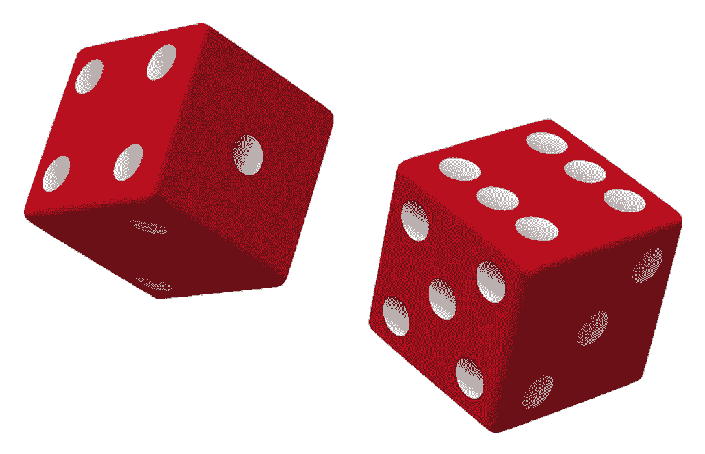

# 教程 | 如何直观地理解条件随机场，并通过 PyTorch 简单地实现

选自 towardsdatascience

**作者：****Freddy Boulton**

**机器之心编译**

**参与：Pedro、思源**

> 条件随机场是一种无向图模型，且相对于深度网络有非常多的优势，因此现在很多研究者结合条件随机场（CRF）与深度网络获得更鲁棒和可解释的模型。本文结合 PyTorch 从基本的概率定义到模型实现直观地介绍了 CRF 的基本概念，有助于读者进一步理解完整理论。

假设我们有两个相同的骰子，但是其中的一个是公平的，每个点数出现的概率相同；另一个骰子则被做了手脚，数字 6 出现的概率为 80%，而数字 1-5 出现的概率都为 4%。如果我给你一个 15 次投掷骰子的序列，你能预测出我每次投掷用的是哪一枚骰子吗？



为了得到较高的准确率，一个简单的模型是，每当「6」出现的时候，我们那就预测使用了有偏的骰子，而出现其他数字时则预测使用了公平的骰子。实际上，如果我们在每次投掷时等可能地使用任意一个骰子，那么这个简单的规则就是你可以做到的最好预测。

但是，设想一种情况：如果在使用了公平的骰子后，我们下一次投掷时使用有偏的骰子的概率为 90%，结果会怎样呢？如果下一次投掷出现了一个「3」，上述模型会预测我们使用了公平的骰子，但是实际上我们使用有偏的骰子是一个可能性更大的选项。我们可以通过贝叶斯定理来进行验证这个说法：


其中随机变量 y_i 是第 i 次投掷所用的骰子类型，x_i 是第 i 次投掷得到的点数。

我们的结论是，在每一步中作出可能性最大的选择只是可行策略之一，因为我们同时可能选择其它的骰子。更有可能的情况是，以前对骰子的选择情况影响了我未来会做出怎样的选择。为了成功地进行预测，你将不得不考虑到每次投掷之间的相互依赖关系。

条件随机场（CRF）是一个用于预测与输入序列相对应标注序列的标准模型。目前有许多关于条件随机场的教程，但是我所看到的教程都会陷入以下两种情况其中之一：1）全都是理论，但没有展示如何实现它们 2）为复杂的机器学习问题编写的代码缺少解释，不能令读者对代码有直观的理解。

之所以这些作者选择写出全是理论或者包含可读性很差的代码教程，是因为条件随机场从属于一个更广更深的课题「概率图模型」。所以要想深入涵盖其理论和实现可能需要写一本书，而不是一篇博文，这种情况也使得学习条件随机场的知识比它原本所需要的更困难。

本教程的目标是涵盖恰到好处的理论知识，以便你能对 CRF 有一个基本的印象。此外我们还会通过一个简单的问题向你展示如何实现条件随机场，你可以在自己的笔记本电脑上复现它。这很可能让你具有将这个简单的条件随机场示例加以改造，用于更复杂问题所需要的直观理解。

**理论**

我们对于理论的讨论将分为三个部分：1）指定模型参数 2）如何估计这些参数 3）利用这些参数进行预测，这三大类适用于任何统计机器学习模型。因此从这个意义上说，条件随机场并没有什么特别的，但这并不意味着条件随机场就和 logistic 回归模型一样简单。我们会发现，一旦我们要面对一连串的预测而不是单一的预测，事情就会变得更加复杂。

**指定模型参数**

在这个简单的问题中，我们需要担心的唯一的参数就是与从一次投掷转换到下一次投掷状态的分布。我们有六种状态需要考虑，因此我们将它们存储在一个 2*3 的「转移矩阵」中。


第一列对应于「从前一次投掷使用公平骰子的状态，转换到当前使用公平骰子状态的概率或成本（第一行的值），或转换到有偏骰子状态的概率（第二行的值）」。因此，第一列中的第一个元素编码了在给定我本次投掷使用了公平骰子的前提下，预测下一次投掷使用公平骰子的概率。如果数据显示，我不太可能在连续使用公平骰子，模型会学习到这个概率应该很低，反之亦然。同样的逻辑也适用于第二列。

矩阵的第一和第二列假设我们知道在前一次投掷中使用了哪个骰子，因此我们必须将第一次投掷作为一个特例来对待。我们将把相应的概率存储在第三列中。

**参数估计**

假设给定一个投掷的集合 X* *以及它们相应的骰子标签 Y。我们将会找到使整个训练数据的负对数似然最小的转移矩阵 T。我将会向你展示单个骰子投掷序列的似然和负对数似然是什么样的。为了在整个数据集上得到它，你要对所有的序列取平均。


P(x_i | y_i) 是在给定当前的骰子标签的前提条件下，观测到一个给定骰子投掷点数的概率。举例而言，如果 y_i 为公平骰子，则 P(x_i | y_i) = 1/6。另一项 T(y_i | y_{i-1}) 是从上一个骰子标签转换到当前投资标签的概率，我们可以直接从转移矩阵中读取出这个概率。

请注意在分母中，我们是怎样在所有可能标签 y' 的序列上进行求和的。在传统的二分类问题 logistic 回归中，我们在分母中会有两个项。但是现在，我们要处理的是标注序列，并且对于一个长度为 15 的序列来说，一共有 2¹⁵ 种可能的标签序列，所以分母项是十分巨大的。条件随机场的「秘密武器」是，它假定当前的骰子标签仅仅只取决于之前的骰子标签，来高效地计算这个大规模求和。

这个秘密武器被称为「前向-后向算法」。对该算法的深入讨论超出了这篇博文的范围，因此这里不做详细的解释。

**序列预测**

一旦我们估计出了我们的转移矩阵，我们可以使用它去找到在给定一个投掷序列的条件下，最有可能的骰子标注序列。要做到这一点，最简单的方法就是计算出所有可能的序列的似然，但这即使对于中等长度的序列也是十分困难的。正如我们在参数估计中所做的那样，我们将不得不用一种特殊的算法高效地搜索可能性最大的序列。这个算法与「向前-向后算法」很相近，它被称为「维特比算法」。

**代码**

PyTorch 是一个在 Python 语言环境下为训练深度学习模型而编写的深度学习库。尽管我们在这里并不是要进行深度学习，但 PyTorch 的自动微分库将帮助我们通过梯度下降算法训练条件随机场模型，而无需我们手动计算任何梯度。使用 PyTorch 会迫使我们实现「向前-向后算法」的前向部分以及「维特比算法」，这比我们直接使用专门的条件随机场构建的 Python 包更有指导意义。

首先，让我们先设想一下结果应该是什么样的。我们需要一种方法去计算给定骰子标签时，对于任意投掷序列的对数似然度，下面我们给出一种可能的方法：

```py
def neg_log_likelihood(self, rolls, states):
 """Compute neg log-likelihood for a given sequence.

 Input: 
 rolls: numpy array, dim [1, n_rolls]. Integer 0-5 showing value on dice.
 states: numpy array, dim [1, n_rolls]. Integer 0, 1\. 0 if dice is fair.
 """
 loglikelihoods = self._data_to_likelihood(rolls)
 states = torch.LongTensor(states)

 sequence_loglik = self._compute_likelihood_numerator(loglikelihoods, states)
 denominator = self._compute_likelihood_denominator(loglikelihoods)
 return denominator - sequence_loglik
```

这个方法做了三件主要的事情：1）将骰子的值映射到一个似然函数上 2）计算对数似然项的分子 3）计算对数似然项的分母。

让我们首先来处理「_data_to_likelihood」方法，它帮助我们去执行上面提到的步骤 1。我们将要做的是，创建一个维度为 6*2 的矩阵，其中第一列是用公平骰子掷到 1-6 的似然度，第二列是用有偏骰子掷到 1-6 的似然度。这个问题中的矩阵的形式如下所示：

```py
array([[-1.79175947, -3.21887582],
 [-1.79175947, -3.21887582],
 [-1.79175947, -3.21887582],
 [-1.79175947, -3.21887582],
 [-1.79175947, -3.21887582],
 [-1.79175947, -0.22314355]])
```

现在，如果我们看到一个投掷的点数为「4」，我们可以直接选择矩阵中的第四行。这个向量中的第一个元素是用公平骰子得到「4」的对数似然 log(1/6)，而第二个元素是用有偏骰子得到「4」的对数似然 log(0.04)。代码如下：

```py
def _data_to_likelihood(self, rolls):
 """Converts a numpy array of rolls (integers) to log-likelihood.
 self.loglikeligood is a matrix of 6 x 2 in our case. 
 Input is one [1, n_rolls]
 """
 log_likelihoods = self.loglikelihood[rolls]
 return Variable(torch.FloatTensor(log_likelihoods), requires_grad=False)
```

接下来，我们将编写计算对数似然分子和分母的方法。

```py
 def _compute_likelihood_numerator(self, loglikelihoods, states):
 """Computes numerator of likelihood function for a given sequence.

 We'll iterate over the sequence of states and compute the sum 
 of the relevant transition cost with the log likelihood of the observed
 roll. 
 Input:
 loglikelihoods: torch Variable. Matrix of n_obs x n_states. 
 i,j entry is loglikelihood of observing roll i given state j
 states: sequence of labels
 Output:
 score: torch Variable. Score of assignment. 
 """
 prev_state = self.n_states
 score = Variable(torch.Tensor([0]))
 for index, state in enumerate(states):
 score += self.transition[state, prev_state] + loglikelihoods[index, state]
 prev_state = state
 return score

 def _compute_likelihood_denominator(self, loglikelihoods):
 """Implements the forward pass of the forward-backward algorithm.

 We loop over all possible states efficiently using the recursive
 relationship: alpha_t(j) = \sum_i alpha_{t-1}(i) * L(x_t | y_t) * C(y_t | y{t-1} = i)
 Input:
 loglikelihoods: torch Variable. Same input as _compute_likelihood_numerator.
 This algorithm efficiently loops over all possible state sequences
 so no other imput is needed.
 Output:
 torch Variable. 
 """

 # Stores the current value of alpha at timestep t
 prev_alpha = self.transition[:, self.n_states] + loglikelihoods[0].view(1, -1)

 for roll in loglikelihoods[1:]:
 alpha_t = []

 # Loop over all possible states
 for next_state in range(self.n_states):

 # Compute all possible costs of transitioning to next_state
 feature_function = self.transition[next_state,:self.n_states].view(1, -1) +\
 roll[next_state].view(1, -1).expand(1, self.n_states)

 alpha_t_next_state = prev_alpha + feature_function
 alpha_t.append(self.log_sum_exp(alpha_t_next_state))
 prev_alpha = torch.cat(alpha_t).view(1, -1)
 return self.log_sum_exp(prev_alpha)
```

就是这样！我们现在已经拥有了学习转移矩阵所需的全部代码。但是，如果我们想要在训练完模型之后作出预测，我们就必须编写维特比算法：

```py
def _viterbi_algorithm(self, loglikelihoods):
 """Implements Viterbi algorithm for finding most likely sequence of labels.

 Very similar to _compute_likelihood_denominator but now we take the maximum
 over the previous states as opposed to the sum. 
 Input:
 loglikelihoods: torch Variable. Same input as _compute_likelihood_denominator.
 Output:
 tuple. First entry is the most likely sequence of labels. Second is
 the loglikelihood of this sequence. 
 """

 argmaxes = []

 # prev_delta will store the current score of the sequence for each state
 prev_delta = self.transition[:, self.n_states].view(1, -1) +\
 loglikelihoods[0].view(1, -1)

 for roll in loglikelihoods[1:]:
 local_argmaxes = []
 next_delta = []
 for next_state in range(self.n_states):
 feature_function = self.transition[next_state,:self.n_states].view(1, -1) +\
 roll.view(1, -1) +\
 prev_delta
 most_likely_state = self.argmax(feature_function)
 score = feature_function[0][most_likely_state]
 next_delta.append(score)
 local_argmaxes.append(most_likely_state)
 prev_delta = torch.cat(next_delta).view(1, -1)
 argmaxes.append(local_argmaxes)

 final_state = self.argmax(prev_delta)
 final_score = prev_delta[0][final_state]
 path_list = [final_state]

 # Backtrack through the argmaxes to find most likely state
 for states in reversed(argmaxes):
 final_state = states[final_state]
 path_list.append(final_state)

 return np.array(path_list), final_score
```

我们实现的代码还有很多，但我在这里仅仅只包含了我们在理论部分讨论过的核心功能。

**利用数据进行模型评价**

我使用下面概率模拟得到的数据，并对模型进行评价：

 1.P（序列中的第一个骰子为公平骰子）=0.5

 2.P（当前为公平骰子|上一次为公平骰子）=0.8

 3.P（当前为有偏骰子|上一次为有偏骰子）=0.35

请查看我编写的 Notebook 去看看我是如何生成条件随机场模型并且训练它的。

Notebook 地址：https://github.com/freddyalfonsoboulton/crf_tutorial/blob/master/crf_demo.ipynb

我们要做的第一件事就是看看估计出的转移矩阵是怎样的。模型会学习如果在前一次使用了公平骰子，那么这一次更有可能使用公平骰子进行投掷（-1.38 < -0.87）。模型还学到在使用了有偏骰子后，我们更有可能使用公平骰子，但这和使用有偏投掷的可能性差别并不是很大（-1.38 < -0.87）。该模型在第一次投掷时给两种骰子分配相同的代价（0.51 ~ -0.54）。

```py
array([[-0.86563134, -0.40748784, -0.54984874],
 [-1.3820231 , -0.59524935, -0.516026 ]], dtype=float32)
```

接下来，我们来看看对于一个特定的投掷序列的预测结果如何：

```py
# observed dice rolls
array([2, 3, 4, 5, 5, 5, 1, 5, 3, 2, 5, 5, 5, 3, 5])
# corresponding labels. 0 means fair
array([0, 0, 1, 1, 1, 1, 0, 1, 0, 0, 1, 1, 1, 0, 1])
# predictions
array([0, 1, 0, 1, 1, 1, 0, 0, 1, 0, 1, 1, 1, 0, 0])
```

模型识别出「6」的长序列（在上面的代码中实际显示为「5」，因为我们是从「0」开始的）来自于有偏的骰子，这是有意义的。请注意，模型并没有将所有的「6」都分配给有偏的骰子，就像对第八次投掷的预测那样。这是因为在这个「6」之前，我们很确信使用了公平骰子（我们掷出了一个「2」）并且从公平骰子状态转换到有偏骰子状态的可能性较小。我认为这种错误是可以接受的，因此模型是很成功的。

**结论**

我向你展示了条件随机场背后的一小部分理论知识，同时也展示了你如何才能实现一个用于简单问题的条件随机场。当然，相关的知识远远比我在这里所能够涵盖到的要多。所以我建议各位读者查看更多相关的资源。

*原文链接：https://towardsdatascience.com/conditional-random-field-tutorial-in-pytorch-ca0d04499463*

****本文为机器之心编译，**转载请联系本公众号获得授权****。**

✄------------------------------------------------

**加入机器之心（全职记者/实习生）：hr@jiqizhixin.com**

**投稿或寻求报道：**content**@jiqizhixin.com**

**广告&商务合作：bd@jiqizhixin.com**