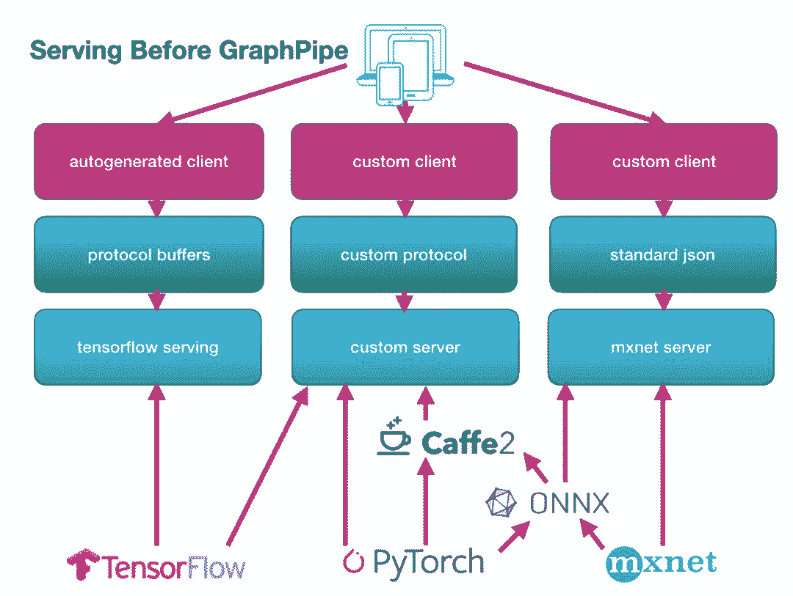
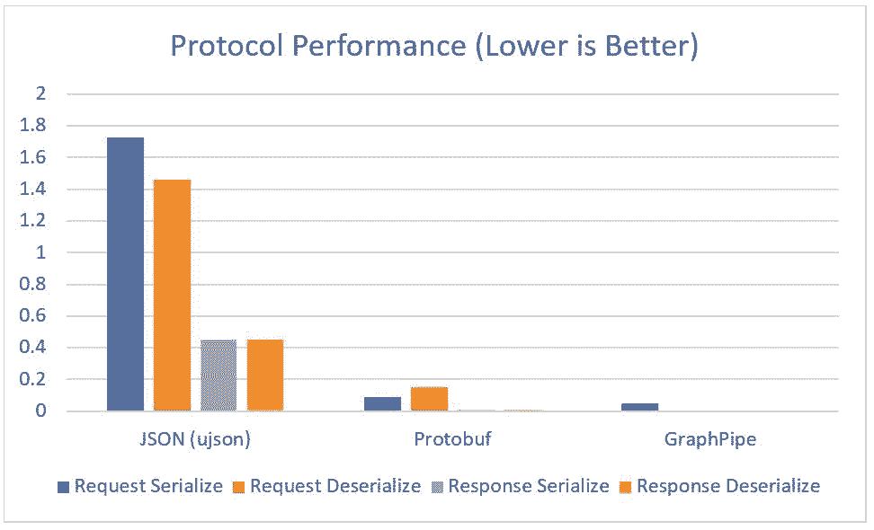
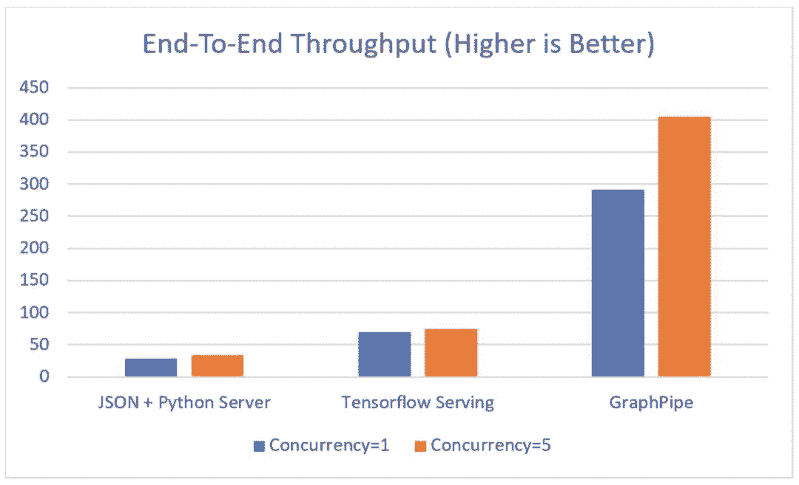
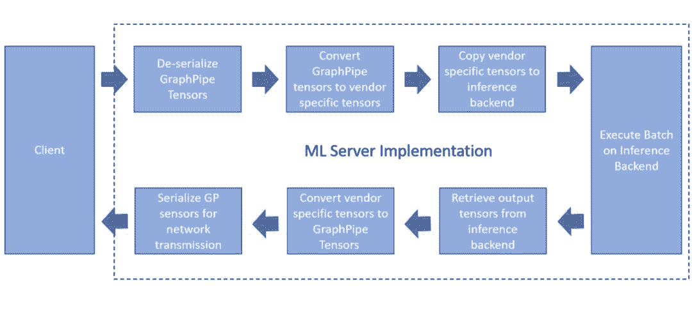
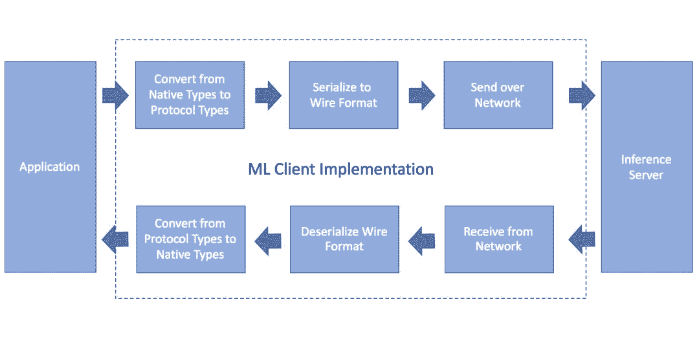
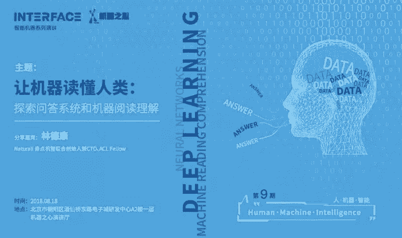

# Oracle 开源 GraphPipe：几行代码让你在 TensorFlow 部署 PyTorch 模型

选自 oracle

**机器之心编译**

**参与：机器之心编辑部**

> 甲骨文公司（Oracle）在人工智能领域非常低调，但最近其开源的通用深度学习模型部署框架 GraphPipe 着实让人眼前一亮，它可以让你的模型在各种框架之间轻松转换。Oracle 称，这一新工具可提供跨深度学习框架的模型通用 API、开箱即用的部署方案以及强大的性能。目前 GraphPine 已支持 TensorFlow、PyTorch、MXNet、CNTK 和 Caffe2 等框架。

项目地址：https://github.com/oracle/graphpipe

ML 的开发者经常会发现已有的模型服务方案存在非一致性和低效的问题。在缺乏一致、能用于不同模型服务器的通信协议下，开发者经常需要为每一个工作负载构建定制客户端。GraphPipe 通过标准化一种高效的通信协议解决了这些问题，并为主流的机器学习框架提供了简单的模型服务器。

GraphPipe 是一个用于简化机器学习模型部署，并将其从特定框架的模型实现中解放出来的协议和软件集合。GraphPipe 为在网络上传递张量数据提供了一个标准、高性能的协议，以及提供了客户端和服务器的简单实现，因而使得从任何框架部署和查询机器学习模型变得轻而易举。GraphPipe 的高性能服务器能支持 TensorFlow、PyTorch、MXNet、CNTK 和 Caffe2。

Oracle 希望开源 GraphPipe 可以使模型服务变得更加友好，因此通过调查当前的机器学习模型服务现状，我们发现：

*   模型服务网络协议尝试隐藏模型的实现。例如，假设你拥有一个 TensorFlow 模型，你需要使用 TensorFlow 的协议缓存服务器（TensorFlow-serving）来执行远程推理。

*   另一方面，PyTorch 和 Caffe2 并没有在他们的代码库中提供高效的模型服务器，但依赖于像 mxnet-model-server 这样的工具来执行远程推理。mxnet-model-server 是用 Python 编写的，并提供了一个 json API，没有批量支持。尽管这对于简单的案例来说很好，但并不适用于后端基础设施。

*   虽然 Facebook 推出了 [ONNX](https://mp.weixin.qq.com/s?__biz=MzA3MzI4MjgzMw==&mid=2650730662&idx=3&sn=361e9d109d2ae1da77caada746502c5a&scene=21#wechat_redirect)，但它是通过标准化模型格式而不是协议格式解决供应商耦合（vendor-coupling）的问题。这很有用但也存在挑战，因为不是所有的后端模型格式都有完全等价的运算。这意味着简单的转换并不总是可行，并且有时候有必要重写模型。

*   对于希望稳健地维护基础设施的运营者而言，拥有一种标准的方法实现前端客户端和后端机器学习模型的通信，而不用管模型实现的框架，是很重要的。

换句话说，没有 GraphPipe 的服务模型是很痛苦的。

在我们发布的代码中提供了：

*   基于 flatbuffer 的极简机器学习传输规范

*   为 Tensorflow、Caffe2 和 ONNX 构建简单高效的参照模型服务器

*   Go、Python 和 Java 中高效的客户端实现

有了这些工具，交流变得畅通无阻，服务也更加简单：

**性能** 

实验首先对比了对 Python 浮点张量数据的序列化和反序列化运算的速度，分别使用定制 ujson API，TensorFlow-serving 预测请求的协议缓存，以及 GraphPipe 远程请求。该请求由大约 1900 万个浮点值（包含 128 张 224x224x3 的图像）组成，并且响应由大约 320 万个浮点值（包含 128 张 7x7x512 的卷积输出）组成。纵轴的单位是秒。

GraphPipe 在并行化方面表现得特别好，因为 flatbuffers 无需复制内存即可提供对基础数据的访问。

其次，实验比较了 Python-JSON TensorFlow 模型服务器、TensorFlow-serving 和 GraphPipe-go TensorFlow 模型服务器的端到端吞吐量。每种类型中，后端模型都是相同的。分别采用一路和五路并行向服务器发出大量请求。纵轴单位是模型每秒计算的行数。

请注意，以上所述的测试仅使用一般推荐的参数来构建 TensorFlow-serving。尽管推荐的构建参数不能让 TensorFlow-serving 效果达到最优，但 Oracle 最终发现编译参数能允许获得与 GraphPipe 实现相同的性能。换而言之，最优的 TensorFlow-serving 与 GraphPipe 的性能相近，尽管构建最优性能的 TensorFlow-serving 并得不到记录。

**使用 GraphPipe 为模型提供服务**

除了有效协议外，GraphPipe 还提供了用 Go 语言编写的参考模型服务器，以简化部署机器学习模型的过程。根据 Oracle 的经验，将现有的模型转换成通用的格式可能会存在很多缺陷。因此，GraphPipe 提供了能够本地运行最常见的 ML 模型格式的模型服务器。

这些服务器可以在 graphpipe-go repo 的 cmd 子目录中找到：

*   graphpipe-tf 使用 libtensorflow 为 TensorFlow 模型提供支持

*   graphpipe-onnx 使用 libcaffe2 为 Caffe2 和 ONNX 模型提供支持

**目标**

在设计模型服务器时，GraphPipe 的目标如下：

*   优越的性能

*   简易文档化的构建过程

*   易于使用的灵活代码

*   支持最常见的 ML 框架

*   更优化的 CPU 和 GPU 支持

**服务器功能概述**

GraphPipe 的参考服务器应用的基本机制非常直观。

为了最小化开销，Oracle 尝试尽可能提高以上步骤的效率。例如，因为使用 flatbuffers 作为网络传输格式，反序列化实际上就是一个指针转换。

**语言选择**

虽然 Go 语言并不是机器学习领域里最常见的语言，但它是构建高效服务器的理想选择。它也是一种明确而友好的语言，不会给你带来太多的惊喜。这些特性使得 Go 语言成为了一种优秀的协作语言，这也是 GraphPipe 模型服务器选择它的原因。

Go 语言存在一个缺点：现有的机器学习框架都是由 C/C++语言编写的，当从 Go 代码转换为框架后端时会存在一些消耗。当然，在实践中我们发现这对于性能的影响其实非常小。在性能测试期间，GraphPipe 的 Go 代码实现了与纯 C++编写的 TensorFlow-serving 优化构建几乎相同的性能。

**CUDA GPU 加速**

对于每个参考服务器，项目中都提供了 docker 镜像和源代码，用于构建使用 CUDA 加速运行的二进制文件。

**MKL CPU 加速** 

为了最大限度提高各种服务器构建之间的兼容性，并且同时最大化性能，服务器的 CPU 构建块需要通过 MKL 编译。当使用 TensorFlow 时，MKL 为支持 channels_first 维度顺序的卷积运算提供了额外的优化，这通常是使用 GPU 的首选排序。因此在使用 GraphPipe 服务器的默认配置时，CPU 和 GPU 可以使用相同的模型并接受相同的输入。

当然，也有可能应用需要使用不同的最优化或通道顺序。因此对于这种情况，应该直接调整源代码以构建满足我们需求的自定义版本。

**缓存**

Go 这类语言的优点之一就是易于访问简单而强大的库。因此，我们能为两个模型服务器添加一些共享代码以创建行级缓存。这个可选的行级缓存是基于 boltdb 的，对于接受相同数据的多项请求的模型非常有用。缓存通常可以在几微秒内返回数据，而大型模型处理一个请求可能需要几百毫秒。

**使用 GraphPipe 用户端**

为了更便捷地将 GraphPipe 整合到我们的应用软件，GraphPipe 为主要的编程语言提供了高效的用户端实现。

一般而言，机器学习用户端的工作流程如下所示：

虚线框中的每一个步骤都应该尽可能更高效地实现，这是非常重要的。GraphPipe 就以这些步骤的高效实现为目标。目前，GraphPipe 的用户端支持 Python、Go 和 Java 语言。**

*原文链接：https://oracle.github.io/graphpipe/#/guide/servers/overview*

8 月 18 日，机器之心最新一期 INTERFACE 邀请到了 Naturali 奇点机智联合创始人兼 CTO、前 Google 研究院高级管理科学家、ACL Fellow 林德康老师为我们讲解问答系统和机器阅读理解的基本概念、经典系统结构和新兴的端对端模型结构。点击阅读原文参与报名。

