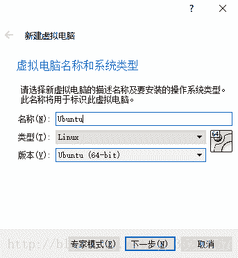
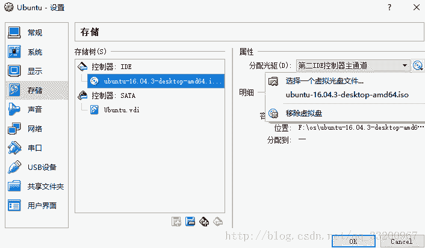

# 专栏 | 新手入门？一步一步教你如何安装 PaddlePaddle

机器之心发布

**来源：百度 PaddlePaddle**

> > 不久之前，机器之心联合百度推出 PaddlePaddle 专栏，为想要学习这一平台的技术人员推荐相关教程与资源。在解析过 [PaddlePaddle](http://mp.weixin.qq.com/s?__biz=MzA3MzI4MjgzMw==&mid=2650739530&idx=3&sn=32bdfdd26a53210ea78097359f67fb65&chksm=871ad734b06d5e22029292b0a38f3a2c5e46b8c9f55d79865782daf7441eace6ea336831a7a8&scene=21#wechat_redirect) 框架之后，从这篇文章开始上手，安装 PaddlePaddle。
> 
> **目录**
> 
> 环境
> 
> Windows 系统的安装
> 
> *   在 Windows 上安装 Docker 容器
>     
>     
> *   在 Windows 上安装 Ubuntu
>     
>     
> 
> 使用 pip 安装
> 
> 使用 Docker 安装
> 
> 从源码编译生成安装包
> 
> *   在本地编译生成安装包
>     
>     
> *   在 Docker 编译生成安装包
>     
>     
> 
> 编译 Docker 镜像
> 
> 测试安装环境
> 
> 最后提示
> 
> 项目代码
> 
> 参考资料
> 
> **环境**
> 
> *   系统：Ubuntu 16.0.4（64 位）
>     
>     
> *   处理器：Intel(R) Celeron(R) CPU 
>     
>     
> *   内存：8G
>     
>     
> 
> **Windows 系统的安装**
> 
> PaddlePaddle 目前还不支持 Windows，如果读者直接在 Windows 上安装 PaddlePaddlePaddle 的话，就会提示没有找到该安装包。如果读者一定要在 Windows 上工作的话，笔者提供两个建议：一、在 Windows 系统上使用 Docker 容器，在 Docker 容器上安装带有 PaddlePaddle 的镜像；二、在 Windows 系统上安装虚拟机，再在虚拟机上安装 Ubuntu。
> 
> **在 Windows 上安装 Docker 容器**
> 
> 首先下载 Docker 容器的工具包 DockerToolbox，笔者使用这个安装包不仅仅只有 Docker，它还包含了 VirtualBox 虚拟机，使用者工具包我们就不用单独去安装 VirtualBox 虚拟机了，DockerToolbox 的官网下载地址：https://docs.docker.com/toolbox/toolbox_install_windows/
> 
> 下载之后，就可以直接安装了，双击安装包，开始安装 
> 
> 
> 
> 选择安装路径，笔者使用默认的安装路径 
> 
> 
> 
> 然后安装所依赖的软件，因为笔者之前在电脑上已经安装了 git，所以在这里就不安装了，其他都要勾选 
> 
> 
> 
> 这一步不用修改什么，让程序为我们创建一个桌面快捷键 
> 
> 
> 
> 最后就可以安装了，等待一小段时间即可 
> 
> 
> 
> 到这里就安装完成了 
> 
> 
> 
> 安装完成之后，如果直接启动 Docker 的话，有可能可能会卡在这里，因为还有下载一个 boot2docker.iso 镜像，网速比较慢的话就可能一直卡在这里。所以我们还要镜像下一步操作
> 
> ```py
> Running pre-create checks...
> (default) No default Boot2Docker ISO found locally, downloading the latest release...
> (default) Latest release for github.com/boot2docker/boot2docker is v17.12.1-ce
> (default) Downloading C:\Users\15696\.docker\machine\cache\boot2docker.iso from https://github.com/boot2docker/boot2docker/releases/download/v17.12.1-ce/boot2docker.iso... 
> ```
> 
> 在下载 DockerToolbox 的时候，这个工具就已经带有 boot2docker.iso 镜像了。并且存在 DockerToolbox 安装的路径上，笔者的路径是：
> 
> C:\Program Files\Docker Toolbox\boot2docker.iso
> 
> 我们把这个镜像复制到用户目录\.docker\machine\cache\，如笔者的目录如下：
> 
> ```py
> C:\Users\15696\.docker\machine\cache\ 
> ```
> 
> 复制完成之后，双击桌面快捷方式 Docker Quickstart Terminal，启动 Docker，命令窗口会输出以下信息：
> 
> ```py
> Running pre-create checks...
> Creating machine...
> (default) Copying C:\Users\15696\.docker\machine\cache\boot2docker.iso to C:\Users\15696\.docker\machine\machines\default\boot2docker.iso...
> (default) Creating VirtualBox VM...
> (default) Creating SSH key...
> (default) Starting the VM...
> (default) Check network to re-create if needed...
> (default) Windows might ask for the permission to create a network adapter. Sometimes, such confirmation window is minimized in the taskbar.
> (default) Found a new host-only adapter: "VirtualBox Host-Only Ethernet Adapter #3"
> (default) Windows might ask for the permission to configure a network adapter. Sometimes, such confirmation window is minimized in the taskbar.
> (default) Windows might ask for the permission to configure a dhcp server. Sometimes, such confirmation window is minimized in the taskbar.
> (default) Waiting for an IP...
> ```
> 
> 最后看到 Docker 的 logo 就表示成功安装 Docker 容器了
> 
> ```py
>  ##         .
>                   ## ## ##        ==
>                ## ## ## ## ##    ===
>            /"""""""""""""""""\___/ ===
>       ~~~ {~~ ~~~~ ~~~ ~~~~ ~~~ ~ /  ===- ~~~
>            \______ o           __/
>              \    \         __/
>               \____\_______/
> 
> docker is configured to use the default machine with IP 192.168.99.100
> For help getting started, check out the docs at https://docs.docker.com
> 
> Start interactive shell
> 
> 15696@ɵ MINGW64 ~
> $ 
> ```
> 
> 到这就可以使用 Docker 来安装 PaddlePaddle 了，具体请看本文章中关于 Docker 使用 PaddlePaddle 部分
> 
> **在 Windows 上安装 Ubuntu**
> 
> 在 Windows 上在 Ubuntu 就要先安装虚拟机，虚拟机有很多，笔者使用的是开源的 VirtualBox 虚拟机，VirtualBox 的官网：https://www.virtualbox.org/
> 
> 安装完成 VirtualBox 虚拟机之后，进入到 VirtualBox 虚拟机中点击新建，创建一个系统 
> 
> 
> 
> 选择分配的内存，我这里只是分配了 2G，如果正式使用 PaddlePaddle 训练模型，这远远不够，读者可以根据需求分配内存 
> 
> 
> 
> 创建一个虚拟硬盘 
> 
> 
> 
> 选择默认的 VDI 硬盘文件类型 
> 
> 
> 
> 这里最好是选择动态分配硬盘，这样虚拟机会根据实际占用的空间大小使用电脑本身的磁盘大小，这样会减少电脑空间的占用率的。如果是固定大小，那么创建的虚拟机的虚拟硬盘一开始就是用户设置的大小了。
> 
> 
> 
> 这里就是选择虚拟硬盘大小的，最后分配 20G 以上，笔者分配 30G，应该够用。
> 
> 
> 
> 然后选择刚才创建的 Ubuntu 系统，点击设置，这系统中取消勾选软驱，然后点击存储，选择 Ubuntu 镜像，笔者使用的是 64 位 Ubuntu 16.04 桌面版的镜像 
> 
> 
> 
> 最后就可以启动安装 Ubuntu 了。选择我们创建的 Ubuntu 系统，点击启动，进入到开始安装界面，为了方便使用，笔者选择中文版的
> 
> 
> 
> 为了安装之后不用在安装和更新应用，笔者勾选了安装 Ubuntu 时下载更新，这样在安装的时候就已经更新应用了 
> 
> 
> 
> 然后是选安装的硬盘，因为我们使用的自己创建的整一个硬盘，所以我们可以直接选择青春整个硬盘并安装 Ubuntu，这里就不用考虑分区和挂载问题了 
> 
> 
> 
> 选择所在的位置，这没什么要求的，笔者随便选择一个城市 
> 
> 
> 
> 然后是选择键盘的布局，通常的键盘布局都是英语（美国）
> 
> 
> 
> 创建 Ubuntu 的用户名称和密码 
> 
> 
> 
> 最后就是安装了，这个安装过程可能有点久，耐心等待 
> 
> 
> 
> 安装完成之后就可以在 Windows 系统上使用 Ubuntu 系统了，我们再使用 Ubuntu 来学习和使用 PaddlePaddle 做深度学习了。最好安装完成之后，把在存储中设置的 Ubuntu 镜像移除 
> 
> 
> 
> 在本篇文章之后部分都是在 Ubuntu 上操作，我们都可以使用 Ubuntu 这虚拟机来完成。
> 
> 如果读者使用的是 Windows 10，可以使用 Windows 系统自带的 Linux 子系统，安装教程可以看我之前的文章 Windows10 安装 Linux 子系统。
> 
> **使用 pip 安装**
> 
> 如果你还没有在 pip 命令的话，首先要安装 pip，要确保安装的 pip 版本是大于 9.0.0 的，否则可能无法安装 paddlepaddle。
> 
> 安装 pip 命令如下：
> 
> ```py
> sudo apt install python-pip 
> ```
> 
> 安装之后，还有看一下 pip 的的版本 pip --version，如果版本低于 9.0.0，那要先升级 pip，先要下载一个升级文件，命令如下：
> 
> ```py
> wget https://bootstrap.pypa.io/get-pip.py 
> ```
> 
> 下载完成之后，可以使用这个文件安装最新的 pip 了
> 
> ```py
> python get-pip.py 
> ```
> 
> 安装 pip 就可以动手安装 paddlepaddle 了。如果权限不够，请在 root 下执行命令
> 
> ```py
> pip install paddlepaddle
> ```
> 
> 现在就测试看看 paddlepaddle 有没有，在 python 的命令终端中试着导入 paddlepaddle 包：
> 
> ```py
>  import paddle.v2 as paddle 
> ```
> 
> 如果没有报错的话就证明 paddlepaddle 安装成功了。
> 
> **使用 Docker 安装**
> 
> 为什么要使用 Docker 安装 paddlepaddle 呢，Docker 是完全使用沙箱机制的一个容器，在这个容器安装的环境是不会影响到本身系统的环境的。通俗来说，它就是一个虚拟机，但是它本身的性能开销很小。在使用 Docker 安装 paddlepaddle 前，首先要安装 Docker，通过下面的命令就可以安装了：
> 
> ```py
> sudo apt-get install docker 
> ```
> 
> 安装完成之后，可以使用 docker --version 查看 Docker 的版本，如果有显示，就证明安装成功了。可以使用 docker images 查看已经安装的镜像。
> 
> 一切都没有问题之后，就可以用 Docker 安装 paddlepaddle 了，命令如下：
> 
> ```py
> docker pull docker.paddlepaddlehub.com/paddle 
> ```
> 
> 在这里不得不说的是，这个安装过程非常久，也许是笔者的带宽太小了。安装完成后，可以再使用 docker images 命令查看安装的镜像，应该可以 看到类似这样一个镜像，名字和 TAG 会相同，其他信息一般不同
> 
> ```py
> docker.paddlepaddlehub.com/paddle latest 2b1ae16d846e 27 hours ago 1.338 GB 
> ```
> 
> **从源码编译生成安装包**
> 
> 我们的硬件环境都有很大的不同，官方给出的 pip 安装包不一定是符合我们的需求，比如笔者的电脑是不支持 AVX 指令集的，在官方中没找到这个的安装包（也行现在已经有了），所以我们要根据自己的需求来打包一个自己的安装包。
> 
> **在本地编译生成安装包**
> 
> 1\. 安装依赖环境 
> 
> 在一切开始之前，先要安装好依赖环境，下面表格是官方给出的依赖环境
> 
> 
> 
> 1.1 安装 GCC 
> 
> 一般现在的 Ubuntu 都是高于个版本了，可以使用 gcc --version 查看安装的版本。比如笔者的是 4.8.4，如果你的是版本是低于 4.8.2 的就要更新一下了
> 
> ```py
> sudo apt-get install gcc-4.9 
> ```
> 
> 1.2 安装 CMake 
> 
> 先要从官网下 CMake 源码
> 
> ```py
> wget https://cmake.org/files/v3.8/cmake-3.8.0.tar.gz
> ```
> 
> 解压源码
> 
> ```py
> tar -zxvf cmake-3.8.0.tar.gz 
> ```
> 
> 依次执行下面的代码
> 
> ```py
> # 进入解压后的目录
> cd cmake-3.8.0
> # 执行当前目录的 bootstrap 程序
> ./bootstrap
> # make 一下
> make
> # 开始安装
> sudo make install 
> ```
> 
> 查看是否安装成功，cmake --version，如果正常显示版本，那已经安装成功了。
> 
> 1.3 安装 pip 
> 
> 关于安装 pip9.0.0 以上的版本，在上面的使用 pip 安装部分已经讲了，这里就不在熬述了 
> 
> 1.4 安装 numpy 
> 
> 安装 numpy 很简单，一条命令就够了
> 
> ```py
> sudo apt-get install python-numpy 
> ```
> 
> 顺便多说一点，matplotlib 这个包也经常用到，顺便安装一下
> 
> ```py
> sudo apt-get install python-matplotlib 
> ```
> 
> 1.5 安装 SWIG 
> 
> 执行下面代码安装 SWIG，安装成功之后，使用 swig -version 检查安装结果
> 
> ```py
> sudo apt-get install -y git curl gfortran make build-essential automake swig libboost-all-dev 
> ```
> 
> 1.6 安装 Go 
> 
> 官方说可选择，那看情况吧，如果像安装安装吧，笔者顺便安装了，就一条代码的事情，老规则 go version
> 
> ```py
> sudo apt-get install golang 
> ```
> 
> 到这里，依赖环境就已经安装好了，准备安装 paddlepaddle。
> 
> 2\. 首先要在 GitHub 上获取 paddlepaddle 源码
> 
> ```py
> git clone https://github.com/PaddlePaddle/Paddle.git 
> ```
> 
> 3\. 然后输以下命令
> 
> ```py
> # 进入刚下载的 Paddle 里面
> cd Paddle
> # 创建一个 build 文件夹
> mkdir build
> # 进入 build 文件夹里
> cd build
> # 这就要选好你的需求了，比如笔者没有使用 GPU，不支持 AVX，为了节省空间，我把测试关闭了，这样会少很多空间。最后不要少了..
> cmake .. -DWITH_GPU=OFF -DWITH_AVX=OFF -DWITH_TESTING=OFF
> # 最后 make，生成你想要的安装包，这个可能很久, 一定要有耐心
> make 
> ```
> 
> 经过长久的 make 之后，终于生成了我们想要的安装包，它的路径在 Paddle/build/python/dist 下，比如笔者在该目录下有这个安装包 paddlepaddle-0.11.0-cp27-cp27mu-linux_x86_64.whl，你的命名可能不是这个。之后就可以安装了，使用 pip 安装：
> 
> ```py
> # 请切入到该目录
> cd build/python/dist/
> # 每个人的安装包名字可能不一样。如果权限不够，请在 root 下执行命令
> pip install paddlepaddle-0.11.0-cp27-cp27mu-linux_x86_64.whl
> ```
> 
> 这个我们就已经安装了 paddlepaddle，现在就测试看看 paddlepaddle 有没有安装成功了，在 python 的命令终端中试着导入 paddlepaddle 包：
> 
> ```py
> import paddle.v2 as paddle 
> ```
> 
> 如果没有报错的话就证明 paddlepaddle 安装成功了。
> 
> **在 Docker 编译生成安装包**
> 
> 使用 Docker 就轻松很多了，有多轻松，看一下便知 。
> 
> 1\. 首先要在 GitHub 上获取 paddlepaddle 源码
> 
> ```py
> git clone https://github.com/PaddlePaddle/Paddle.git 
> ```
> 
> 2\. 切入到项目的根目录下
> 
> ```py
> cd Paddle 
> ```
> 
> 3\. 生成安装包 
> 
> 下面一行代码，提醒一下，这个过程非常长，一定要有耐心，顺便把编译测试关了，减少空间
> 
> ```py
> docker run -it -v $PWD:/paddle -e "WITH_GPU=OFF" -e "WITH_AVX=OFF" -e "-DWITH_TESTING=OFF" docker.paddlepaddlehub.com/paddle:latest-dev bash -x /paddle/paddle/scripts/docker/build.sh 
> ```
> 
> 同样会在 Paddle/build/python/dist 下生成一个安装包，这对比在本地生成的安装包，是不是要简单很多，没错这就是 Docker 强大之处，所有的依赖环境都帮我们安装好了，现在只要安装这个安装包就行了：
> 
> ```py
> # 请切入到该目录
> cd build/python/dist/
> # 每个人的安装包名字可能不一样。如果权限不够，请在 root 下执行命令
> pip install paddlepaddle-0.11.0-cp27-cp27mu-linux_x86_64.whl 
> ```
> 
> 同样我们要测试看看 paddlepaddle 有没有安装成功了，在 python 的命令终端中试着导入 paddlepaddle 包：
> 
> ```py
>  import paddle.v2 as paddle 
> ```
> 
> 如果没有报错的话就证明 paddlepaddle 安装成功了。
> 
> **编译 Docker 镜像**
> 
> 如果你比较喜欢使用 Docker 来运行你的 paddlepaddle 代码，但是有没有你想要的镜像，这是就要自己来制作一个 Docker 镜像了，比如笔者的电脑是不支持 AVX 指令集的，还只有 CPU，那么我就要一个不用 AVX 指令集和使用 CPU 训练的镜像。好吧，我们开始吧 
> 
> 1\. 我们要从 GitHub 下载源码：
> 
> ```py
> git clone https://github.com/PaddlePaddle/Paddle.git 
> ```
> 
> 2\. 安装开发工具到 Docker image 里
> 
> ```py
> # 切入到 Paddle 目录下
> cd Paddle
> # 下载依赖环境并创建镜像，别少了最后的.
> docker build -t paddle:dev .
> ```
> 
> 有可能它不能够命名为 paddle:dev，我们可以对他从重新命名，ID 要是你镜像的 ID
> 
> ```py
> # docker tag <镜像对应的 ID> <镜像名:TAG>
> 例如：docker tag 1e835127cf33 paddle:dev 
> ```
> 
> 3\. 编译
> 
> # 这个编译要很久的，请耐心等待
> 
> ```py
> docker run --rm -e WITH_GPU=OFF -e WITH_AVX=OFF -v $PWD:/paddle paddle:dev 
> ```
> 
> 安装完成之后，使用 docker images 查看刚才安装的镜像。
> 
> **测试安装环境**
> 
> 我们就使用官方给出的一个例子，来测试我们安装 paddlepaddle 真的安装成功了 
> 
> 1\. 创建一个记事本，命名为 housing.py，并输入以下代码：
> 
> ```py
> import paddle.v2 as paddle
> # Initialize PaddlePaddle.
> paddle.init(use_gpu=False, trainer_count=1)
> # Configure the neural network.
> x = paddle.layer.data(name='x', type=paddle.data_type.dense_vector(13))
> y_predict = paddle.layer.fc(input=x, size=1, act=paddle.activation.Linear())
> # Infer using provided test data.
> probs = paddle.infer(
>  output_layer=y_predict,
>  parameters=paddle.dataset.uci_housing.model(),
>  input=[item for item in paddle.dataset.uci_housing.test()()])
> for i in xrange(len(probs)):
>  print 'Predicted price: ${:,.2f}'.format(probs[i][0] * 1000) 
> ```
> 
> 2\. 执行一下该代码 
> 
> 在本地执行代码请输入下面的命令
> 
> ```py
> python housing.py
> ```
> 
> 在 Docker 上执行代码的请输入下面的代码
> 
> ```py
> docker run -v $PWD:/work -w /work -p 8899:8899 docker.paddlepaddle.org/paddle python housing.py 
> ```
> 
> -v 命令是把本地目录挂载到 docker 镜像的目录上，-w 设置该目录为工作目录，-p 设置端口号，使用到的镜像是在使用 Docker 安装部分安装的镜像 docker.paddlepaddle.org/paddle
> 
> 3\. 终端会输出下面类似的日志
> 
> ```py
> I0116 08:40:12.004096 1 Util.cpp:166] commandline: --use_gpu=False --trainer_count=1 
> Cache file /root/.cache/paddle/dataset/fit_a_line.tar/fit_a_line.tar not found, downloading https://github.com/PaddlePaddle/book/raw/develop/01.fit_a_line/fit_a_line.tar
> [==================================================]
> Cache file /root/.cache/paddle/dataset/uci_housing/housing.data not found, downloading https://archive.ics.uci.edu/ml/machine-learning-databases/housing/housing.data
> [==================================================]
> Predicted price: $12,316.63
> Predicted price: $13,830.34
> Predicted price: $11,499.34
> Predicted price: $17,395.05
> Predicted price: $13,317.67
> Predicted price: $16,834.08
> Predicted price: $16,632.04
> ```
> 
> 如果没有成功运行该代码，报错信息如下，说明安装的 paddlepaddle 版本过低，请安装高版本的 paddlepaddle
> 
> ```py
> I0116 13:53:48.957136 15297 Util.cpp:166] commandline: --use_gpu=False --trainer_count=1
> Traceback (most recent call last):
>  File "housing.py", line 13, in <module>
>  parameters=paddle.dataset.uci_housing.model(),
> AttributeError: 'module' object has no attribute 'model'
> ```
> 
> **最后提示**
> 
> 有很多学习者会出现明明安装完成 PaddlePaddle 了，但是在 PaddlePaddle 的时候，在初始化 PaddlePaddle 这一行代码出错
> 
> ```py
> paddle.init(use_gpu=False, trainer_count=1) 
> ```
> 
> 这个多数是读者的电脑不支持 AVX 指令集，而在 PaddlePaddle 的时候，安装的是支持 AVX 指令集的版本，所以导致在初始化 PaddlePaddle 的时候报错。所以在安装或者编译 PaddlePaddle 安装包时，要根据读者电脑本身的情况，选择是否支持 AVX 指令集。查看电脑是否支持 AVX 指令集，可以在终端输入以下命令，输出 Yes 表示支持，输出 No 表示不支持。
> 
> ```py
> if cat /proc/cpuinfo | grep -i avx; then echo Yes; else echo No; fi
> ```
> 
> **项目代码**
> 
> GitHub 地址:https://github.com/yeyupiaoling/LearnPaddle
> 
> 参考资料
> 
> *http://paddlepaddle.org/*
> 
> *https://pip.pypa.io/en/stable/*
> 
> *http://www.runoob.com/*
> 
> *http://www.linuxidc.com/Linux/2016-12/138489.htm*
> 
> *https://www.jianshu.com/p/c6264cd5f5c7*
> 
>  *****本文为机器之心专栏，**转载请联系本公众号获得授权****。**
> 
> ✄------------------------------------------------
> 
> **加入机器之心（全职记者/实习生）：hr@jiqizhixin.com**
> 
> **投稿或寻求报道：editor@jiqizhixin.com**
> 
> **广告&商务合作：bd@jiqizhixin.com***