# 专栏 | 百度深度学习平台 PaddlePaddle 框架解析

机器之心专栏

**来源：百度 PaddlePaddle**

> PaddlePaddle 是 2016 年 8 月底百度开源的深度学习平台，并且在短时间内迅速引发全球开发热度，成为 Github Pull Request 数量增速极高的开源深度学习平台之一。如今，机器之心联合百度推出 PaddlePaddle 专栏，为想要学习这一平台的技术人员推荐相关教程与资源。

PaddlePaddle 的迭代速度非常快，同时也广受社区的关注。刚开源的时候，PaddlePaddle 的设计思想是基于 Layer 的设计。后来推出了「v2」和「Fluid」两次迭代：其中 v2 增加了 operators 的概念，把 layers「打碎」成更细粒度的 operators，同时支持更复杂的网络拓扑「图」；Fluid 类似 PyTorch，但是不依赖 Python 的控制流（if-else、for 等），而是提供自己的解释器甚至编译器，因此不受限于 Python 的执行速度。

我们今天就从 PaddlePaddleFluid 讲起，随后讲述为了能更方便利用集群而提供的在浏览器端训练的 PaddlePaddleCloud，也着重讲解集群训练的原理、配置、和实验结果，也就是 PaddlePaddleEDL 部分。最后，讲解 PaddlePaddleVisualDL，这个非常强大的训练日志解析和可视化工具。

**PaddlePaddleFluid**

PaddlePaddleFluid 提供类似于高级语言中的控制流结构（例如 while 、 if 、if-else、 for 等），不仅能利用编译优化技术保证计算性能，提升使用者的开发效率。

PaddlePaddleFluid 的设计思路非常领先，不再沿用层（layer）结构和操作（operator）结构的模式。也就是说不再有「模型」的概念，也就不再有「图」（graph of operators）或者「串」（sequence of layers）。而只有「程序」的概念。同时，程序是可以导出一个图的，从程序中可以导出成 ONNX 文件格式的模型。

深度学习基础架构是最快速发展的技术之一，在四年之内，已经发明了三代技术。从下表可以看出，深度学习技术架构设计的方向正是逐渐摆脱模型的。

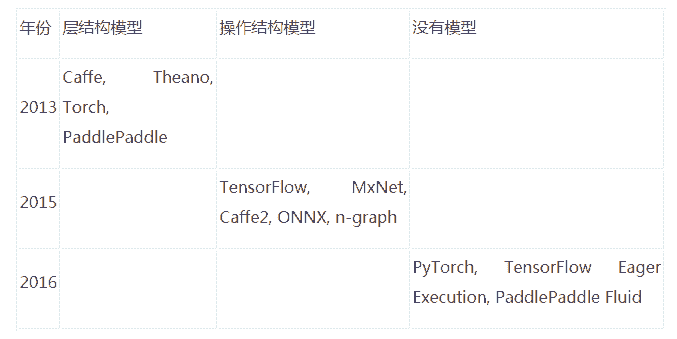

基于 Python 语言强大的生态，PyTorch 和 Eager Execution 中的控制流都是用的 Python，但面临的一个瓶颈是 Python 执行速度慢且难以提速。解决 PyTorch 和 Eager Execution 程序的执行速度受限于 Python 的执行速度的问题，Fluid 有一个比 PyTorch 和 Eager Execution 更激进的技术思路。在 Fluid 的设计上，执行会把编写的 Python 程序输出成一个 protobuf message，随后调用 Fluid 解释器（而不是 Python 解释器）来解释执行这个 protobuf message。Fluid 解释器极大地加快了执行图的速度。同时，在编译执行的方式上，通过写一个 transpiler 把 protobuf message 翻译成 C++ 程序，然后用 nvcc、icc、gcc 编译成二进制代码，可以直接运行在服务器和手机上。

**PaddlePaddleCloud**

PaddlePaddle 有一个 Web-based IDE，支持使用者在浏览器用 JupyterNotebook 编程来开发 AI 应用，随后可以把程序发送到云端（Kubernetes 集群上）调试或者运行，程序运行时的输出会实时地显示在浏览器里。这样使用者就不需要在个人电脑和集群等多个编程环境之间切换并且维护多个环境的版本和配置的一致性，极大地提升了工作效率。

**PaddlePaddleEDL**

PaddlePaddle EDL 对标的是 Google KubeFlow。PaddlePaddle EDL 通过与 Kubernetes 合作来实现弹性作业调度，是全球首个支持弹性作业调度的开源 AI 云解决方案。

尽管现在很多深度学习应用用一个几台机器的小集群就可以解决，但是 随着数据量的增加和 AI 应用场景的不断扩大，例如 Web scaled 应用（广告、搜索、推荐等），以及通过传感器采集海量数据的无人车，都需要大规模深度学习计算能力的。

这里主要为了解决深度学习面临的两大挑战。其一是需要大量的计算能力。研究室和公司经常构建由 SLURM，MPI 或 SGE 管理的 GPU 集群。这些集群要么运行一个提交的作业（假定它需要的比闲置的资源要少）或者将作业挂起一段难以预估的时间。但是这种方法有个缺点：在有 99 个可用节点和一个需要 100 个提交作业的任务时，作业必须等待而不能运行。

PaddlePaddle EDL 弹性调度体现在可以空闲的时候一个训练作业多用一些资源，忙碌的时候少用一些，但是资源的变化并不会导致作业失败；这是优于 KubeFlow 的特点之一。同时，EDL 也弹性调度其他作业（比如 Nginx、MySQL 等），从而极大地提升集群总体利用率。[2] 这样在公有云和私有云上的推广和部署时，就很容易节省几倍的机器，为公司一年节省的计算成本可以高达百万、甚至数百万美元。

另一个挑战是，工业用户倾向于将深度学习作业作为完整数据管道的子集阶段，例如日志采集器等。这种通用集群需要基于优先级的弹性调度。比如网络开销较高的时间段内深度学习任务少运行，在网络流量较低时优先进行深度学习任务。这就需要了解全局的情况，并协调与各种工作有关的进程的数量。

**PaddlePaddleEDL 的测试实验**

面对上述这两种挑战，PaddlePaddle 作业都可以轻松应对进程数量忽高忽低的变化。这里有 Fluid EDL 的两种测试用例：

*   Kubernetes 集群只运行 PaddlePaddle 作业;

*   集群运行 PaddlePaddle 和 Nginx 作业。

在第一个测试中，我们开始了 20 个 PaddlePaddle 作业，间隔 10 秒。每个作业有 60 个 trainers 和 10 个参数服务进程，并将持续数小时。我们重复实验 20 次：关闭 Fluid EDL 10 次，打开 Fluid EDL 10 次。在下图中，实线对应于前 10 个实验，其余的是虚线。在图的上半部分，我们看到未处理作业的数量在没有 EDL 的情况下单调递增。但是，当 EDL 打开时，资源将平均分配给所有作业。Fluid EDL 杀死了一些现有的进程，为新的其他任务腾出空间，并在晚些时候任务开始运行。在这两种情况下，集群都被平等利用（见图的下半部分）。

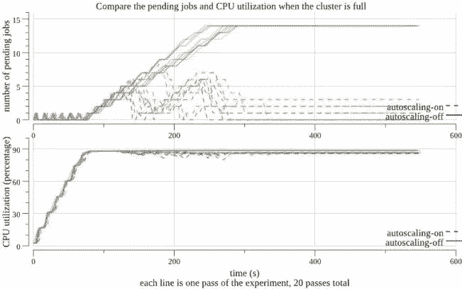

在第二个测试中，每个实验都运行了 400 个 Nginx Pods，其优先级高于 6 个 PaddlePaddle 作业。最初，每个 PaddlePaddle 工作有 15 个 trainers 和 10 个参数服务。我们每 90 秒杀死 100 个 Nginx Pods，直到剩下 100 个，然后我们开始将 Nginx 工作的数量每 90 秒增加 100 个。下图的上半部分显示了这个过程。图中的中间显示，Fluid EDL 通过减少 Nginx Pods 来自动启动一些 PaddlePaddle 进程，并在稍后增加 Nginx Pods 来杀死 PaddlePaddle 进程。结果，该集群维持在 90％左右的利用率，如图所示。当 Fluid EDL 被关闭时，没有 PaddlePaddle 进程自动增加，并且利用率随着 Nginx Pods 数量的变化而波动。

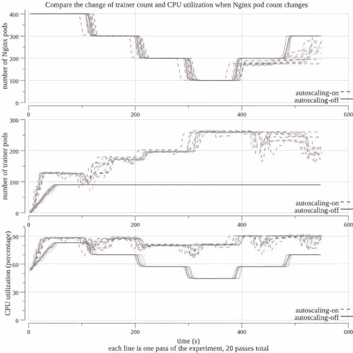

**PaddlePaddleEDL 的设计和实现**

那上面这种深度学习服务和其它云端服务共享计算资源的过程，以及各个任务的优先级动态地调整和伸缩的过程，从而充分地利用集群 CPU/GPU 是如何实现的呢？

**EDL 和 HPA**

Horizontal Pod Autoscaling（HPA）是 Kubernetes 提供的一种弹性调度机制。它的设计出发点是通过公平分配计算资源给某一个单一的计算任务中的各个 Pod 来实现分布式系统资源针对单一任务的最优化利用。但我们的训练任务可能多种多样（语音、图像等）、部署时间有先有后，对资源的需求也不通，因此我们希望这种弹性调度机制能对每一种训练任务所需的系统资源有个全局的了解，然后按需分配。但目前 HPA controller 还没有实现。

同时，HPA 的弹性调度是针对同种类型的计算任务（homogenous computing task）下的 Pods。但深度学习系统里的计算节点和参数服务器往往是在不同类型的 Pods 里 的。

上述特有的需求导致使用 Kubernetes 的时候需要有特定的弹性调度解决方案，而不能直接采用 HPA。因此更好的解决方案是 PaddlePaddle EDL。

**PaddlePaddleEDL 的具体设计和实现**

*   1\. 让 Kubernetes 支持定制的弹性调度机制

Kubernetes 本身就支持定制的资源管理机制。用户可以通过提交定制的 resource declaration file 和 controller file 来实现对某种 Pods 的弹性调度。以下图为例，这个 training_job.yaml 保证了 controller 会自动监管 pservers，并且保证它们的数量在 min-instance 和 max-instance 之间。

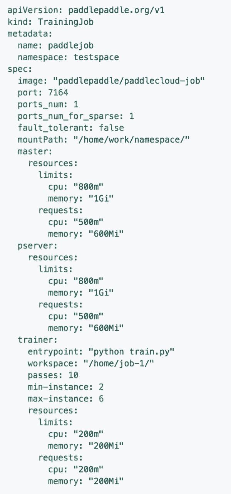

在 Kubernetes 集群上，这个定制的资源可以通过 kubectl create -f training_job.yaml 命令获得。接下来，我们需要有个定制的 training job controller 来调度这个资源。

定制的 training job controller 跑在一个 Pod 里，对集群资源有一个统一的了解，它通过 Kubernetes API 对集群资源起到监控和调度的作用。下图是 training job controller 配置文件的一个例子。

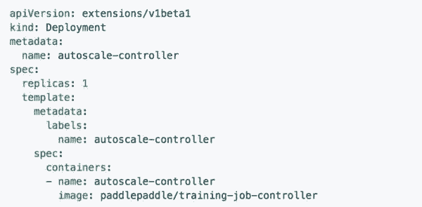

在 Kubernetes 集群上，这个定制的资源管理 Pod 可以通过 kubectl create -f training_job_controller.yaml 命令启动。

*   2\. 控制程序的实现

上面提到的定制化资源在 Kubernetes 里面目前有两种实现方式。一种是 Custom Resource Definition (CRD)，由 Kubernetes 1.7 版本引入;另一种是 Third Party Resource (TRP)。PaddlePaddle 项目现在用的是 Kubernetes 1.6 版本，所以实现的是 TRP 模式，今后将整合 CRD 模式。

当前 PaddlePaddle 假设只有一个单独的 training job controller 在运行。当前的 training job controller 依照下面的逻辑管理资源:

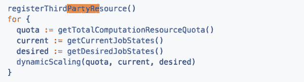

*   3\. 弹性调度算法

PaddlePaddle 根据定制资源的配置文件（training_job.yaml）来判断某个 job 需不需要弹性调度，而判断的标准是 trainer 和 pserver 的 min-instance =/ max-instance。

集群中 GPU 的调度

controller 知道集群中全部 GPU 个数，以及当前闲置的 GPU 的个数，并试图把闲置的 GPU 全部分配给当前训练任务。PaddlePaddle 给需求 GPU 的训练任务定义一个「满足程度」的评分（fulfillment score），此评分的范围是 [0，1]。PaddlePaddle 会优先分配 GPU 资源给满足程度评分最低的训练任务。如果有分数相同的情况，则分别优先考虑 GPU 需求数，CPU 需求数，内存需求数。如果有某个训练任务的 GPU min-instance 没有满足（除非 cur-instance=min-instance），那么 PaddlePaddle 会把一个满足程度最高分的训练任务里的 GPU 资源拿出来分给它。如果满足程度分数最高的训练任务 cur-instance=min-instance，则整个集群不再执行新的训练任务，新来的任务需等待。

集群中 CPU 的调度

CPU 资源的分配和 GPU 思路相同。controller 知道集群中一共有多少个 CPU，内存，它们的负载情况；同时也知道训练任务对 CPU 的需求。同样的，CPU 资源根据满足程度评分被按需分配。

**PaddlePaddle 容错机制**

这里讨论 PaddlePaddle 的容错机制。在一个分布式训练任务里，如果 master 进程或者所有的参数服务进程都死掉了，那么整个训练任务会被停掉，过一段时间被 Kubernetes 整个重启。如果具体训练进程没有都死掉，则整个训练任务继续。

PaddlePaddle 用 etcd 来记录训练进程的状态。etcd 是高可靠性的分布式 key-value 存储，训练进程会定时把自身状态写进 etcd，而这些信息将会在必要的时候用来恢复训练进程。具体过程如下图：

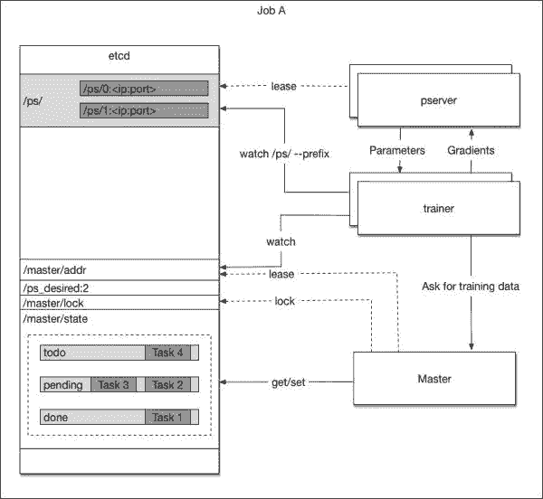

当 master 进程被 Kubernetes 启动时，它进行如下操作:

1\. 从 etcd 中取一个唯一的 master lock，以此避免多个 master 实例存在

2\. 查看 etcd 中是否存在任务队列。如果不存在，则新建一个任务队列;否则得到这个任务队列中的信息

3\. 把自身的 ip 地址写进 etcd 中/master/addr 这个 key 中，便于后来的训练进程和自己通信

4\. 开端口监听训练进程的任务需求，如果收到来自训练进程的任务请求，从任务队列中取任务分配之，并且更新任务队列。

如果 master 进程因为任何原因死掉了，Kubernetes 会将它重启，从被重启到获取 etcd 的信息，获取训练进程的任务，这个过程一般是几分钟。

*   训练进程

当训练进程被 Kubernetes 启动时，它进行如下操作:

1\. 查看 etcd 中包含参数服务前缀 /ps/ 获取当前参数服务进程的数量并等待，直到该数量达到配置文件中的要求

2\. 从 etcd 的/master/addr key 中获取 master 进程地址

3\. 向 master 发起任务请求，根据任务开始训练程序

当训练进程死掉之后，Kubernetes 会将它重启，新起来的进程会重复上述工作直到开始新的训练工作。

*   参数服务进程

当参数服务进程被 Kubernetes 启动时，它进行如下操作:

1\. 从 etcd /ps_desired 中读取训练任务所需求的参数服务进程个数

2\. 在 etcd /ps/<index>（/ps/0, /ps/1, ...）里找一个小于所需进程数里最大的还不存在的 id，并在 etcd 里创建这个 entry，以此作为自身的 id。（如下图）

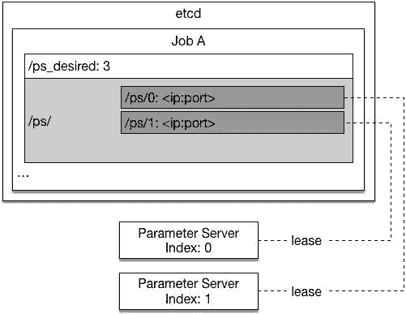

当第三个参数服务器加入时：

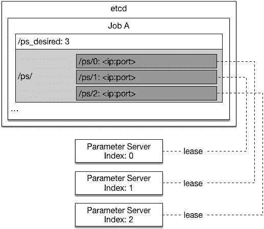

3\. 参数服务进程会从自身对应的 etcd path 中找到已有的训练结果参数并且将它读入

4\. 参数服务进程开始接收来自训练进程的请求。

**PaddlePaddle 的可视化—PaddlePaddleVisualDL**

PaddlePaddleVisualDL 是 PaddlePaddle 自带的一个强大的可视化工具，也是一个 Web 应用程序套件。PaddlePaddleVisualDL 目前支持 4 种可视化，即 SCALARS、IMAGES、GRAPHS、HISTOGRAMS。这 4 种可视化的主要功能如下。

● SCALARS：展示训练过程中的准确率、损失值、权重/偏置的变化情况。

● IMAGES：展示训练过程中记录的图像。

● GRAPHS：展示模型的数据流图，以及训练在各个设备上消耗的内存和时间。

● HISTOGRAMS：展示训练过程中记录的数据的柱状图。

PaddlePaddleVisualDL 通过运行一个本地服务器，来监听 8080 端口。在浏览器发出请求时，分析训练时记录的数据，绘制训练过程中的图像。而且 VisualDL 兼容 ONNX, 通过与 python SDK 的结合，VisualDL 可以兼容包括 PaddlePaddle, pytorch, mxnet, Caffe2 在内的大部分主流 DNN 平台。而 Tensorboard 目前仅适用于 Tensorflow、Pytorch、MXNet 等。

PaddlePaddleVisualDL 的可视化界面如下图所示。

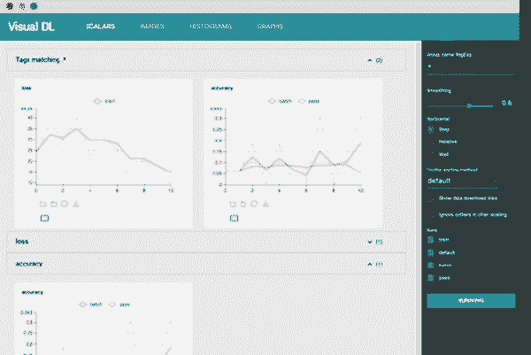

**VisualDL 的使用**

VisualDL 的使用方式非常简单，只需要下面三个过程：

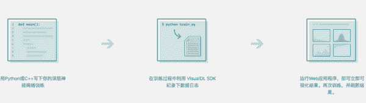

**VisualDL 的特性**

VisualDL 的特性主要有下面 4 点：

*   支持 Scalar 打点折线图展示，方便观察训练整体趋势

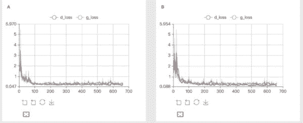

*   支持 Image 查看数据样本的质量和训练中间结果

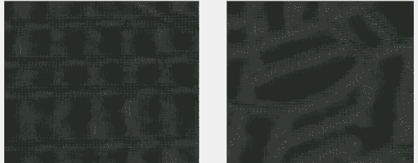

*   支持 Histogram 查看参数分布展示和变化趋势

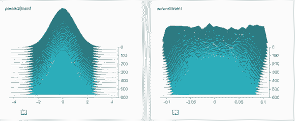

*   支持 Graph 查看深度神经网络的模型结构

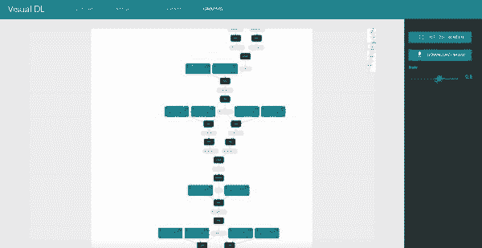

**总结**

随着 PaddlePaddle 新特性的不断增加，相信在科研和使用中能给广大使用者带来很多帮助。这里从 PaddlePaddleFluid 讲起，随后讲述为了能更方便利用集群而提供的在浏览器端训练的 PaddlePaddleCloud，也着重讲解集群训练的原理、配置、和实验结果，也就是 PaddlePaddleEDL 部分。最后，讲解 PaddlePaddleVisualDL，这个非常强大的训练日志解析和可视化工具。

****本文为机器之心专栏，**转载请联系本公众号获得授权****。**

✄------------------------------------------------

**加入机器之心（全职记者/实习生）：hr@jiqizhixin.com**

**投稿或寻求报道：editor@jiqizhixin.com**

**广告&商务合作：bd@jiqizhixin.com**