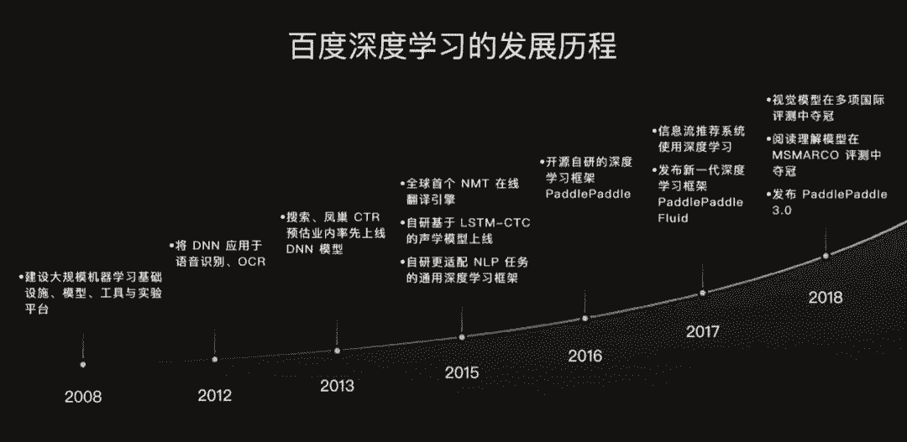
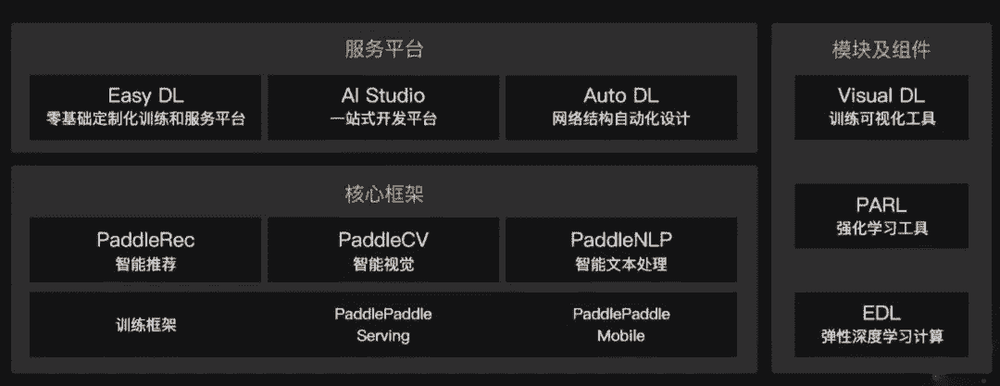
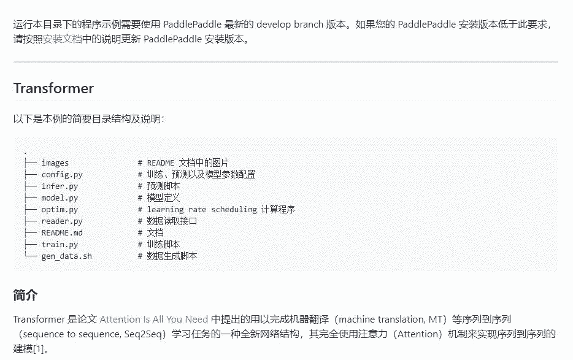
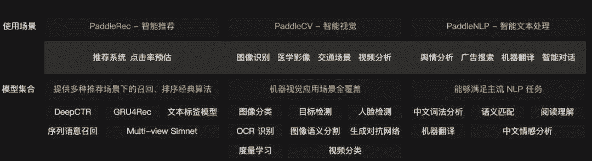
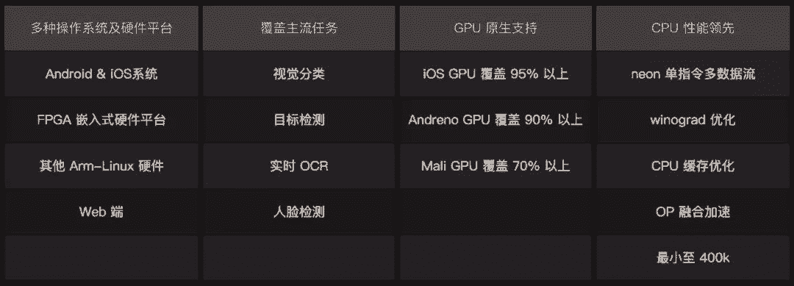
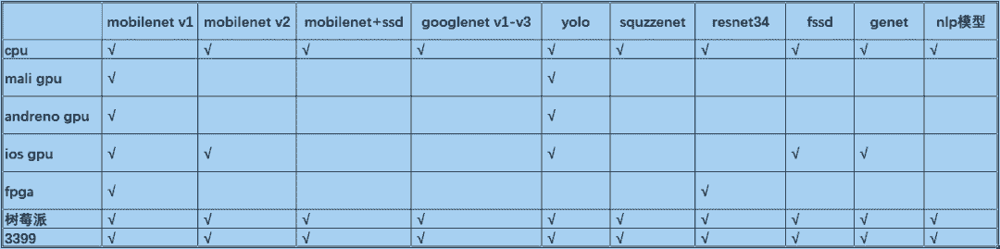

# 最适合中国开发者的深度学习框架：走向成熟的 PaddlePaddle 1.0

机器之心原创

**作者：思**

> 近日，PaddlePaddle 1.0 正式发布，这一适合国内开发者的框架为我们提供了超全的官方模型支持和最完善的移动端硬件支持。在 PaddlePaddle 走向成熟的这些历程中，它为机器学习社区贡献了非常多的实现及应用。机器之心访问了百度深度学习技术平台部总监马艳军和 PaddlePaddle 总架构师于佃海，他们向我们介绍了 PaddlePaddle 的「成熟韵味」都体现在哪。

自深度学习以分层逐步学习的奇思妙想崛起以来，深度学习框架就在不停地发展。在 AlexNet 还没有携带深度学习亮相 ImageNet 之前，由蒙特利尔大学 LISA 实验室所编写的 Theano 框架就已经开源，它可用来支持高效机器学习算法。Theano 是目前 DL 框架中的元老，它开启了深度神经网络高效编程的先河，后来开源的框架都受益于 Theano 的先行探索。

自 AlexNet 之后，深度卷积神经网络在图像数据展现出无与伦比的能力，而伯克利大学 AI 研究中心维护的 Caffe 也在 2013 年底正式开源。Caffe 支持非常多的计算机视觉领域算法，目前仍然有非常多的卷积神经网络模型还都依赖于这个框架。

此后随着深度学习在各种任务都以「暴力美学」的方式频频打破纪录，科技巨头也开始逐步开源内部的深度学习框架，包括 Facebook 主要维护的 Torch、谷歌主要维护的 TensorFlow（2015 年）和百度主要维护的 PaddlePaddle（2016 年）等。

因为学术研究机构主导维护的框架比较适合完成模型原型，但在大数据或大规模分布式计算等情况下 很难有比较好的性能，因此由科技巨头主导维护的框架变得越来越流行。2017 年 4 月 19 日发布 1.0 后的 Caffe 不再更新版本，9 月 19 日走过 10 年的 Theano 不再有官方维护。但与此同时，具有业务基础的 TensorFlow、PaddlePaddle 和 PyTorch 等框架获得了更广泛的应用。

在这些根植业务的稳定框架中，由百度开发并维护的 PaddlePaddle 是适合中国开发者和企业的深度学习工具，而最近发布的 PaddlePaddle 1.0 又标志着它已经走向成熟。成熟的 PaddlePaddle 官方所维护的模型数量基本上是最多的，包括自然语言处理、计算机视觉和推荐等领域的成熟模型。这些模型很多都是根据百度自身业务积累而开源的，甚至还会提供对应的预训练资源。例如在 NLP 中的情感分析任务上，PaddlePaddle 就会提供基于中文的预训练模型，这对于开发者而言是非常有意义的。

成熟也就意味着 PaddlePaddle 能为开发者和企业提供从训练到部署的整套流程。从框架开发环境、AutoDL 2.0 自动设计深度模型、大规模并行训练框架到覆盖 90% 以上的移动端 GPU 加速，新发布的 PaddlePaddle 在数据预处理、模型搭建、模型训练和部署这一系列流程都展示了成熟的味道：

*   支持真正能解决企业问题的模型，所有成熟的模型都必须完备；

*   运行稳定、可靠且高效；

*   代码简洁，方便二次开发。

作为国内唯一成熟的深度学习框架，PaddlePaddle 目前已经更新到了 1.1.0。机器之心在本文中将从整体开发套件、官方模型、移动端支持以及并行计算等方面介绍成熟的 PaddlePaddle 目前已经走到哪了。

**PaddlePaddle Suite**

PaddlePaddle Suite 是以深度学习框架为核心的套件，它从数据预处理到模型部署为深度学习的整个开发和应用流程提供了完整的工具。其中核心框架是从头构建模型的基础，而模块与组件可以帮助我们快速训练与试验模型。最后的平台会为开发者提供整体流程支持，例如 AI Studio 提供了各种竞赛教程与免费 GPU 资源，而 EasyDL 可以为完全没有基础的用户提供自动化的机器学习模型。

马艳军表示这三部分都是相互有联系的，模块与组件都是依托核心框架所做的工具，而平台是基于核心框架与组件所搭建的系统。例如在组件中，Visual DL 能可视化整个训练和测试过程，包括损失函数的变化、模型计算图和中间生成的图像等。而 PARL 是深度强化学习框架性质的组件，它相当于提供了一套强化学习模型、算法和函数等，这些都还是基于核心框架的。

此外核心框架与组件又为平台提供了底层支持，例如我们可以在平台上直接可视化训练过程，或者在平台调用核心框架搭建模型。值得注意的是，使用深度学习设计深度学习的 Auto DL 2.0 可以基于核心框架自动构建出非常优秀的模型。例如 Auto DL 在 Cifar-10 数据集上自动设计的神经网络能获得当前最优的测试集准确度 97.9%，同比一般的 ResNet-110 只能获得 93.5% 的准确率。

**官方模型**

PaddlePaddle 1.0 为推荐系统、视觉和自然语言处理任务提供了大量的官方模型，这对于开发者而言是非常难得的资源。马艳军表示为了吸引研究者与开发者，百度首先会开源一些比较经典的算法，这些算法在业界上已经有比较广的应用，且它们已经非常稳定。其次百度会开源一些前沿高性能模型，尤其是在各种竞赛获得第一的强大模型。特别是在 NLP 等百度传统强项，其开放的经典模型很多都包含一些百度特有的技术，这些技术在实际产品线上都 已发挥了很大的作用。

百度在搜索和推荐等实际产品应用中积累的一些自然语言处理相关的核心技术都有开放出来，例如文本匹配和推荐的整套系列模型，包括对整个任务流程的支持。另外还有一些前沿模型，例如百度自研的人脸检测 PyramidBox，该模型在 WIDER FACE 2018 的多项评测中均获得第一名。

此外 PaddlePaddle 还会提供一些模型的简洁实现，例如在机器翻译中，百度会「精简」整个 Transformer 的模型代码，将本来很复杂的实现通过高级 API 或封装变得直观与易懂。

*Transformer 开源模型，开发者可以快速理解直观代码并完成二次开发。*

马艳军表示其实现在 Transformer 的很多实现都非常复杂，开发者需要大量时间理解代码才能继续二次开发和部署模型。而 PaddlePaddle 相当于把实现做到足够简单，因此修改、训练、测试或部署都不会有太复杂的工作。

我们注意到，如果用户使用 Tensorflow 来来开发 Transformer 翻译模型，需要在 10 万行 Tensor2tensor 代码中找出他需要的部分，而在 PaddlePaddle 下的 Transformer 翻译模型代码仅 2000 余行，开发者可以快速理解代码并完成二次开发。

其实除了 PaddlePaddle 官方维护的这些模型，很多具体领域也都会有一系列类似的工具，例如自然语言处理中的 NLTK 或计算机视觉领域的 Detectron 等。于佃海表示，这些第三方的库很多时候都只是把各种算法整理出来，并以一种近似黑盒的方式提供使用。但是对于 Paddle 来说，它本身就是深度学习框架，因此搭上这些模型也会有很好的扩展性，我们可以直接调用这些模型，也可以对它们做二次开发。

此外，Paddle 支持的开源模型还有另外一个特点，它们会基于百度在中文上的大数据做一些预训练模型，这对于中文文本处理或推荐系统都有很大的帮助。例如对于词法分析模型，Paddle 提供的预训练模型已经在大规模汉语数据集上训练得非常好，开发者可以直接调用并用于自己的任务。

除了上面模型的挑选、简化和中文预训练等特点，Paddle 支持的官方模型还有另一大特色，即覆盖了推荐、视觉和文本的大部分的任务和模型。

*Paddle 主要覆盖的任务，每一种任务有多个最优模型，例如目标检测中的 SSD、PyramidBox 和 Faster R-CNN 等。更详细的模型列表情查看开源地址。*

Paddle 官方模型地址：https://github.com/PaddlePaddle/models/tree/develop/fluid

**开发与维护**

这么全的官方模型有一套自己的开发和维护流程，官方支持不仅表示这些模型是没问题的，同时还表示不论怎样更新 PaddlePaddle，不论在什么环境下，这些模型也都是跑得动的。

对于官方模型的整个开发过程而言，Paddle 团队通过实践经验或调研会得出到底哪些模型效果好、性能稳定，当然这一过程会结合具体问题与具体领域。选定模型后 Paddle 团队会直接实现，或其它部门的算法工程师根据实际经验完成模型，当然第三方也可以提交新算法。

针对何为官方支持，马艳军表示一旦模型得到实现，他们会在认可的数据集上对效果和速度等各方面都进行验证。一旦新模型通过验证，它们就能加入发行版的模型列表，并且在所有的 Paddle 后续框架开发中，不管框架如何升级，这些模型都能稳定地运行。

也就是说不管什么时候用这些模型，它们肯定都能运行。为了达到这样的效果，官方支持的模型在每一次框架升级后都会重新验证，它们的准确度和速度等衡量标准只允许变好而不能变坏。如果模型性能变差，那么官方支持的模型肯定出了问题，Paddle 团队需要在新框架上将它们调整好才能发布。

于佃海表示这其实也是很自然的一个过程，因为百度有很强的 AI 研发团队，而基于 PaddlePaddle 的研发过程，使得在 NLP 和 CV 等方面天然就会有持续的积累。在评估这些模型后肯定知道哪些对大家是值得开源的，因此整个开放和维护过程是一个持续的过程。

除了开源流程外，另外一个比较重要的方面就是环境配置。很多时候我们调用不同的包或工具都会遇到配置运行环境这一「玄学」，尤其是在 Windows 系统上。而马艳军表示 Paddle 团队在环境配置方面也是下了「血本」的，他们一直将环境支持放在最优先的位置。

具体而言，Paddle 对国内各社区的用户反馈做了全面的回应，不管是 Windows、MacOS 还是 Linux，模型发布前都会做全面的验证，包括各系统版本的支持、编程语言的支持和模型依赖项的支持等。这就相当于在每一种系统环境下对所有模型都做了验证，因为官方支持的模型很多，所以这个工作量还是非常大的。

最后，相对于其它使用不同框架的非官方模型，很可能它们都是针对特定论文的实现，而这些实现有可能是不稳定的，在实际应用中可能需要做大量的工程化努力。Paddle 官方支持的模型不仅会保证稳定可靠，同时那些被验证的前沿最新模型也都会纳入官方支持。比如说前一段时间在 NLP 中效果非常好的 BERT 预训练模型，Paddle 也将提供基于大规模中文数据所预训练的版本。

**移动端加速**

除了大量的官方模型，开发者在产品化模型时还会遇到各种各样的工程化问题。例如简单地将模型部署到云端，那么就需要考虑推理延迟和网络稳定性等问题。而如果考虑将模型部署到移动端，那么面临的问题就更多了，例如安装包大小、运行内存占用大小、推理速度和效果等。

针对移动端的这些问题，我们一般会先压缩神经网络以减少所需的计算资源，并只编译特定的 Operator 而降低包体大小。当然若移动端框架还支持硬件加速，那就最好不过了。以前这些优化步骤都需要开发者自行完成，例如根据实际情况实现新的模型压缩算法，编写底层加速库等等。

但是自面向工业化的框架崛起以来，这些调用个函数就能解决。Paddle Mobile 在移动端加速也是做得非常好，马艳军表示 Paddle Mobile 对移动端硬件的支持基本上是所有框架中最完整的，使用整套工具不仅能快速部署模型，同时还能借助高速推理引擎快速执行预测。

首先 Paddle 在 CPU 上的支持非常完备，这也是一直以来的优化重点。其次随着 GPU 在移动端变得越来越流行，目前 Paddle Mobile 已经支持最主流的 90%GPU，包括 IOS、高通的 Andrene 和 ARM 的 Mali GPU。下图展示了不同模型在不同硬件上的支持情况：

既然已经有了硬件加速的保证，那么接下来开发者就只需要搞定模型了。不过即使模型压缩得越狠加速越快，但实际上模型压缩和性能也是有权衡的。在大多数场景下，压缩后的模型准确率损失不能超过 1%，甚至有一些会要求准确率不能降低。因此 Paddle 做的很多工作都关注于如何在保持准确率不变的情况下做压缩。

于佃海表示研究团队会持续基于 Paddle 框架把轻量级部署应用做得更好，例如可以和训练阶段更好配合，在训练阶段就为模型压缩做一些准备。因为如果等模型训练好再做压缩或使用低精度，一些场景下准确率或多或少有一些影响。但是如果在训练阶段就考虑推理阶段的模型压缩或低精度计算问题，那么模型可能在推理阶段的适应性会更大，再做剪枝等压缩算法就会有比较好的效果。这也就是说为什么 PaddlePaddle 不仅做高速推理引擎，它关注的是全流程的高效训练和上线部署。

最后当模型训练并压缩完毕，我们就需要编译成安装包。这里比较重要的是控制包体大小，这也可以视为一种「压缩」。很多移动端框架在这一方面做得并不好，比如说如果采用了框架自带的模型压缩算法，那么编译时会附带很多额外的 OP。而 Paddle Mobile 在打包的时候会尽量把一些不需要的 OP 不放到软件包中，并最终实现一个轻量化的安装程序。

**超大规模并行训练**

PaddlePaddle 这种面向工业化的框架在并行训练，尤其是在 GPU 多机多卡、CPU 多机多线程上的并行训练非常有优势。从整体上来说有高效的数据读取方式 PyReader，也有对分布式框架本身做的优化。例如对于大规模稀疏特征，因为参数量会非常大，甚至单台服务器都无法加载全部参数，那么并行分布式参数服务器的设计就需要优化。这种大规模稀疏特征在工业上非常常见，例如处理广告或信息流的特征维度可能会达到千亿级的规模，再加上同样巨量的样本数，一般的框架是搞不定的。

基于工业化经验，Paddle 在参数服务器、多机通信和数值优化算法等方面优化了整个并行框架。它不仅适合解决大规模稀疏特征问题，同时还有很多具体实现上的优化创新，比如动态地调整通信节奏以使用更大的 BatchSize 进行训练。这样不仅并行的效率高，同时模型收敛也能变得更快。

总的而言，PaddlePaddle 1.0 支持超大规模的并行深度学习，包括支持大规模异构计算集群、异步训练和同步训练模式、以及千亿级稀疏特征任务在数百个节点的并行训练。********

1.  点击**「阅读原文」**填写报名表单，工作人员在审核后会发送评选申请表格。

2.  申请企业需按照要求填写评选申请表格。

3.  未尽事宜可添加机器之心小助手：syncedai3 进行咨询；添加好友请备注「年度评选」。