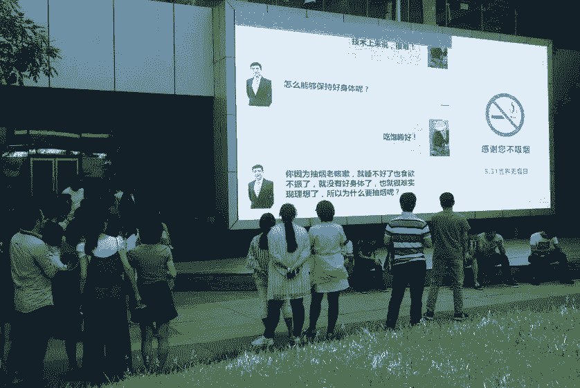
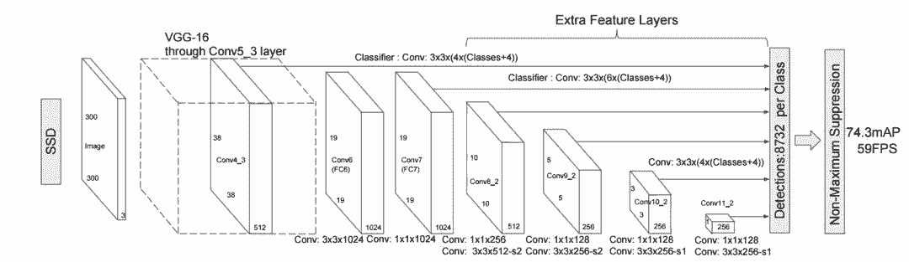

# 专栏 | 有趣！用计算机视觉技术与 PaddlePaddle 打造 AI 控烟项目

机器之心专栏

**作者：****吴欣**

> 每年 5 月 31 日是世界控烟日，百度使用了目标检测、动作识别、人脸检测等 AI 技术，基于 PaddlePaddle 做了一个「AI 控烟」项目。

*百度工程师用 PaddlePaddle 训练出一套模型，能够对吸烟人群进行识别和适当提示。当摄像头捕捉到正在吸烟的同学，就会投射到大屏幕上。图为李彦宏和某个员工的对话，对话员工的头像正是周围某个吸烟员工的「吸烟照」，而且其面部用表情包替换了。*

这是一个基于 AI 技术完成的项目，使用了目标检测、动作识别、人脸检测等 AI 技术。其大致流程可以这样描述：

*项目流程示意图*

**训练与预测**

我们可以借这个项目来了解一个 AI 控烟这样的应用是如何完成的。项目的实现可以分为训练阶段、预测阶段两部分。

我们先来看训练，主要是对吸烟动作识别的训练。这里用到的是动作识别技术，也叫做人体动作识别，是图像分类技术的一个细分领域，通过对图像中的人物动作来判断其行为，主要可以分为视频识别和静态图像识别。两种技术都会有自己的应用场景，其中视频识别会对计算资源的要求比较高，更多使用在一些对实时性要求比较高的场景，比如安防领域会基于实时监控中是否出现抢劫或求救行为来自动完成报警。而基于静态图像的动作识别则可以面向一些实时性不那么高的场景，可以用较低的计算成本来完成。

本文的控烟项目根据其采集图片数据的行为来看，应该是基于静态图像的动作识别。具体到训练过程，首先是样本数据的获取，这也是所有深度学习问题的起点。在这个项目中需要搜集的是户外情况下用户的吸烟图片，并将每张图像中的吸烟者标注出来。第二步是训练吸烟动作识别的模型，即通过标注好的数据来让机器学习到什么样的动作可能是吸烟，从而在有新的图像出现时能够判断其是吸烟行为的可能性，模型训练过程是一系列复杂的工作。

最后是模型的评估工作，需要让模型去判断新的图像是否是存在吸烟行为，并记录其表现，在满足一定评估指标后，才能停止优化。经过这样一系列流程，我们会得到一个符合业务目标的吸烟动作识别模型。

得到动作识别模型之后，我们就可以进行预测环节了。预测的具体的流程是这样：首先我们需要将吸烟动作识别模型部署在服务器上，让其具备能够在生产环境中接收数据以及输出结果的能力，有了这个基础，我们就能够将摄像头采集的图像数据输入模型，经过模型的判断后再向大屏幕输出吸烟者的图像。

但是事实上，项目中输出的内容并不仅仅是吸烟动作，其实是一个整体图像中抽取出的吸烟者所在的图像部分，还要依赖于目标检测技术。目标检测是计算机视觉领域三大任务之一（另外两个是图像分类、和图像分割），该技术可以识别一张图片的多个物体，并可以定位出不同物体（给出边界框）。这种技术的应用场景非常广泛，比如无人驾驶、安防等领域都很依赖这种技术。在此项目中，通过目标检测，机器会先将摄像头采集的数据进行人体目标识别并将有人的图像区域裁剪出来并传输给吸烟动作识别模型，如果这部分图像被判断为吸烟，就会输出到展示端。

参与者被上传到大屏幕的图像中，人物的面部是被表情包替换的，这又是如何实现的呢？这个操作涉及的是人脸检测技术，它其实是图像检测的一个细分垂类，简单来说就是能够知道一个图像中是否存在人脸，以及如果存在那么其所在图像区域是什么。人脸检测技术是人脸识别技术方向的关键环节，也是人脸识别流程的第一步，除了能检测图像区域内是否存在人脸外，人脸图像中展示的特定信息（比如是否带眼镜、是否有胡须）、以及面部表情（比如是否微笑、是否悲伤）都属于人脸检测技术的范畴。

人脸检测技术是一个应用场景非常广泛的技术，在我们的日常生活中非常普遍，比如手机拍照时我们会发现系统会定位每个人脸并将其框出来，比如女生最爱的一些修图软件，可以自动完成瘦脸或是其他一些特效，都是在人脸检测技术的基础上进行加工的。该技术在本文介绍的控烟项目中也是一样的使用场景：如果一个用户被判断为吸烟，那么系统就会检测图像中是否存在人脸，如果有就在其所在的区域用一个表情包来替换，这样就达到了我们看到的效果。

以上三项技术都涉及到深度学习的开发工作，他们背后都是由百度的深度学习引擎进行支持的，这个我们会在文章的下一个部分进行说明。

从活动对外视频上看，被投放到屏幕的上吸烟员工（虽然面部被处理，但是现场通过体型服饰等特征还是容易被认出来）绝大多数会快速终止其吸烟行为，出现这样的结果在社会学中是有理论依据的，曾有学者做过实验，对于阻止那些需要道德约束的不良行为，有交互的提示会比静态的提示有效很多，比如饭店中禁止吸烟的标识即使摆在吸烟者的面前，对其的约束力也远远比不上服务员亲自出面提示，真正的问题在于并不是所有场合都能有这样一个勇敢的「服务员」来充当这个「有交互的提示者」，而这个项目让我们看见了通过 AI 技术来打造这样一个无处不在、任何时间都可以发出警告的提示者的可能。

**「幕后玩家」-深度学习引擎**

深度学习引擎被认为是 AI 时代的操作系统，就好比 PC 时代的 windows 或者移动时代的 Android。深度学习引擎大致可以表述为这样：深度学习引擎是一套帮助开发者完成各种深度学习模型训练任务的解决方案。通过这样的解决方案，可以让深度学习的研发工作者把更多的精力放在解决业务问题而非一些复杂、工作量巨大的基础编程工作。此外，一个良好的深度学习引擎可以让模型的训练工作更加快速高效，节省更多的时间和计算资源成本，这对于有大规模业务需求的企业级用户来说，就显得非常重要。这项技术会连接 AI 产业链底层的硬件计算资源以及上层的各种应用层面的 AI 技术，处在一个非常关键的位置，是科技巨头的必争之地。

还是拿刚才提到的 AI 控烟项目举例子，这里面依赖了三种 AI 技术能力，而这三项技术能力有着共同的源头—百度的自研深度学习引擎 PaddlePaddle。其中吸烟动作的识别是通过采集、标注图像中的吸烟行为后，基于 PaddlePaddle 框架直接训练出来的，据官方说法，大概使用了数万张样本数据，经过 40 多轮模型训练得到了一个准确率在 80% 左右的模型；图像中人物检测和提取使用的是 PaddlePaddle 中开源的 SSD 目标检测算法；确定人脸位置使用的人脸检测的技术接口，但接口背后的人脸检测模型也是基于 PaddlePaddle 框架训练得到的。

*   SSD 目标检测：https://github.com/PaddlePaddle/models/blob/develop/ssd/README.cn.md

*   人脸检测：http://ai.baidu.com/tech/face/detect

这个项目主要采用的 SSD 模型是目标检测领域效果最好的算法之一，有着检测速度快且检测精度高的特点。如下展示了 SSD 网络的整体结构：

图中每个矩形框代表一个卷积层，最后两个矩形框分别表示汇总各卷积层输出结果和后处理阶段。在预测阶段，网络会输出一组候选矩形框，每个矩形包含：位置和类别得分。图中倒数第二个矩形框即表示网络的检测结果的汇总处理。由于候选矩形框数量较多且很多矩形框重叠严重，这时需要经过后处理来筛选出质量较高的少数矩形框，主要方法有非极大值抑制（Non-maximum Suppression）。

从 SSD 的网络结构可以看出，候选矩形框在多个特征图上生成，不同的特征图具有的感受野不同，这样可以在不同尺度扫描图像，相对于其他检测方法可以生成更丰富的候选框，从而提高检测精度；另一方面 SSD 对 VGG16 的扩展部分以较小的代价实现对候选框的位置和类别得分的计算，整个过程只需要一个卷积神经网络完成，所以速度较快。

目前主流的深度学习引擎有十余种，其背后是各个科技巨头（如 TensorFlow-谷歌、CNTK-微软、MXNET-亚马逊、Pytorch-脸书等）的支持，而 PaddlePaddle 是目前唯一一个由中国企业，即百度，研发和支持的项目，目前正处于快速发展中。

****本文为机器之心专栏，**转载请联系本公众号获得授权****。**

✄------------------------------------------------

**加入机器之心（全职记者 / 实习生）：hr@jiqizhixin.com**

**投稿或寻求报道：**content**@jiqizhixin.com**

**广告 & 商务合作：bd@jiqizhixin.com**