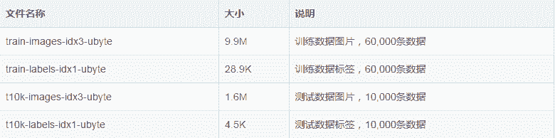

# 专栏 | 在 PaddlePaddle 上实现 MNIST 手写体数字识别

 **机器之心专栏

****来源：百度 PaddlePaddle****

> 不久之前，机器之心联合百度推出 PaddlePaddle 专栏，为想要学习这一平台的技术人员推荐相关教程与资源。在[框架解析](http://mp.weixin.qq.com/s?__biz=MzA3MzI4MjgzMw==&mid=2650739530&idx=3&sn=32bdfdd26a53210ea78097359f67fb65&chksm=871ad734b06d5e22029292b0a38f3a2c5e46b8c9f55d79865782daf7441eace6ea336831a7a8&scene=21#wechat_redirect)和[安装教程](http://mp.weixin.qq.com/s?__biz=MzA3MzI4MjgzMw==&mid=2650739772&idx=3&sn=1d1a6cadfa042064928cab3191942df7&chksm=871ad042b06d59548a5406b8e45d05b48671e7cfd77c7633f6fb557ef783a2fb76cacbecf7a0&scene=21#wechat_redirect)的介绍之后，本次专栏将教你如何在 PaddlePaddle 上实现 MNIST 手写数字识别。

**目录**

*   数据集的介绍

*   定义神经网络

*   开始训练模型

*   导入依赖包

*   初始化 Paddle

*   获取训练器

*   开始训练

*   使用参数预测

*   初始化 PaddlePaddle

*   获取训练好的参数

*   读取图片

*   开始预测

*   所有代码

*   项目代码

*   参考阅读

**数据集的介绍**

如题目所示, 本次训练使用到的是 MNIST 数据库的手写数字, 这个数据集包含 60,000 个示例的训练集以及 10,000 个示例的测试集. 图片是 28x28 的像素矩阵，标签则对应着 0~9 的 10 个数字。每张图片都经过了大小归一化和居中处理. 该数据集的图片是一个黑白的单通道图片, 其中图片如下: 


该数据集非常小, 很适合图像识别的入门使用, 该数据集一共有 4 个文件, 分别是训练数据和其对应的标签, 测试数据和其对应的标签. 文件如表所示:



这个数据集针对 170 多 M 的 CIFAR 数据集来说, 实在是小太多了. 这使得我们训练起来非常快, 这能一下子激发开发者的兴趣。

在训练时, 开发者不需要单独去下载该数据集,PaddlePaddle 已经帮我们封装好了, 在我们调用 paddle.dataset.mnist 的时候, 会自动在下载到缓存目录/home/username/.cache/paddle/dataset/mnist 下, 当以后再使用的时候, 可以直接在缓存中获取, 就不会去下载了。

**定义神经网络**

我们这次使用的是卷积神经网络 LeNet-5，官方一共提供了 3 个分类器，分别是 Softmax 回归，多层感知器，卷积神经网络 LeNet-5，在图像识别问题上，一直是使用卷积神经网络较多。我们创建一个 cnn.py 的 Python 文件来定义一个 LeNet-5 神经网络，代码如下：

```py
# coding=utf-8
import paddle.v2 as paddle

# 卷积神经网络 LeNet-5, 获取分类器
def convolutional_neural_network():
 # 定义数据模型, 数据大小是 28*28, 即 784
 img = paddle.layer.data(name="pixel",
 type=paddle.data_type.dense_vector(784))
 # 第一个卷积--池化层
 conv_pool_1 = paddle.networks.simple_img_conv_pool(input=img,
 filter_size=5,
 num_filters=20,
 num_channel=1,
 pool_size=2,
 pool_stride=2,
 act=paddle.activation.Relu())
 # 第二个卷积--池化层
 conv_pool_2 = paddle.networks.simple_img_conv_pool(input=conv_pool_1,
 filter_size=5,
 num_filters=50,
 num_channel=20,
 pool_size=2,
 pool_stride=2,
 act=paddle.activation.Relu())
 # 以 softmax 为激活函数的全连接输出层，输出层的大小必须为数字的个数 10
 predict = paddle.layer.fc(input=conv_pool_2,
 size=10,
 act=paddle.activation.Softmax())
 return predict 
```

**开始训练模型**

我们创建一个 train.py 的 Python 文件来做训练模型。

**导入依赖包**

首先要先导入依赖包, 其中就包含了最重要的 PaddlePaddle 的 V2 包

```py
# encoding:utf-8
import os
import sys
import paddle.v2 as paddle
from cnn import convolutional_neural_network 
```

**初始化 Paddle**

然后我们创建一个类, 再在类中创建一个初始化函数, 在初始化函数中来初始化我们的 PaddlePaddle，在初始化 PaddlePaddle 的时候，就要指定是否使用 GPU 来训练我们的模型，同时使用多少个线程来训练。

```py
class TestMNIST:
 def __init__(self):
 # 该模型运行在 CUP 上，CUP 的数量为 2
 paddle.init(use_gpu=False, trainer_count=2) 
```

**获取训练器**

通过上面一步获取的分类器和图片的标签来生成一个损失函数, 通过损失函数就可以创建训练参数了。

之后也要创建一个优化方法，这个优化方法是定义学习率等等在训练中的处理。

最后通过训练参数，优化方法，损失函数这 3 个参数创建训练器

```py
# *****************获取训练器********************************
def get_trainer(self):

 # 获取分类器
 out = convolutional_neural_network()

 # 定义标签
 label = paddle.layer.data(name="label",
 type=paddle.data_type.integer_value(10))

 # 获取损失函数
 cost = paddle.layer.classification_cost(input=out, label=label)

 # 获取参数
 parameters = paddle.parameters.create(layers=cost)

 """
 定义优化方法
 learning_rate 迭代的速度
 momentum 跟前面动量优化的比例
 regularzation 正则化, 防止过拟合
 :leng re
 """
 optimizer = paddle.optimizer.Momentum(learning_rate=0.1 / 128.0,
 momentum=0.9,
 regularization=paddle.optimizer.L2Regularization(rate=0.0005 * 128))
 '''
 创建训练器
 cost 损失函数
 parameters 训练参数, 可以通过创建, 也可以使用之前训练好的参数
 update_equation 优化方法
 '''
 trainer = paddle.trainer.SGD(cost=cost,
 parameters=parameters,
 update_equation=optimizer)
 return trainer 
```

**开始训练**

最后就可以的开始训练了, 通过上一步得到的训练器开始训练, 训练的时候要用到 3 个参数. 

第一个是训练数据, 这个训练数据就是我们的 MNIST 数据集。

第二个是训练的轮数, 表示我们要训练多少轮, 次数越多准确率越高, 最终会稳定在一个固定的准确率上。

第三个是训练过程中的一些事件处理, 比如会在每个 batch 打印一次日志, 在每个 pass 之后保存一下参数和测试一下测试数据集的预测准确率。

```py
# *****************开始训练********************************
def start_trainer(self):
 # 获取训练器
 trainer = self.get_trainer()

 # 定义训练事件
 def event_handler(event):
 lists = []
 if isinstance(event, paddle.event.EndIteration):
 if event.batch_id % 100 == 0:
 print "\nPass %d, Batch %d, Cost %f, %s" % (
 event.pass_id, event.batch_id, event.cost, event.metrics)
 else:
 sys.stdout.write('.')
 sys.stdout.flush()
 if isinstance(event, paddle.event.EndPass):
 # 保存训练好的参数
 model_path = '../model'
 if not os.path.exists(model_path):
 os.makedirs(model_path)
 with open(model_path + "/model.tar", 'w') as f:
 trainer.save_parameter_to_tar(f=f)

 result = trainer.test(reader=paddle.batch(paddle.dataset.mnist.test(), batch_size=128))
 print "\nTest with Pass %d, Cost %f, %s\n" % (event.pass_id, result.cost, result.metrics)
 lists.append((event.pass_id, result.cost, result.metrics['classification_error_evaluator']))

 # 获取数据
 reader = paddle.batch(paddle.reader.shuffle(paddle.dataset.mnist.train(), buf_size=20000),
 batch_size=128)
 '''
 开始训练
 reader 训练数据
 num_passes 训练的轮数
 event_handler 训练的事件, 比如在训练的时候要做一些什么事情
 '''
 trainer.train(reader=reader,
 num_passes=100,
 event_handler=event_handler) 
```

然后在 main 入口中调用我们的训练函数, 就可以训练了

```py
if __name__ == "__main__":
 testMNIST = TestMNIST()
 # 开始训练
 testMNIST.start_trainer() 
```

在训练过程中会输出这样的日志：

```py
Pass 0, Batch 0, Cost 2.991905, {'classification_error_evaluator': 0.859375}
...................................................................................................
Pass 0, Batch 100, Cost 0.891881, {'classification_error_evaluator': 0.3046875}
...................................................................................................
Pass 0, Batch 200, Cost 0.309183, {'classification_error_evaluator': 0.0859375}
...................................................................................................
Pass 0, Batch 300, Cost 0.289464, {'classification_error_evaluator': 0.078125}
...................................................................................................
Pass 0, Batch 400, Cost 0.131645, {'classification_error_evaluator': 0.03125}
....................................................................
Test with Pass 0, Cost 0.117626, {'classification_error_evaluator': 0.03790000081062317} 
```

**使用参数预测**

我们创建一个 infer.py 的 Python 文件，用来做模型预测的。

**初始化 PaddlePaddle**

在预测的时候也是要初始化 PaddlePaddle 的

```py
class TestMNIST:
 def __init__(self):
 # 该模型运行在 CUP 上，CUP 的数量为 2
 paddle.init(use_gpu=False, trainer_count=2) 
```

**获取训练好的参数**

在训练的时候, 我们在 pass 训练结束后都会保存他的参数, 保存这些参数我们现在就可以使用它来预测了

```py
# *****************获取参数********************************
def get_parameters(self):
 with open("../model/model.tar", 'r') as f:
 parameters = paddle.parameters.Parameters.from_tar(f)
 return parameters 
```

**读取图片**

在使用图片进行预测时，我们要对图片进行处理,，处理成跟训练的图片一样，28*28 的灰度图，最后图像会转化成一个浮点数组。

```py
# *****************获取你要预测的参数********************************
def get_TestData(self):
 def load_images(file):
 # 对图进行灰度化处理
 im = Image.open(file).convert('L')
 # 缩小到跟训练数据一样大小
 im = im.resize((28, 28), Image.ANTIALIAS)
 im = np.array(im).astype(np.float32).flatten()
 im = im / 255.0
 return im

 test_data = []
 test_data.append((load_images('../images/infer_3.png'),))
 return 
```

**开始预测**

通过传入分类器，训练好的参数，预测数据这个 3 个参数就可以进行预测了。这个分类器就是我们之前定义的。

```py
# *****************使用训练好的参数进行预测********************************
def to_prediction(self, out, parameters, test_data):

 # 开始预测
 probs = paddle.infer(output_layer=out,
 parameters=parameters,
 input=test_data)
 # 处理预测结果并打印
 lab = np.argsort(-probs)
 print "预测结果为: %d" % lab[0][0] 
```

在 main 入口中调用预测函数

```py
if __name__ == "__main__":
    testMNIST = TestMNIST()
    out = convolutional_neural_network()
    parameters = testMNIST.get_parameters()
    test_data = testMNIST.get_TestData()
    # 开始预测
    testMNIST.to_prediction(out=out, parameters=parameters, test_data=test_data) 
```

输出的预测结果是:

```py
预测结果为: 3 
```

**所有代码**

infer.py 代码：

```py
# coding=utf-8
import paddle.v2 as paddle

# 卷积神经网络 LeNet-5, 获取分类器
def convolutional_neural_network():
 # 定义数据模型, 数据大小是 28*28, 即 784
 img = paddle.layer.data(name="pixel",
 type=paddle.data_type.dense_vector(784))
 # 第一个卷积--池化层
 conv_pool_1 = paddle.networks.simple_img_conv_pool(input=img,
 filter_size=5,
 num_filters=20,
 num_channel=1,
 pool_size=2,
 pool_stride=2,
 act=paddle.activation.Relu())
 # 第二个卷积--池化层
 conv_pool_2 = paddle.networks.simple_img_conv_pool(input=conv_pool_1,
 filter_size=5,
 num_filters=50,
 num_channel=20,
 pool_size=2,
 pool_stride=2,
 act=paddle.activation.Relu())
 # 以 softmax 为激活函数的全连接输出层，输出层的大小必须为数字的个数 10
 predict = paddle.layer.fc(input=conv_pool_2,
 size=10,
 act=paddle.activation.Softmax())
 return predict 
```

train.py 代码：

```py
# encoding:utf-8
import os
import sys
import paddle.v2 as paddle
from cnn import convolutional_neural_network

class TestMNIST:
 def __init__(self):
 # 该模型运行在 CUP 上，CUP 的数量为 2
 paddle.init(use_gpu=False, trainer_count=2)

 # *****************获取训练器********************************
 def get_trainer(self):

 # 获取分类器
 out = convolutional_neural_network()

 # 定义标签
 label = paddle.layer.data(name="label",
 type=paddle.data_type.integer_value(10))

 # 获取损失函数
 cost = paddle.layer.classification_cost(input=out, label=label)

 # 获取参数
 parameters = paddle.parameters.create(layers=cost)

 """
 定义优化方法
 learning_rate 迭代的速度
 momentum 跟前面动量优化的比例
 regularzation 正则化, 防止过拟合
 :leng re
 """
 optimizer = paddle.optimizer.Momentum(learning_rate=0.1 / 128.0,
 momentum=0.9,
 regularization=paddle.optimizer.L2Regularization(rate=0.0005 * 128))
 '''
 创建训练器
 cost 分类器
 parameters 训练参数, 可以通过创建, 也可以使用之前训练好的参数
 update_equation 优化方法
 '''
 trainer = paddle.trainer.SGD(cost=cost,
 parameters=parameters,
 update_equation=optimizer)
 return trainer

 # *****************开始训练********************************
 def start_trainer(self):
 # 获取训练器
 trainer = self.get_trainer()

 # 定义训练事件
 def event_handler(event):
 lists = []
 if isinstance(event, paddle.event.EndIteration):
 if event.batch_id % 100 == 0:
 print "\nPass %d, Batch %d, Cost %f, %s" % (
 event.pass_id, event.batch_id, event.cost, event.metrics)
 else:
 sys.stdout.write('.')
 sys.stdout.flush()
 if isinstance(event, paddle.event.EndPass):
 # 保存训练好的参数
 model_path = '../model'
 if not os.path.exists(model_path):
 os.makedirs(model_path)
 with open(model_path + "/model.tar", 'w') as f:
 trainer.save_parameter_to_tar(f=f)
 # 使用测试进行测试
 result = trainer.test(reader=paddle.batch(paddle.dataset.mnist.test(), batch_size=128))
 print "\nTest with Pass %d, Cost %f, %s\n" % (event.pass_id, result.cost, result.metrics)
 lists.append((event.pass_id, result.cost, result.metrics['classification_error_evaluator']))

 # 获取数据
 reader = paddle.batch(paddle.reader.shuffle(paddle.dataset.mnist.train(), buf_size=20000),
 batch_size=128)
 '''
 开始训练
 reader 训练数据
 num_passes 训练的轮数
 event_handler 训练的事件, 比如在训练的时候要做一些什么事情
 '''
 trainer.train(reader=reader,
 num_passes=100,
 event_handler=event_handler)

if __name__ == "__main__":
 testMNIST = TestMNIST()
 # 开始训练
 testMNIST.start_trainer() 
```

infer.py 代码：

```py
# encoding:utf-8
import numpy as np
import paddle.v2 as paddle
from PIL import Image
from cnn import convolutional_neural_network

class TestMNIST:
    def __init__(self):
        # 该模型运行在 CUP 上，CUP 的数量为 2
        paddle.init(use_gpu=False, trainer_count=2)

    # *****************获取参数********************************
    def get_parameters(self):
        with open("../model/model.tar", 'r') as f:
            parameters = paddle.parameters.Parameters.from_tar(f)
        return parameters

    # *****************获取你要预测的参数********************************
    def get_TestData(self ,path):
        def load_images(file):
            # 对图进行灰度化处理
            im = Image.open(file).convert('L')
            # 缩小到跟训练数据一样大小
            im = im.resize((28, 28), Image.ANTIALIAS)
            im = np.array(im).astype(np.float32).flatten()
            im = im / 255.0
            return im

        test_data = []
        test_data.append((load_images(path),))
        return test_data

    # *****************使用训练好的参数进行预测********************************
    def to_prediction(self, out, parameters, test_data):

        # 开始预测
        probs = paddle.infer(output_layer=out,
                             parameters=parameters,
                             input=test_data)
        # 处理预测结果并打印
        lab = np.argsort(-probs)
        print "预测结果为: %d" % lab[0][0]

if __name__ == "__main__":
    testMNIST = TestMNIST()
    # 开始预测
    out = convolutional_neural_network()
    parameters = testMNIST.get_parameters()
    test_data = testMNIST.get_TestData('../images/infer_3.png')
    testMNIST.to_prediction(out=out, parameters=parameters, test_data=test_data) 
```

**项目代码**

GitHub 地址:https://github.com/yeyupiaoling/LearnPaddle

**参考阅读**

*   [专栏 | 百度深度学习平台 PaddlePaddle 框架解析](http://mp.weixin.qq.com/s?__biz=MzA3MzI4MjgzMw==&mid=2650739530&idx=3&sn=32bdfdd26a53210ea78097359f67fb65&chksm=871ad734b06d5e22029292b0a38f3a2c5e46b8c9f55d79865782daf7441eace6ea336831a7a8&scene=21#wechat_redirect)

*   [专栏 | 新手入门？一步一步教你如何安装 PaddlePaddle](http://mp.weixin.qq.com/s?__biz=MzA3MzI4MjgzMw==&mid=2650739772&idx=3&sn=1d1a6cadfa042064928cab3191942df7&chksm=871ad042b06d59548a5406b8e45d05b48671e7cfd77c7633f6fb557ef783a2fb76cacbecf7a0&scene=21#wechat_redirect)

****本文为机器之心专栏，**转载请联系本公众号获得授权****。**

✄------------------------------------------------

**加入机器之心（全职记者/实习生）：hr@jiqizhixin.com**

**投稿或寻求报道：editor@jiqizhixin.com**

**广告&商务合作：bd@jiqizhixin.com****