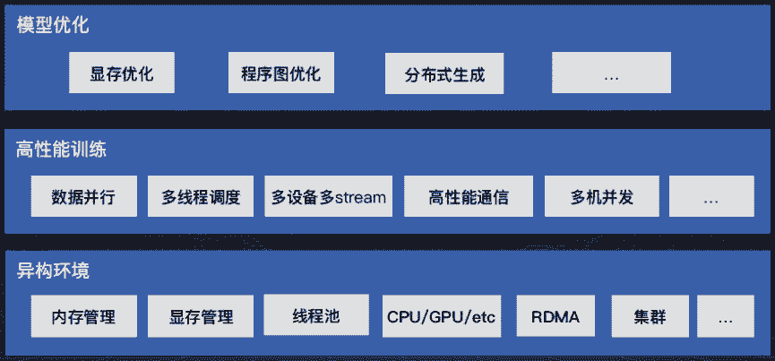
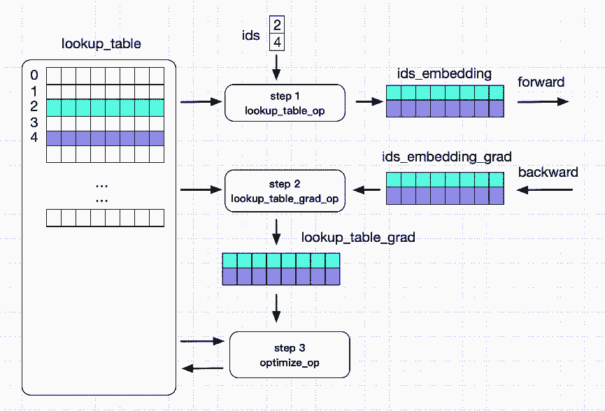

# 专栏 | 百度 PaddlePaddle 的新特性与大规模稀疏数据分布式模型训练

机器之心专栏

**来源：百度 PaddlePaddle**

> 7 月 5 日，第二届百度 AI 开发者大会落下帷幕。在今年的开发者大会上，百度宣布了一系列[重磅内容](http://mp.weixin.qq.com/s?__biz=MzA3MzI4MjgzMw==&mid=2650744717&idx=1&sn=cbe8ffd27d726d4263f4bb1be13ba247&chksm=871ae3f3b06d6ae5277c6f6f1a895114759e6600bdc880eb9e16b001e001337c0f522f7cee3f&scene=21#wechat_redirect)：全球首款 L4 自动驾驶巴士「阿波龙」量产下线；发布全功能云端 AI 芯片「昆仑」；发布百度大脑 3.0；推出百度智能小程序等。此外，百度还发布了 PaddlePaddle3.0，升级核心框架，提供 EasyDL 快速应用平台、AutoDL 网络结构自动化设计，以及 AI Studio 在线实训平台。

百度深度学习框架 PaddlePaddle 自 2016 年开源以来，受到了业界的广泛关注，PaddlePaddle 社区更是汇集了一大批 AI 技术开发者。开源的模式使 PaddlePaddle 在近两年取得了快速发展和升级，2017 年 11 月百度发布了更细粒度的新一代深度学习框架——PaddlePaddleFluid，在今年大会上百度发布 PaddlePaddle3.0。

在深度学习前沿技术与工业应用公开课分论坛，百度的专家讲师团围绕 PaddlePaddle 从深度学习的语义计算技术、百度视觉技术、OCR 迁移至 Paddle-Fluid 版本的工程实例，到 PaddlePaddle 的新特性、大规模稀疏数据分布式模型训练等，为参会者进行了详细讲解。本文节选了 PaddlePaddle 的新特性与大规模稀疏数据分布式模型训练两部分部分内容。

*百度自主研发的深度学习框架 PaddlePaddle*

**深度学习框架 PaddlePaddle 的新特性与炼成之路**

 **[`v.qq.com/iframe/preview.html?vid=o0730r6bhdo&width=500&height=375&auto=0`](https://v.qq.com/iframe/preview.html?vid=o0730r6bhdo&width=500&height=375&auto=0)** 

PaddlePaddle 能全面支撑 Modeling、Training 和 Serving 下的各种 AI 场景。

*Paddle Modeling*

Paddle Modeling 涵盖数百种计算 operator 和 layer 组网；支持序列变长，动态 batch size；Pre-trained 模型开放。

*Paddle Training*

Paddle Training 支持同步，异步分布式；多线程，多 GPU，多 stream 异构并行计算；ring，trainer-pserver 拓扑。

*Paddle Serving*

Paddle Serving 能实现服务器端快速部署；汇编层高度性能优化；移动端 Linux-ARM/iOS/Android/DuerOS 多终端支持。

PaddlePaddle Serving 灵活适配多种预测引擎：

*   灵活融合原生计算 operator 与第三方预测引擎；

*   默认引擎，快速可用；

*   兼容业内流行预测引擎 TensorRT；

*   Anakin，百度开源预测引擎，性能优异。

PaddlePaddle Serving 的默认引擎：

*   统一的 training 与 serving 的基础架构和实现，训后模型快速部署。

*   多 pass 进行图优化。

*   CPU MKLDNN 高性能加速。

*   GPU 可以混合调度 TensorRT。

*PaddlePaddle 核心框架*

PaddlePaddle Fluid 版本主要包含四大组成部分：Python API；模型改写与优化；训练 Runtime；CPU/GPU 支持。

Python API 支持图像模型、NLP 模型、语音模型、推荐模型等各类模型。Python API 大致可分为组网类底层 API 以及执行类底层 API 两大类别。组网类底层 API 包含通用、控制、计算、优化、IO 等类型的 API。执行类底层 API 包含训练、预测、分布式等 API。

**组网类 API**

*   Variables：Paddle 中的变量，可以是 Tensor，可以是 Parameter，也可以是 RPCClient。概念类似高级语言中的变量，可以有不同类型。

*   Layers：Paddle 中，用户配置模型的基础模块，Layer 表示一个或者一组紧密关联的计算，Layers 可以通过输入输出连接起来。

*   Block：Block 表示一组连续的计算逻辑，通常是一个或多个顺序 Layer 组成。通常主模型是一个 block0，另外在 control flow 中，比如 while, iflese，也会单独形成一个子 block。

*   Control Flow：Paddle 支持 if-else, while, switch 等编程语言中常见的 control flow。以确保模型的灵活表达。control flow 通常以 block 的形式存在。

*   Program：包含了 1 个或者多个 block，表示一个完整的模型执行单元。执行器需要完整的执行 Program，并保证读写关系符合用户的预期。

**执行类 API**

*执行类 API*

*执行类 API*

*示例*

**训练 Runtime**

*训练 Runtime*

**显存优化**

*   InPlace Activation

*   反向不需要 input，并且输出和输入的 tensor 一致，可以直接 overwrite input，节省显存开销。

*   Memory Optimizer

*   Live variable analysis：分析每个 Op 的 live-in 和 live-out，找到可以将来被复用的 candidate。在将来的 op output 中，如果有 match candidate 的，复用 candidate，节省显存分配。

**多卡并行-SSA Graph**

*   将模型 program 转换成一个可并发执行的 Intermediate Representation (IR)；利用 Static Single Assignment 为 variable 加 version，得到一个正确的依赖关系；Build Pass 中插入通信节点和额外的依赖关系。

*   基于图依赖的执行：Input ready 的所有 operator 可以并发执行；Operators 在多个 GPU 上数据并行执行；多卡 gradient 聚合，确保数据并行中参数一致。

*多卡并行-Profile*

**多机分布式**

多机分布式支持 ring、pserver 两种模式。ring：自动插入多机 communicator，多机同步训练，支持高性能 RDMA 通信。pserver：拆分成 trainer program 和 pserver program。支持同步和异步的分布式训练。Trainer 端多线程异步发送 gradient；Pserver 端多线程异步 apply optimization。

用户 Focus Modeling, 框架自动多机化部署：

*   发现 optimizer operators，parameters, gradients。

*   split 和 assign 他们到 parameter server 上。

*   在 trainer 和 parameter server 上插入发送和接收的通信节点。

*   生成在 trainer 执行的 program。

*   生成在 parameter server 执行的 program。

多机分布式的通信和集群：

*   支持 MPI, RPC 等通信方式。

*   RPC 将来会换成 brpc，并提供原生的 RPC+RDMA 支持，极大提高通信效率。

*   支持 Kubernetes 集群部署。

多机分布式下的容错：

*   trainer 或者 pserver failure 后可以重启恢复训练。

*   即将支持 pserver 端的分布式 checkpoint 和恢复，支持大规模 embedding。

**大规模稀疏数据分布式模型训练。**

[`v.qq.com/iframe/preview.html?vid=n0730rr5m6y&width=500&height=375&auto=0`](https://v.qq.com/iframe/preview.html?vid=n0730rr5m6y&width=500&height=375&auto=0)

在互联网场景中，亿级的用户每天产生着百亿级的用户数据，百度的搜索和推荐系统是大规模稀疏数据分布式模型训练的主要应用场景。

如何利用这些数据训练出更好的模型来给用户提供服务，对机器器学习框架提出了很高的要求。主要包括：

*   样本数量大，单周 20T+。

*   特征维度多达千亿甚至万亿。

*   T 级别，参数大。

*   小时级更新，时效要求高。

主要问题包括三个方面：

1\. 在千亿 feature 的时候，一个宽度 8 的 embedding table 的参数量 2980.23GB。

2\. Feature ID 使用 hash 算法计算，分布在 int64 范围内，难以预先确定。

3\. 输入特征非常稀疏。(数百/千亿)

分布式查找表（Distribute Lookup Table）：

1\. 参数量大：针对数据特点的数据结构 SelectedRows(key-value)；分布式存储；Pserver 端 save/load。

2\. Feature ID 不确定：Auto Growth。

3\. 输入特征稀疏：参数 Prefetch。

*系统整体架构一*

*系统整体架构二*

**应用优化**

*   Model Average Optimizer：训练中通过窗⼝累计历史 parameter，在预测时使用 average 后的 parameter，整体提高预测的精度。

*   序列变长：Batch 中序列长度不一，计算时无需填充。

*   动态 Batch：训练中，每个 iteration 的 batch size 可变。

最后，为了更好的帮助开发者学习深度学习，PaddlePaddle 建立了覆盖线上、线下的全套课程及培训。PaddlePaddle 公开课拥有 10 大系列、400 节课程、累计学习时间 3000 分钟的在线课程体系，可以覆盖开发者的学习全阶段。**

****本文为机器之心专栏，**转载请联系本公众号获得授权****。**

✄------------------------------------------------

**加入机器之心（全职记者 / 实习生）：hr@jiqizhixin.com**

**投稿或寻求报道：**content**@jiqizhixin.com**

**广告 & 商务合作：bd@jiqizhixin.com**