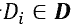

# 专栏 | 云脑科技-实习僧文本匹配模型及基于百度 PaddlePaddle 的应用

机器之心发布

****云脑科技****

**作者：****算法工程师 ****李瀚立**

> 作者简介：李瀚立，本科毕业于武汉大学数学与统计学院，普渡大学统计硕士，达特茅斯学院计算机硕士。曾就职于 Amazon AWS，IBM Cloud。现为云脑科技算法团队成员。

**1\. 上下文理解理论基础**

在语言模型中，当前句子段落里的语义，语法，在很大程度上决定了下一个词是什么，如何表达。对一个由 n 个词组成的语句，传统语言模型通过对条件概率 进行建模，来估计整个语句的概率分布：

然而很多时候稀疏的数据，对上下文长度有限的覆盖，离散的概率分布空间局限了传统语言模型的效果。在深度学习中，基于词向量和循环神经网络 (RNN) 的语言模型很好的解决了这些问题。但普通的 RNN，受限于梯度消失和梯度饱和，在训练时更新信息可能传播不到序列所有的位置上。因此对于较长的语句，RNN 并不能很好的整合上文信息。GRU 和 LSTM 这两种特殊的 RNN，在每一个循环单元内引入了「门」的结构，如输入门，输出门，遗忘门，等等。这些特殊的结构避免了梯度在循环单元之间传播时，必须通过非线性激活函数的现象。从而能够保证信息在长距离上的更新，进而使得当前的词能很好的承接上文。普通 RNN 的语言模型在训练时速度较慢，GRU/LSTM 在普通 RNN 的基础上，由于其复杂的循环单元结构，更加降低了执行速度。在自然语言处理的很多问题，比如句法分析，命名实体识别中，需要考虑一个词在上下文中的含义和作用。因此，这些问题在隐藏层往往需要正向传播，反向传播的两条 GRU/LSTM 链。在工业级生产上，由于大数据集的普遍性，以及对速度的需求，局限了 GRU/LSTM 的实际应用。

卷积神经网络 (CNN) 一直以来的主要应用都是在基于图像的深度学习算法上。近些年 CNN 在自然语言处理上的应用证明，CNN 系列的算法可以高效的对语言进行建模，在更快的执行速度下，达到或超过 GRU/LSTM 的效果。以短文本分类为例，CNN 在这一问题上的应用如下图所示：

输入层语句可以看作是一个文本长度为 7，词向量维度为 5 的文本「矩阵」。对于 3 组长度分别为 {2, 3, 4} 的上下文，每组有 2 个卷积核。在图像的应用中，卷积核的长宽一般均小于图像矩阵，而在文本的应用中，卷积核长度虽然小于文本矩阵的长度，但其宽度一定等于文本矩阵宽度，即词向量的维度。于是卷积核只在长度的方向上做卷积。以上下文长度为 2 的一个卷积核 K 为例，在如上图所示的没有填充的文本矩阵下，K 分别作用于「I like」,「like this」,「this movie」,「movie very」,「very much」,「much !」，6 个子矩阵。K 将每个映射为一个实数后，得到一个 6 维向量 U，U 可以看作一个局部上下文特征向量。之后将最大池化层作用于 U 上，过滤掉该局部上下文里不重要的特征，只保留最重要的一个。对于上面 6 个卷积内核，都完成这样的操作后，构成可以代表整个文本的全局上下文特征向量 V。最后，对于文本分类问题，将 softmax 函数作用于 V 上，作为整个网络的输出层。

对于较长的文本，单个卷积-最大池化层也许不能够完全覆盖整个文本，因此对于全局上下文特征的提取，就需要多个卷积层的叠加。对于 RNN 来说，当前的循环单元在很大程度上决定于之前的循环单元。而 CNN 的卷积核独立作用于子文本窗，因此可以并行同步处理，进而大大地提高了算法的执行速度。

**2\. 文本匹配模型理论基础**

文本匹配顾名思义，就是对给定的文本，在文本库中找到与其最为相似的匹配文本。文本匹配较为广泛的一个应用实例是搜索引擎。很多搜索引擎对查询文本进行关键词抽取，通过关键词来找到文本库中最为相似的文本进行返回。然而很多时候，同一个意思在不同的环境下有很多不同的表达方式，所以这种基于词法的匹配在广义的文本匹配应用中也就很可能出现不准确的现象。从这个角度出发，便有了基于语义的模型，比如 Latent Semantic Analysis (LSA)，Latent Dirichlet Allocation (LDA)，Semantic Hashing，等等。然而这些语义模型有着非监督性学习的性质。比如 LSA 是对词条-文本共生矩阵做 SVD 降维，在低维空间中用聚类或余弦相似度寻找文本间的相似性，但并没有特别明确具体的目标函数以及匹配度评测标准；Semantic Hashing 是基于 Restricted Boltzman Machine，将文本转化为形同内存地址的 0-1 形式，它的参数估计过程不是以区分相关文本和不相关文本来进行最优化。

Deep Structured Semantic Model(DSSM) 是语义层面上的监督性学习文本匹配模型。DSSM 通过深度神经网络单元 (DNN Unit)，将查询文本 Q 和匹配文本 D 映射为同一语义空间下的语义向量对，并用 的余弦相似度来表达 Q 与 D 的匹配度。因此对于给定的 Q，以及潜在匹配候选文本，可通过得到的余弦相似度来进行匹配度排序。DSSM 的结构如下图所示：

x 为输入向量，y 为语义向量，为 DNN Unit 的 隐藏层，为对应隐藏层的权重参数与偏差参数。具体地，

其中，g 为激活函数。一对 Q,D 文本的相似度定义为：

训练数据集中，对于每一个 Q，都有对应的候选匹配文本集 D，以及在 D 中被实际选取的单个匹配文本。对于每一个，有匹配条件概率

其中平滑因子γ是可调试的 hyper parameter. 在训练的时候，我们的目标函数为：

，即交叉熵损失函数，其中。之后便可用基于梯度下降的优化算法来得到参数的估计。

一些时候，在训练数据集中，对于每一个 Q，对应的候选匹配文本集 D 中的文本是根据匹配程度排好序的。这种情况下，对于任意两个候选文本，有

如果真实的排序，那么真实概率 ，这个时候的损失函数为：

可以看出是上述全局单一匹配下的一种特殊情况。

虽然 DSSM 相比较于之前的匹配模型有着显著的效果提升，但是 DSSM 的输入是普通的词哈希向量，并且其 DNN Unit 是叠加的全连接层，并没有考虑文本的上下文联系。

Convolutional DSSM(CDSSM) 在 DSSM 的词哈希向量的基础上，引入了卷积层和最大池化层，进行上下文显著特征提取，并将提取的特征通过非线性映射得到语义向量 (semantic feature)，C-DSSM 的 DNN Unit 的结构如下图所示：

同第一部分所描述的 CNN 作用原理，卷积层会考虑每一个上下文窗口中的词哈希向量，再将此向量映射为较低维的局部上下文向量。对于一系列相关的局部上下文向量，最大池化层可以过滤掉不重要的文本特征，只保留最显著的，形成全局上下文向量。进而在 DSSM 的基础上，更进一步的考虑并联系了上下文的语义特征，达到更好的文本匹配效果。

**3\. 云脑科技-实习僧文本匹配模型以及在百度 PaddlePaddle 中的实现**

云脑科技的 Gated Query Model(GQM)，是基于 CNN，DSSM，C-DSSM，等算法的文本匹配模型。GQM 在上述模型构架的基础上，优化了对全局语义特征的提取，以及查询文本与候选匹配文本的语义特征交互，进而达到更快速、单文本上下文特征提取范围更广、文本对语义特征交互最大化、同时高准确匹配的效果。GQM 的实现是在百度的 PaddlePaddle 深度学习框架中进行的，现运用于合作伙伴实习僧的项目中。

PaddlePaddle 于 2016 年开源，对自己的定义是「easy-to-use, efficient, flexible, scalable」. PaddlePaddle 封装了许多经典的神经网络算法，因此，用 PaddlePaddle 实现一些基于经典结构，较为复杂但效果很好的神经网络时，就十分方便。比如在机器翻译中，一个比较流行的模型是带有注意力机制的编码-解码器。在编码器中，输入为词向量或独热向量，隐藏层为正向传播的循环神经网络 (F-RNN)，以及反向传播的 B-RNN，循环单元可以是 GRU 或者 LSTM。对每一个输入词向量，对应位置上正向反向两个循环单元的输出结合起来，得到对应词向量的隐含状态。在解码器中，隐藏层由一个正向传播的 F-RNN 构成，其每一个循环单元 的输入取决于 的输出，以及 所对应的位于编码器中的上下文 。而 , 即注意力机制是通过对编码器中各时刻的隐含状态 进行加权平均实现的。

在注意力模型的思想中，任意两个目标语言和源语言词间均存在一定的关联，且这个关联强度是由模型计算得到的实数。在 PaddlePaddle 里，对这些重要的组成部分，都有对应的 Python API 可以调用。比如「paddle.layer」的「paddle.layer.data」,「paddle.layer.embedding」,「paddle.layer.fc」;「paddle.networks」下的「paddle.networks.gru_unit」,「paddle.networks.simple_attention」，等等。通过这些组成部分来实现上面所描述的机器翻译模型只需要简单的 100 行 python 代码。在模型训练的过程中，PaddlePaddle 同样封装了丰富的 API 比如各种 optimizer，以及实现 callback，early stopping 机制的方法，等等。

虽然 PaddlePaddle 的 Python API 覆盖了大部分的主流神经网络结构，但在模型开发中，对应于实际的问题，仍然需要自己实现神经网络组成部分。在 TensorFlow 中，这些新的构架可以直接在 Python 里通过 TensorFlow 的基础单元进行实现。在 PaddlePaddle 里，新的 layer，operator，必须通过较为底层的 C++来实现，而这些单元中对于梯度计算的 forward/backward 结构设计和 Caffe 又比较类似。新的单元实现之后，需要封装相应的 Python 接口，通过 make，编译，组件测试，才能在自己的网络结构中使用这个新的 layer/operator. 这样的好处是更快的执行速度。

在数据读取方面，PaddlePaddle 需要开发者实现 dataprovider，并在 config 文件中调用这个 dataprovider。在 TensorFlow 里，并没有这样比较直接的读取机制。TensorFlow 中普遍使用的 feed_dict/placeholder 是单线程运行，读取速度较慢。如果要实现多线程快速的数据输入，数据的批量读取，数据读取顺序重洗等功能，开发者必须预先将原始数据序列化成 tfrecords 格式，再从序列化的数据读取到定义的 TensorFlow 模型图中。而在 PaddlePaddle 中，实现如同 tfrecords 的读取功能并不需要预先的序列化，只用在 dataprovider 里实现 reader 和相应的 reader decorator 即可。

总体上而言，PaddlePaddle 可以很好的适用于实际生产线而不单单是研发模型原型。PaddlePaddle 支持模型并行，数据并行，多机多卡，多种集群方式，即使在缺少 GPU 的情况下也可以在较大的数据集上进行深度模型训练。在云脑科技与合作伙伴的众多项目中，既有来自于传统行业的大数据集，也有对实时行为的预测，智能推荐，等多种需求。PaddlePaddle 帮助云脑科技的工程师有效的利用计算资源，实现模型研发，迭代以及实际应用。 

参考文献：

P. Huang, X. He., J. Gao, L. Deng, A. Acero, L. Heck. Learning Deep Structured Semantic Models for web search using clickthrough data. In CIKM, 2013

Y. Shen, X. He, J. Gao, L. Deng, G. Mesnil. Learning semantic representations using convolutional neural networks for web search. Models for web search using clickthrough data. In Proceedings of the 23rd International Conference on World Wide Web, 2014

Y. Zhang, B.C. Wallace. A sensitivity analysis of (and practitioners' guide to) convolutional neural networks for sentence classification. arXiv:1510.03820, 2016

****本文为机器之心专栏，**转载请联系本公众号获得授权****。**

✄------------------------------------------------

**加入机器之心（全职记者/实习生）：hr@jiqizhixin.com**

**投稿或寻求报道：**content**@jiqizhixin.com**

**广告&商务合作：bd@jiqizhixin.com**