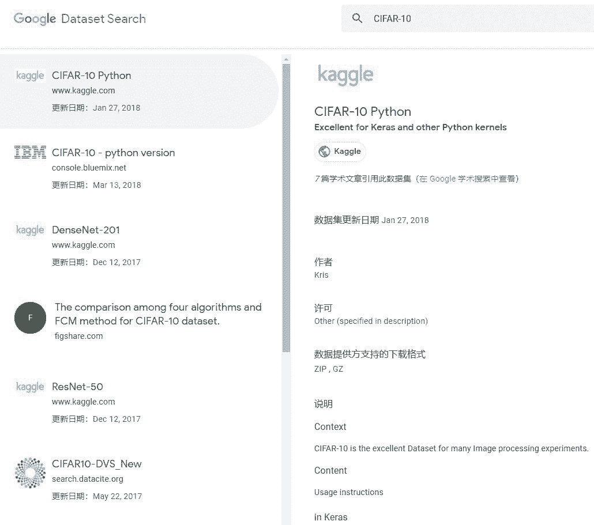
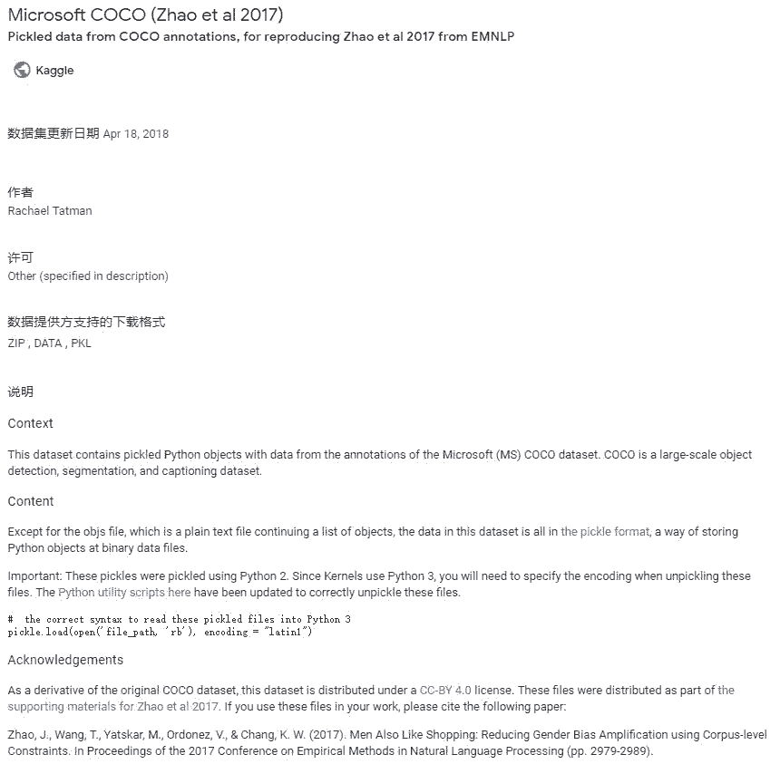

# AI 研发者福利！谷歌推出数据集搜索专用引擎 Dataset Search

选自 nature

**作者：Davide Castelvecchi**

**机器之心编译**

> 9 月 5 日，谷歌发布了一个帮助研究者查找在线数据的免费搜索引擎 Dataset Search。谷歌表示，该引擎面向「科学家、数据记者、数据极客等人群」。该引擎有助于促进数据的开放利用和重复利用。

Dataset Search 测试版地址：https://toolbox.google.com/datasetsearch

Dataset Search 与谷歌的其他专用搜索引擎（如用于搜索新闻和图像的引擎，以及 Google Scholar 和 Google Books）一样可以免费使用，它基于拥有者对文件和数据库的分类方式来查找文件和数据集。该引擎读取文件内容的方式与搜索引擎搜索网页的方式不同。有专家表示，该引擎填补了这一领域的空白，可以极大地促进开放数据运动的发展，这一运动旨在实现数据的开放利用和重复利用。

政府机构、科学出版社、研究机构甚至是个人研究者在全世界维护着成千上万的开源数据资源库，包含了数百万个数据集。

但那些想知道哪些类型的数据可用，或者那些希望定位已经存在的数据的研究者，通常依赖于口耳相传的信息。来自加州山景城的 Google AI 计算机科学家 Natasha Noy 说。

对于那些处于研究生涯早期阶段且还没有建立专业联系网络的研究者而言，这个问题尤其严重，Noy 说。这对于那些做交叉学科研究的人而言也是个严重的缺陷。例如，流行病学家需要访问气候数据，其可能与某种病毒的传播相关。

[`v.qq.com/iframe/preview.html?width=500&height=375&auto=0&vid=c134714yekq`](https://v.qq.com/iframe/preview.html?width=500&height=375&auto=0&vid=c134714yekq)

**分类搜索**

2017 年 1 月，Noy 及其谷歌同事 Dan Brickley 在一篇谷歌博客（https://ai.googleblog.com/2017/01/facilitating-discovery-of-public.html）中首次介绍了解决该问题的策略。

典型的搜索引擎分两个阶段运行。第一个阶段是通过在互联网上持续搜索来索引可用网页。第二个阶段是对索引网页进行排序，以使用户输入搜索词时，搜索引擎能够按相关度排序来提供搜索结果。

Noy 和 Brickley 写道，为了帮助搜索引擎索引现有数据集，拥有数据集的人应该使用一个叫作 Schema.org 的标准化词汇表来「标记」数据集，Schema.org 是谷歌和另外三个搜索引擎巨头（微软、雅虎和 Yandex）一起发起的项目，由 Brickley 管理。谷歌团队还开发了一种特殊算法来对搜索结果中的数据集进行排序。

由于谷歌在网页搜索中的主导地位，谷歌正在快速转入数据生态系统的消息刺激主要搜索引擎巨头进入该战场，对元数据进行标准化处理，伦敦数据共享公司 Figshare CEO Mark Hahnel 说道。（Figshare 由霍尔茨布林克出版集团管理，该集团也对 Nature 的出版公司持有大量股份。）

「到 11 月，我们接触的所有大学的数据都已经标记完成。我认为这对学界的开放数据而言是一项重要变革。」Hahnel 说道。

Hahnel 认为，融资机构有时强制要求研究数据必须可获取，而只要信息能够高效获取，他们就能达到其最终目的。「这使得投资机构一直尝试做的事合法化。」

谷歌为用户提供了能够同时搜索多个存储区的单个界面，希望借此改变用户发布和运用数据的方式。谷歌表示这个项目能够带来下列好处：

*   形成数据共享生态系统，鼓励数据发布者依照最佳做法来存储和发布数据；

*   为科学家提供相应平台，方便大众引用他们创建的数据集，展现他们的研究成果所带来的影响力。

**搜索试验**

目前谷歌已经正式对外测试开源数据集搜索引擎，用户在键入数据集名称或关键信息后，该搜索引擎会给出一系列数据源列表，每一个数据源都会有简要的介绍，例如更新日期、作者、版权和内容说明等。值得注意的是，除了数据集资源，该搜索引擎还能检索到很多 Kaggle 上的预训练模型。在机器之心的尝试中，我们分别以 CIFAR-10、Object Detection 和 SQuAD 为关键词搜索数据集，发现了一些很有意思的结果。

首先我们检索了十分常用的图像分类数据集 CIFAR-10，该数据集包含 10 个类别共 60000 张 32x32 的彩色图像，且分为 50000 张训练图像和 10000 张测试图像。搜索结果共给出了 9 项来源，包括数据集、预训练模型和对比结果。



例如在排名第一的搜索结果中，数据集来自 Kaggle 的 CIFAR-10 Python。在搜索引擎的简介页中，除了给出该数据集的简要信息（包括引用此数据集的论文），它甚至还展示了该数据集的使用指南。例如，如下展示页介绍了该数据集在 Keras 的使用方法：

```py
from os import listdir, makedirs
from os.path import join, exists, expanduser

cache_dir = expanduser(join('~', '.keras'))
if not exists(cache_dir):
    makedirs(cache_dir)
datasets_dir = join(cache_dir, 'datasets') # /cifar-10-batches-py
if not exists(datasets_dir):
    makedirs(datasets_dir)

# If you have multiple input datasets, change the below cp command accordingly, typically:
# !cp ../input/cifar10-python/cifar-10-python.tar.gz ~/.keras/datasets/
!cp ../input/cifar-10-python.tar.gz ~/.keras/datasets/
!ln -s  ~/.keras/datasets/cifar-10-python.tar.gz ~/.keras/datasets/cifar-10-batches-py.tar.gz
!tar xzvf ~/.keras/datasets/cifar-10-python.tar.gz -C ~/.keras/datasets/ 
```

点击第一条数据源就能跳转到对应的 Kaggle 页面，下载和额外信息都展示在原页面中。

在采用关键词「Object Detection」进行搜索的过程中，我们会发现搜索结果远远要比上面多得多，大约会有上百条数据来源。依靠关键词同样检索到了非常多流行的开源数据集，它们都适用于目标检测这一领域。例如 Microsoft COCO、Face Detection 和 Vehicle Number Plate Detection 等。

从「Object Detection」的搜索结果来看，来自 Kaggle 的数据集占了一小半，它们都会在 Kaggle 上提供下载与使用指南。其实浏览这么多数据源，搜索引擎给出的简介页面就显得非常重要了。我们不需要跳转到每一个数据集的原地址，仅根据简介就能了解该数据集的大概应用领域与内容。如下展示了 COCO 数据集的简介页面：



最后我们检索了斯坦福的问答数据集「SQuAD」，搜索结果不仅给出了挑战赛地址和数据集地址，同时还提供了相似数据集和挑战赛的地址。但是在我们检索「SQuAD 2.0」的时候，并没有搜索到斯坦福大学发布的机器阅读理解问答数据集 SQuAD 2.0，也可能是该数据集太新，还没有被搜索引擎收录。

**合作机构**

谷歌这一尝试的早期支持者是美国国家海洋和大气管理局（NOAA）。该机构的职权范围从渔业到日冕，其档案包含近 7 万个数据集，包括 19 世纪的船舶日志。这些数据的总容量超过 35 PB，相当于 35000 个典型硬盘的容量。

谷歌这一工具 Dataset Search 将帮助 NOAA 完成数据开放的使命，NOAA 首席数据官 Edward Kearns 表示。「我们想探索新的方法，使其他人也能使用这些数据。」

与数据拥有者展开合作是运行 Dataset Search 的关键步骤。尽管这一系统未来可能变得更加复杂，谷歌目前不打算像处理网页和图像那样读取或分析数据。Noy 表示，「只有数据发布者提供的元数据足够好，这种搜索工具才能够好。」

和 Google Scholar 一样，Dataset Search 目前不提供自动化查询或应用程序编程接口（API），尽管谷歌表示将来可能会增加这一功能。

Noy 表示当研究人员开始使用 Dataset Search 时，谷歌将会观察他们如何与其交互，并利用这些信息来改进搜索结果。她还表示，公司尚未打算把该服务商业化。

随着 Dataset Search 的不断改进，未来它也许会跟 Google Scholar 整合，将特定研究领域的搜索结果关联到相关数据集。

*原文链接：https://www.nature.com/articles/d41586-018-06201-x*


点击阅读原文，直达大会首页，免费领取 PPT