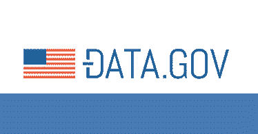
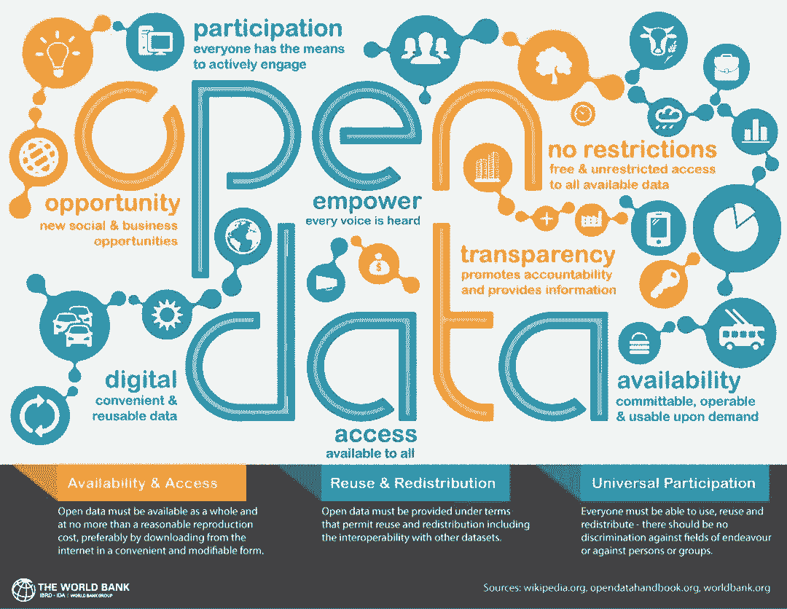

# 入门 | 从文本处理到自动驾驶：机器学习最常用的 50 大免费数据集

选自 Gengo.ai

****作者：Meiryum Ali****

****机器之心编译****

**参与：王淑婷、李泽南**

> 机器学习领域里有哪些开放数据集？Gengo 近日发布了一份高质量免费数据集列表，其搜索范围不仅包含内容广泛（如 Kaggle），也包括高度特化的（如自动驾驶汽车专用数据集）数据集种类。

首先，在选择数据集时要记住几个重要标准：

*   数据集不能是混乱的，因为你不希望花费大量时间整理数据。

*   数据集不应该有过多的行或者列，这样才能容易处理。

*   数据越干净越好——清理大型数据集可能会非常耗时。

*   该数据集可以用于回答一些有趣的问题。

这样的话，让我们看看能找到点什么？

**查找数据集**

Kaggle：一个数据科学竞赛网站，其中包含大量外部贡献的有趣数据集。你可以在它长长的列表中（https://www.kaggle.com/datasets）找到各种小众数据集，从拉面的评分、篮球数据，到西雅图的宠物牌照。

UCI Machine Learning Repository：它是网络中最古老的数据集源之一，是寻找各种有趣数据集的第一选择。在这里，尽管数据集都是用户自行贡献的，但清洁程度仍然很高。此外，你可以直接从 UCI Machine Learning Repository 上下载数据，无需注册。

**通用数据集**

**公共政府数据集**

Data.gov：这个网站可以从多个美国政府机构下载数据，从政府预算到学校成绩。不过要注意：其中的大部分数据需要进一步研究。

链接：https://www.data.gov/

Food Environment Atlas：包含有关本地食物选择如何影响美国饮食习惯的数据。

链接：https://catalog.data.gov/dataset/food-environment-atlas-f4a22

School system finances：美国学校系统财务状况调查。

链接：https://catalog.data.gov/dataset/annual-survey-of-school-system-finances

Chronic disease data：美国各地慢性病指标数据。

链接：https://catalog.data.gov/dataset/u-s-chronic-disease-indicators-cdi-e50c9

The US National Center for Education Statistics：美国和世界各地教育机构和教育人口统计数据。

链接：https://nces.ed.gov/

The UK Data Centre：英国最大的社会、经济和人口数据收集。

链接：https://www.ukdataservice.ac.uk/

Data USA：美国公共数据的全面可视化。

链接：http://datausa.io/

**金融类**

Quandl：很好的财经数据来源——有助于建立预测经济指标或股票价格的模型。

链接：https://www.quandl.com/

World Bank Open Data：涵盖人口统计和世界各地大量经济和发展指标的数据集。

链接：https://data.worldbank.org/

IMF Data：国际货币基金组织公布有关国际金融、债务利率、外汇储备、商品价格和投资的数据。

链接：https://www.imf.org/en/Data

Financial Times Market Data：世界金融市场的最新信息，包括股票价格指数、商品和外汇。

链接：https://markets.ft.com/data/

Google Trends：观察和分析有关互联网搜索活动和世界各地新闻故事趋势的数据。

链接：http://www.google.com/trends?q=google&ctab=0&geo=all&date=all&sort=0

AmericanEconomic Association (AEA)：寻找美国宏观经济数据的来源。

链接：https://www.aeaweb.org/resources/data/us-macro-regional

**机器学习数据集**

**图像**

Labelme：注释图像的大数据集。

链接：http://labelme.csail.mit.edu/Release3.0/browserTools/php/dataset.php

ImageNet：著名的 ImageNet，由斯坦福大学教授李飞飞等人发起，它是面向新算法的真实图像数据集。根据 WordNet 层次结构来组织，其中层次结构的每个节点都由成百上千个图像来描述。

链接：http://image-net.org/

LSUN：场景理解和许多辅助任务（房间布局估计、显著性预测等）。

链接：http://lsun.cs.princeton.edu/2016/

MS COCO：ImageNet 之外另一个常用的图像数据集，包含通用图像理解和注释。

链接：http://cocodataset.org/

COIL100：100 个不同的物体在 360°旋转中以每个角度成像。

链接：http://www1.cs.columbia.edu/CAVE/software/softlib/coil-100.php

Visual Genome：非常详细的视觉知识库，配有约 100K 个图像的注释。

链接：http://visualgenome.org/

Google's Open Images：Creative Commons 下的 900 万个图片的网址集合，「已经标注了跨越 6000 多个类别的标签」。

链接：https://research.googleblog.com/2016/09/introducing-open-images-dataset.html

Labelled Faces in the Wild：13000 张贴有标签的人脸图像，用于开发涉及人脸识别的应用。

链接：http://vis-www.cs.umass.edu/lfw/

Stanford Dogs Dataset：包含 20580 个图像和 120 个不同品种的狗类别。

链接：http://vision.stanford.edu/aditya86/ImageNetDogs/

Indoor Scene Recognition：非常具体的数据集，适用于大多数场景识别模型，因为后者在「外部」表现更好。包含 67 个室内类别，总共 15620 个图像。

链接：http://web.mit.edu/torralba/www/indoor.html

**情感分析**

Multidomain Sentiment analysis dataset：有点旧的一个数据集，以亚马逊的产品评论为特色。

链接：http://www.cs.jhu.edu/~mdredze/datasets/sentiment/

IMDB reviews：用于二进制情感分类的较旧的、相对较小的数据集，具有 25000 个电影评论。

链接：http://ai.stanford.edu/~amaas/data/sentiment/

Stanford Sentiment Treebank：带有情感注释的标准情感数据集。

链接：https://nlp.stanford.edu/sentiment/code.html

Sentiment140：一个流行的数据集，使用 16 万条预先删除表情符号的推文

链接：http://help.sentiment140.com/for-students/

Twitter US Airline Sentiment：2015 年 2 月以来美国航空公司的推特数据，分为正面、负面和中性。

链接：https://www.kaggle.com/crowdflower/twitter-airline-sentiment

**自然语言处理**

Enron Dataset：Enron 公司高层管理人员的电子邮件数据，整理成文件夹。

链接：https://www.cs.cmu.edu/~./enron/

Amazon Reviews：包含来自亚马逊长达 18 年的约 3500 万条评论。数据包括产品和用户信息、评级和明文审查。

链接：https://snap.stanford.edu/data/web-Amazon.html

Google Books Ngrams：Google 书籍中的词汇集合。

链接：https://aws.amazon.com/cn/datasets/google-books-ngrams/

Blogger Corpus：从 blogger . com 收集的 681288 篇博客文章。每个博客至少包含 200 个常用英语单词。

链接：http://u.cs.biu.ac.il/~koppel/BlogCorpus.htm

Wikipedia Links data：维基百科全文。数据集包含 400 多万篇文章中的近 19 亿字。你可以根据单词、短语或段落本身的一部分进行搜索。

链接：https://code.google.com/p/wiki-links/downloads/list

Gutenberg eBooks List：古腾堡计划电子书注释清单。

链接：http://www.gutenberg.org/wiki/Gutenberg:Offline_Catalogs

Hansards text chunks of Canadian Parliament：加拿大第 36 届国会记录 130 万对文本。

链接：https://www.isi.edu/natural-language/download/hansard/

Jeopardy：机智问答节目 Jeopardy 中存档的 20 多万个问题。

链接：https://www.reddit.com/r/datasets/comments/1uyd0t/200000jeopardyquestionsinajsonfile/

SMS Spam Collection in English：由 5574 条英文短信垃圾邮件组成的数据集

链接：http://www.dt.fee.unicamp.br/~tiago/smsspamcollection/

Yelp Reviews：Yelp 发布的开放数据集包含 500 多万条评论。

链接：https://www.yelp.com/dataset

UCI's Spambase：大型垃圾邮件数据集，可用于垃圾邮件过滤。

链接：https://archive.ics.uci.edu/ml/datasets/Spamb (https://archive.ics.uci.edu/ml/datasets/Spambase)

**自动驾驶**

[Berkeley DeepDrive BDD100k](http://mp.weixin.qq.com/s?__biz=MzA3MzI4MjgzMw==&mid=2650743073&idx=4&sn=9e3bd62efd16afaab982da2476ff724a&chksm=871ae55fb06d6c496fdcd1acc1a43bda0cefd29d6802355b1c536f57d2b2b3b98a2aec444466&scene=21#wechat_redirect)：目前最大的自动驾驶人工智能数据集。包含 100000 多段视频，内容涉及一天中不同时间和天气条件下 1100 多小时的驾驶体验。注释图像来自纽约和旧金山地区。

链接：http://bdd-data.berkeley.edu/

Baidu Apolloscapes：[百度 Apollo 计划](http://mp.weixin.qq.com/s?__biz=MzA3MzI4MjgzMw==&mid=2650725673&idx=2&sn=5c040603f58ae132aa578bdeffa00c14&chksm=871b1957b06c90418037bfc3748f3482d0c19237dd5f89fa5c999c18d157c3bd5f2931f86ccf&scene=21#wechat_redirect)开放的大规模自动驾驶数据集。它定义了 26 个不同语义项目，如汽车、自行车、行人、建筑物、路灯等。

链接：http://apolloscape.auto/

Comma.ai：7 小时以上的公路行驶体验。详细信息包括车速、加速度、转向角和 GPS 坐标。

链接：https://archive.org/details/comma-dataset

Oxford's Robotic Car：一年内在英国牛津同一条路线重复 100 多次的行驶。数据集捕捉天气、交通和行人的不同组合，以及建筑和道路工程等长期变化。

链接：http://robotcar-dataset.robots.ox.ac.uk/

Cityscape Dataset：记录 50 个不同城市街道场景的大型数据集。

链接：https://www.cityscapes-dataset.com/

CSSAD Dataset：该数据集可用于自主车辆的感知和导航。数据集在发达国家的道路上出现严重偏差。

链接：http://aplicaciones.cimat.mx/Personal/jbhayet/ccsad-dataset

KUL Belgium Traffic Sign Dataset：比利时佛兰德区数以千计截然不同的超过 10000 个的交通标志标注。

链接：http://www.vision.ee.ethz.ch/~timofter/traffic_signs/

MIT AGE Lab：在 AgeLab 收集的 1000 多个小时的多传感器驱动数据集样本。

链接：http://lexfridman.com/carsync/

LISA: Laboratory for Intelligent & Safe Automobiles, UC San Diego Datasets：此数据集包括交通标志、车辆检测、交通灯和轨迹模式。

链接：http://cvrr.ucsd.edu/LISA/datasets.html

如果你知道本文中有哪些漏掉的重要数据集，欢迎留言补充。

*原文链接：https://gengo.ai/articles/the-50-best-free-datasets-for-machine-learning/*

****本文为机器之心编译，**转载请联系本公众号获得授权****。**

✄------------------------------------------------

**加入机器之心（全职记者 / 实习生）：hr@jiqizhixin.com**

**投稿或寻求报道：**content**@jiqizhixin.com**

**广告 & 商务合作：bd@jiqizhixin.com**