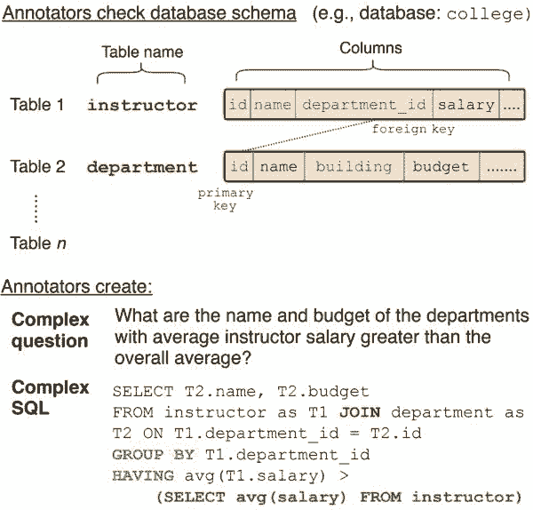
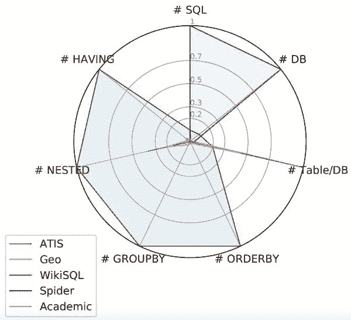
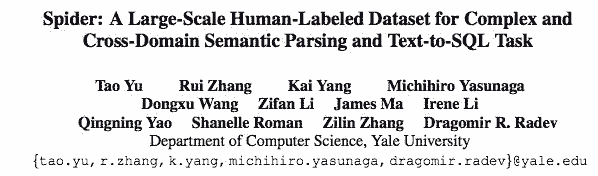

# 资源 | 「蜘蛛」来了！耶鲁大学 11 名学生标注完成大规模复杂跨域 Text-to-SQL 数据集 Spider

选自 Medium

**作者****：Tao Yu**

**机器之心编译**

**参与：路、王淑婷**

> 近期，耶鲁大学创建了一个新型大规模复杂跨域语义解析和 Text-to-SQL 数据集 Spider。研究者用多个当前最优模型进行实验，最好的模型在数据库分割设置下仅能达到 14.3% 的精确匹配准确率。Spider 数据集对未来研究是一个巨大挑战。

项目地址：https://yale-lily.github.io/spider

新千禧年开始后，每天生产的数据量呈指数级增长，它们大部分存储在关系数据库中。近年来，访问这些数据成为大多数大公司的兴趣，这些公司可以使用结构化查询语言（SQL）查询数据。随着手机的发展，更多个人数据也被存储。因此，更多来自不同背景的人尝试查询和使用自己的数据。尽管目前数据科学非常流行，但是大部分人不具备足够的知识来写 SQL、查询数据。此外，大部分人没有时间学习和了解 SQL。即使对于 SQL 专家，一次又一次地写类似的查询也是很单调的任务。因此，今天海量可用的数据无法有效访问。

*标注问题和 SQL 对示例。*

如果你不了解上图长长的 SQL 代码，不要担心！这就是数据库自然语言接口的用武之地了。其目标是允许我们直接使用人类语言和数据进行互动！因此，这些接口可以帮助不同背景的用户轻松查询和分析海量数据。

**如何构建此类接口？**

要构建此类自然语言接口，系统必须理解用户的问题，并将问题自动转换为对应的 SQL 查询。那么我们如何构建此类系统呢？目前最好的方法是使用深度学习在大规模问题和 SQL 对标注数据上训练神经网络！与基于规则的完备系统相比，这些方法更具鲁棒性和扩展性。

**好的数据太少了！**

但是，有一个关键的问题：我们从哪里找到大量问题和 SQL 对标注数据？创建此类数据集非常耗时，因为标注人员必须理解数据库模式，问问题然后写出 SQL 答案，所有这些都需要特定的数据库知识。而让这件事变得更加困难的是：具备多个表的非私人数据库数量非常有限。为了解决该任务对大型高质量数据集的需求，我们创建了数据集 Spider，它包含 200 个具备多个表的数据库、10181 个问题、5693 个对应的复杂 SQL 查询。所有这些由 11 名耶鲁大学学生标注完成，共耗时 1000 小时！

**为什么要选 Spider？**

尽管创建此类数据很难，但在传统的 9 个数据库（包括 ATIS、GeoQuery、Scholar、Advising、WikiSQL 等）中还是有一些和 SQL 查询类似的数据资源。那么，为什么要选择 Spider 数据集呢？我们来看下图：

*一些 Text-to-SQL 数据集的 Spider 图。*

*   ATIS、Geo、Academic：这些数据集都只包含一个数据库。而这些数据库大部分仅包含不到 500 个独特的 SQL 查询。基本上，在这些数据集上训练的模型仅对特定的数据库有效。在转换数据库后，模型将完全失败。

*   WikiSQL：SQL 查询和表的数量很多，但是所有 SQL 查询都很简单，仅包含 SELECT 和 WHERE 从句。此外，每个数据库都只是没有外键的简单的表。在 WikiSQL 上训练的模型在其它新数据库上仍然可以运行，但是该模型无法处理复杂的 SQL（如 GROUP BY、ORDER BY 或嵌套查询）和具备多个表和外键的数据库。

从上图中可以看出，Spider 的范围最大，因此它是最复杂的跨域 text-to-SQL 数据集。为什么我们说它是最大的复杂跨域数据集呢？

*   大：超过 10000 个问题，6000 个对应的独特 SQL 查询。

*   复杂：大部分 SQL 查询覆盖几乎所有重要的 SQL 组件，包括 GROUP BY、ORDER BY、HAVING 和嵌套查询。此外，所有数据库都具备多个由外键链接的表。

*   跨域：包含 200 个复杂数据库。根据数据库类型，我们将 Spider 数据集分割成训练、开发和测试集。这样，我们就可以在未见过的数据库上测试系统性能。

**为什么大、复杂、跨域？**

首先，要训练一个深度学习模型，数据集越大，性能越好。其次，你当然希望训练数据尽可能多地覆盖更多场景，包括不同的 SQL 组件和数据库模式。这样，系统可以更好地适应多种情形。最后，为什么我们想要跨域数据？简单来讲，当你遇到新数据库时，你不想重新标注数据、重新训练一个新模型，这很浪费时间！

**Spider 数据集下载**

你可以通过以下方式找到 Spider 数据集和排行榜：

*   项目页面：https://yale-lily.github.io/spider

*   GitHub 页面：https://github.com/taoyds/spider

我们希望 Spider 能够帮助我们走向下一代数据库自然语言接口！

**其它挑战**

我们已经创建了一个不错的数据集了，那么要构建现实世界的数据库自然语言接口还需要解决哪些挑战？从自然语言处理的角度来看，有三个主要任务：

自然语言理解：该系统必须理解用户的问题，这些问题可能是模糊、随机和多样的。

数据库模式表征：数据库可以非常复杂，包括数百个列、很多表和外键。

复杂的 SQL 解码／生成：该系统理解用户问题和用户正在查询的数据库模式后，它还需要生成对应的 SQL 答案。但是，SQL 查询可能非常复杂，并且还包含具备不同条件的嵌套查询。

**相关研究**

该领域已经经过 NLP 和数据库社区数十年的研究。以下是近期相关研究的简短列表：

*   SyntaxSQLNet: Syntax Tree Networks for Complex and Cross-Domain Text-to-SQL Task

*   Zero-shot Parser：Decoupling Structure and Lexicon for Zero-Shot Semantic Parsing（https://arxiv.org/abs/1804.07918）

*   Coarse2fine：Coarse-to-Fine Decoding for Neural Semantic Parsing（https://arxiv.org/pdf/1805.04793.pdf）

*   SQL 评估方法：TypeSQL: Knowledge-based Type-Aware Neural Text-to-SQL Generation（https://arxiv.org/pdf/1804.09769.pdf）

*   在任务中加入背景信息：Learning to Map Context-Dependent Sentences to Executable Formal Queries（http://alanesuhr.com/atis.pdf）、DialSQL: Dialogue Based Structured Query Generation（http://cs.ucsb.edu/~ysu/papers/acl18_dialsql.pdf）

*   TypeSQL：TypeSQL: Knowledge-based Type-Aware Neural Text-to-SQL Generation（https://arxiv.org/abs/1804.09769）

*   SQLNet：SQLNet: Generating Structured Queries From Natural Language Without Reinforcement Learning（https://arxiv.org/abs/1711.04436）

*   Seq2SQL：Seq2SQL: Generating Structured Queries from Natural Language using Reinforcement Learning（https://arxiv.org/abs/1709.00103）

*   句法神经网络：A Syntactic Neural Model for General-Purpose Code Generation（https://arxiv.org/abs/1704.01696）、Abstract Syntax Networks for Code Generation and Semantic Parsing（https://arxiv.org/abs/1704.07535）

*   Seq2Tree：Learning a Neural Semantic Parser from User Feedback（https://arxiv.org/pdf/1704.08760.pdf）

*   NaLIR：Constructing an Interactive Natural Language Interface for Relational Databases（http://www.vldb.org/pvldb/vol8/p73-li.pdf）

以及一些相关的演讲、博客或书籍：

*   How to Talk to Your Database（https://einstein.ai/research/blog/how-to-talk-to-your-database）

*   ACL 2018 Tutorial on Neural Semantic Parsing（https://github.com/allenai/acl2018-semantic-parsing-tutorial）

*   Natural Language Data Management and Interfaces（http://www.morganclaypoolpublishers.com/catalog_Orig/product_info.php?products_id=1286）

*   A Syntactic Neural Model for General-Purpose Code Generation（https://vimeo.com/234954608）

*   Learning to Map Context-Dependent Sentences to Executable Formal Queries（http://alanesuhr.com/sia2018-slides.pdf）

**论文：Spider: A Large-Scale Human-Labeled Dataset for Complex and Cross-Domain Semantic Parsing and Text-to-SQL Task**

论文链接：https://arxiv.org/abs/1809.08887

摘要：我们展示了一个大规模复杂跨域语义解析和 text-to-SQL 数据集 Spider。该数据集由 11 名耶鲁大学学生标注，包含 10181 个问题和 5693 个独特的复杂 SQL 查询、200 个具备多个表的数据库，覆盖 138 个不同领域。我们定义了一个新的复杂跨域语义解析和 text-to-SQL 任务，其中训练集和测试集中出现不同的复杂 SQL 查询和数据库。因此，该任务要求模型在新的 SQL 查询和新数据库模式上均实现良好的泛化。Spider 与之前的大部分语义解析任务都不同，因为它们使用单个数据库，而且训练集和测试集使用的是相同的数据库。我们用多个当前最优模型进行实验，最好的模型在数据库分割设置下仅能达到 14.3% 的精确匹配准确率。这表明 Spider 对未来研究是一个巨大挑战。**

*原文地址：https://medium.com/@tao.yu/spider-one-more-step-towards-natural-language-interfaces-to-databases-62298dc6df3c*

2018AIIA 人工智能开发者大会将于 2018 年 10 月 15 日到 16 日在苏州国际博览中心举办。点击阅读原文链接报名。

