# 资源 | 1460 万个目标检测边界框：谷歌开源 Open Images V4 数据集

选自 Google AI

**机器之心编译**

**作者：******Alina Kuznetsova 等****

**参与：******Geek AI、张倩****

> Open Images 是谷歌开源的一个大型数据集，包含大约 900 万张图像，这些图像用图像级别的标签和目标边界框进行了标注。最近，谷歌发布了该数据集的第四个版本——Open Images V4，图像数量增加到 920 万，其训练集包含 1460 万个边界框，用于标识从属于 600 个目标类别的 174 万张图像中的目标，这使它成为了现有的含有目标位置标注的最大数据集。

<mp-miniprogram class="miniprogram_element" data-miniprogram-appid="wxf424e2f3e2f94500" data-miniprogram-path="pages/resource/resource?id=6dba7a6c-1b23-4298-a03b-7d7f841fc17e&amp;from=weapp" data-miniprogram-nickname="机器之心 Synced" data-miniprogram-avatar="http://mmbiz.qpic.cn/mmbiz_png/f3g058loLBj0Pib4UhuCFagffSB1RHImwskFzvic6mSp2LDhuerbXxeqqv0b63wSt2Pas7MicNWIcia358rlnhiaVag/640?wx_fmt=png&amp;wxfrom=200" data-miniprogram-title="Open Images" data-miniprogram-imageurl="http://mmbiz.qpic.cn/mmbiz_jpg/KmXPKA19gW9lP0yfAtcyQ3Xr1kb3wOQgicPrnrjfHWf47nDictMgfZFxNj4D7JMvScmdPvQLVbhTW0pHEhq6JekQ/0?wx_fmt=jpeg"></mp-miniprogram>

这些边界框大部分由专业的标注人员手工绘制，以确保准确性和一致性。数据集中的图像非常多样化，通常包含存在多个目标的复杂场景（平均每张图像 8.4 个）。此外，数据集用逾数千个类别的图像级标签进行标注。

数据集地址：https://storage.googleapis.com/openimages/web/visualizer/index.html?set=train&c=%2Fm%2F06mf6

**数据组织**

数据集被分成了训练集（9,011,219 张图像）、验证集（41,620 张图像）和测试集（125,436 张图像）三部分。这些图像用图像级的标签和边界框进行了标注，如下所述。

**图像级标签**

表 1 为 Open Images V4 数据集所有部分（训练集、验证集、测试集）的图像级标签的概述。所有图像都带有由机器通过类似于谷歌云视觉 API（https://cloud.google.com/vision/）的计算机视觉模型自动生成的图像级标签。这些自动生成的标签有很大的假正例率。

*表 1：图像级标签。*

此外，验证集、测试集以及部分训练集都带有经过人验证的图像级别标签。大多数验证工作都是由谷歌内部的标注人员完成的。一小部分数据标注工作是通过图像标注程序（Image Labeler）进行众包完成的：如 Crowdsource app 和 g.co/ imagelabeler。这个验证过程实际上消除了假正例（但不能消除假负例：图像中可能缺少一些标签）。最终得到的标签基本上是正确的，我们认为这些数据可以很好的被用于训练计算机视觉模型。我们使用了多个计算机视觉模型来生成样本（不仅仅是用于机器生成标签的模型），词汇表因此得到了显著的扩展（表 1 中的 #Classes 列）。

总的来说，数据集包含 19,995 个具有图像级标签的不同类。注意，这个数字略高于上表中经过人工验证的标签的数量。原因是机器生成的集合中有少量的标签没有出现在人工验证的集合中。在 V4 训练集中，至少含有 100 个人工验证的正类才能算得上可训练的类。根据这个定义，我们可以认为有 7186 个类是可训练的。

**边界框**

表 2 为 Open Images V4 数据集所有部分（训练集、验证集、测试集）中逾 600 类边界框标注的概述。这些数据比 ILSVRC 和 COCO 目标检测挑战赛的数据类别范围更大，包括「fedora」和「snowman」等新对象。

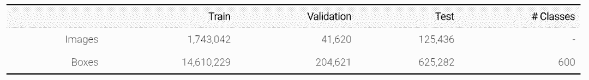

*表 2：边界框。*

对于训练集，我们在 174 万张经过人类验证的带有正类图像级别标签的图像上标注了边界框。我们关注的是最具体的标签。例如，如果一个图像带有标签 {car，limousine，screwdriver}，我们会为「limousine」和「screwdriver」两类标注边界框。对于图像中的每个标签，我们都详尽地标注了图像中从属于该目标类的每个实例。我们一共标注了 1460 万个边界框。平均每个图像有 8.4 个带有边界框的目标。90% 的边界框都是由谷歌的专业标注人员使用高效的「extreme clicking」界面手动绘制的 [1]。我们使用 [2] 中方法的增强版半自动地生成了剩下 10% 的边界框。经过人类验证，这些边界框的 IoU>0.7，在相应目标上有一个完美的边界框，它们在实际中的准确率非常高（平均的 IoU 大约为 0.82）。由于实例过多（95,335 张图片上共有 1,327,596 个实例），我们仅为 95,335 张图像绘制了人体部分和「哺乳动物」的边界框。

对于验证集和测试集，我们为所有目标实例所有可能的正类图像级标签提供了详尽的边界框标注信息。所有的边界框都是手工绘制的。我们尽可能在语义层次结构中最具体的层次上标注边界框。在验证集和测试集中，平均每个图像都有大约 5 个边界框。

在所有部分（训练集、验证集、测试集）中，标注人员还为每个框标记了一组属性。例如，说明该目标是否被遮盖（请参阅「download」部分（https://storage.googleapis.com/openimages/web/download.html#attributes）的完整描述）。

**类的定义**

图像的类别由 MID（机器生成的 ID）来标识，这些 MID 可以在「Freebase」或「Google Knowledge Grapg API」（https://developers.google.com/knowledge-graph/）中找到。在「class-description.csv」（https://storage.googleapis.com/openimages/2018_04/class-descriptions.csv）文件中可以找到每个类的简短描述。

**统计和数据分析**

**600 个边界框可标识的类的层次结构**

在这里，我们将一组可以用边界框标识出来的类以一种层次结构表示出来（https://storage.googleapis.com/openimages/2018_04/bbox_labels_600_hierarchy_visualizer/circle.html），或者可以以 JSON 文件的方式下载它们（https://storage.googleapis.com/openimages/2018_04/bbox_labels_600_hierarchy.json）：

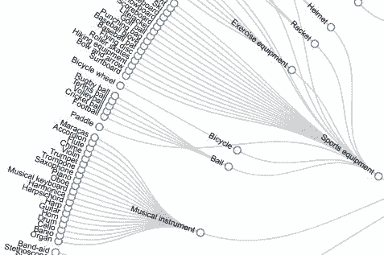

**标签分布**

下图显示了标注结果在数据集中的分布情况。注意，标签分布严重倾斜（注：y 轴为对数刻度）。根据正类样本的数量对各类排序。绿色代表正类样本，红色代表负类样本。

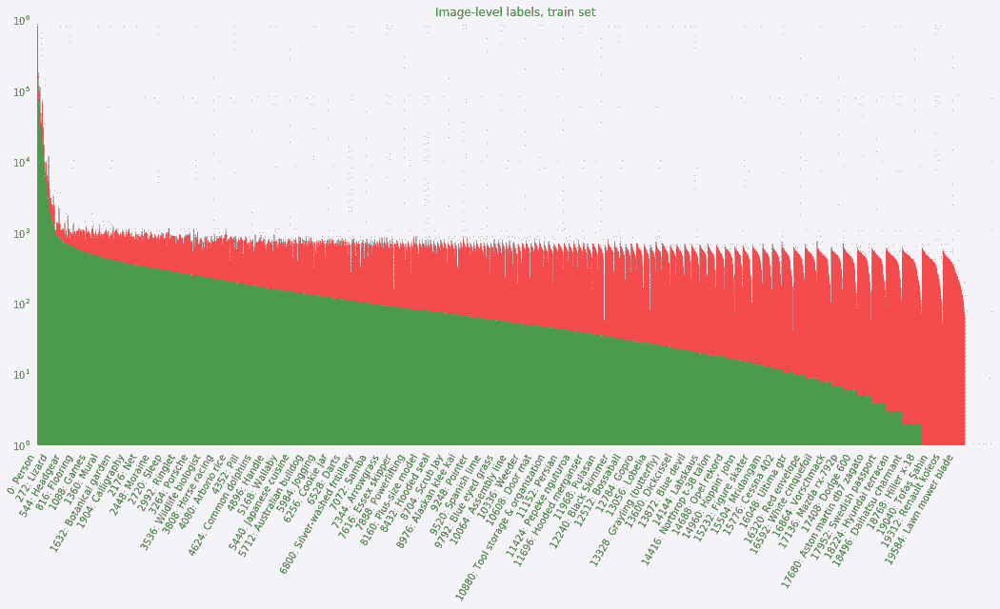

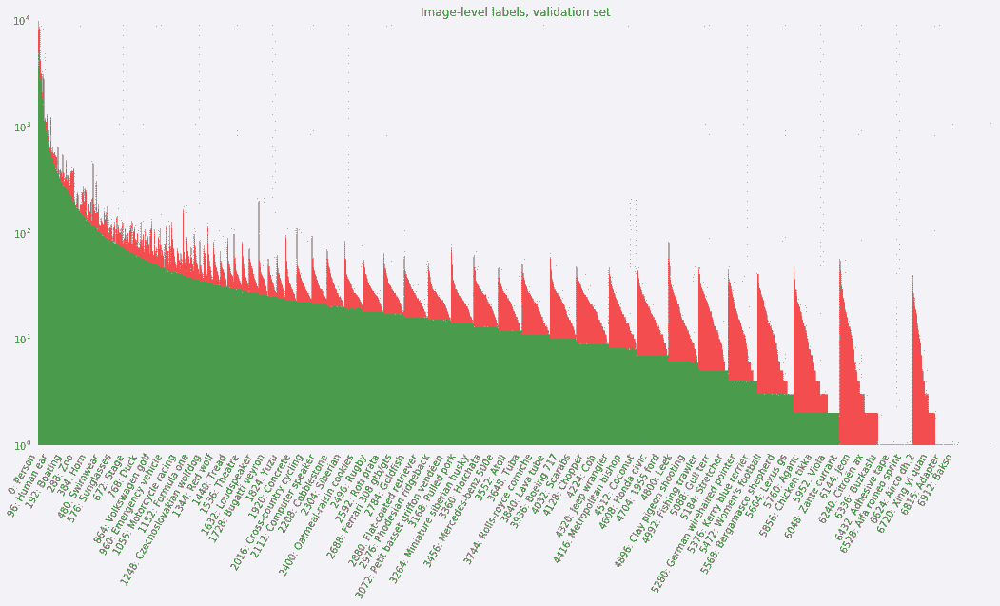

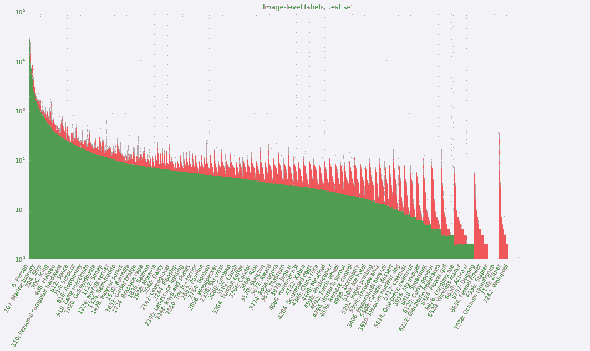

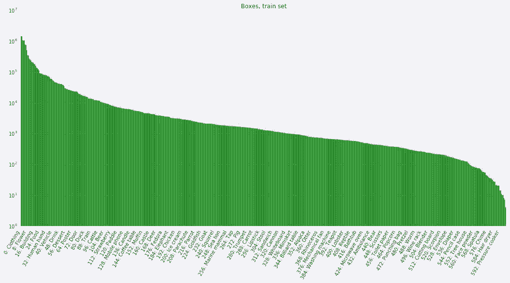

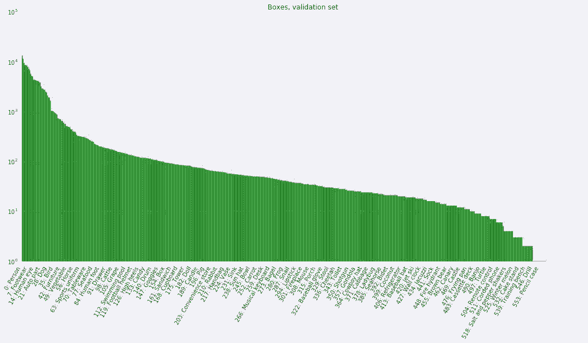

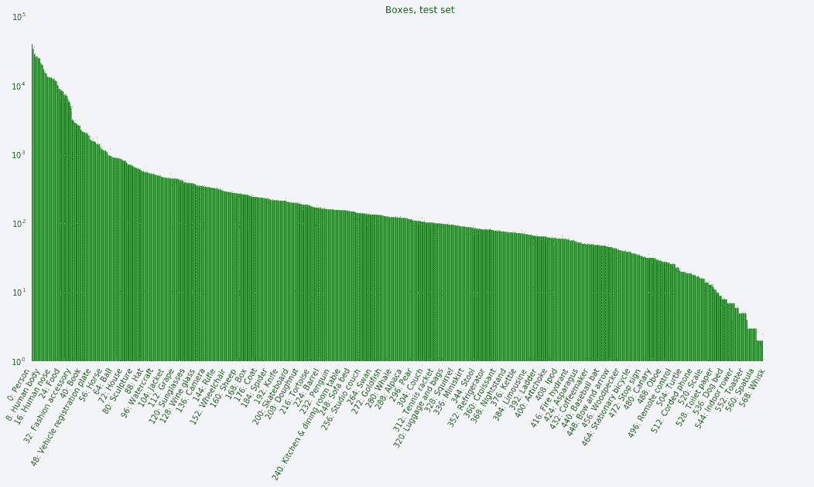

**论文：The Open Images Dataset V4: Unified image classification, object detection, and visual relationship detection at scale**

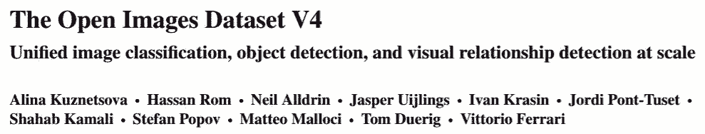

论文链接：https://arxiv.org/abs/1811.00982

**摘要：**在本文中，我们发布了 Open Images V4，这是一个包含 920 万张图像的数据集，对于图像分类、目标检测和视觉关系检测等任务有统一的标注。这些图像都具有允许共享和修改素材的创作共用许可证（Creative Commons Attribution license），收集自 Flickr，上面没有事先定义的类名或标签列表。这使得数据集具备自然的类的统计性质，避免了初始设计偏差。Open Images V4 提供了多个维度上的大规模数据：为 19800 个概念提供了 3010 万个图像级标签，为 600 个目标类提供了 1540 万个边界框，为 57 个类提供了 375000 个视觉关系标注。特别是目标检测方面，我们提供了比仅次于我们的第二大数据集多 15 倍的边界框。在这些图像中经常出现一些包含多个目标的复杂场景（平均每个图像有 8 个带标注的目标）。我们标注了它们之间的视觉关系，用来支持视觉关系检测，这是一个需要结构化推理的新兴任务。我们提供了关于数据集的深入、全面的统计数据，验证了标注信息的质量，并研究了随着训练数据的增加，目前流行的一些模型的性能会如何变化。我们希望 Open Image V4 的规模、质量和种类能够促进进一步的研究和创新，甚至在图像分类、目标检测和视觉关系检测等领域之外也能有所助益。

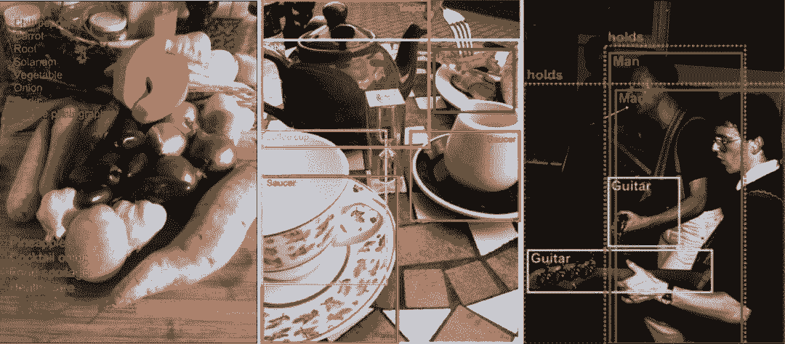

*图 1：Open Image 中用于图像分类、目标检测和视觉关系检测的标注示例。对于图像分类任务，正类标签（出现在图像中）是绿色的，而负类标签（没有出现在图像中）是红色的。对于视觉关系检测任务，带有虚线轮廓的边界框将两个具有特定视觉关系的目标圈在一起。*

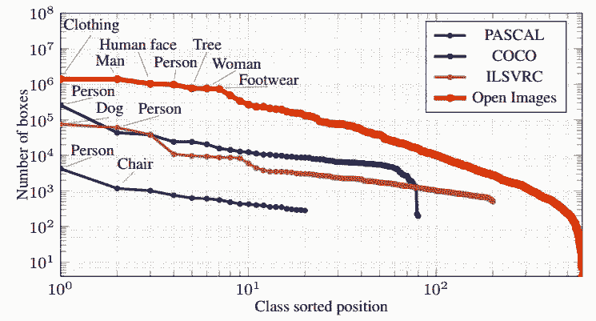

*图 17：每类边界框的数量。横轴是按边界框数量对各类进行排序的结果，为了提高可读性，我们将该结果用对数刻度表示。我们还标明了最常见的类的名称。*

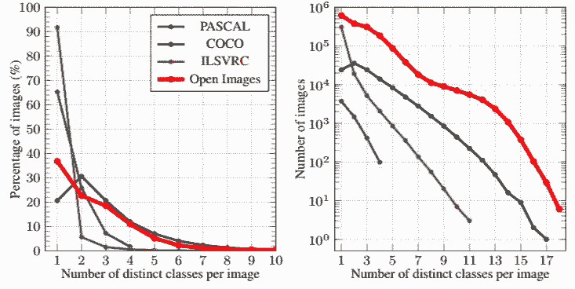

*图 18：每张图像中的类别数量。每张图像不同类别数量归一化（左）和非归一化（右）直方图。*

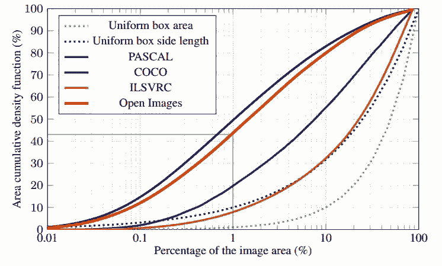

*图 20：训练集中标注过的目标区域的比例：PASCAL、COCO、Open Images 中标注过的目标占图像区域百分比的累积分布；即面积低于某个值的实例的百分比。作为对比基线，我们绘制了面积和边长均匀分布的边界框对应的函数。我们忽略了在 COCO 中标记为人群的边界框和在 Open Image 中标记为群组的边界框。*

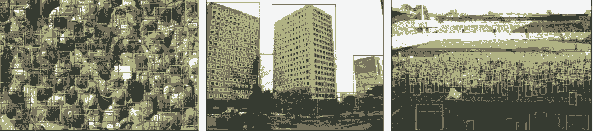

*图 15：包含大量标注过的边界框的示例：分别包含 348、386 和 743 个边界框的图像。在很多这样的情况下可以使用 GroupOf，但实际上它们还是对此很感兴趣。*

*图 19：含有大量不同类别的标注的图像（左图中有 11 类标注，右图中有 7 类标注）。*******

*参考链接：https://storage.googleapis.com/openimages/web/factsfigures.html*

****本文为机器之心编译，**转载请联系本公众号获得授权****。**

✄------------------------------------------------

**加入机器之心（全职记者 / 实习生）：hr@jiqizhixin.com**

**投稿或寻求报道：**content**@jiqizhixin.com**

**广告 & 商务合作：bd@jiqizhixin.com**