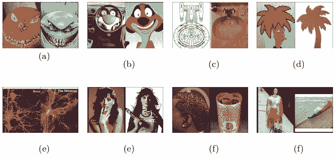
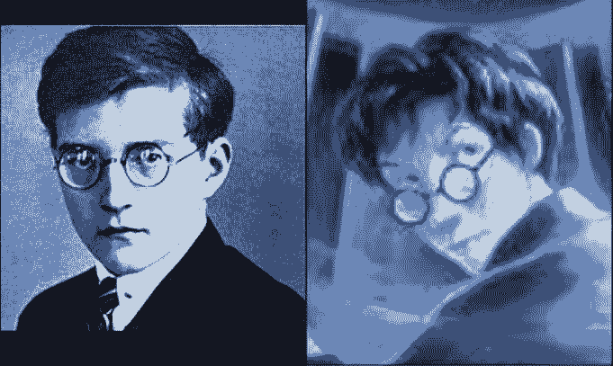
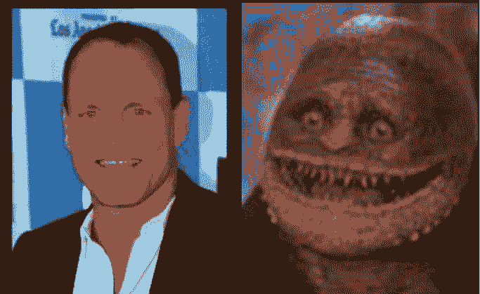
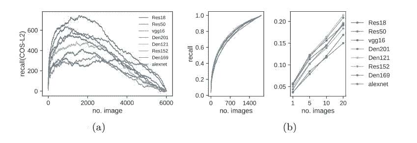
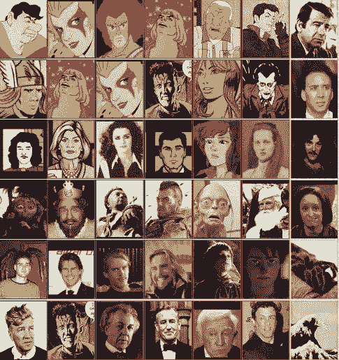
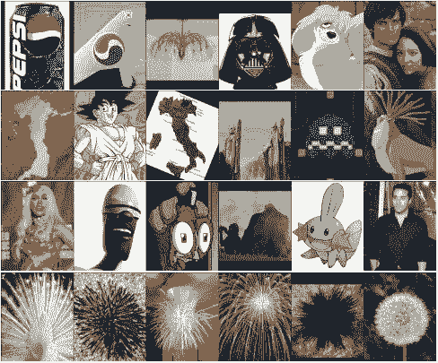
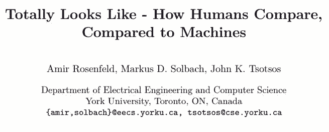

# 资源 | 图像配对数据集 TTL：展现人类和机器判断图像相似性的差异

选自 arXiv

**作者：****Amir Rosenfeld 等**

**机器之心编译**

**参与：刘晓坤、李泽南**

> 人类对图像相似性的知觉判断依赖于丰富的内部表征，现有的计算机视觉技术应用的信号类型可能过于狭隘。本文介绍了新型图像配对数据集 TTL，该数据集收集了很多人类在视觉上认为很相似的图像，而深度学习模型无法通过特征提取重构出相似的配对。该结果为未来的图像表征研究指出了新的方向。

数据集地址：https://sites.google.com/view/totally-looks-like-dataset

人类对图像的感知远远超出了物体、形状、纹理和轮廓这些因素。人们看到一个场景时通常会唤醒和当前场景在总体特征或关系上类似的其它场景。这种特性的实现依赖于大脑中的图像空间的丰富表征，包括场景结构、语义以及使用观察场景的表征来唤醒海量存储记忆中相似场景的机制。虽然尚未被完全理解，但人类的大脑的记忆容量是相当惊人的 [1,2]。对于近期深度学习在计算机视觉所有领域（包括图像检索和对比 [6]）的爆炸式发展 [3,4,5]，人们可能会认为计算机视觉的表征能力已经接近甚至超越了人类。为了探索这个问题，本文的研究测试了深度神经网络在一个新数据集（Totally-Looks-Like，TTL）的图像对上的相似性判断行为。如图 1 所示。

*图 1：Totally-Looks-Like 数据集例图：人类用户选出的知觉上相似的图像对。这些图像对隐含了人类在相似性判断时使用的丰富特征集，包括而不限于：物体和动物的面部特征属性（a,b）、整体形状相似性（c,d）、近似重复（d）、相似面部（e）、纹理相似性（f）、颜色相似性（g）等。*

该数据集基于一个娱乐性的网站，用户可以发布一对认为很相似的图片，并让网友发表看法。这些图片通常在低层特征上的相似性是很低的。这些图像对的类型包括（但不限于）多种画风的物体、场景、模式、动物和人脸，有素描、卡通以及自然图像。网站上还有用户评级功能（「赞」或「踩」），展示了网友对此图像对的相似性同意度。虽然该数据集规模不是很大，但其中图像的多样性和复杂度隐含地捕捉到了人类对图像相似性感知的很多层面。

网站链接：http://memebase.cheezburger.com/totallylookslike

作者以图像检索任务的形式，评估了多个当前最佳模型在该数据集上的表现，并将结果与人类的相似性判断行为进行了对比。该研究不仅构成了特征评估的一类新基准，并且揭示了当前深度学习表征方法的具体弱点，为未来研究指出了新的方向。作者还实施了人类评估实验来验证收集数据的一致性。虽然在一些实验中为深度学习模型设置了很好的条件，它们仍然无法正确地重构出人类选择的匹配图像。

*图 3：（a）各种当前最佳模型的基于余弦和 L2 距离的图像检索的每张图像召回率的对比。使用余弦距离得到的召回率总是比使用 L2 距离得到的召回率更高。（b）在 TTL 数据集中学习特征后得到的检索性能。左：使用所有图像进行检索的召回率；右：仅使用 top-1、5、10、20 图像进行检索的召回率。*

*图 4：自动检索误差：每一行的左边展示了一张参考图像，右边展示了一张正确的匹配图像。知觉相似性适用于卡通面部和真实面部的相似性判断（前 3 行），还有面部表情的灵活迁移（第 4 行）、局部区域的视觉相似性（最后两行，第 5 行的人的头发和蜘蛛腿相似，第 6 行的人的头发和海浪相似）。虽然这些检索得到的图像和参考图像在严格意义上有更高的相似性，人类还是一致认为最后一行的图像更加匹配。*

*图 5：每一行展示了左边的一张参考图像和其它 5 张匹配图像。某些匹配结果是高度集中于某张图像的，而某些匹配结果是均匀分布的。读者可以猜猜看，哪一行是第一种情况，哪一行是第二种情况（各有两行）。*

**论文：Totally Looks Like - How Humans Compare, Compared to Machines**

论文地址：https://arxiv.org/abs/1803.01485

**摘要：**人类对图像相似性的知觉判断依赖于丰富的内部表征，包括低级特征、高级特征、场景特性，甚至文化联想等。试图解释知觉相似性的已有方法和数据集使用的刺激信号并没有覆盖影响人类判断的所有因素。我们在这里介绍基于一个娱乐性网站构建的新数据集 Totally-Looks-Like（TTL），该数据集收集了很多人类在视觉上认为很相似的图像，其中包含了网站上采集的 6016 个图像对，拥有对人类而言足够的多样性和复杂度。我们做了实验试图从当前最佳的深度卷积神经网络提取的特征重构图像对，还做了人类判断实验以验证收集数据的一致性。虽然在一些实验中人工地为深度学习模型设置了很好的条件，但结果表明它们仍然无法通过提取的特征正确地重构和人类选择的匹配图像。我们讨论和分析了这些结果，为未来的图像表征研究指出了新的方向。 

****本文为机器之心编译，**转载请联系本公众号获得授权****。**

✄------------------------------------------------

**加入机器之心（全职记者/实习生）：hr@jiqizhixin.com**

**投稿或寻求报道：editor@jiqizhixin.com**

**广告&商务合作：bd@jiqizhixin.com**