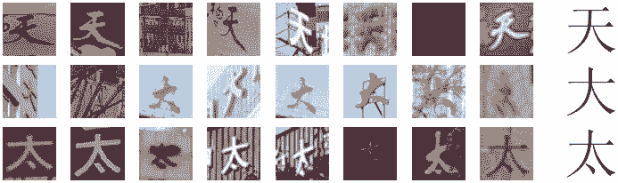
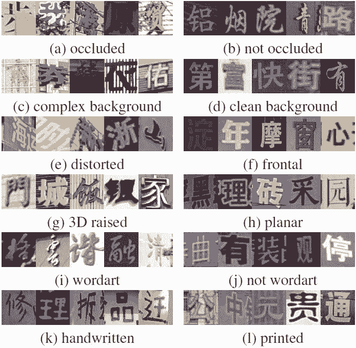
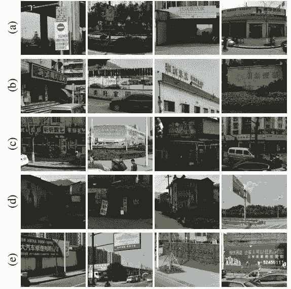
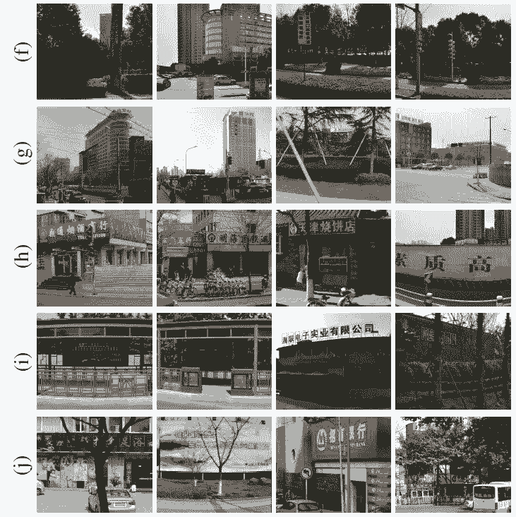
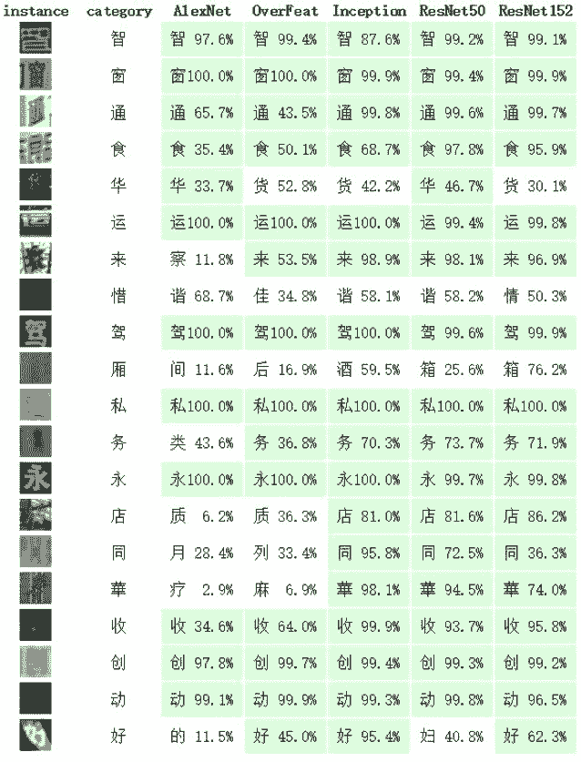
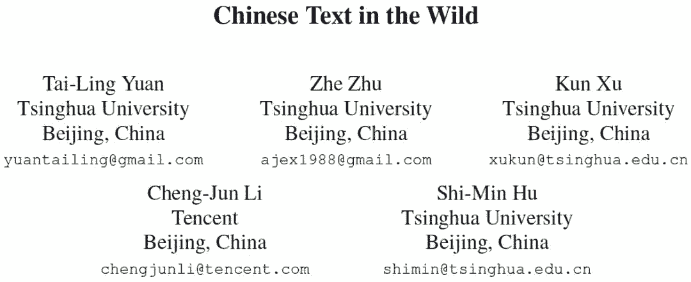

# 资源 | 百万级字符：清华大学提出中文自然文本数据集 CTW

选自 arXiv

**作者：Tailing Yuan 等**

**机器之心编译**

**参与：刘晓坤、李泽南**

> 文字识别一直是图像处理领域中的重要任务。近日，清华大学与腾讯共同推出了中文自然文本数据集（Chinese Text in the Wild，CTW）——一个超大的街景图片中文文本数据集，为训练先进的深度学习模型奠定了基础。目前，该数据集包含 32,285 张图像和 1,018,402 个中文字符，规模远超此前的同类数据集。研究人员表示，未来还将在此数据集之上推出基于业内最先进模型的评测基准。

资源链接：https://ctwdataset.github.io/

在计算机视觉领域中，自动化的文本检测和识别是一项很重要的任务，它拥有大量的应用方向，如自动驾驶和书籍数码化等。该问题已被广泛地研究过，并按难度等级分成了两个问题：文本图像的文本检测和识别，以及自然图像的文本检测和识别。前者更加简单，已有很多可用的商业工具。然而，自然图像的文本检测和识别仍然是很困难的。例如，一个字符可能在不同的图像中有很不同的外观，包括书写风格、字型、分辨率和照明差异等因素；字符还可能是部分显示的、扭曲的，或者有很复杂的背景，这些因素进一步加大了检测和识别的难度。有时候我们甚至需要处理高类内方差和低类间方差 [2]，如图 1 所示，有三个区别很小的字符，而相同字符的不同势力的外观可能差异很大。

*图 1：高类内方差和低类间方差。每一行展示了一个中文字符的多个实例。第一个字符和第二个相差一个笔画，同理，第二个字符和第三个相差一个笔画。虽然这三个字符在形状上很相似，而相同字符的多个实例可以有很不同的外观，包括颜色、字型和背景差异等。*

过去几年内，深度学习在很多领域都得到了爆炸式的发展，包括图像分类、语音识别等。拥有数十甚至上百层的深度网络（例如 VGG-19、Google Inception 或 ResNet）都有很不错的建模能力，在多种检测、分类、识别任务中都得到了很有潜力的表现。这些模型需要大量的训练数据。获取海量数据是深度神经网络成功的关键因素。诸如 Image-Net 数据集 [4]、微软 COCO 数据集 [13] 和 ADE20K 数据集 [33]，已成为计算机视觉进步的关键驱动力。

在本文中，清华大学的研究人员提出了一个自然图像的中文文本的大型数据集，称为 Chinese Text in the Wild（CTW）。该数据集包含 32,285 张图像和 1,018,402 个中文字符，规模远超之前的数据集。这些图像源于腾讯街景，从中国的几十个不同城市中捕捉得到，不带任何特定目的的偏好。由于其多样性和复杂性，使得该数据集的收集很困难。它包含了平面文本、凸出文本、城市街景文本、乡镇街景文本、弱照明条件下的文本、远距离文本、部分显示文本等。对于每张图像，数据集中都标注了所有中文字符。对每个中文字符，数据集都标注了其真实字符、边界框和 6 个属性以指出其是否被遮挡、有复杂的背景、被扭曲、3D 凸出、艺术化，和手写体等。

在相关论文《Chinese Text in the Wild》中，清华大学的研究人员以该数据集为基础训练了多种目前业内最先进的深度模型进行字符识别和字符检测。这些模型将作为基线算法为人们提供测试标准。研究人员表示，该数据集、源代码和基线算法将全部公开。新的数据集将极大促进自然图像中中文文本检测和识别算法的发展。

*图 2：标注流程：（a）为句子提取边界框，（b）为每个字符实例提取边界框，（c）标记其对应的字符类别，（d）标注字符的属性。*

*图 3：不同属性的例子。（a）遮挡，（b）未遮挡，（c）复杂背景，（d）简单背景，（e）扭曲，（f）工整，（g）3D 凸出，（h）平面，（i）艺术字，（j）非艺术字，（k）手写体，（l）打印体。*

*图 9：数据集多样性。（a）平面文本，（b）凸出文本，（c）城市街景文本，（d）乡镇街景文本，（e）水平文本，（f）垂直文本，（g）远距离文本，（h）近距离文本，（i）弱照明文本，（j）部分显示文本。*

*图 10：识别任务中的一些例子。每行从左到右给出的是：裁剪的实例区域、真实结果以及不同方法的识别结果。正确的结果为绿色显示，数字为置信度。*

**论文：Chinese Text in the Wild**

论文链接：https://arxiv.org/abs/1803.00085

**摘要：**我们提出了 Chinese Text in the Wild，这是一个街景图像内中文文本的超大型数据集。虽然文本图像的光学字符识别（OCR）已得到充分的研究，并有很多可用的商业工具，但是自然图像中的文本检测和识别仍然是很困难的问题，尤其是对于更复杂的字符集，例如中文文本。训练集的匮乏是很常见的问题，特别是对于需要大量训练数据的深度学习方法而言。

在本文中，我们将提供该新数据集的细节描述，其中包含专家标注的超过 3 万个街景图像的大约 100 万个中文字符。该数据集具有高度多样性，它包含了平面文本、凸出文本、城市街景文本、乡镇街景文本、弱照明条件下的文本、远距离文本、部分显示文本等。对于数据集中的每个字符，这些标注包含其真实字符、边界框及其他 6 个属性。这些属性指出其是否被遮挡、有复杂的背景、是否凸出、是手写体还是打印体等。该数据集的大规模和多样性使得其能适用于多种任务的鲁棒性神经网络训练，特别是检测和识别任务。我们使用多个当前最佳模型得到了基线测试结果，包括用 AlexNet、OverFeat、Google Inception 和 ResNet 执行字符识别，用 YOLOv2 执行字符检测。综合来说，Google Inception 在识别任务上达到了 80.5% top-1 准确率的最佳性能，而 YOLOv2 在检测任务上达到了 71.0% 的 mAP。我们将在网站上公布数据集、源代码和训练后的模型。 

****本文为机器之心编译，**转载请联系本公众号获得授权****。**

✄------------------------------------------------

**加入机器之心（全职记者/实习生）：hr@jiqizhixin.com**

**投稿或寻求报道：editor@jiqizhixin.com**

**广告&商务合作：bd@jiqizhixin.com**