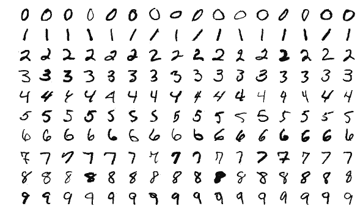
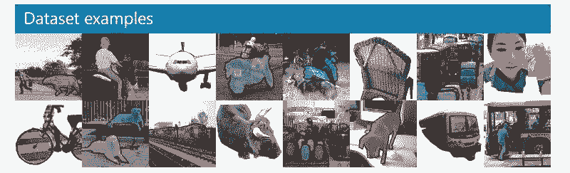
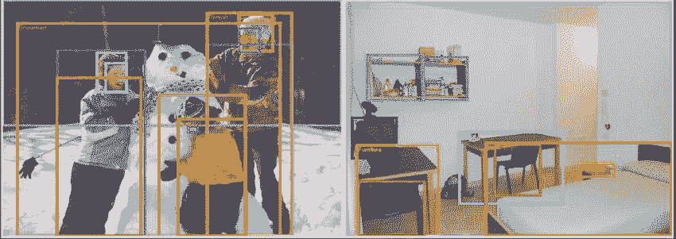
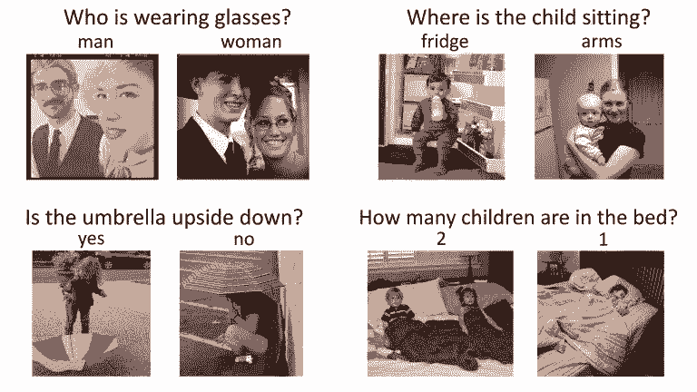
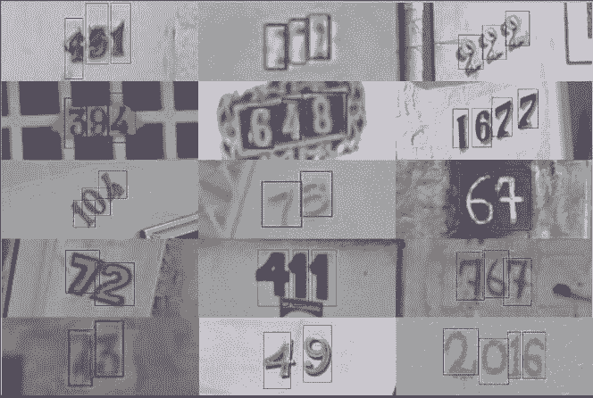
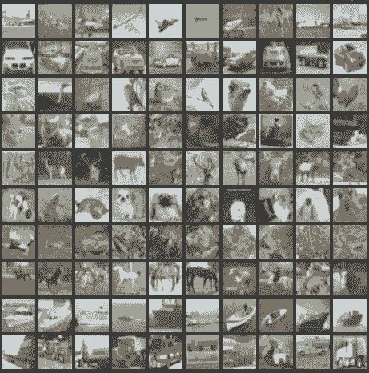
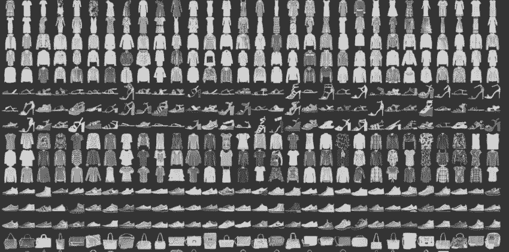
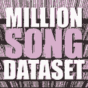

# 资源 | 从图像处理到语音识别，25 款数据科学家必知的深度学习开放数据集

选自 Analytics Vidhya

**作者：****Pranav Dar**

**机器之心编译**

**参与：****陈韵竹、路**

> 本文介绍了 25 个深度学习开放数据集，包括图像处理、自然语言处理、语音识别和实际问题数据集。

**介绍**

深度学习（或生活中大部分领域）的关键在于实践。你需要练习解决各种问题，包括图像处理、语音识别等。每个问题都有其独特的细微差别和解决方法。

但是，从哪里获得数据呢？现在许多论文都使用专有数据集，这些数据集通常并不对公众开放。如果你想学习并应用技能，那么无法获取合适数据集是个问题。

如果你面临着这个问题，本文可以为你提供解决方案。本文介绍了一系列公开可用的高质量数据集，每个深度学习爱好者都应该试试这些数据集从而提升自己的能力。在这些数据集上进行工作将让你成为一名更好的数据科学家，你在其中学到的知识将成为你职业生涯中的无价之宝。我们同样介绍了具备当前最优结果的论文，供读者阅读，改善自己的模型。

**如何使用这些数据集？**

首先，你得明白这些数据集的规模非常大！因此，请确保你的网络连接顺畅，在下载时数据量没有或几乎没有限制。

使用这些数据集的方法多种多样，你可以应用各种深度学习技术。你可以用它们磨炼技能、了解如何识别和构建各个问题、思考独特的使用案例，也可以将你的发现公开给大家！

数据集分为三类——图像处理、自然语言处理和音频/语音处理。

让我们一起看看吧！

**图像处理数据集**

**MNIST**

链接：https://datahack.analyticsvidhya.com/contest/practice-problem-identify-the-digits/

MNIST 是最流行的深度学习数据集之一。这是一个手写数字数据集，包含一个有着 60000 样本的训练集和一个有着 10000 样本的测试集。对于在现实世界数据上尝试学习技术和深度识别模式而言，这是一个非常好的数据库，且无需花费过多时间和精力进行数据预处理。

大小：约 50 MB

数量：70000 张图像，共分为 10 个类别。

SOTA：《Dynamic Routing Between Capsules》

参考阅读：

*   [终于，Geoffrey Hinton 那篇备受关注的 Capsule 论文公开了](http://mp.weixin.qq.com/s?__biz=MzA3MzI4MjgzMw==&mid=2650732472&idx=1&sn=259e5aa77b62078ffa40be9655da0802&chksm=871b33c6b06cbad0748571c9cb30d15e9658c7509c3a6e795930eb86a082c270d0a7af1e3aa2&scene=21#wechat_redirect)

*   [浅析 Geoffrey Hinton 最近提出的 Capsule 计划](http://mp.weixin.qq.com/s?__biz=MzA3MzI4MjgzMw==&mid=2650731207&idx=1&sn=db9b376df658d096f3d1ee71179d9c8a&chksm=871b36b9b06cbfafb152abaa587f6730716c5069e8d9be4ee9def055bdef089d98424d7fb51b&scene=21#wechat_redirect)

*   [先读懂 CapsNet 架构然后用 TensorFlow 实现，这应该是最详细的教程了](http://mp.weixin.qq.com/s?__biz=MzA3MzI4MjgzMw==&mid=2650732855&idx=1&sn=87319e9390200f24dfd2faff4d7d364a&chksm=871b3d49b06cb45fd8a68d003310b05562d9f8ff094ed08345f112e4450f7e66e6cf71c5b571&scene=21#wechat_redirect)

*   [Capsule 官方代码开源之后，机器之心做了份核心代码解读](http://mp.weixin.qq.com/s?__biz=MzA3MzI4MjgzMw==&mid=2650737203&idx=1&sn=43c2b6f0e62f8c4aa3f913aa8b9c9620&chksm=871ace4db06d475be8366969d74c4b2250602f5e262a3f97a5faf2183e53474d3f9fd6763308&scene=21#wechat_redirect)

**MS-COCO**

链接：http://cocodataset.org/#home

COCO 是一个大型数据集，用于目标检测、分割和标题生成。它有以下几个特征：

*   目标分割

*   在语境中识别

*   超像素物品分割

*   33 万张图像（其中超过 20 万张是标注图像）

*   150 万个目标实例

*   80 个目标类别

*   91 个物品分类

*   每张图像有 5 个标题

*   25 万张带有关键点的人像

大小：约 25 GB（压缩后）

数量：33 万张图像、80 个目标类别、每张图像 5 个标题、25 万张带有关键点的人像

SOTA：《Mask R-CNN》

参考阅读：

[学界 | Facebook 新论文提出通用目标分割框架 Mask R-CNN：更简单更灵活表现更好](http://mp.weixin.qq.com/s?__biz=MzA3MzI4MjgzMw==&mid=2650724526&idx=2&sn=10ccdf74b480da89fce21ca7501718c1&chksm=871b1cd0b06c95c60c0a03580f5a21abd03c06193f1ac67440e6fb69609af5e7b7c029355568&scene=21#wechat_redirect)

[深度 | 用于图像分割的卷积神经网络：从 R-CNN 到 Mask R-CNN](http://mp.weixin.qq.com/s?__biz=MzA3MzI4MjgzMw==&mid=2650725842&idx=2&sn=e18500166c6108d7194588befba061a4&chksm=871b19acb06c90ba9c19ba73719d375c4fe1f378f9bccae82e508c34a20c7513c55a84d3441b&scene=21#wechat_redirect)

[资源 | Mask R-CNN 神应用：像英剧《黑镜》一样屏蔽人像](http://mp.weixin.qq.com/s?__biz=MzA3MzI4MjgzMw==&mid=2650740099&idx=2&sn=48990251109e0c23a70ffc99eb5da930&chksm=871ad1fdb06d58eb8bcabc69c4f86103b7009d64ffc3677873e793897fb2f2eaeb0a77822113&scene=21#wechat_redirect)

**ImageNet**

链接：http://www.image-net.org/

ImageNet 是根据 WordNet 层次来组织的图像数据集。WordNet 包含大约 10 万个短语，而 ImageNet 为每个短语提供平均约 1000 张描述图像。

大小：约 150 GB

数量：图像的总数约为 1,500,000；每一张图像都具备多个边界框和各自的类别标签。

SOTA：《Aggregated Residual Transformations for Deep Neural Networks》（https://arxiv.org/pdf/1611.05431.pdf）

**Open Images 数据集**

链接：https://github.com/openimages/dataset

Open Images 是一个包含近 900 万个图像 URL 的数据集。这些图像使用包含数千个类别的图像级标签边界框进行了标注。该数据集的训练集包含 9,011,219 张图像，验证集包含 41,260 张图像，测试集包含 125,436 张图像。

大小：500GB（压缩后）

数量：9,011,219 张图像，带有超过 5000 个标签

SOTA：Resnet 101 image classification model (trained on V2 data)：

*   模型检查点：https://storage.googleapis.com/openimages/2017_07/oidv2-resnet_v1_101.ckpt.tar.gz

*   Checkpoint readme：https://storage.googleapis.com/openimages/2017_07/oidv2-resnet_v1_101.readme.txt

*   推断代码：https://github.com/openimages/dataset/blob/master/tools/classify_oidv2.py

**VisualQA**

链接：http://www.visualqa.org/

VQA 是一个包含图像开放式问题的数据集。这些问题的解答需要视觉和语言的理解。该数据集拥有下列有趣的特征：

*   265,016 张图像（COCO 和抽象场景）

*   每张图像至少包含 3 个问题（平均有 5.4 个问题）

*   每个问题有 10 个正确答案

*   每个问题有 3 个看似合理（却不太正确）的答案

*   自动评估指标

大小：25GB（压缩后）

数量：265,016 张图像，每张图像至少 3 个问题，每个问题 10 个正确答案

SOTA：《Tips and Tricks for Visual Question Answering: Learnings from the 2017 Challenge》（https://arxiv.org/abs/1708.02711）

**街景门牌号数据集（SVHN）**

链接：http://ufldl.stanford.edu/housenumbers/

这是一个现实世界数据集，用于开发目标检测算法。它需要最少的数据预处理过程。它与 MNIST 数据集有些类似，但是有着更多的标注数据（超过 600,000 张图像）。这些数据是从谷歌街景中的房屋门牌号中收集而来的。

大小：2.5GB

数量：6,30,420 张图像，共 10 类

SOTA：《Distributional Smoothing With Virtual Adversarial Training》（https://arxiv.org/pdf/1507.00677.pdf）

这篇论文中，日本京都大学提出了局部分布式平滑度（LDS），一个关于统计模型平滑度的新理念。它可被用作正则化从而提升模型分布的平滑度。该方法不仅在 MNIST 数据集上解决有监督和半监督学习任务时表现优异，而且在 SVHN 和 NORB 数据上，Test Error 分别取得了 24.63 和 9.88 的分值。以上证明了该方法在半监督学习任务上的表现明显优于当前最佳结果。

**CIFAR-10**

链接：http://www.cs.toronto.edu/~kriz/cifar.html

该数据集也用于图像分类。它由 10 个类别共计 60,000 张图像组成（每个类在上图中表示为一行）。该数据集共有 50,000 张训练集图像和 10,000 个测试集图像。数据集分为 6 个部分——5 个训练批和 1 个测试批。每批含有 10,000 张图像。

大小：170MB

数量：60,000 张图像，共 10 类

SOTA：《ShakeDrop regularization》（https://openreview.net/pdf?id=S1NHaMW0b）

**Fashion-MNIST**

链接：https://github.com/zalandoresearch/fashion-mnist

Fashion-MNIST 包含 60,000 个训练集图像和 10,000 个测试集图像。它是一个类似 MNIST 的时尚产品数据库。开发人员认为 MNIST 的使用次数太多了，因此他们把这个数据集用作 MNIST 的直接替代品。每张图像都以灰度显示，并具备一个标签（10 个类别之一）。

大小：30MB

数量：70,000 张图像，共 10 类

SOTA：《Random Erasing Data Augmentation》（https://arxiv.org/abs/1708.04896）

**自然语言处理**

**IMDB 电影评论数据集**

链接：http://ai.stanford.edu/~amaas/data/sentiment/

该数据集对于电影爱好者而言非常赞。它用于二元情感分类，目前所含数据超过该领域其他数据集。除了训练集评论样本和测试集评论样本之外，还有一些未标注数据可供使用。此外，该数据集还包括原始文本和预处理词袋格式。

大小：80 MB

数量：训练集和测试集各包含 25,000 个高度两极化的电影评论

SOTA：《Learning Structured Text Representations》（https://arxiv.org/abs/1705.09207）

**Twenty Newsgroups 数据集**

链接：https://archive.ics.uci.edu/ml/datasets/Twenty+Newsgroups

顾名思义，该数据集涵盖新闻组相关信息，包含从 20 个不同新闻组获取的 20000 篇新闻组文档汇编（每个新闻组选取 1000 篇）。这些文章有着典型的特征，例如标题、导语。

大小：20MB

数量：来自 20 个新闻组的 20,000 篇报道

SOTA：《Very Deep Convolutional Networks for Text Classification》（https://arxiv.org/abs/1606.01781）

**Sentiment140**

链接：http://help.sentiment140.com/for-students/

Sentiment140 是一个用于情感分析的数据集。这个流行的数据集能让你完美地开启自然语言处理之旅。数据中的情绪已经被预先清空。最终的数据集具备以下六个特征：

*   推文的情绪极性

*   推文的 ID

*   推文的日期

*   查询

*   推特的用户名

*   推文的文本

大小：80MB（压缩后）

数量： 1,60,000 篇推文

SOTA：《Assessing State-of-the-Art Sentiment Models on State-of-the-Art Sentiment Datasets》（http://www.aclweb.org/anthology/W17-5202）

**WordNet**

链接：https://wordnet.princeton.edu/

上文介绍 ImageNet 数据集时提到，WordNet 是一个大型英语 synset 数据库。Synset 也就是同义词组，每组描述的概念不同。WordNet 的结构让它成为 NLP 中非常有用的工具。

大小：10 MB

数量：117,000 个同义词集，它们通过少量的「概念关系」与其他同义词集相互关联

SOTA：《Wordnets: State of the Art and Perspectives》（https://aclanthology.info/pdf/R/R11/R11-1097.pdf）

**Yelp 数据集**

链接：https://www.yelp.com/dataset

这是 Yelp 出于学习目的而发布的开放数据集。它包含数百万个用户评论、商业属性（businesses attribute）和来自多个大都市地区的超过 20 万张照片。该数据集是全球范围内非常常用的 NLP 挑战赛数据集。

大小：2.66 GB JSON、2.9 GB SQL 和 7.5 GB 的照片（全部压缩后）

数量：5,200,000 个评论、174,000 份商业属性、200,000 张照片和 11 个大都市地区

SOTA：《Attentive Convolution》（https://arxiv.org/pdf/1710.00519.pdf）

**Wikipedia Corpus**

链接：http://nlp.cs.nyu.edu/wikipedia-data/

该数据集是维基百科全文的集合，包含来自超过 400 万篇文章的将近 19 亿单词。你能逐单词、逐短语、逐段地对其进行检索，这使它成为强大的 NLP 数据集。

大小：20 MB

数量：4,400,000 篇文章，包含 19 亿单词

SOTA：《Breaking The Softmax Bottelneck: A High-Rank RNN language Model》（https://arxiv.org/pdf/1711.03953.pdf）

**Blog Authorship Corpus**

链接：http://u.cs.biu.ac.il/~koppel/BlogCorpus.htm

该数据集包含从数千名博主那里收集到的博客文章，这些数据从 blogger.com 中收集而来。每篇博客都以一个单独的文件形式提供。每篇博客至少出现 200 个常用的英语单词。

大小：300 MB

数量：681,288 篇博文，共计超过 1.4 亿单词。

SOTA：《Character-level and Multi-channel Convolutional Neural Networks for Large-scale Authorship Attribution》（https://arxiv.org/pdf/1609.06686.pdf）

**欧洲语言机器翻译数据集**

链接：http://statmt.org/wmt18/index.html

该数据集包含四种欧洲语言的训练数据，旨在改进当前的翻译方法。你可以使用以下任意语言对：

*   法语 - 英语

*   西班牙语 - 英语

*   德语 - 英语

*   捷克语 - 英语

大小： 约 15 GB

数量：约 30,000,000 个句子及对应的译文

SOTA：《Attention Is All You Need》

参考阅读：

[学界 | 机器翻译新突破：谷歌实现完全基于 attention 的翻译架构](http://mp.weixin.qq.com/s?__biz=MzA3MzI4MjgzMw==&mid=2650727887&idx=5&sn=a5991e49a4b1df2ea70ddbb84631ff9c&chksm=871b21b1b06ca8a71be9ec7ee1d7d5ef46eef1116c3d396f3cc467b95186d278bcdd8e6ac07c&scene=21#wechat_redirect)

[资源 | 谷歌全 attention 机器翻译模型 Transformer 的 TensorFlow 实现](http://mp.weixin.qq.com/s?__biz=MzA3MzI4MjgzMw==&mid=2650728136&idx=4&sn=04d55487be6ad40bfc87e8f849f5d2d0&chksm=871b22b6b06caba0258a749290b1824b1bb47a18563e69554d99e06593a8549b88c0f1f8c0c9&scene=21#wechat_redirect)

**音频/语音数据集**

**Free Spoken Digit 数据集**

链接：https://github.com/Jakobovski/free-spoken-digit-dataset

这是本文又一个受 MNIST 数据集启发而创建的数据集！该数据集旨在解决识别音频样本中口述数字的任务。这是一个公开数据集，所以希望随着人们继续提供数据，它会不断发展。目前，它具备以下特点：

*   3 种人声

*   1500 段录音（每个人口述 0- 9 各 50 次）

*   英语发音

大小： 10 MB

数量： 1500 个音频样本

SOTA：《Raw Waveform-based Audio Classification Using Sample-level CNN Architectures》（https://arxiv.org/pdf/1712.00866）

**Free Music Archive (FMA)**

链接：https://github.com/mdeff/fma

FMA 是音乐分析数据集，由整首 HQ 音频、预计算的特征，以及音轨和用户级元数据组成。它是一个公开数据集，用于评估 MIR 中的多项任务。以下是该数据集包含的 csv 文件及其内容：

*   tracks.csv：记录每首歌每个音轨的元数据，例如 ID、歌名、演唱者、流派、标签和播放次数，共计 106,574 首歌。

*   genres.csv：记录所有 163 种流派的 ID 与名称及上层风格名（用于推断流派层次和上层流派）。

*   features.csv：记录用 librosa 提取的常见特征。

*   echonest.csv：由 Echonest（现在的 Spotify）为 13,129 首音轨的子集提供的音频功能。

大小：约 1000 GB

数量：约 100,000 个音轨

SOTA：《Learning to Recognize Musical Genre from Audio》（https://arxiv.org/pdf/1803.05337.pdf）

**Ballroom**

链接：http://mtg.upf.edu/ismir2004/contest/tempoContest/node5.html

该数据集包含舞厅的舞曲音频文件。它以真实音频格式提供了许多舞蹈风格的一些特征片段。以下是该数据集的一些特点：

*   实例总数：698

*   单段时长：约 30 秒

*   总时长：约 20940 秒

大小：14 GB（压缩后）

数量：约 700 个音频样本

SOTA：《A Multi-Model Approach To Beat Tracking Considering Heterogeneous Music Styles》（https://pdfs.semanticscholar.org/0cc2/952bf70c84e0199fcf8e58a8680a7903521e.pdf）

**Million Song 数据集**

链接：https://labrosa.ee.columbia.edu/millionsong/

Million Song 数据集包含一百万首当代流行音乐的音频特征和元数据，可免费获取。其目的是：

*   鼓励研究商业规模的算法

*   为评估研究提供参考数据集

*   作为使用 API 创建大型数据集的捷径（例如 The Echo Nest API）

*   帮助入门级研究人员在 MIR 领域展开工作

数据集的核心是一百万首歌曲的特征分析和元数据。该数据集不包含任何音频，只包含导出要素。示例音频可通过哥伦比亚大学提供的代码（https://github.com/tb2332/MSongsDB/tree/master/Tasks_Demos/Preview7digital）从 7digital 等服务中获取。

大小：280 GB

数量：一百万首歌曲！

SOTA：《Preliminary Study on a Recommender System for the Million Songs Dataset Challenge》（http://www.ke.tu-darmstadt.de/events/PL-12/papers/08-aiolli.pdf）

**LibriSpeech**

链接：http://www.openslr.org/12/

该数据集是一个包含约 1000 小时英语语音的大型语料库。数据来源为 LibriVox 项目的音频书籍。该数据集已经得到了合理地分割和对齐。如果你还在寻找起始点，那么点击 http://www.kaldi-asr.org/downloads/build/6/trunk/egs/查看在该数据集上训练好的声学模型，点击 http://www.openslr.org/11/查看适合评估的语言模型。

大小：约 60 GB

数量：1000 小时的语音

SOTA：《Letter-Based Speech Recognition with Gated ConvNets》（https://arxiv.org/abs/1712.09444）

**VoxCeleb **

链接：http://www.robots.ox.ac.uk/~vgg/data/voxceleb/

VoxCeleb 是一个大型人声识别数据集。它包含来自 YouTube 视频的 1251 位名人的约 10 万段语音。数据基本上是性别平衡的（男性占 55％）。这些名人有不同的口音、职业和年龄。开发集和测试集之间没有重叠。对大明星所说的话进行分类并识别——这是一项有趣的工作。

大小：150 MB

数量：1251 位名人的 100,000 条语音

SOTA：《VoxCeleb: a large-scale speaker identification dataset》（https://www.robots.ox.ac.uk/~vgg/publications/2017/Nagrani17/nagrani17.pdf）

为了帮助你练习，我们还提供了一些真实生活问题和数据集，供读者上手操作。这一部分，我们列举了 DataHack 平台上关于深度学习的问题。

**推特情感分析数据集**

链接：https://datahack.analyticsvidhya.com/contest/practice-problem-twitter-sentiment-analysis/

涉及种族主义和性别歧视的偏激言论已成为 Twitter 的难题，因此将这类推文与其它推文分开已十分重要。在这个实际问题中，我们提供的 Twitter 数据包含普通言论和偏激言论。作为数据科学家，你的任务是确定哪些推文是偏激型推文，哪些不是。

大小： 3 MB

数量： 31,962 篇推文

**印度演员年龄检测数据集**

链接：https://datahack.analyticsvidhya.com/contest/practice-problem-age-detection/

对于深度学习爱好者来说，这是一个令人着迷的挑战。该数据集包含数千名印度演员的图像，你的任务是确定他们的年龄。所有图像都由人工从视频帧中挑选和剪切而来，这导致规模、姿势、表情、亮度、年龄、分辨率、遮挡和妆容具有高度可变性。

大小：48 MB（压缩后）

数量：训练集中有 19,906 幅图像，测试集中有 6636 幅图像

**城市声音分类数据集**

链接：https://datahack.analyticsvidhya.com/contest/practice-problem-urban-sound-classification/

该数据集包含超过 8000 个来自 10 个类别的城市声音片段。这个实际问题旨在向你介绍常见分类场景中的音频处理。

大小：训练集 - 3 GB（压缩后）、测试集 - 2 GB（压缩后）

数量：来自 10 个类别的 8732 个标注城市声音片段（单个片段音频时长 <= 4s）

*原文链接：https://www.analyticsvidhya.com/blog/2018/03/comprehensive-collection-deep-learning-datasets/*

****本文为机器之心编译，**转载请联系本公众号获得授权****。**

✄------------------------------------------------

**加入机器之心（全职记者/实习生）：hr@jiqizhixin.com**

**投稿或寻求报道：editor@jiqizhixin.com**

**广告&商务合作：bd@jiqizhixin.com**