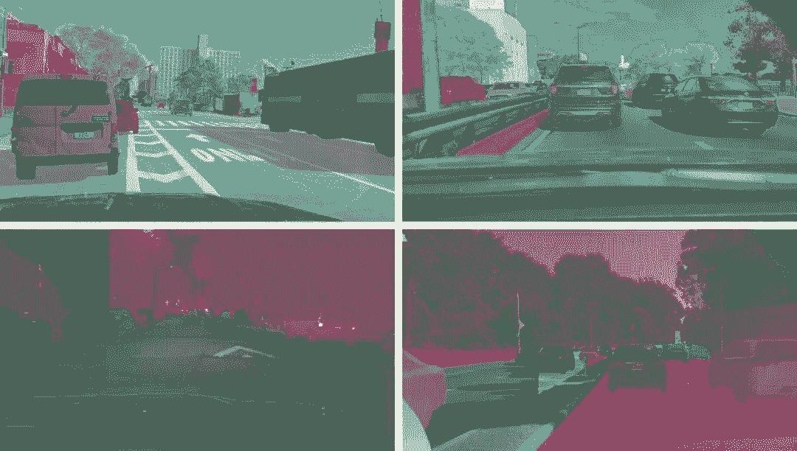

# 资源 | 伯克利发布 BDD100K：目前最大规模开放驾驶视频数据集

选自 BAIR Blog

**作者：Fisher Yu**

**机器之心编译**

**参与：张倩、路雪**

> 近日，UC Berkeley 发布了迄今为止规模最大、最多样化的开放驾驶视频数据集——BDD100K。该数据集共包含 10 万个视频，BAIR 研究者在视频上采样关键帧，并为这些关键帧提供注释。此外，BAIR 还将在 CVPR 2018 自动驾驶 Workshop 上基于其数据举办三项挑战赛。

[`v.qq.com/iframe/preview.html?vid=m0672lnmy85&width=500&height=375&auto=0`](https://v.qq.com/iframe/preview.html?vid=m0672lnmy85&width=500&height=375&auto=0)

**大规模、多样化、驾驶、视频：四合一**

自动驾驶将改变每个社区的生活。然而，最近的事件表明，在自动驾驶系统部署到现实世界中后，人造感知系统如何避免错误（甚至看似明显的错误）还不得而知。BAIR 的计算机视觉研究者有兴趣探索自动驾驶感知算法的前沿，以使其更加安全。为了设计和测试潜在的算法，研究者想利用真实驾驶平台收集数据中的所有信息。这种数据有四个主要特点：大规模、多样化、在街上采集、具有时间信息。数据多样性对于测试感知算法的鲁棒性尤为重要。但是，当前的开放数据集只能覆盖上述属性的一部分。因此，在 Nexar 的帮助下，BAIR 将发布 BDD100K 数据库，这是迄今为止用于计算机视觉研究的最大、最多样化的开放驾驶视频数据集。该项目由伯克利 DeepDrive 产业联盟组织和赞助，该联盟研究计算机视觉和机器学习在汽车应用上的最新技术。

*随机视频子集的位置。*

顾名思义，该数据集共包含 10 万个视频。每个视频大约 40 秒长、720 p、30 fps，还附有手机记录的 GPS/IMU 信息，以显示大概的驾驶轨迹。这些视频是从美国各地收集的，如上图所示。数据库涵盖了不同的天气条件，包括晴天、阴天和雨天，以及白天和晚上的不同时间。下表总结了与以前数据集的对比结果，表明 BAIR 的数据集更大、更多样化。

*与其他街道场景数据集的对比结果。很难在数据集之间公平地比较 # images，但在此将其列出作为粗略参考。*

正如 2017 年的 CVPR 论文（https://arxiv.org/abs/1612.01079）中提到的一样，这些视频和它们的轨迹对于模仿学习驾驶规则是有用的。为了促进研究者在 BDD100K 这一大规模数据集上进行计算机视觉研究，BAIR 还提供了视频关键帧的基本注释，详见下一节。

数据和注释下载地址：http://bdd-data.berkeley.edu

**注释**

BAIR 研究者在每个视频的第 10 秒采样关键帧，并为这些关键帧提供注释。它们被标记为几个级别：图像标记、道路对象边界框、可驾驶区域、车道标记线和全帧实例分割。这些注释有助于理解不同场景中数据和对象统计的多样性。BAIR 将在另一篇博文中讨论标注过程。有关注释的更多信息，请参见 BAIR 的 arXiv 报告：https://arxiv.org/abs/1805.04687。

*注释概览*

**道路目标检测**

为了解对象的分布及其位置，BAIR 研究者为所有 10 万个关键帧中常出现在道路上的对象标记了对象边界框。下面的条形图显示对象计数。在注释中还有其他处理统计数据的方法。例如，我们可以比较不同天气条件下或不同场景中的对象数量。此图还显示了数据集中出现的各种对象集，以及数据集的规模——超过 100 万辆汽车。这里应该提醒读者，这些是具有不同外观和语境的不同对象。

*不同类型对象的数据。*

该数据集也适用于研究某些特定的领域。例如，如果你对检测和避开街道上的行人感兴趣，可以考虑研究该数据集，因为它包含的行人实例比以前的专门数据集还要多，如下表所示：

*与其他行人数据集的训练集规模对比结果。*

**车道线**

车道线对于人类司机而言是重要的道路指示。它们也是驾驶方向的重要线索，以及在 GPS 或地图没有准确覆盖全球时，帮助自动驾驶系统准确定位。BAIR 研究者根据车道线对车辆的指示作用将车道线分成两种类型。垂直车道线（下图红色标记）表示车辆驾驶方向，平行车道线（下图蓝色标记）表示车辆在此车道要停下。BAIR 研究者还为车道线提供属性，如实线 vs. 虚线、双线 vs. 单线。

如果你准备好试用自己的车道线预测算法，那么开始吧。下面是现有车道线数据集的对比结果：

**可驾驶区域**

我们能否在某条路上驾驶取决于车道线、交通设备，以及与道路上其他对象的复杂互动。总之，理解哪块区域适合驾驶非常重要。为了研究该问题，BAIR 提供了可驾驶区域的分割注释，如下图所示。BAIR 根据 ego vehicle 将可驾驶区域分割成两个类别：直接可驾驶和替代可驾驶。直接可驾驶（标记为红色）即 ego vehicle 具备道路优先权，可以在该区域驾驶。替代可驾驶（标记为蓝色）即 ego vehicle 可在该区域驾驶，但是必须小心，因为这段路的优先权属于其他车辆。

**全帧分割**

研究者已经证明在 Cityscapes 数据集上，全帧实例分割可以大大促进密集预测和目标检测方面的研究，而这二者是计算机视觉应用中的重要部分。由于 BAIR 的视频是不同的领域，因此 BAIR 也提供实例分割注释，以对比不同数据集上的域变换（domain shift）。获取全像素级别的分割结果成本高，且耗费大量劳动。幸运的是，使用 BAIR 的标注工具后，标注成本可以减少 50%。最后，BAIR 给包含一万张图像的数据子集进行了全帧实例分割。标注集与 Cityscapes 数据集中的训练注释是兼容的，这样便于研究两个数据集之间的域变换。

**自动驾驶挑战赛**

BAIR 将在 CVPR 2018 自动驾驶 Workshop 上基于其数据举办三项挑战赛：道路目标检测、可驾驶区域预测和语义分割域适应。检测任务要求算法找出 BAIR 测试图像上的所有目标对象。可驾驶区域预测要求分割出汽车可以驾驶的区域。域适应中的测试数据是从中国收集的，因此系统必须使在美国数据中训练的模型在中国北京的拥挤街道上仍然能够运行。查看工具包（https://github.com/ucbdrive/bdd-data），赶快参与吧！

**未来工作展望**

自动驾驶感知系统绝不仅仅关于单目视频。它还可能包括全景视频和立体视频，以及其他类型的感知器，如 LiDAR 和雷达。BAIR 希望能在不久的未来提供和研究多模态感知器数据。

*原文链接：http://bair.berkeley.edu/blog/2018/05/30/bdd/*

****本文为机器之心编译，**转载请联系本公众号获得授权****。**

✄------------------------------------------------

**加入机器之心（全职记者/实习生）：hr@jiqizhixin.com**

**投稿或寻求报道：**content**@jiqizhixin.com**

**广告&商务合作：bd@jiqizhixin.com**