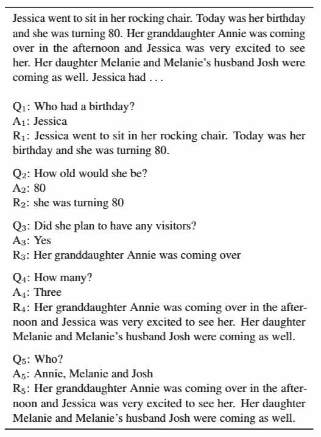
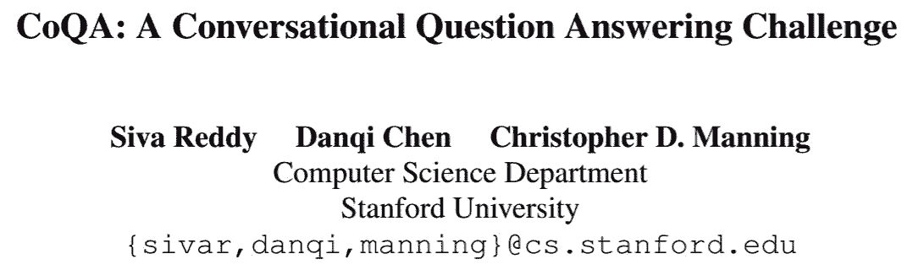
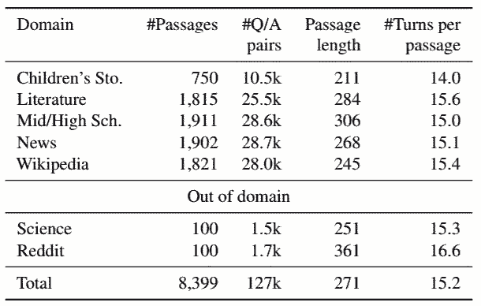
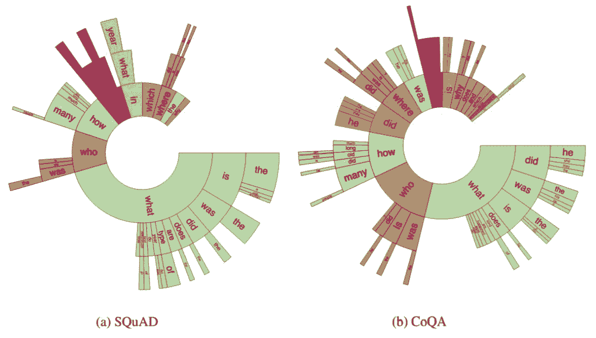
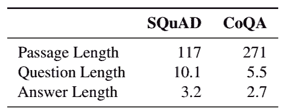
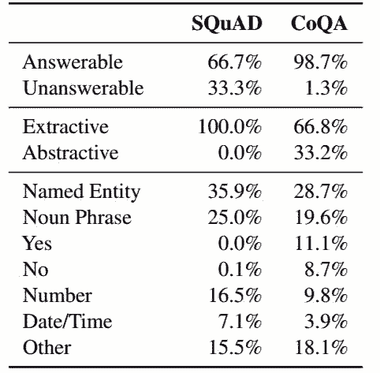
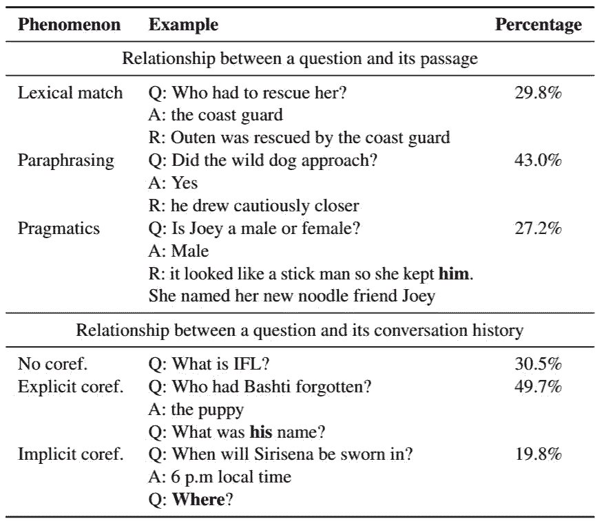
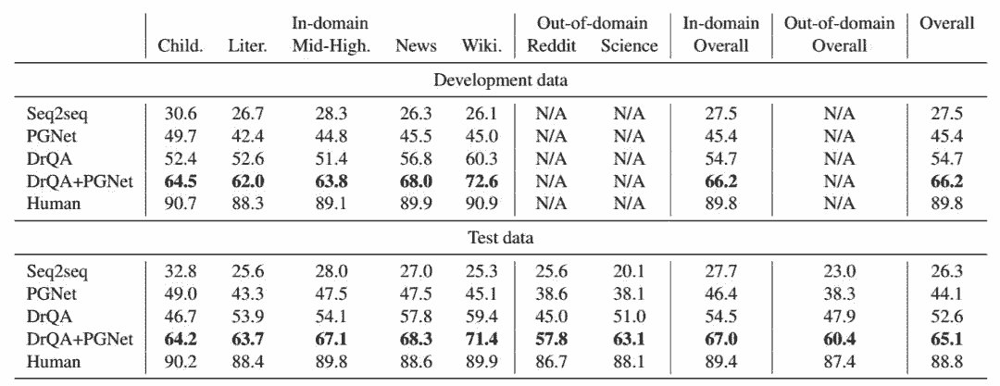

# 资源 | 让 AI 学会刨根问底和放飞自我，斯坦福最新问答数据集 CoQA

选自 arXiv

**作者：****Siva Reddy、Danqi Chen、Christopher D. Manning **

**机器之心编译**

**参与：白悦、王淑婷**

> 以往的对话问答数据集，大多把答案限定在了给定段落的范围内，这种答案有时候不仅不自然，而且还要依赖问题与段落之间的词汇相似性。导致机器有时答非所问，显得有点笨拙。本文提出的一种新型对话数据集 CoQA，囊括来自 7 个不同领域的文本段落里 8000 个对话中的 127,000 轮问答，内容丰富。而且该问答系统支持自由形式的答案，使机器回答问题不再那么一板一眼，而是灵活多样。

我们通常以提问的方式来向别人求解或测试对方。然后根据对方的回答，我们会继续提问，然后他们又基于之前的讨论来回答。这种循序渐进的方式使对话变得简洁明了。无法建立和维持这种问答方式是虚拟助手无法成为可靠对话伙伴的部分原因。本文提出了 CoQA，一个衡量机器参与问答式对话能力的对话问答数据集。在 CoQA 中，机器必须理解文本段落并回答对话中出现的一系列问题。研究人员开发 CoQA 时主要考虑了三个主要目标。

*图 1：CoQA 数据集中的一个对话。每个回合都包含一个问题（Qi），一个答案（Ai）和支持答案的理由（Ri）。*

首先要考虑的是人类对话中问题的性质。图 1 显示了正在阅读文章的两个人之间的对话，其中一个为提问者，另一个为回答者。在此次对话中，第一个问题之后的每个问题都是基于之前的对话。例如，Q5（Who？）只有一个单词，如果不知道之前的对话是不可能回答的。提出简短的问题对人类来说是一种有效的沟通方式，但对机器来说却是一种痛苦。众所周知，即使是最先进的模型在很大程度上也要依赖于问题与段落之间的词汇相似性（Chen et al., 2016; Weissenborn et al., 2017）。而目前，包含基于对话历史的问题的大规模阅读理解数据集（见表 1）仍未出现，而这正是 CoQA 的主要开发目的。

*表 1：CoQA 与现有大型阅读理解数据集的比较（约 10 万多个问题）。*

CoQA 的第二个目标是确保对话中答案的自然性。很多现有的 QA 数据集把答案限制在给定段落的连续范围内，也被称之为可提取答案（表 1）。这样的答案有时候不是很自然，例如，图 1 中 Q4（How many？）就没有可提取答案。在 CoQA 中，答案可以是自由形式的文本（抽象答案），而提取跨度则作为实际答案的参照。因此，Q4 的答案虽然只是简单的『Three』，但却是参照多句话所得出的结论。

CoQA 的第三个目标是构建跨域稳定执行的 QA 系统。当前的 QA 数据集主要集中在单个域上，所以难以测试现有模型的泛化能力。因此，研究人员从七个不同的领域收集数据集——儿童故事、文学、中学和高中英语考试、新闻、维基百科、科学和 Reddit。最后两个用于域外评估。

总而言之，CoQA 具有以下主要特征：

*   通过文本段落从 8000 个对话中收集了 127，000 轮问答（每段约一个对话）。平均会话长度为 15 回合，每回合包含一个问题和一个答案。

*   自由形式的答案。每个答案都有一个提取理由，在段落中突出显示。

*   文本段落来自七个不同的领域——五个用于域内评估，两个用于域外评估。

几乎有一半的 CoQA 问题使用共指关系回溯到会话历史，并且很大一部分需要语用推理，这导致仅依赖词汇线索的模型更具挑战性。研究人员对生成抽象答案和可提取答案（第 5 节）的深度神经网络模型进行了基准测试。表现最佳的系统是一种可以预测提取原理，并将原理进一步输入生成最终答案的序列到序列模型中的阅读理解模型，该阅读理解模型获得 65.1％的 F1 分数。相比之下，人类实现了 88.8％的 F1，比模型高出了 23.7％，这表明它有很大的提升空间。此外，人类的强劲表现表明，与闲聊对话（它支持更可靠的自动评估）相比，CoQA 的回答空间要小得多（Ritter et al., 2011; Vinyals and Le, 2015; Sordoni et al., 2015）。

**论文：CoQA: A Conversational Question Answering Challenge**

论文地址：https://arxiv.org/abs/1808.07042

摘要：人类通过参与一系列问题和答案相互关联的对话来收集信息。因此协助我们收集信息的机器，也必须能够回答对话问题。我们介绍了一个用于构建对话问答系统的新数据集 CoQA。该数据集包含来自 7 个不同领域的文本段落里 8000 个对话中的 127,000 轮问答。问题是会话形式，而答案是自由形式的文本，并在段落中突出显示相应的依据。我们深入分析了 CoQA，发现会话问题具有现有阅读理解数据集所没有的挑战性现象，例如共指关系和实用推理。我们在 CoQA 上评估强大的对话和阅读理解模型。表现最佳的系统获得了 65.1％的 F1 分数，与人类相比低了 23.7%，这表明它有很大的改善空间。作为一种挑战，我们在 _this http URL (http://stanfordnlp.github.io/coqa/)_ 社区上推出了 CoQA。

**任务定义**

对于图 2 中的示例，对话从问题 Q1 开始。我们根据段落中的依据 R1 用 A1 回答 Q1。在这个例子中，回答者只写了 Governor 作为答案，但选择了很长的依据——「The Virginia governor’s race」。

下面来看 Q2（Where？），我们必须回顾对话历史，否则它的答案可能是 Virginia 或 Richmond 或其它。在我们的任务中，回答很多问题都需要对话历史。我们使用对话历史 Q1 和 A1，基于依据 R2 用 A2 回答 Q2。按公式来讲，回答问题 Qn 要根据对话历史 Q1，A1 ……Qn-1，An-1。对于一个无法回答的问题，我们将未知作为最终答案，并且不选择任何理由。

在这个例子中，我们观察到焦点实体（entity of focus）随着对话的进行而改变。提问者使用 his 指代 Q4 中的 Terry，he 指代 Q5 中的 Ken。如果这些问题得不到解决，我们最终将会得到错误答案。问题的对话性质要求我们根据多个句子（当前问题和之前的问题或答案，以及段落中的句子）来推理。通常，单个问题的参照可能会跨越多个句子（例如，图 1 中的 Q1，Q4 和 Q5）。我们在第 4 节中描述了其它问答类型。

*图 2：用不同的颜色表示共指关系链的对话。焦点实体在 Q4，Q5，Q6 中发生变化。*

*表 2：CoQA 中域的分布*

**数据集分析**

*图 3：SQUAD 和 CoQA 里问题中前三个词的分布情况。*

*表 3：SQUAD 和 CoQA 中段落、问题和答案的平均单词数。*

*表 4：SQuAD 和 CoQA 中答案类型的分布。*

*表 5：CoQA 问题中的语言现象。*

*表 6：模型和人类在开发数据和测试数据上的表现（F1 得分）。*

表 6 列出了模型在开发数据和测试数据上的结果。根据测试集上的结果，seq2seq 模型表现最差，有些答案不管有没有出现在段落中，都会频繁出现，这是一种众所周知的对话模型行为（Li et al., 2016）。PGNet 通过关注文章中的词汇来缓解反应频繁的问题，优于 seq2seq 17.8 个百分点。然而，它仍然落后于 DrQA 8.5 个百分点。原因可能是 PGNet 在回答问题之前必须记住整个段落，而 DrQA 避免了这项巨大开销。但 DrQA 在回复自由形式答案的问题时不理想（参见表 7 中的 Abstractive 行）。当 DrQA 被输入 PGNet 时，我们授权 DrQA 和 PGNet - DrQA 生成自由形式的答案; PGNet 专注于参照而不是段落。这种组合比经典 PGNet 和 DrQA 模型分别要强 21.0% 和 12.5%。

**结论**

在本文中，我们介绍了 CoQA，一个用于构建对话问答系统的大型数据集。与现有的阅读理解数据集不同，CoQA 包含对话问题，自然答案，作为参照的提取跨度，以及来自不同领域的文本段落。我们的实验表明，现有的对话和阅读理解模型在 CoQA 上的表现不如人类。我们希望这项工作能够激发更多有关会话建模的研究，这是实现人机自然交互的关键因素。

****本文为机器之心编译，**转载请联系本公众号获得授权****。**

✄------------------------------------------------

**加入机器之心（全职记者 / 实习生）：hr@jiqizhixin.com**

**投稿或寻求报道：**content**@jiqizhixin.com**

**广告 & 商务合作：bd@jiqizhixin.com**