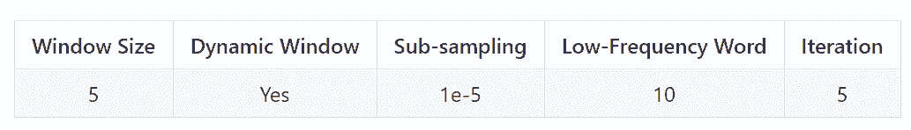
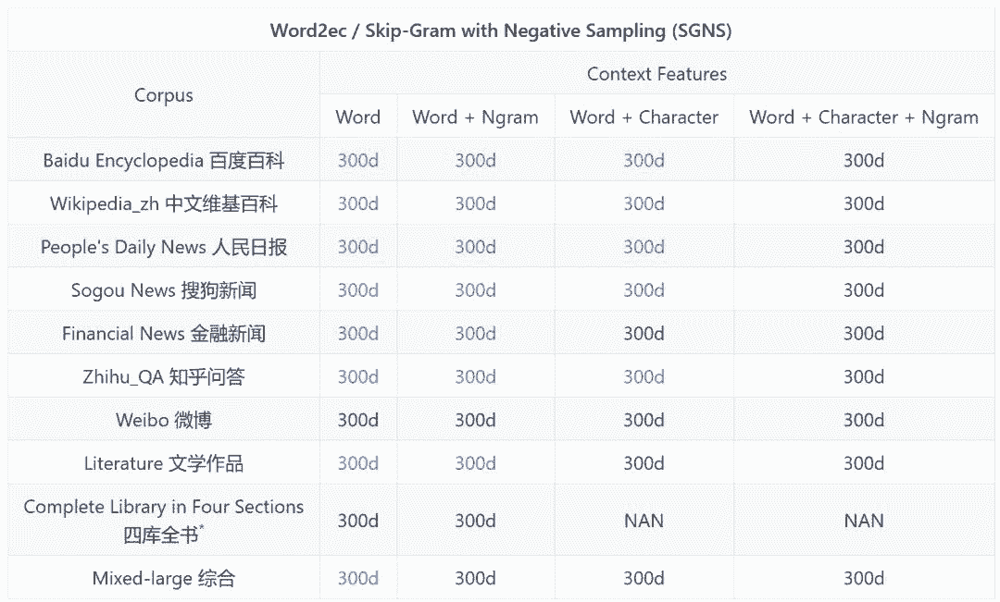
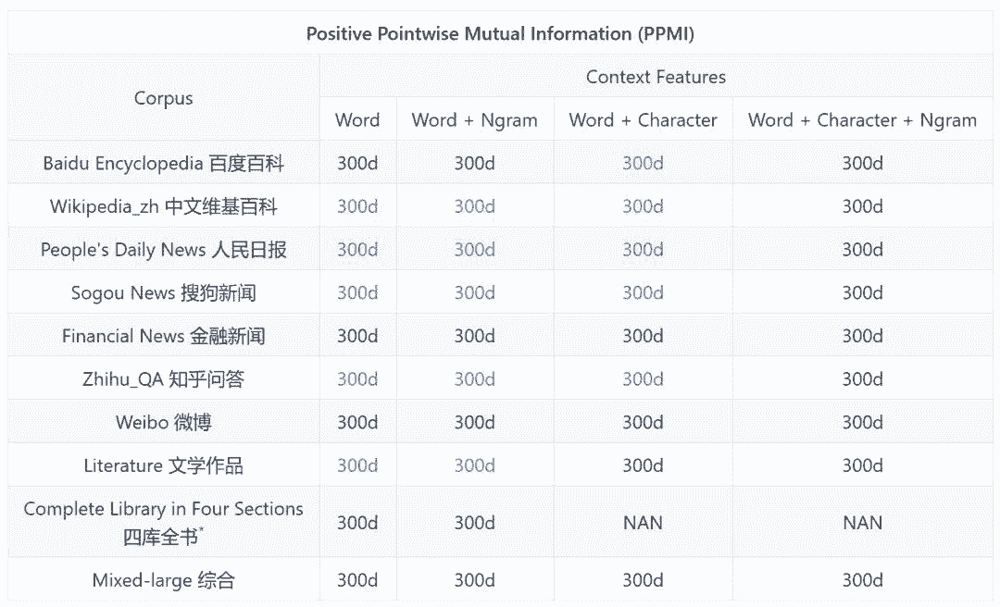
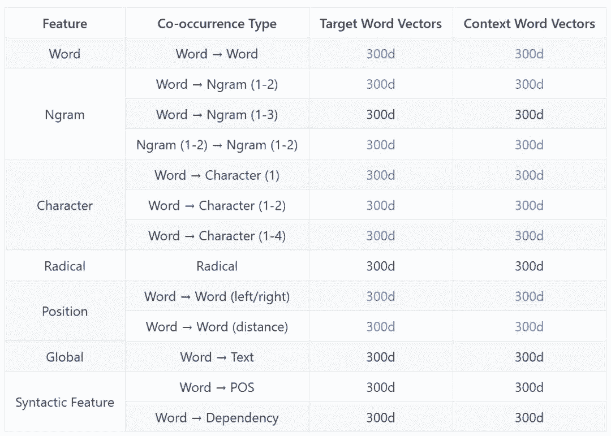
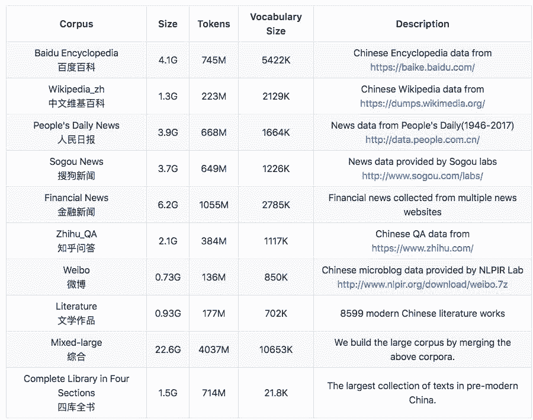

# 资源 | Chinese Word Vectors：目前最全的中文预训练词向量集合

选自 GitHub

**作者：****shenshen-hungry**

 ****机器之心编译**

**参与：刘晓坤、思源**

> 对于国内自然语言处理的研究者而言，中文词向量语料库是需求很大的资源。近日，北京师范大学等机构的研究者开源了「中文词向量语料库」，试图为大家解决这一问题，该库包含经过数十种用各领域语料（百度百科、维基百科、人民日报 1947-2017、知乎、微博、文学、金融、古汉语等）训练的词向量，涵盖各领域，且包含多种训练设置。目前，该研究的论文《Analogical Reasoning on Chinese Morphological and Semantic Relations》已经被 ACL2018 大会接收。

项目链接：https://github.com/Embedding/Chinese-Word-Vectors

该项目提供使用不同表征（稀疏和密集）、上下文特征（单词、n-gram、字符等）以及语料库训练的中文词向量（嵌入）。在这里，你可以轻松获得具有不同属性的预训练向量，并将它们用于各类下游任务。

此外，开发者还在该工具中提供了一个中文类比推理数据集 CA8 及其评估工具包，用户可以以此评估自己词向量的质量。

**格式**

本资源中的预训练词向量文件以文本格式存储。每一行包含一个单词及其词向量。每个值由空格分开。第一行记录元信息：第一个数字表示该单词在文件中的排序，第二个数字表示维度大小。

除了密集单词向量（以 SGNS 训练），该项目还提供了稀疏向量（以 PPMI 训练）。它们与 liblinear 格式相同，其中「：」前的数字代表维度索引，「：」后的数字表示值。

**预训练中文词向量**

**基本设定**

 **

 ****多领域词汇**

中文词向量在不同的表征、上下文特征和语料库上进行了训练。





*该项目提供了汉字嵌入，因为古中文大多数汉字就是一个词。

**多种共现信息**

开发者发布了在不同的共现（co-occurrence）统计数据上的词向量。目标和上下文向量在相关的论文中一般称为输入和输出向量。

在这一部分中，我们可以获取词层面之上的任意语言单元向量。例如，汉字向量包含在词-汉字的上下文向量中。所有向量都在百度百科上使用 SGNS 训练。



**表征**

现有的词表征方法一般可分为两种，即密集型和稀疏型的词嵌入表征。SGANS 模型（word2vec 工具包中的模型）和 PPMI 模型分别是这两种表征的典型案例。SGNS 模型通过一个浅层神经网络学习低维度的密集向量，这也称为神经嵌入方法。PPMI 模型是一种稀疏的特征袋（bag-of-feature）表征方法，且它会使用正逐点互信息（PPMI）对特征进行加权。

**上下文特征**

三种上下文特征：单词、n-gram 和字符在词嵌入文献中很常用。大多数词表征方法本质上利用了词-词的共现统计，即使用词作为上下文特征（词特征）。受语言建模问题的启发，开发者将 n-gram 特征引入了上下文中。词到词和词到 n-gram 的共现统计都被用于训练 n-gram 特征。对于中文而言，字符（即汉字）通常表达了很强的语义。为此，开发者考虑使用词-词和词-字符的共现统计来学习词向量。字符级的 n-gram 的长度范围是从 1 到 4（个字符特征）。

除了词、n-gram 和字符或汉字以外，还有其它对词向量的属性具有重要影响的特征。例如，使用整个文本作为上下文特征能将更多的主题信息引入到词嵌入向量中，使用依存关系解析树作为上下文特征能为词向量添加语法信息等。本项目考虑了 17 种同现类型。

**语料库**

开发者做了大量工作来收集多个领域的语料库。所有的文本数据都通过删除 html 和 xml 标记进行了预处理。只有纯文本被保留并使用 HanLP(v_1.5.3) 进行词分割。语料库的详细信息如下：



所有的单词都被包含其中，包括低频词。

**工具包**

所有的词向量由 ngram2vec 工具包训练。ngram2vec 工具包是 word2vec 和 fasttext 工具包的超集合，其支持抽象上下文特征和模型。

*   ngram2vec：https://github.com/zhezhaoa/ngram2vec/

*   word2vec：https://github.com/svn2github/word2vec

*   fasttext：https://github.com/facebookresearch/fastText

**中文词类比基准**

词向量的质量通常由类比问题任务进行评估。在该项目中，开发者使用了两个基准来评估。第一个是 CA-translated，其中大多数类比问题直接从英语基准中翻译得到。虽然 CA-translated 在很多中文词嵌入论文中被广泛应用，但它仅包含了三个语义问题和 134 个中文词。相对的，CA8 是专门为中文语言设计的。它包含了 17813 个类比问题，覆盖了综合的词法和语义关联。CA-translated、CA8 和它们的详细信息在 testets 文件夹中。

**评估工具包**

评估工具包在 evaluation 文件夹中。

运行以下代码可评估密集向量：

```py
$ python ana_eval_dense.py -v <vector.txt> -a CA8/morphological.txt
$ python ana_eval_dense.py -v <vector.txt> -a CA8/semantic.txt
```

运行以下代码可评估稀疏向量：

```py
$ python ana_eval_sparse.py -v <vector.txt> -a CA8/morphological.txt
$ python ana_eval_sparse.py -v <vector.txt> -a CA8/semantic.txt
```

**参考文献**

如果要使用这些嵌入和 CA8 数据集，请引用开发者的论文：

Shen Li, Zhe Zhao, Renfen Hu, Wensi Li, Tao Liu, Xiaoyong Du, Analogical Reasoning on Chinese Morphological and Semantic Relations, ACL 2018. 

****本文为机器之心编译，**转载请联系本公众号获得授权****。**

✄------------------------------------------------

**加入机器之心（全职记者/实习生）：hr@jiqizhixin.com**

**投稿或寻求报道：**content**@jiqizhixin.com**

**广告&商务合作：bd@jiqizhixin.com********