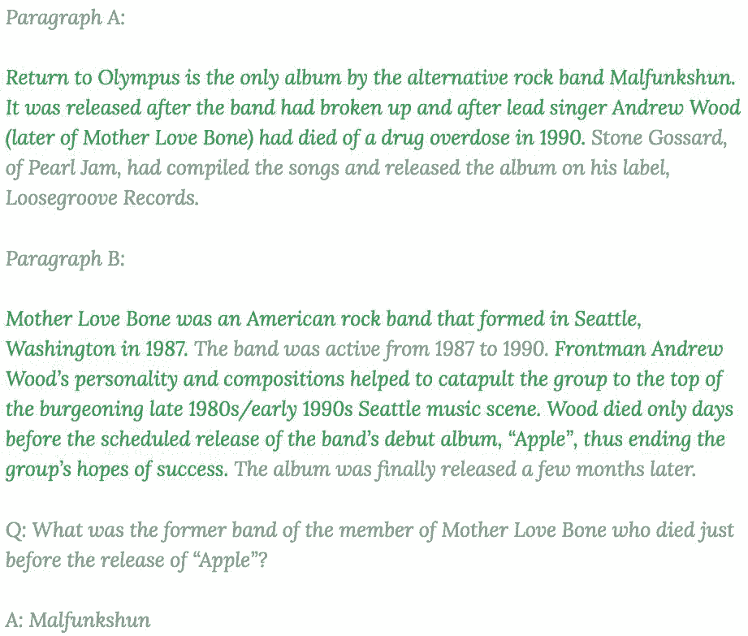
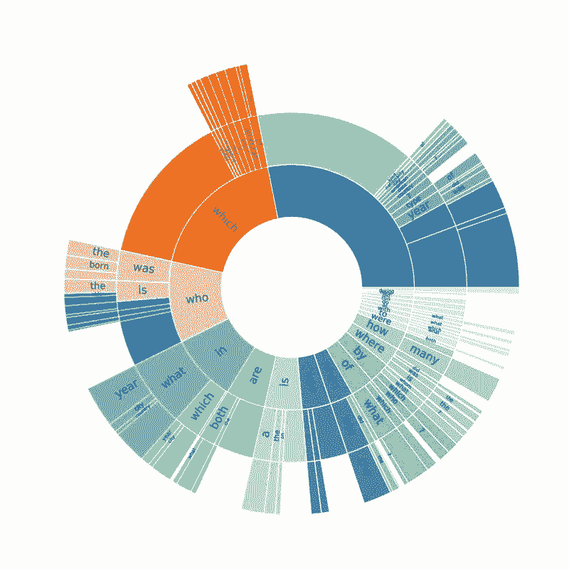
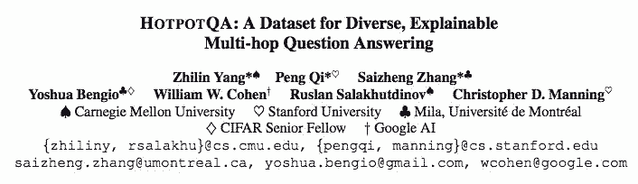

# 资源 |「火锅问答」是啥？面向自然语言和多步推理问题，新型问答数据集 HotpotQA 面世

选自 GitHub

**作者：****杨植麟、齐鹏、张赛峥**

**机器之心编译**

**参与：路**

> 近日，来自斯坦福、CMU 和蒙特利尔大学的三名中国学生推出了新型问答数据集 HotpotQA，该数据集面向自然语言和多步推理问题。Emmm，从名字来看，这三位小朋友貌似很喜欢吃火锅～

**「火锅兄弟团」成员：**

*   作者杨植麟目前博士就读于卡内基梅隆大学，师从 Ruslan Salakhutdinov 教授（苹果公司 AI 负责人）和 William Cohen 教授从事深度学习方面的研究。

*   作者齐鹏目前博士就读于斯坦福大学，师从 Christopher Manning 教授从事自然语言处理方面的研究。

*   作者张赛峥目前博士就读于蒙特利尔大学，师从 Yoshua Bengio 教授从事深度学习和自然语言处理方面的研究。

HotpotQA 数据集的作者写了一篇博客，介绍了这个「让人看饿了」的数据集：

**你是否好奇过以下问题：**

> *   我们都知道 Facebook 总部在加州，那你知道 Facebook 的诞生地在哪个城市吗？
>     
>     
> *   吃鸡和王者农药这两款游戏到底哪个玩家多一些？
>     
>     
> *   如果你是一个吃货，那你每天要在跑步机上跑多久才能消耗掉你今天偷吃的十包辣条的热量？

乍一看这些问题有些复杂，然而作为人类，回答这些问题并不难。

比如第一个问题，你只要先在某百科上找到小扎在哈佛大学的寝室创立 Facebook 这一事实，而另一个百科页面则告诉你哈佛大学在美国麻省的剑桥市。又如第二个问题，你可以在网上的某两篇新闻中搜索到吃鸡和农药各自的活跃用户数量，两个数字一比对结果便一目了然。而对于第三个问题，你可以首先在辣条官网上发现辣条的卡路里说明，然后在健身网站上搜索到成年人在跑步机上挥汗一小时消耗的热量，最后计算一番便能得出答案。

总结下来，要回答这些问题，我们需要定位多个信息来源并从中找到最相关的部分，并且基于这些信息进行多步推理和理解。一个机智的机器学习研究者看到这里一定会问了：那目前的机器算法是否也可以进行这种「基于多个信息内容的多步推理 (multi-hop reasoning)」并回答问题呢？

怀揣着同样的疑问，我们对目前主流的问答系统 (question answering (QA) system) 以及相关的大规模数据集 (large-scale QA dataset) 进行了调研，结果稍显悲剧：对于目前主流的问答数据集（例如[斯坦福的 SQuAD 数据集](http://mp.weixin.qq.com/s?__biz=MzA3MzI4MjgzMw==&mid=2650726837&idx=4&sn=b947dd113892c8023a4bfce3691d2f07&chksm=871b25cbb06cacddcb4e85fa504afeb2020a7f09507a374e6626281f0c452515674c10dfca8d&scene=21#wechat_redirect) [1]），问题的答案基本都在单一文档的单一（或连续的）句子中，并且这类问题大多可通过对问题和单一文档使用类似关键词匹配（keyword matching）的方式来回答。基于这些数据集训练的模型虽然在这类问题上表现不俗，但是它们是否有基于多个信息进行多步推理的能力依旧是个未知数。同时我们也注意到，一些研究者已经开始对机器多步推理问答的研究：例如 Facebook 之前发布的 bAbI 数据集 [2] 就尝试探究机器基于多条信息的推理综合能力，然而由于其数据本身并不是来源于真实文本而是通过人造模版生成的，这使得该数据集在实际场景中的性能大打折扣。自去年以来，陆续有研究者开始尝试收集大规模多步推理问答数据集，其中典型的工作包括 TriviaQA [3] 和 QAngaroo [4]。在 TriviaQA 中，每个问题通常附带了多个相关文档用来获取答案（这些文档是通过信息检索的方式得到的）。然而相关文档的增多并不能保证回答某个问题一定用到跨文档的多步推理，实际上，该数据库中大部分问题仍旧可以只通过多个文档中的某一个直接回答。另一方面，QAngaroo 利用知识图谱技术构建了一批确实需要多步推理才能回答的问题。然而，该数据集的问题和答案的种类严重受限于知识图谱预先定义的模式 (schema) 本身，同时问题格式也被限制为知识图谱的三元组形式（triple）而非自然语言。此外，以上提到的所有数据集在给出相关问题的同时仅提供相关文档本身，并没有给出更细粒度和更直接的推理线索。

基于以上种种问题，我们（来自 CMU、Stanford 和 Mila 的联合小分队）提出了一个名为「HotpotQA」的数据集（中文名又作「火锅问答」。注：这篇文章始于作者们在纽约法拉盛的一次火锅聚餐，同时「火锅中多种食材混合产生的终极美味」也暗喻多源多步推理)。HotpotQA 是作者们对机器多步推理问答的更进一步探究，它有以下几个重要特点：

*   问题被设计为必须使用多步推理来回答。为了收集这些问题和答案，我们使用了亚马逊的众包服务 (Amazon Mechanical Turk)。我们向众包工人展示两个维基百科选段，通过一些用户交互设计保证他们可以提问出「必须基于两个选段进行多步推理才能得到答案」的问题。

*   问题本身不会受限于任何预设的知识图谱。我们从维基百科中收集了多种类型多种主题的选段，并且不限制问题的类型。这使得最终收集的数据（问题、答案、选段）以自然语言的形式呈现，并且在内容和难度上具有多样性。

*   对于每一个问题，我们还收集了回答它所需要的更细粒度的支持推理线索 (supporting fact)。这些线索可以用来提升模型的可解释性 (explainability)。相比于之前基于整篇文章进行训练的粗粒度方式，HotpotQA 允许模型利用这些更加准确的推理线索来提升表现，并且迫使模型在回答问题的同时给出它基于哪些事实进行的推理，不像以前的模型只给出一个答案，知其然而不知其所以然。

话不多说，下面是 HotpotQA 里面的一个样例问题，在选段中我们用绿色标出了用来回答该问题的支持推理线索。

除此之外，HotpotQA 的问题种类也十分多样。除了一些常见的多步推理问题，还包括在大规模文本问答数据集中首次出现的比较型问题 (comparison question)，例如文章开头的「吃鸡 vs 农药」。下图展示了 HotpotQA 中的问题种类以及占比情况：

俗话说，酒逢知己千杯少，话不投机半句多。相信耐心读到此处还没有关掉页面的看官一定也像我们一样对多步推理问答充满了好奇，那不妨移步我们的 EMNLP2018 paper 一探我们的方法细节。同时对于那些「我的模型已经饥渴难耐」的同仁，你们一定要访问 HotpotQA 的官方网站，我们在此处设擂，欢迎前来砸场子！你们模型的提交是机器多步推理进步的动力！

以上。

火锅兄弟团 Zhilin、Peng、Saizheng

HotpotQA 官网：https://hotpotqa.github.io/

**论文：HOTPOTQA: A Dataset for Diverse, Explainable Multi-hop Question Answering**

论文链接：https://arxiv.org/pdf/1809.09600.pdf

**摘要：**现有的问答（QA）数据集无法训练可执行复杂推理和提供答案解释的 QA 系统。我们创建了一个新型问答数据集 HotpotQA，该数据集包含 11.3 万个基于维基百科的问答对，具备以下四个特点：

1\. 问题的答案必须要基于多个支持文档；

2\. 问题多样化，不局限于任何已有的知识库或知识模式；

3\. 提供句子级别的支持推理线索（supporting fact），允许 QA 系统用强大的监督进行推理，并对预测结果进行解释；

4\. 提供了新型模拟比较型问题，来测试 QA 系统提取相关线索、执行必要对比的能力。

我们展示了 HotpotQA 数据集对最新 QA 系统是有难度的，支持推理线索帮助模型提升性能、做出可解释的预测。****

**参考文献：**

[1] "SQuAD: 100,000+ Questions for Machine Comprehension of Text", Pranav Rajpurkar, Jian Zhang, Konstantin Lopyrev, Percy Liang. EMNLP 2016.

[2] "Towards AI Complete Question Answering: A Set of Prerequisite Toy Tasks", Jason Weston, Antoine Bordes, Sumit Chopra, Alexander M. Rush, Bart van Merriënboer, Armand Joulin and Tomas Mikolov. arXiv:1502.05698.

[3] "TriviaQA: A Large Scale Distantly Supervised Challenge Dataset for Reading Comprehension", Mandar Joshi, Eunsol Choi, Daniel Weld, Luke Zettlemoyer. ACL 2017.

[4] "Constructing Datasets for Multi-hop Reading Comprehension Across Documents", Johannes Welbl, Pontus Stenetorp, Sebastian Riedel. TACL 2018.

 **2018AIIA 人工智能开发者大会将于 2018 年 10 月 15 日到 16 日在苏州国际博览中心举办。点击阅读原文链接报名。

**