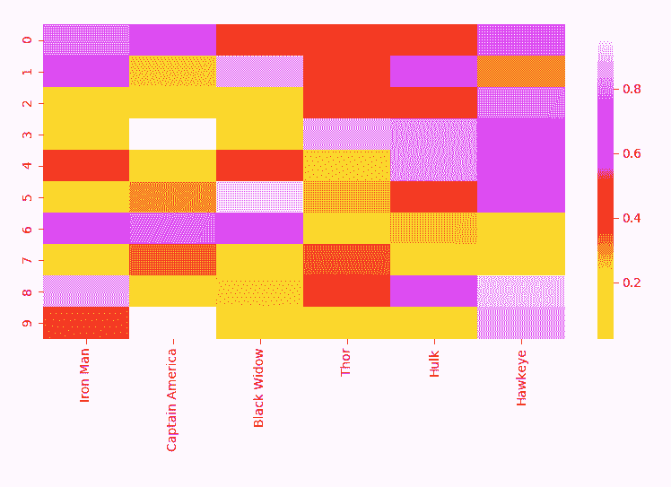
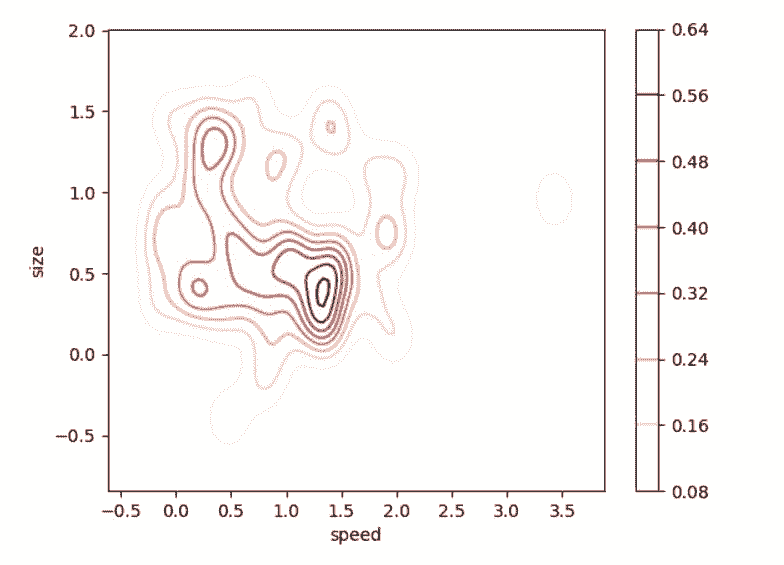
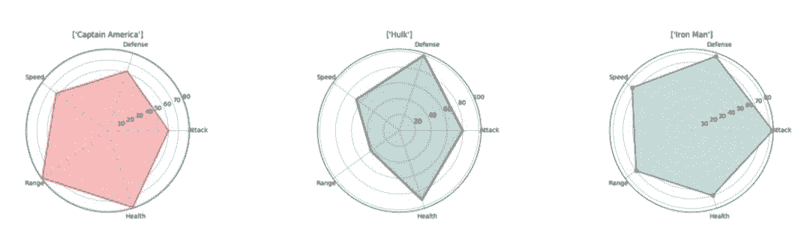
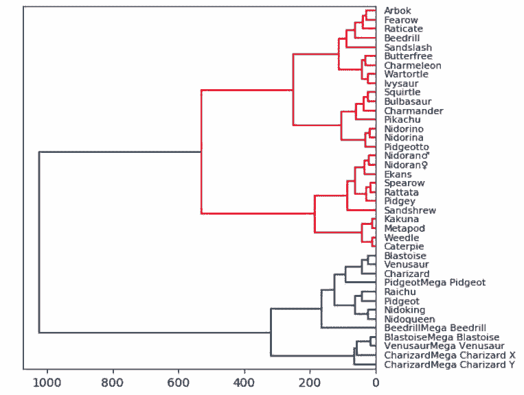

# 四种更快更简单实现 Python 数据可视化的方法

选自 towardsdatascience

**作者：****George Seif**

****机器之心编译****

**参与：****Geek AI、刘晓坤**

> 热力图、二维密度图、蜘蛛网图和树状图，这些可视化方法你都用过吗？

数据可视化是数据科学或机器学习项目中十分重要的一环。通常，你需要在项目初期进行探索性的数据分析（EDA），从而对数据有一定的了解，而且创建可视化确实可以使分析的任务更清晰、更容易理解，特别是对于大规模的高维数据集。在项目接近尾声时，以一种清晰、简洁而引人注目的方式展示最终结果也是非常重要的，让你的受众（通常是非技术人员的客户）能够理解。

读者可能阅读过我之前的文章「5 Quick and Easy Data Visualizations in Python with Code」，我通过那篇文章向大家介绍了 5 种基础的数据可视化方法：散点图、线图、直方图、条形图和箱形图。这些都是简单而强大的可视化方法，通过它们你可以对数据集有深刻的认识。在本文中，我们将看到另外 4 个数据可视化方法！本文对这些方法的介绍会更详细一些，可以在您阅读了上一篇文章中的基本方法之后接着使用，从而从数据中提取出更深入的信息。

**热力图**

热力图（Heat Map）是数据的一种矩阵表示方法，其中每个矩阵元素的值通过一种颜色表示。不同的颜色代表不同的值，通过矩阵的索引将需要被对比的两项或两个特征关联在一起。热力图非常适合于展示多个特征变量之间的关系，因为你可以直接通过颜色知道该位置上的矩阵元素的大小。通过查看热力图中的其他点，你还可以看到每种关系与数据集中的其它关系之间的比较。颜色是如此直观，因此它为我们提供了一种非常简单的数据解释方式。



现在让我们来看看实现代码。与「matplotlib」相比，「seaborn」可以被用于绘制更加高级的图形，它通常需要更多的组件，例如多种颜色、图形或变量。「matplotlib」可以被用于显示图形，「NumPy」可被用于生成数据，「pandas」可以被用于处理数据！绘图只是「seaborn」的一个简单的功能。

```py
# Importing libs
import seaborn as sns
import pandas as pd
import numpy as np
import matplotlib.pyplot as plt

# Create a random dataset
data = pd.DataFrame(np.random.random((10,6)), columns=["Iron Man","Captain America","Black Widow","Thor","Hulk", "Hawkeye"])

print(data)

# Plot the heatmap
heatmap_plot = sns.heatmap(data, center=0, cmap='gist_ncar')

plt.show()
```

**二维密度图**

二维密度图（2D Density Plot）是一维版本密度图的直观扩展，相对于一维版本，其优点是能够看到关于两个变量的概率分布。例如，在下面的二维密度图中，右边的刻度图用颜色表示每个点的概率。我们的数据出现概率最大的地方（也就是数据点最集中的地方），似乎在 size=0.5，speed=1.4 左右。正如你现在所知道的，二维密度图对于迅速找出我们的数据在两个变量的情况下最集中的区域非常有用，而不是像一维密度图那样只有一个变量。当你有两个对输出非常重要的变量，并且希望了解它们如何共同作用于输出的分布时，用二维密度图观察数据是十分有效的。



事实再次证明，使用「seaborn」编写代码是十分便捷的！这一次，我们将创建一个偏态分布，让数据可视化结果更有趣。你可以对大多数可选参数进行调整，让可视化看结果看起来更清楚。

```py
# Importing libs
import seaborn as sns
import matplotlib.pyplot as plt
from scipy.stats import skewnorm

# Create the data
speed = skewnorm.rvs(4, size=50) 
size = skewnorm.rvs(4, size=50)

# Create and shor the 2D Density plot
ax = sns.kdeplot(speed, size, cmap="Reds", shade=False, bw=.15, cbar=True)
ax.set(xlabel='speed', ylabel='size')
plt.show()
```

**蜘蛛网图**

蜘蛛网图（Spider Plot）是显示一对多关系的最佳方法之一。换而言之，你可以绘制并查看多个与某个变量或类别相关的变量的值。在蜘蛛网图中，一个变量相对于另一个变量的显著性是清晰而明显的，因为在特定的方向上，覆盖的面积和距离中心的长度变得更大。如果你想看看利用这些变量描述的几个不同类别的对象有何不同，可以将它们并排绘制。在下面的图表中，我们很容易比较复仇者联盟的不同属性，并看到他们各自的优势所在！（请注意，这些数据是随机设置的，我对复仇者联盟的成员们没有偏见。）



在这里，我们可以直接使用「matplotlib」而非「seaborn」来创建可视化结果。我们需要让每个属性沿圆周等距分布。我们将在每个角上设置标签，然后将值绘制为一个点，它到中心的距离取决于它的值/大小。最后，为了显示更清晰，我们将使用半透明的颜色来填充将属性点连接起来得到的线条所包围的区域。

```py
# Import libs
import pandas as pd
import seaborn as sns
import numpy as np
import matplotlib.pyplot as plt

# Get the data
df=pd.read_csv("avengers_data.csv")
print(df)

"""
   #             Name  Attack  Defense  Speed  Range  Health
0  1         Iron Man      83       80     75     70      70
1  2  Captain America      60       62     63     80      80
2  3             Thor      80       82     83    100     100
3  3             Hulk      80      100     67     44      92
4  4      Black Widow      52       43     60     50      65
5  5          Hawkeye      58       64     58     80      65

"""

# Get the data for Iron Man
labels=np.array(["Attack","Defense","Speed","Range","Health"])
stats=df.loc[0,labels].values

# Make some calculations for the plot
angles=np.linspace(0, 2*np.pi, len(labels), endpoint=False)
stats=np.concatenate((stats,[stats[0]]))
angles=np.concatenate((angles,[angles[0]]))

# Plot stuff
fig = plt.figure()
ax = fig.add_subplot(111, polar=True)
ax.plot(angles, stats, 'o-', linewidth=2)
ax.fill(angles, stats, alpha=0.25)
ax.set_thetagrids(angles * 180/np.pi, labels)
ax.set_title([df.loc[0,"Name"]])
ax.grid(True)

plt.show() 
```

**树状图**

我们从小学就开始使用树状图（Tree Diagram）了！树状图是自然而直观的，这使它们容易被解释。直接相连的节点关系密切，而具有多个连接的节点则不太相似。在下面的可视化结果中，我根据 Kaggle 的统计数据（生命值、攻击力、防御力、特殊攻击、特殊防御、速度）绘制了一小部分口袋妖怪游戏的数据集的树状图。

因此，统计意义上最匹配的口袋妖怪将被紧密地连接在一起。例如，在图的顶部，阿柏怪 和尖嘴鸟是直接连接的，如果我们查看数据，阿柏怪的总分为 438，尖嘴鸟则为 442，二者非常接近！但是如果我们看看拉达，我们可以看到其总得分为 413，这和阿柏怪、尖嘴鸟就具有较大差别了，所以它们在树状图中是被分开的！当我们沿着树往上移动时，绿色组的口袋妖怪彼此之间比它们和红色组中的任何口袋妖怪都更相似，即使这里并没有直接的绿色的连接。



对于树状图，我们实际上需要使用「Scipy」来绘制！读取数据集中的数据之后，我们将删除字符串列。这么做只是为了使可视化结果更加直观、便于理解，但在实践中，将这些字符串转换为分类变量会得到更好的结果和对比效果。我们还设置了数据帧的索引，以便能够恰当地将其用作引用每个节点的列。最后需要告诉大家的是，在「Scipy」中计算和绘制树状图只需要一行简单的代码。********

```py
# Import libs
import pandas as pd
from matplotlib import pyplot as plt
from scipy.cluster import hierarchy
import numpy as np

# Read in the dataset
# Drop any fields that are strings
# Only get the first 40 because this dataset is big
df = pd.read_csv('Pokemon.csv')
df = df.set_index('Name')
del df.index.name
df = df.drop(["Type 1", "Type 2", "Legendary"], axis=1)
df = df.head(n=40)

# Calculate the distance between each sample
Z = hierarchy.linkage(df, 'ward')

# Orientation our tree
hierarchy.dendrogram(Z, orientation="left", labels=df.index)

plt.show()
```

*原文链接：https://towardsdatascience.com/4-more-quick-and-easy-data-visualizations-in-python-with-code-da9030ab3429*

****本文为机器之心编译，**转载请联系本公众号获得授权****。**

✄------------------------------------------------

**加入机器之心（全职记者 / 实习生）：hr@jiqizhixin.com**

**投稿或寻求报道：**content**@jiqizhixin.com**

**广告 & 商务合作：bd@jiqizhixin.com**