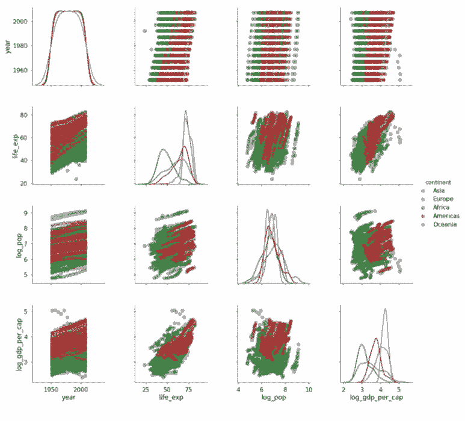

# 教程 | 如何利用散点图矩阵进行数据可视化

选自 TowardsDataScience

**作者：****William Koehrsen**

**机器之心编译**

**参与：Nurhachu Null、路** 

> > 本文介绍了如何在 Python 中利用散点图矩阵（Pairs Plots）进行数据可视化。
> 
> **如何快速构建强大的探索性数据分析可视化**
> 
> 当你得到一个很不错的干净数据集时，下一步就是探索性数据分析（Exploratory Data Analysis，EDA）。EDA 可以帮助发现数据想告诉我们什么，可用于寻找模式、关系或者异常来指导我们后续的分析。尽管在 EDA 中有很多种可以使用的方法，但是其中最有效的启动工具之一就是散点图矩阵（pairs plot，也叫做 scatterplot matrix）。散点图矩阵允许同时看到多个单独变量的分布和它们两两之间的关系。散点图矩阵是为后续分析识别趋势的很棒方法，幸运的是，用 Python 实现也是相当简单的。
> 
> 本文，我们将介绍如何使用 Seaborn 可视化库（https://seaborn.pydata.org/）在 Python 中启动和运行散点图矩阵。我们将看到如何为快速检查数据而创建默认散点图矩阵，以及如何为了更深入的分析定制可视化方案。
> 
> 代码地址：https://github.com/WillKoehrsen/Data-Analysis/blob/master/pairplots/Pair%20Plots.ipynb
> 
> 我们将探索一个现实世界数据集，它由国家级的社会经济数据组成，这些数据都是 Gapminder 收集的。
> 
> **Seaborn 中的散点图矩阵**
> 
> 我们需要先了解一下数据，以便开始后续的进展。我们可以 pandas 数据帧的形式加载这些社会经济数据，然后我们会看到下面这些列：
> 
> 
> 
> 每一行代表一个国家一年的观察数据，列代表变量（这种格式的数据被称作整洁数据，tidy data），其中有两个类别列（国家和洲）和四个数值列。这些列简单易懂：life_exp 是出生时的预期寿命，以年为单位，popis 是人口数量，gdp_per_cap 是人均 GDP（以国际元）为单位。
> 
> seaborn 中的默认散点图矩阵仅仅画出数值列，尽管我们随后也会使用类别变量来着色。创建默认的散点图矩阵很简单：我们加载 seaborn 库，然后调用 pairplot 函数，向它传递我们的数据帧即可：
> 
> ```py
> # Seaborn visualization library
> import seaborn as sns
> # Create the default pairplot
> sns.pairplot(df) 
> ```
> 
> 
> 
> 我仍旧大为吃惊，一行简单的代码就能够让我们得到整个图。散点图矩阵会构建两种基本图形：直方图和散点图。位于对角线位置的直方图让我们看到了每一个变量的分布，而对角线上下的散点图则展示了变量两两之间的关系。例如，第二行最左侧的散点图展示了 life_exp 和 year 之间的关系。
> 
> 默认的散点图矩阵通常能够提供有价值的洞见。我们可以看到 life-exp 和 gdp_per_cap 是正相关的，这表明较高收入国家的国民要活得更久一些（尽管这并不能表明二者存在因果关系）。令人欣慰的是，这也显示出世界范围内的人口寿命随着时间逐渐增长。我们可以从直方图中了解到人口和 GDP 变量呈严重右偏态分布。为了在以后的图中更好地展示这些变量，我们可以通过对列数值取对数来进行列变换：
> 
> ```py
> # Take the log of population and gdp_per_capita
> df['log_pop'] = np.log10(df['pop'])
> df['log_gdp_per_cap'] = np.log10(df['gdp_per_cap'])
> 
> # Drop the non-transformed columns
> df = df.drop(columns = ['pop', 'gdp_per_cap'])
> ```
> 
> 尽管这一张图在分析中就很有用，然而我们发现基于类别变量（例如洲）对图进行着色能够让它更有价值。这在 seaborn 中也是极其简单的。我们唯一要做的就是在调用 sns.pairplot 函数的时候使用关键词 hue。
> 
> ```py
> sns.pairplot(df, hue = 'continent')
> ```
> 
> 
> 
> 现在我们发现大洋洲和欧洲趋向于拥有最高的期望寿命，而亚洲拥有最多的人口量。注意我们对人口和 GDP 的对数变换使得这些变量呈正态分布，这提供了一个关于这些变量更加全面的表征。
> 
> 这张图具有更多的信息，但是还存在一些问题：正如对角线上看到的一样，我认为堆叠的直方图可解释性不是很好。展示来自多类别的单变量分布的一个更好方法就是密度图（density plot）。我们可以通过调用函数将直方图变成密度图。向散点图输入一些关键词，改变点的透明度、大小和边缘颜色。
> 
> ```py
> # Create a pair plot colored by continent with a density plot of the # diagonal and format the scatter plots.
> sns.pairplot(df, hue = 'continent', diag_kind = 'kde',
>              plot_kws = {'alpha': 0.6, 's': 80, 'edgecolor': 'k'},
>              size = 4)
> ```
> 
> 
> 
> 对角线上的密度图使得对比洲之间的分布相对于堆叠的直方图更加容易。改变散点图的透明度增加了图的可读性，因为这些图存在相当多的重叠（ovelapping）。
> 
> 现在是默认散点图矩阵的最后一个例子。为减少复杂度，我们仅画出 2000 年以后的数据。我们仍旧把洲着色，但是不画出「年」这一列。为了限制画出的列的数量，我们给函数传递了一个 vars 列表。为了更好的阐明这个图，我们还加上了标题。
> 
> ```py
> # Plot colored by continent for years 2000-2007
> sns.pairplot(df[df['year'] >= 2000], 
>              vars = ['life_exp', 'log_pop', 'log_gdp_per_cap'], 
>              hue = 'continent', diag_kind = 'kde', 
>              plot_kws = {'alpha': 0.6, 's': 80, 'edgecolor': 'k'},
>              size = 4);
> # Title 
> plt.suptitle('Pair Plot of Socioeconomic Data for 2000-2007', 
>              size = 28);
> ```
> 
> 
> 
> 现在开始变得相当好看了！如果继续建模，我们可能会使用这些图中的信息指导我们的选择。例如，我们知道 log_gdp_per_cap 与 life_exp 是成正相关的，所以我们会创建一个线性模型来量化这种关系。本文主要集中在画图上面，如果希望更多地探索数据，我们可以使用 PairGrid 类定制散点图。
> 
> **使用 PairGrid 的定制化**
> 
> 与 sns.pairplot 函数相反，sns.PairGrid 是一个类，这意味着它不能自动填充图。我们创建一个类实例，然后为网格的不同部分匹配特定的函数。为了给数据创建 PairGrid 实例，我们使用了以下的代码，这也限制了我们所展示的变量：
> 
> ```py
> # Create an instance of the PairGrid class.
> grid = sns.PairGrid(data= df_log[df_log['year'] == 2007],
>                     vars = ['life_exp', 'log_pop', 
>                     'log_gdp_per_cap'], size = 4)
> ```
> 
> 如果我们要显示内容的话，则会得到一个空图，因为我们还没有为网格部分匹配任何函数。一个 PairGrid 需要填充三个网格部分：上三角、下三角和对角线。为了给这些部分匹配图，我们使用在这一部分使用 grid.map 方法。例如，为了给上三角匹配一个散点图，我们使用：
> 
> ```py
> # Map a scatter plot to the upper triangle
> grid = grid.map_upper(plt.scatter, color = 'darkred')
> ```
> 
> map_upper 方法采用任意接受两个变量数组的函数（例如 plt.scatter），以及相关的关键词（例如 color）。map_lower 方法几乎与其相同，但是它填充的是网格的下三角。map_diag 与这两者稍有不同，因为它采用接受单个数组的函数（回想一下，对角线只显示单个变量）。一个例子是 plt.hist，我们使用它来填充对角线部分：
> 
> ```py
> # Map a histogram to the diagonal
> grid = grid.map_diag(plt.hist, bins = 10, color = 'darkred', 
>                      edgecolor = 'k')
> # Map a density plot to the lower triangle
> grid = grid.map_lower(sns.kdeplot, cmap = 'Reds')
> ```
> 
> 在这个例子中，我们在下三角中使用二维核密度估计（即密度图）。将上面的内容合在一起，这段代码就会给出下图：
> 
> 
> 
> 当我们想要创建自定义函数将不同的信息匹配到该图时，使用 PairGrid 类的实际好处就会显露出来。例如，我可能希望在散点图上增加两个变量的皮尔逊相关系数。为了做到这一点，我会写一个使用两个数组的函数，用它来计算统计数据，然后画在图上。下面的代码展示的就是如何做到这件事（来源：https://stackoverflow.com/questions/30942577/seaborn-correlation-coefficient-on-pairgrid）。
> 
> ```py
> # Function to calculate correlation coefficient between two arrays
> def corr(x, y, **kwargs):
> 
>     # Calculate the value
>     coef = np.corrcoef(x, y)[0][1]
>     # Make the label
>     label = r'$\rho$ = ' + str(round(coef, 2))
> 
>     # Add the label to the plot
>     ax = plt.gca()
>     ax.annotate(label, xy = (0.2, 0.95), size = 20, xycoords = ax.transAxes)
> 
> # Create a pair grid instance
> grid = sns.PairGrid(data= df[df['year'] == 2007],
>                     vars = ['life_exp', 'log_pop', 'log_gdp_per_cap'], size = 4)
> 
> # Map the plots to the locations
> grid = grid.map_upper(plt.scatter, color = 'darkred')
> grid = grid.map_upper(corr)
> grid = grid.map_lower(sns.kdeplot, cmap = 'Reds')
> grid = grid.map_diag(plt.hist, bins = 10, edgecolor =  'k', color = 'darkred');
> ```
> 
> 我们的新函数被匹配到上三角中了，因为我们需要两个数组来计算相关系数（还要注意到，我们可以将多个函数匹配到网格部分中）。这样就得到了下图：
> 
> 
> 
> 现在相关系数已经出现在上面的散点图上了。这是一个比较直接的例子，但是我们可以使用 PairGrid 映射任何一个我们想要映射到图上的函数。我们可以按照需要增加相关的信息，这可以帮助我们解决如何写这个函数的问题！最后一个例子，下图对角线上展示了总结统计信息：
> 
> 
> 
> 虽然还需要一些整理，但是它展示了一个通用的思想：除了使用库中现有的函数将数据映射到图上，例如 matplotlib，我们可以写自己的函数来展示自定义信息。
> 
> **总结**
> 
> 散点图矩阵（pairs plots）是一款强大的工具，可以快速探索数据集中的分布和关系。为了让散点图矩阵可定制、可扩展，Seaborn 通过 Pair Grid 类提供了一个简单的默认方法。在数据分析项目中，大部分的价值通常不是来自于酷炫的机器学习，而是来自对数据的直接可视化。散点图矩阵给我们提供了对数据的概览，是数据分析项目很棒的起点。
> 
> *原文链接：https://towardsdatascience.com/visualizing-data-with-pair-plots-in-python-f228cf529166*
> 
> ****本文为机器之心编译，**转载请联系本公众号获得授权****。**
> 
> ✄------------------------------------------------
> 
> **加入机器之心（全职记者/实习生）：hr@jiqizhixin.com**
> 
> **投稿或寻求报道：editor@jiqizhixin.com**
> 
> **广告&商务合作：bd@jiqizhixin.com**