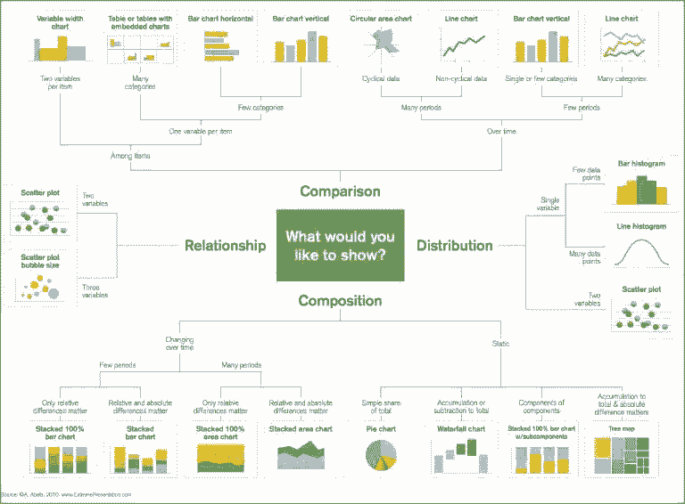
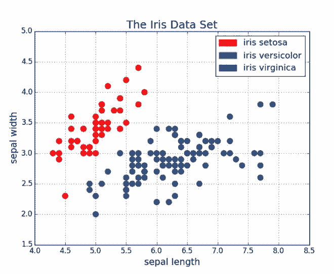
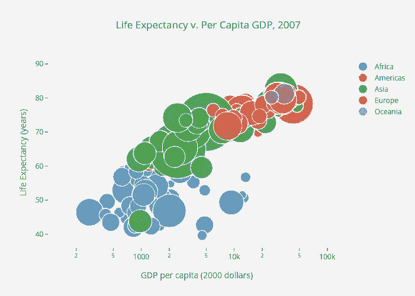
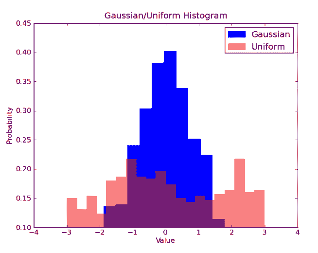
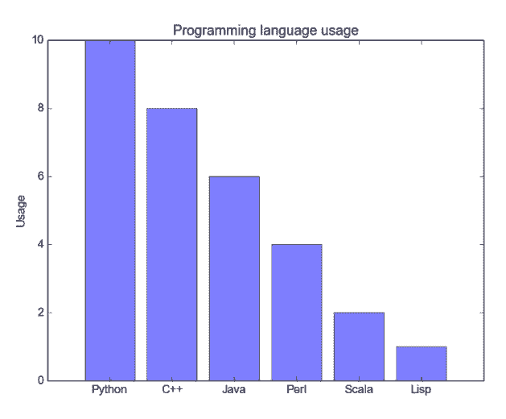
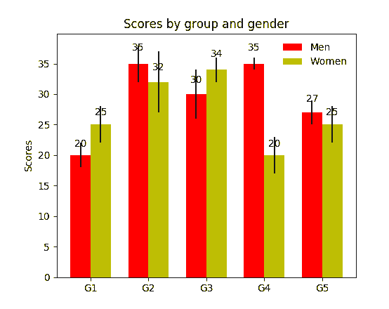
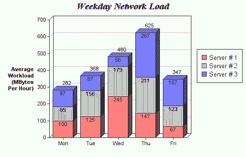
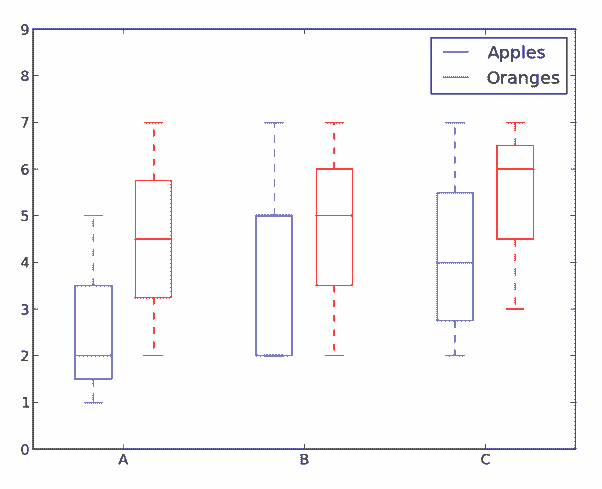

# 教程 | 5 种快速易用的 Python Matplotlib 数据可视化方法

选自 towardsdatascience

**作者：George Seif**

**机器之心编译**

**参与：刘晓坤、思源**

> > > 数据可视化是数据科学家工作的重要部分。在项目的早期阶段，我们通常需要进行探索性数据分析来获得对数据的洞察。通过数据可视化可以让该过程变得更加清晰易懂，尤其是在处理大规模、高维度数据集时。在本文中，我们介绍了最基本的 5 种数据可视化图表，在展示了它们的优劣点后，我们还提供了绘制对应图表的 Matplotlib 代码。
> > 
> > Matplotlib 是一个很流行的 Python 库，可以帮助你快速方便地构建数据可视化图表。然而，每次启动一个新项目时都需要重新设置数据、参数、图形和绘图方式是非常枯燥无聊的。本文将介绍 5 种数据可视化方法，并用 Python 和 Matplotlib 写一些快速易用的可视化函数。下图展示了选择正确可视化方法的导向图。
> > 
> > 
> > 
> > *选择正确可视化方法的导向图。*
> > 
> > **散点图**
> > 
> > 由于可以直接看到原始数据的分布，散点图对于展示两个变量之间的关系非常有用。你还可以通过用颜色将数据分组来观察不同组数据之间的关系，如下图所示。你还可以添加另一个参数，如数据点的半径来编码第三个变量，从而可视化三个变量之间的关系，如下方第二个图所示。
> > 
> > 
> > 
> > *用颜色分组的散点图。*
> > 
> > 
> > 
> > *用颜色分组的散点图，点半径作为第三个变量表示国家规模。*
> > 
> > 接下来是代码部分。我们首先将 Matplotlib 的 pyplot 导入为 plt，并调用函数 plt.subplots() 来创建新的图。我们将 x 轴和 y 轴的数据传递给该函数，然后将其传递给 ax.scatter() 来画出散点图。我们还可以设置点半径、点颜色和 alpha 透明度，甚至将 y 轴设置为对数尺寸，最后为图指定标题和坐标轴标签。
> > 
> > ```py
> > import matplotlib.pyplot as plt
> > import numpy as np
> > 
> > def scatterplot(x_data, y_data, x_label="", y_label="", title="", color = "r", yscale_log=False):
> > 
> >     # Create the plot object
> >     _, ax = plt.subplots()
> > 
> >     # Plot the data, set the size (s), color and transparency (alpha)
> >     # of the points
> >     ax.scatter(x_data, y_data, s = 10, color = color, alpha = 0.75)
> > 
> >     if yscale_log == True:
> >         ax.set_yscale('log')
> > 
> >     # Label the axes and provide a title
> >     ax.set_title(title)
> >     ax.set_xlabel(x_label)
> >     ax.set_ylabel(y_label) 
> > ```
> > 
> > **线图**
> > 
> > 当一个变量随另一个变量的变化而变化的幅度很大时，即它们有很高的协方差时，线图非常好用。如下图所示，我们可以看到，所有专业课程的相对百分数随年代的变化的幅度都很大。用散点图来画这些数据将变得非常杂乱无章，而难以看清其本质。线图非常适合这种情况，因为它可以快速地总结出两个变量的协方差。在这里，我们也可以用颜色将数据分组。
> > 
> > 
> > 
> > *线图示例。*
> > 
> > 以下是线图的实现代码，和散点图的代码结构很相似，只在变量设置上有少许变化。
> > 
> > ```py
> > def lineplot(x_data, y_data, x_label="", y_label="", title=""):
> >     # Create the plot object
> >     _, ax = plt.subplots()
> > 
> >     # Plot the best fit line, set the linewidth (lw), color and
> >     # transparency (alpha) of the line
> >     ax.plot(x_data, y_data, lw = 2, color = '#539caf', alpha = 1)
> > 
> >     # Label the axes and provide a title
> >     ax.set_title(title)
> >     ax.set_xlabel(x_label)
> >     ax.set_ylabel(y_label) 
> > ```
> > 
> > **直方图**
> > 
> > 直方图对于观察或真正了解数据点的分布十分有用。以下为我们绘制的频率与 IQ 的直方图，我们可以直观地了解分布的集中度（方差）与中位数，也可以了解到该分布的形状近似服从于高斯分布。使用这种柱形（而不是散点图等）可以清楚地可视化每一个箱体（X 轴的一个等距区间）间频率的变化。使用箱体（离散化）确实能帮助我们观察到「更完整的图像」，因为使用所有数据点而不采用离散化会观察不到近似的数据分布，可能在可视化中存在许多噪声，使其只能近似地而不能描述真正的数据分布。
> > 
> > 
> > 
> > *直方图案例*
> > 
> > 下面展示了 Matplotlib 中绘制直方图的代码。这里有两个步骤需要注意，首先，n_bins 参数控制直方图的箱体数量或离散化程度。更多的箱体或柱体能给我们提供更多的信息，但同样也会引入噪声并使我们观察到的全局分布图像变得不太规则。而更少的箱体将给我们更多的全局信息，我们可以在缺少细节信息的情况下观察到整体分布的形状。其次，cumulative 参数是一个布尔值，它允许我们选择直方图是不是累积的，即选择概率密度函数（PDF）或累积密度函数（CDF）。
> > 
> > ```py
> > def histogram(data, n_bins, cumulative=False, x_label = "", y_label = "", title = ""):
> >     _, ax = plt.subplots()
> >     ax.hist(data, n_bins = n_bins, cumulative = cumulative, color = '#539caf')
> >     ax.set_ylabel(y_label)
> >     ax.set_xlabel(x_label)
> >     ax.set_title(title) 
> > ```
> > 
> > 如果我们希望比较数据中两个变量的分布，有人可能会认为我们需要制作两个独立的直方图，并将它们拼接在一起而进行比较。但实际上 Matplotlib 有更好的方法，我们可以用不同的透明度叠加多个直方图。如下图所示，均匀分布设置透明度为 0.5，因此我们就能将其叠加在高斯分布上，这允许用户在同一图表上绘制并比较两个分布。
> > 
> > 
> > 
> > *叠加直方图*
> > 
> > 在叠加直方图的代码中，我们需要注意几个问题。首先，我们设定的水平区间要同时满足两个变量的分布。根据水平区间的范围和箱体数，我们可以计算每个箱体的宽度。其次，我们在一个图表上绘制两个直方图，需要保证一个直方图存在更大的透明度。
> > 
> > ```py
> > # Overlay 2 histograms to compare them
> > def overlaid_histogram(data1, data2, n_bins = 0, data1_name="", data1_color="#539caf", data2_name="", data2_color="#7663b0", x_label="", y_label="", title=""):
> >     # Set the bounds for the bins so that the two distributions are fairly compared
> >     max_nbins = 10
> >     data_range = [min(min(data1), min(data2)), max(max(data1), max(data2))]
> >     binwidth = (data_range[1] - data_range[0]) / max_nbins
> > 
> >     if n_bins == 0
> >         bins = np.arange(data_range[0], data_range[1] + binwidth, binwidth)
> >     else: 
> >         bins = n_bins
> > 
> >     # Create the plot
> >     _, ax = plt.subplots()
> >     ax.hist(data1, bins = bins, color = data1_color, alpha = 1, label = data1_name)
> >     ax.hist(data2, bins = bins, color = data2_color, alpha = 0.75, label = data2_name)
> >     ax.set_ylabel(y_label)
> >     ax.set_xlabel(x_label)
> >     ax.set_title(title)
> >     ax.legend(loc = 'best') 
> > ```
> > 
> > **条形图**
> > 
> > 当对类别数很少（<10）的分类数据进行可视化时，条形图是最有效的。当类别数太多时，条形图将变得很杂乱，难以理解。你可以基于条形的数量观察不同类别之间的区别，不同的类别可以轻易地分离以及用颜色分组。我们将介绍三种类型的条形图：常规、分组和堆叠条形图。
> > 
> > 常规条形图如图 1 所示。在 barplot() 函数中，x_data 表示 x 轴上的不同类别，y_data 表示 y 轴上的条形高度。误差条形是额外添加在每个条形中心上的线，可用于表示标准差。
> > 
> > 
> > 
> > *常规条形图*
> > 
> > 分组条形图允许我们比较多个类别变量。如下图所示，我们第一个变量会随不同的分组（G1、G2 等）而变化，我们在每一组上比较不同的性别。正如代码所示，y_data_list 变量现在实际上是一组列表，其中每个子列表代表了一个不同的组。然后我们循环地遍历每一个组，并在 X 轴上绘制柱体和对应的值，每一个分组的不同类别将使用不同的颜色表示。
> > 
> > 
> > 
> > *分组条形图*
> > 
> > 堆叠条形图非常适合于可视化不同变量的分类构成。在下面的堆叠条形图中，我们比较了工作日的服务器负载。通过使用不同颜色的方块堆叠在同一条形图上，我们可以轻松查看并了解哪台服务器每天的工作效率最高，和同一服务器在不同天数的负载大小。绘制该图的代码与分组条形图有相同的风格，我们循环地遍历每一组，但我们这次在旧的柱体之上而不是旁边绘制新的柱体。
> > 
> > 
> > 
> > *堆叠条形图*
> > 
> > ```py
> > def barplot(x_data, y_data, error_data, x_label="", y_label="", title=""):
> >     _, ax = plt.subplots()
> >     # Draw bars, position them in the center of the tick mark on the x-axis
> >     ax.bar(x_data, y_data, color = '#539caf', align = 'center')
> >     # Draw error bars to show standard deviation, set ls to 'none'
> >     # to remove line between points
> >     ax.errorbar(x_data, y_data, yerr = error_data, color = '#297083', ls = 'none', lw = 2, capthick = 2)
> >     ax.set_ylabel(y_label)
> >     ax.set_xlabel(x_label)
> >     ax.set_title(title)
> > 
> > def stackedbarplot(x_data, y_data_list, colors, y_data_names="", x_label="", y_label="", title=""):
> >     _, ax = plt.subplots()
> >     # Draw bars, one category at a time
> >     for i in range(0, len(y_data_list)):
> >         if i == 0:
> >             ax.bar(x_data, y_data_list[i], color = colors[i], align = 'center', label = y_data_names[i])
> >         else:
> >             # For each category after the first, the bottom of the
> >             # bar will be the top of the last category
> >             ax.bar(x_data, y_data_list[i], color = colors[i], bottom = y_data_list[i - 1], align = 'center', label = y_data_names[i])
> >     ax.set_ylabel(y_label)
> >     ax.set_xlabel(x_label)
> >     ax.set_title(title)
> >     ax.legend(loc = 'upper right')
> > 
> > def groupedbarplot(x_data, y_data_list, colors, y_data_names="", x_label="", y_label="", title=""):
> >     _, ax = plt.subplots()
> >     # Total width for all bars at one x location
> >     total_width = 0.8
> >     # Width of each individual bar
> >     ind_width = total_width / len(y_data_list)
> >     # This centers each cluster of bars about the x tick mark
> >     alteration = np.arange(-(total_width/2), total_width/2, ind_width)
> > 
> >     # Draw bars, one category at a time
> >     for i in range(0, len(y_data_list)):
> >         # Move the bar to the right on the x-axis so it doesn't
> >         # overlap with previously drawn ones
> >         ax.bar(x_data + alteration[i], y_data_list[i], color = colors[i], label = y_data_names[i], width = ind_width)
> >     ax.set_ylabel(y_label)
> >     ax.set_xlabel(x_label)
> >     ax.set_title(title)
> >     ax.legend(loc = 'upper right') 
> > ```
> > 
> > **箱线图**
> > 
> > 上述的直方图对于可视化变量分布非常有用，但当我们需要更多信息时，怎么办？我们可能需要清晰地可视化标准差，也可能出现中位数和平均值差值很大的情况（有很多异常值），因此需要更细致的信息。还可能出现数据分布非常不均匀的情况等等。
> > 
> > 箱线图可以给我们以上需要的所有信息。实线箱的底部表示第一个四分位数，顶部表示第三个四分位数，箱内的线表示第二个四分位数（中位数）。虚线表示数据的分布范围。
> > 
> > 由于箱线图是对单个变量的可视化，其设置很简单。x_data 是变量的列表。Matplotlib 函数 boxplot() 为 y_data 的每一列或 y_data 序列中的每个向量绘制一个箱线图，因此 x_data 中的每个值对应 y_data 中的一列/一个向量。
> > 
> > *箱线图示例。*
> > 
> > ```py
> > def boxplot(x_data, y_data, base_color="#539caf", median_color="#297083", x_label="", y_label="", title=""):
> >     _, ax = plt.subplots()
> > 
> >     # Draw boxplots, specifying desired style
> >     ax.boxplot(y_data
> >                # patch_artist must be True to control box fill
> >                , patch_artist = True
> >                # Properties of median line
> >                , medianprops = {'color': median_color}
> >                # Properties of box
> >                , boxprops = {'color': base_color, 'facecolor': base_color}
> >                # Properties of whiskers
> >                , whiskerprops = {'color': base_color}
> >                # Properties of whisker caps
> >                , capprops = {'color': base_color})
> > 
> >     # By default, the tick label starts at 1 and increments by 1 for
> >     # each box drawn. This sets the labels to the ones we want
> >     ax.set_xticklabels(x_data)
> >     ax.set_ylabel(y_label)
> >     ax.set_xlabel(x_label)
> >     ax.set_title(title) 
> > ```
> > 
> > *箱线图代码*
> > 
> > **结论**
> > 
> > 本文介绍了 5 种方便易用的 Matplotlib 数据可视化方法。将可视化过程抽象为函数可以令代码变得易读和易用。Hope you enjoyed！
> > 
> > *原文地址：**https://towardsdatascience.com/5-quick-and-easy-data-visualizations-in-python-with-code-a2284bae952f*
> > 
> > ****本文为机器之心编译，**转载请联系本公众号获得授权****。**
> > 
> > ✄------------------------------------------------
> > 
> > **加入机器之心（全职记者/实习生）：hr@jiqizhixin.com**
> > 
> > **投稿或寻求报道：editor@jiqizhixin.com**
> > 
> > **广告&商务合作：bd@jiqizhixin.com**