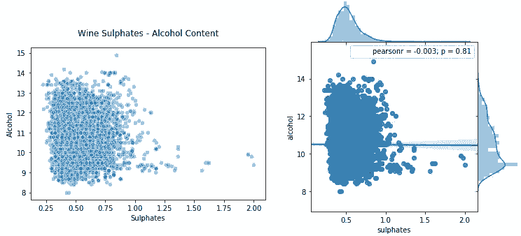
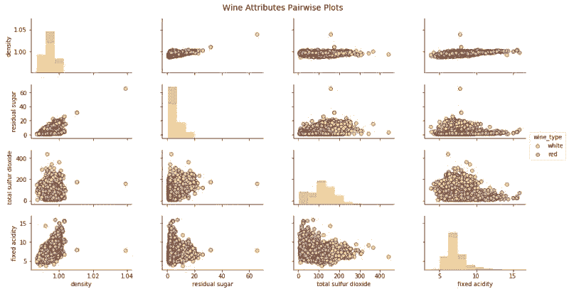

# 从 1 维到 6 维，一文读懂多维数据可视化策略

选自 towardsdatascience

**作者：****Dipanjan Sarkar**

**机器之心编译**

**参与：Jane W、乾树、黄小天**

> 数据聚合、汇总和可视化是支撑数据分析领域的三大支柱。长久以来，数据可视化都是一个强有力的工具，被业界广泛使用，却受限于 2 维。在本文中，作者将探索一些有效的多维数据可视化策略（范围从 1 维到 6 维）。

**介绍**

描述性分析（descriptive analytics）是任何分析生命周期的数据科学项目或特定研究的核心组成部分之一。数据聚合（aggregation）、汇总（summarization）和可视化（visualization）是支撑数据分析领域的主要支柱。从传统商业智能（Business Intelligence）开始，甚至到如今人工智能时代，数据可视化都是一个强有力的工具；由于其能有效抽取正确的信息，同时清楚容易地理解和解释结果，可视化被业界组织广泛使用。然而，处理多维数据集（通常具有 2 个以上属性）开始引起问题，因为我们的数据分析和通信的媒介通常限于 2 个维度。在本文中，我们将探索一些有效的多维数据可视化策略（范围从 1 维到 6 维）。

**动机**

> 「一图胜千言」

这是一句我们熟悉的非常流行的英语习语，可以充当将数据可视化作为分析的有效工具的灵感和动力。永远记住：「有效的数据可视化既是一门艺术，也是一门科学。」在开始之前，我还要提及下面一句非常相关的引言，它强调了数据可视化的必要性。

> 「一张图片的最大价值在于，它迫使我们注意到我们从未期望看到的东西。」
> 
> ——John Tukey

**快速回顾可视化**

本文假设一般读者知道用于绘图和可视化数据的基本图表类型，因此这里不再赘述，但在本文随后的实践中，我们将会涉及大部分图表类型。著名的可视化先驱和统计学家 Edward Tufte 说过，数据可视化应该在数据的基础上，以清晰、精确和高效的方式传达数据模式和洞察信息。

结构化数据通常包括由行和特征表征的数据观测值或由列表征的数据属性。每列也可以被称为数据集的某特定维度。最常见的数据类型包括连续型数值数据和离散型分类数据。因此，任何数据可视化将基本上以散点图、直方图、箱线图等简单易懂的形式描述一个或多个数据属性。本文将涵盖单变量（1 维）和多变量（多维）数据可视化策略。这里将使用 Python 机器学习生态系统，我们建议先检查用于数据分析和可视化的框架，包括 pandas、matplotlib、seaborn、plotly 和 bokeh。除此之外，如果你有兴趣用数据制作精美而有意义的可视化文件，那么了解 D3.js（https://d3js.org/）也是必须的。有兴趣的读者可以阅读 Edward Tufte 的「The Visual Display of Quantitative Information」。

**闲话至此，让我们来看看可视化（和代码）吧！**

别在这儿谈论理论和概念了，让我们开始进入正题吧。我们将使用 UCI 机器学习库（https://archive.ics.uci.edu/ml/index.php）中的 Wine Quality Data Set。这些数据实际上是由两个数据集组成的，这两个数据集描述了葡萄牙「Vinho Verde」葡萄酒中红色和白色酒的各种成分。本文中的所有分析都在我的 GitHub 存储库中，你可以用 Jupyter Notebook 中的代码来尝试一下！

我们将首先加载以下必要的依赖包进行分析。

```py
import pandas as pd
import matplotlib.pyplot as plt
from mpl_toolkits.mplot3d import Axes3D
import matplotlib as mpl
import numpy as np
import seaborn as sns
%matplotlib inline
```

我们将主要使用 matplotlib 和 seaborn 作为我们的可视化框架，但你可以自由选择并尝试任何其它框架。首先进行基本的数据预处理步骤。

```py
white_wine = pd.read_csv('winequality-white.csv', sep=';')
red_wine = pd.read_csv('winequality-red.csv', sep=';')

# store wine type as an attribute
red_wine['wine_type'] = 'red'   
white_wine['wine_type'] = 'white'

# bucket wine quality scores into qualitative quality labels
red_wine['quality_label'] = red_wine['quality'].apply(lambda value: 'low' 
                                                          if value <= 5 else 'medium' 
                                                              if value <= 7 else 'high')
red_wine['quality_label'] = pd.Categorical(red_wine['quality_label'], 
                                           categories=['low', 'medium', 'high'])
white_wine['quality_label'] = white_wine['quality'].apply(lambda value: 'low' 
                                                              if value <= 5 else 'medium' 
                                                                  if value <= 7 else 'high')
white_wine['quality_label'] = pd.Categorical(white_wine['quality_label'], 
                                             categories=['low', 'medium', 'high'])

# merge red and white wine datasets
wines = pd.concat([red_wine, white_wine])

# re-shuffle records just to randomize data points
wines = wines.sample(frac=1, random_state=42).reset_index(drop=True) 
```

我们通过合并有关红、白葡萄酒样本的数据集来创建单个葡萄酒数据框架。我们还根据葡萄酒样品的质量属性创建一个新的分类变量 quality_label。现在我们来看看数据前几行。

```py
wines.head()
```


*葡萄酒质量数据集*

很明显，我们有几个葡萄酒样本的数值和分类属性。每个观测样本属于红葡萄酒或白葡萄酒样品，属性是从物理化学测试中测量和获得的特定属性或性质。如果你想了解每个属性（属性对应的变量名称一目了然）详细的解释，你可以查看 Jupyter Notebook。让我们快速对这些感兴趣的属性进行基本的描述性概括统计。

```py
subset_attributes = ['residual sugar', 'total sulfur dioxide', 'sulphates', 
                     'alcohol', 'volatile acidity', 'quality']
rs = round(red_wine[subset_attributes].describe(),2)
ws = round(white_wine[subset_attributes].describe(),2)

pd.concat([rs, ws], axis=1, keys=['Red Wine Statistics', 'White Wine Statistics']) 
```


*葡萄酒类型的基本描述性统计*

比较这些不同类型的葡萄酒样本的统计方法相当容易。注意一些属性的明显差异。稍后我们将在一些可视化中强调这些内容。

**单变量分析**

单变量分析基本上是数据分析或可视化的最简单形式，因为只关心分析一个数据属性或变量并将其可视化（1 维）。

**可视化 1 维数据（1-D）**

使所有数值数据及其分布可视化的最快、最有效的方法之一是利用 pandas 画直方图（histogram）。

```py
wines.hist(bins=15, color='steelblue', edgecolor='black', linewidth=1.0,
           xlabelsize=8, ylabelsize=8, grid=False)    
plt.tight_layout(rect=(0, 0, 1.2, 1.2)) 
```


*将属性作为 1 维数据可视化*

上图给出了可视化任何属性的基本数据分布的一个好主意。

让我们进一步可视化其中一个连续型数值属性。直方图或核密度图能够很好地帮助理解该属性数据的分布。

```py
# Histogram
fig = plt.figure(figsize = (6,4))
title = fig.suptitle("Sulphates Content in Wine", fontsize=14)
fig.subplots_adjust(top=0.85, wspace=0.3)

ax = fig.add_subplot(1,1, 1)
ax.set_xlabel("Sulphates")
ax.set_ylabel("Frequency") 
ax.text(1.2, 800, r'$\mu$='+str(round(wines['sulphates'].mean(),2)), 
         fontsize=12)
freq, bins, patches = ax.hist(wines['sulphates'], color='steelblue', bins=15,
                                    edgecolor='black', linewidth=1)

# Density Plot
fig = plt.figure(figsize = (6, 4))
title = fig.suptitle("Sulphates Content in Wine", fontsize=14)
fig.subplots_adjust(top=0.85, wspace=0.3)

ax1 = fig.add_subplot(1,1, 1)
ax1.set_xlabel("Sulphates")
ax1.set_ylabel("Frequency") 
sns.kdeplot(wines['sulphates'], ax=ax1, shade=True, color='steelblue') 
```


*可视化 1 维连续型数值数据*

从上面的图表中可以看出，葡萄酒中硫酸盐的分布存在明显的右偏（right skew）。

可视化一个离散分类型数据属性稍有不同，条形图是（bar plot）最有效的方法之一。你也可以使用饼图（pie-chart），但一般来说要尽量避免，尤其是当不同类别的数量超过 3 个时。

```py
# Histogram
fig = plt.figure(figsize = (6,4))
title = fig.suptitle("Sulphates Content in Wine", fontsize=14)
fig.subplots_adjust(top=0.85, wspace=0.3)

ax = fig.add_subplot(1,1, 1)
ax.set_xlabel("Sulphates")
ax.set_ylabel("Frequency") 
ax.text(1.2, 800, r'$\mu$='+str(round(wines['sulphates'].mean(),2)), 
         fontsize=12)
freq, bins, patches = ax.hist(wines['sulphates'], color='steelblue', bins=15,
                                    edgecolor='black', linewidth=1)

# Density Plot
fig = plt.figure(figsize = (6, 4))
title = fig.suptitle("Sulphates Content in Wine", fontsize=14)
fig.subplots_adjust(top=0.85, wspace=0.3)

ax1 = fig.add_subplot(1,1, 1)
ax1.set_xlabel("Sulphates")
ax1.set_ylabel("Frequency") 
sns.kdeplot(wines['sulphates'], ax=ax1, shade=True, color='steelblue') 
```


*可视化 1 维离散分类型数据*

现在我们继续分析更高维的数据。

**多变量分析**

多元分析才是真正有意思并且有复杂性的领域。这里我们分析多个数据维度或属性（2 个或更多）。多变量分析不仅包括检查分布，还包括这些属性之间的潜在关系、模式和相关性。你也可以根据需要解决的问题，利用推断统计（inferential statistics）和假设检验，检查不同属性、群体等的统计显著性（significance）。

**可视化 2 维数据（2-D）**

检查不同数据属性之间的潜在关系或相关性的最佳方法之一是利用配对相关性矩阵（pair-wise correlation matrix）并将其可视化为热力图。

```py
# Correlation Matrix Heatmap
f, ax = plt.subplots(figsize=(10, 6))
corr = wines.corr()
hm = sns.heatmap(round(corr,2), annot=True, ax=ax, cmap="coolwarm",fmt='.2f',
                 linewidths=.05)
f.subplots_adjust(top=0.93)
t= f.suptitle('Wine Attributes Correlation Heatmap', fontsize=14) 
```


*用相关性热力图可视化 2 维数据*

热力图中的梯度根据相关性的强度而变化，你可以很容易发现彼此之间具有强相关性的潜在属性。另一种可视化的方法是在感兴趣的属性之间使用配对散点图。

```py
# Correlation Matrix Heatmap
f, ax = plt.subplots(figsize=(10, 6))
corr = wines.corr()
hm = sns.heatmap(round(corr,2), annot=True, ax=ax, cmap="coolwarm",fmt='.2f',
                 linewidths=.05)
f.subplots_adjust(top=0.93)
t= f.suptitle('Wine Attributes Correlation Heatmap', fontsize=14) 
```


*用配对散点图可视化 2 维数据*

根据上图，可以看到散点图也是观察数据属性的 2 维潜在关系或模式的有效方式。另一种将多元数据可视化为多个属性的方法是使用平行坐标图。

```py
# Correlation Matrix Heatmap
f, ax = plt.subplots(figsize=(10, 6))
corr = wines.corr()
hm = sns.heatmap(round(corr,2), annot=True, ax=ax, cmap="coolwarm",fmt='.2f',
                 linewidths=.05)
f.subplots_adjust(top=0.93)
t= f.suptitle('Wine Attributes Correlation Heatmap', fontsize=14) 
```


*用平行坐标图可视化多维数据*

基本上，在如上所述的可视化中，点被表征为连接的线段。每条垂直线代表一个数据属性。所有属性中的一组完整的连接线段表征一个数据点。因此，趋于同一类的点将会更加接近。仅仅通过观察就可以清楚看到，与白葡萄酒相比，红葡萄酒的密度略高。与红葡萄酒相比，白葡萄酒的残糖和二氧化硫总量也较高，红葡萄酒的固定酸度高于白葡萄酒。查一下我们之前得到的统计表中的统计数据，看看能否验证这个假设！

因此，让我们看看可视化两个连续型数值属性的方法。散点图和联合分布图（joint plot）是检查模式、关系以及属性分布的特别好的方法。

```py
# Scatter Plot
plt.scatter(wines['sulphates'], wines['alcohol'],
            alpha=0.4, edgecolors='w')

plt.xlabel('Sulphates')
plt.ylabel('Alcohol')
plt.title('Wine Sulphates - Alcohol Content',y=1.05)

# Joint Plot
jp = sns.jointplot(x='sulphates', y='alcohol', data=wines,
                   kind='reg', space=0, size=5, ratio=4) 
```



*使用散点图和联合分布图可视化 2 维连续型数值数据*

散点图在上图左侧，联合分布图在右侧。就像我们提到的那样，你可以查看联合分布图中的相关性、关系以及分布。

如何可视化两个连续型数值属性？一种方法是为分类维度画单独的图（子图）或分面（facet）。

```py
# Using subplots or facets along with Bar Plots
fig = plt.figure(figsize = (10, 4))
title = fig.suptitle("Wine Type - Quality", fontsize=14)
fig.subplots_adjust(top=0.85, wspace=0.3)
# red wine - wine quality
ax1 = fig.add_subplot(1,2, 1)
ax1.set_title("Red Wine")
ax1.set_xlabel("Quality")
ax1.set_ylabel("Frequency") 
rw_q = red_wine['quality'].value_counts()
rw_q = (list(rw_q.index), list(rw_q.values))
ax1.set_ylim([0, 2500])
ax1.tick_params(axis='both', which='major', labelsize=8.5)
bar1 = ax1.bar(rw_q[0], rw_q[1], color='red', 
               edgecolor='black', linewidth=1)

# white wine - wine quality
ax2 = fig.add_subplot(1,2, 2)
ax2.set_title("White Wine")
ax2.set_xlabel("Quality")
ax2.set_ylabel("Frequency") 
ww_q = white_wine['quality'].value_counts()
ww_q = (list(ww_q.index), list(ww_q.values))
ax2.set_ylim([0, 2500])
ax2.tick_params(axis='both', which='major', labelsize=8.5)
bar2 = ax2.bar(ww_q[0], ww_q[1], color='white', 
               edgecolor='black', linewidth=1) 
```


*使用条形图和子图可视化 2 维离散型分类数据*

虽然这是一种可视化分类数据的好方法，但正如所见，利用 matplotlib 需要编写大量的代码。另一个好方法是在单个图中为不同的属性画堆积条形图或多个条形图。可以很容易地利用 seaborn 做到。

```py
# Multi-bar Plot
cp = sns.countplot(x="quality", hue="wine_type", data=wines, 
                   palette={"red": "#FF9999", "white": "#FFE888"}) 
```


*在一个条形图中可视化 2 维离散型分类数据*

这看起来更清晰，你也可以有效地从单个图中比较不同的类别。

让我们看看可视化 2 维混合属性（大多数兼有数值和分类）。一种方法是使用分图\子图与直方图或核密度图。

```py
# facets with histograms
fig = plt.figure(figsize = (10,4))
title = fig.suptitle("Sulphates Content in Wine", fontsize=14)
fig.subplots_adjust(top=0.85, wspace=0.3)

ax1 = fig.add_subplot(1,2, 1)
ax1.set_title("Red Wine")
ax1.set_xlabel("Sulphates")
ax1.set_ylabel("Frequency") 
ax1.set_ylim([0, 1200])
ax1.text(1.2, 800, r'$\mu$='+str(round(red_wine['sulphates'].mean(),2)), 
         fontsize=12)
r_freq, r_bins, r_patches = ax1.hist(red_wine['sulphates'], color='red', bins=15,
                                     edgecolor='black', linewidth=1)

ax2 = fig.add_subplot(1,2, 2)
ax2.set_title("White Wine")
ax2.set_xlabel("Sulphates")
ax2.set_ylabel("Frequency")
ax2.set_ylim([0, 1200])
ax2.text(0.8, 800, r'$\mu$='+str(round(white_wine['sulphates'].mean(),2)), 
         fontsize=12)
w_freq, w_bins, w_patches = ax2.hist(white_wine['sulphates'], color='white', bins=15,
                                     edgecolor='black', linewidth=1)

# facets with density plots
fig = plt.figure(figsize = (10, 4))
title = fig.suptitle("Sulphates Content in Wine", fontsize=14)
fig.subplots_adjust(top=0.85, wspace=0.3)

ax1 = fig.add_subplot(1,2, 1)
ax1.set_title("Red Wine")
ax1.set_xlabel("Sulphates")
ax1.set_ylabel("Density") 
sns.kdeplot(red_wine['sulphates'], ax=ax1, shade=True, color='r')

ax2 = fig.add_subplot(1,2, 2)
ax2.set_title("White Wine")
ax2.set_xlabel("Sulphates")
ax2.set_ylabel("Density") 
sns.kdeplot(white_wine['sulphates'], ax=ax2, shade=True, color='y') 
```


*利用分面和直方图\核密度图可视化 2 维混合属性*

虽然这很好，但是我们再一次编写了大量代码，我们可以通过利用 seaborn 避免这些，在单个图表中画出这些图。

```py
# Using multiple Histograms 
fig = plt.figure(figsize = (6, 4))
title = fig.suptitle("Sulphates Content in Wine", fontsize=14)
fig.subplots_adjust(top=0.85, wspace=0.3)
ax = fig.add_subplot(1,1, 1)
ax.set_xlabel("Sulphates")
ax.set_ylabel("Frequency") 

g = sns.FacetGrid(wines, hue='wine_type', palette={"red": "r", "white": "y"})
g.map(sns.distplot, 'sulphates', kde=False, bins=15, ax=ax)
ax.legend(title='Wine Type')
plt.close(2) 
```


*利用多维直方图可视化 2 维混合属性*

可以看到上面生成的图形清晰简洁，我们可以轻松地比较各种分布。除此之外，箱线图（box plot）是根据分类属性中的不同数值有效描述数值数据组的另一种方法。箱线图是了解数据中四分位数值以及潜在异常值的好方法。

```py
# Box Plots
f, (ax) = plt.subplots(1, 1, figsize=(12, 4))
f.suptitle('Wine Quality - Alcohol Content', fontsize=14)

sns.boxplot(x="quality", y="alcohol", data=wines,  ax=ax)
ax.set_xlabel("Wine Quality",size = 12,alpha=0.8)
ax.set_ylabel("Wine Alcohol %",size = 12,alpha=0.8) 
```


*2 维混合属性的有效可视化方法——箱线图*

另一个类似的可视化是小提琴图，这是使用核密度图显示分组数值数据的另一种有效方法（描绘了数据在不同值下的概率密度）。

```py
# Violin Plots
f, (ax) = plt.subplots(1, 1, figsize=(12, 4))
f.suptitle('Wine Quality - Sulphates Content', fontsize=14)

sns.violinplot(x="quality", y="sulphates", data=wines,  ax=ax)
ax.set_xlabel("Wine Quality",size = 12,alpha=0.8)
ax.set_ylabel("Wine Sulphates",size = 12,alpha=0.8) 
```


*2 维混合属性的有效可视化方法——小提琴图*

你可以清楚看到上面的不同酒品质类别的葡萄酒硫酸盐的密度图。

将 2 维数据可视化非常简单直接，但是随着维数（属性）数量的增加，数据开始变得复杂。原因是因为我们受到显示媒介和环境的双重约束。

对于 3 维数据，可以通过在图表中采用 z 轴或利用子图和分面来引入深度的虚拟坐标。

但是，对于 3 维以上的数据来说，更难以直观地表征。高于 3 维的最好方法是使用图分面、颜色、形状、大小、深度等等。你还可以使用时间作为维度，为随时间变化的属性制作一段动画（这里时间是数据中的维度）。看看 Hans Roslin 的精彩演讲就会获得相同的想法！

**可视化 3 维数据（3-D）**

这里研究有 3 个属性或维度的数据，我们可以通过考虑配对散点图并引入颜色或色调将分类维度中的值分离出来。

```py
# Scatter Plot with Hue for visualizing data in 3-D
cols = ['density', 'residual sugar', 'total sulfur dioxide', 'fixed acidity', 'wine_type']
pp = sns.pairplot(wines[cols], hue='wine_type', size=1.8, aspect=1.8, 
                  palette={"red": "#FF9999", "white": "#FFE888"},
                  plot_kws=dict(edgecolor="black", linewidth=0.5))
fig = pp.fig 
fig.subplots_adjust(top=0.93, wspace=0.3)
t = fig.suptitle('Wine Attributes Pairwise Plots', fontsize=14) 
```



*用散点图和色调（颜色）可视化 3 维数据*

上图可以查看相关性和模式，也可以比较葡萄酒组。就像我们可以清楚地看到白葡萄酒的总二氧化硫和残糖比红葡萄酒高。

让我们来看看可视化 3 个连续型数值属性的策略。一种方法是将 2 个维度表征为常规长度（x 轴）和宽度（y 轴）并且将第 3 维表征为深度（z 轴）的概念。

```py
# Visualizing 3-D numeric data with Scatter Plots
# length, breadth and depth
fig = plt.figure(figsize=(8, 6))
ax = fig.add_subplot(111, projection='3d')

xs = wines['residual sugar']
ys = wines['fixed acidity']
zs = wines['alcohol']
ax.scatter(xs, ys, zs, s=50, alpha=0.6, edgecolors='w')

ax.set_xlabel('Residual Sugar')
ax.set_ylabel('Fixed Acidity')
ax.set_zlabel('Alcohol') 
```


*通过引入深度的概念来可视化 3 维数值数据*

我们还可以利用常规的 2 维坐标轴，并将尺寸大小的概念作为第 3 维（本质上是气泡图），其中点的尺寸大小表征第 3 维的数量。

```py
# Visualizing 3-D numeric data with a bubble chart
# length, breadth and size
plt.scatter(wines['fixed acidity'], wines['alcohol'], s=wines['residual sugar']*25, 
            alpha=0.4, edgecolors='w')

plt.xlabel('Fixed Acidity')
plt.ylabel('Alcohol')
plt.title('Wine Alcohol Content - Fixed Acidity - Residual Sugar',y=1.05) 
```


*通过引入尺寸大小的概念来可视化 3 维数值数据*

因此，你可以看到上面的图表不是一个传统的散点图，而是点（气泡）大小基于不同残糖量的的气泡图。当然，并不总像这种情况可以发现数据明确的模式，我们看到其它两个维度的大小也不同。

为了可视化 3 个离散型分类属性，我们可以使用常规的条形图，可以利用色调的概念以及分面或子图表征额外的第 3 个维度。seaborn 框架帮助我们最大程度地减少代码，并高效地绘图。

```py
# Visualizing 3-D categorical data using bar plots
# leveraging the concepts of hue and facets
fc = sns.factorplot(x="quality", hue="wine_type", col="quality_label", 
                    data=wines, kind="count",
                    palette={"red": "#FF9999", "white": "#FFE888"}) 
```


*通过引入色调和分面的概念可视化 3 维分类数据*

上面的图表清楚地显示了与每个维度相关的频率，可以看到，通过图表能够容易有效地理解相关内容。

考虑到可视化 3 维混合属性，我们可以使用色调的概念来将其中一个分类属性可视化，同时使用传统的如散点图来可视化数值属性的 2 个维度。

```py
# Visualizing 3-D mix data using scatter plots
# leveraging the concepts of hue for categorical dimension
jp = sns.pairplot(wines, x_vars=["sulphates"], y_vars=["alcohol"], size=4.5,
                  hue="wine_type", palette={"red": "#FF9999", "white": "#FFE888"},
                  plot_kws=dict(edgecolor="k", linewidth=0.5))

# we can also view relationships\correlations as needed                  
lp = sns.lmplot(x='sulphates', y='alcohol', hue='wine_type', 
                palette={"red": "#FF9999", "white": "#FFE888"},
                data=wines, fit_reg=True, legend=True,
                scatter_kws=dict(edgecolor="k", linewidth=0.5)) 
```


*通过利用散点图和色调的概念可视化 3 维混合属性*

因此，色调作为类别或群体的良好区分，虽然如上图观察没有相关性或相关性非常弱，但从这些图中我们仍可以理解，与白葡萄酒相比，红葡萄酒的硫酸盐含量较高。你也可以使用核密度图代替散点图来理解 3 维数据。

```py
# Visualizing 3-D mix data using kernel density plots
# leveraging the concepts of hue for categorical dimension
ax = sns.kdeplot(white_wine['sulphates'], white_wine['alcohol'],
                  cmap="YlOrBr", shade=True, shade_lowest=False)
ax = sns.kdeplot(red_wine['sulphates'], red_wine['alcohol'],
                  cmap="Reds", shade=True, shade_lowest=False) 
```


*通过利用核密度图和色调的概念可视化 3 维混合属性*

与预期一致且相当明显，红葡萄酒样品比白葡萄酒具有更高的硫酸盐含量。你还可以根据色调强度查看密度浓度。

如果我们正在处理有多个分类属性的 3 维数据，我们可以利用色调和其中一个常规轴进行可视化，并使用如箱线图或小提琴图来可视化不同的数据组。

```py
# Visualizing 3-D mix data using violin plots
# leveraging the concepts of hue and axes for > 1 categorical dimensions
f, (ax1, ax2) = plt.subplots(1, 2, figsize=(14, 4))
f.suptitle('Wine Type - Quality - Acidity', fontsize=14)

sns.violinplot(x="quality", y="volatile acidity",
               data=wines, inner="quart", linewidth=1.3,ax=ax1)
ax1.set_xlabel("Wine Quality",size = 12,alpha=0.8)
ax1.set_ylabel("Wine Volatile Acidity",size = 12,alpha=0.8)

sns.violinplot(x="quality", y="volatile acidity", hue="wine_type", 
               data=wines, split=True, inner="quart", linewidth=1.3,
               palette={"red": "#FF9999", "white": "white"}, ax=ax2)
ax2.set_xlabel("Wine Quality",size = 12,alpha=0.8)
ax2.set_ylabel("Wine Volatile Acidity",size = 12,alpha=0.8)
l = plt.legend(loc='upper right', title='Wine Type') 
```


*通过利用分图小提琴图和色调的概念来可视化 3 维混合属性*

在上图中，我们可以看到，在右边的 3 维可视化图中，我们用 x 轴表示葡萄酒质量，wine_type 用色调表征。我们可以清楚地看到一些有趣的见解，例如与白葡萄酒相比红葡萄酒的挥发性酸度更高。

你也可以考虑使用箱线图来代表具有多个分类变量的混合属性。

```py
# Visualizing 3-D mix data using box plots
# leveraging the concepts of hue and axes for > 1 categorical dimensions
f, (ax1, ax2) = plt.subplots(1, 2, figsize=(14, 4))
f.suptitle('Wine Type - Quality - Alcohol Content', fontsize=14)

sns.boxplot(x="quality", y="alcohol", hue="wine_type",
               data=wines, palette={"red": "#FF9999", "white": "white"}, ax=ax1)
ax1.set_xlabel("Wine Quality",size = 12,alpha=0.8)
ax1.set_ylabel("Wine Alcohol %",size = 12,alpha=0.8)

sns.boxplot(x="quality_label", y="alcohol", hue="wine_type",
               data=wines, palette={"red": "#FF9999", "white": "white"}, ax=ax2)
ax2.set_xlabel("Wine Quality Class",size = 12,alpha=0.8)
ax2.set_ylabel("Wine Alcohol %",size = 12,alpha=0.8)
l = plt.legend(loc='best', title='Wine Type') 
```


*通过利用箱线图和色调的概念可视化 3 维混合属性*

我们可以看到，对于质量和 quality_label 属性，葡萄酒酒精含量都会随着质量的提高而增加。另外红葡萄酒与相同品质类别的白葡萄酒相比具有更高的酒精含量（中位数）。然而，如果检查质量等级，我们可以看到，对于较低等级的葡萄酒（3 和 4），白葡萄酒酒精含量（中位数）大于红葡萄酒样品。否则，红葡萄酒与白葡萄酒相比似乎酒精含量（中位数）略高。

**可视化 4 维数据（4-D）**

基于上述讨论，我们利用图表的各个组件可视化多个维度。一种可视化 4 维数据的方法是在传统图如散点图中利用深度和色调表征特定的数据维度。

```py
# Visualizing 4-D mix data using scatter plots
# leveraging the concepts of hue and depth
fig = plt.figure(figsize=(8, 6))
t = fig.suptitle('Wine Residual Sugar - Alcohol Content - Acidity - Type', fontsize=14)
ax = fig.add_subplot(111, projection='3d')

xs = list(wines['residual sugar'])
ys = list(wines['alcohol'])
zs = list(wines['fixed acidity'])
data_points = [(x, y, z) for x, y, z in zip(xs, ys, zs)]
colors = ['red' if wt == 'red' else 'yellow' for wt in list(wines['wine_type'])]

for data, color in zip(data_points, colors):
    x, y, z = data
    ax.scatter(x, y, z, alpha=0.4, c=color, edgecolors='none', s=30)

ax.set_xlabel('Residual Sugar')
ax.set_ylabel('Alcohol')
ax.set_zlabel('Fixed Acidity') 
```


*通过利用散点图以及色调和深度的概念可视化 4 维数据*

wine_type 属性由上图中的色调表征得相当明显。此外，由于图的复杂性，解释这些可视化开始变得困难，但我们仍然可以看出，例如红葡萄酒的固定酸度更高，白葡萄酒的残糖更高。当然，如果酒精和固定酸度之间有某种联系，我们可能会看到一个逐渐增加或减少的数据点趋势。

另一个策略是使用二维图，但利用色调和数据点大小作为数据维度。通常情况下，这将类似于气泡图等我们先前可视化的图表。

```py
# Visualizing 4-D mix data using bubble plots
# leveraging the concepts of hue and size
size = wines['residual sugar']*25
fill_colors = ['#FF9999' if wt=='red' else '#FFE888' for wt in list(wines['wine_type'])]
edge_colors = ['red' if wt=='red' else 'orange' for wt in list(wines['wine_type'])]

plt.scatter(wines['fixed acidity'], wines['alcohol'], s=size, 
            alpha=0.4, color=fill_colors, edgecolors=edge_colors)

plt.xlabel('Fixed Acidity')
plt.ylabel('Alcohol')
plt.title('Wine Alcohol Content - Fixed Acidity - Residual Sugar - Type',y=1.05) 
```


*通过利用气泡图以及色调和大小的概念可视化 4 维数据*

我们用色调代表 wine_type 和数据点大小代表残糖。我们确实看到了与前面图表中观察到的相似模式，白葡萄酒气泡尺寸更大表征了白葡萄酒的残糖值更高。

如果我们有多于两个分类属性表征，可在常规的散点图描述数值数据的基础上利用色调和分面来描述这些属性。我们来看几个实例。

```py
# Visualizing 4-D mix data using scatter plots
# leveraging the concepts of hue and facets for > 1 categorical attributes
g = sns.FacetGrid(wines, col="wine_type", hue='quality_label', 
                  col_order=['red', 'white'], hue_order=['low', 'medium', 'high'],
                  aspect=1.2, size=3.5, palette=sns.light_palette('navy', 4)[1:])
g.map(plt.scatter, "volatile acidity", "alcohol", alpha=0.9, 
      edgecolor='white', linewidth=0.5, s=100)
fig = g.fig 
fig.subplots_adjust(top=0.8, wspace=0.3)
fig.suptitle('Wine Type - Alcohol - Quality - Acidity', fontsize=14)
l = g.add_legend(title='Wine Quality Class') 
```


*通过利用散点图以及色调和分面的概念可视化 4 维数据*

这种可视化的有效性使得我们可以轻松识别多种模式。白葡萄酒的挥发酸度较低，同时高品质葡萄酒具有较低的酸度。也基于白葡萄酒样本，高品质的葡萄酒有更高的酒精含量和低品质的葡萄酒有最低的酒精含量！

让我们借助一个类似实例，并建立一个 4 维数据的可视化。

```py
# Visualizing 4-D mix data using scatter plots
# leveraging the concepts of hue and facets for > 1 categorical attributes
g = sns.FacetGrid(wines, col="wine_type", hue='quality_label', 
                  col_order=['red', 'white'], hue_order=['low', 'medium', 'high'],
                  aspect=1.2, size=3.5, palette=sns.light_palette('navy', 4)[1:])
g.map(plt.scatter, "volatile acidity", "alcohol", alpha=0.9, 
      edgecolor='white', linewidth=0.5, s=100)
fig = g.fig 
fig.subplots_adjust(top=0.8, wspace=0.3)
fig.suptitle('Wine Type - Alcohol - Quality - Acidity', fontsize=14)
l = g.add_legend(title='Wine Quality Class') 
```


*通过利用散点图以及色调和分面的概念可视化 4 维数据*

我们清楚地看到，高品质的葡萄酒有较低的二氧化硫含量，这是非常相关的，与葡萄酒成分的相关领域知识一致。我们也看到红葡萄酒的二氧化硫总量低于白葡萄酒。在几个数据点中，红葡萄酒的挥发性酸度水平较高。

**可视化 5 维数据（5-D）**

我们照旧遵从上文提出的策略，要想可视化 5 维数据，我们要利用各种绘图组件。我们使用深度、色调、大小来表征其中的三个维度。其它两维仍为常规轴。因为我们还会用到大小这个概念，并借此画出一个三维气泡图。

```py
# Visualizing 5-D mix data using bubble charts
# leveraging the concepts of hue, size and depth
fig = plt.figure(figsize=(8, 6))
ax = fig.add_subplot(111, projection='3d')
t = fig.suptitle('Wine Residual Sugar - Alcohol Content - Acidity - Total Sulfur Dioxide - Type', fontsize=14)

xs = list(wines['residual sugar'])
ys = list(wines['alcohol'])
zs = list(wines['fixed acidity'])
data_points = [(x, y, z) for x, y, z in zip(xs, ys, zs)]

ss = list(wines['total sulfur dioxide'])
colors = ['red' if wt == 'red' else 'yellow' for wt in list(wines['wine_type'])]

for data, color, size in zip(data_points, colors, ss):
    x, y, z = data
    ax.scatter(x, y, z, alpha=0.4, c=color, edgecolors='none', s=size)

ax.set_xlabel('Residual Sugar')
ax.set_ylabel('Alcohol')
ax.set_zlabel('Fixed Acidity') 
```


*利用气泡图和色调、深度、大小的概念来可视化 5 维数据。*

气泡图灵感来源与上文所述一致。但是，我们还可以看到以二氧化硫总量为指标的点数，发现白葡萄酒的二氧化硫含量高于红葡萄酒。

除了深度之外，我们还可以使用分面和色调来表征这五个数据维度中的多个分类属性。其中表征大小的属性可以是数值表征甚至是类别（但是我们可能要用它的数值表征来表征数据点大小）。由于缺乏类别属性，此处我们不作展示，但是你可以在自己的数据集上试试。

```py
# Visualizing 5-D mix data using bubble charts
# leveraging the concepts of hue, size and depth
fig = plt.figure(figsize=(8, 6))
ax = fig.add_subplot(111, projection='3d')
t = fig.suptitle('Wine Residual Sugar - Alcohol Content - Acidity - Total Sulfur Dioxide - Type', fontsize=14)

xs = list(wines['residual sugar'])
ys = list(wines['alcohol'])
zs = list(wines['fixed acidity'])
data_points = [(x, y, z) for x, y, z in zip(xs, ys, zs)]

ss = list(wines['total sulfur dioxide'])
colors = ['red' if wt == 'red' else 'yellow' for wt in list(wines['wine_type'])]

for data, color, size in zip(data_points, colors, ss):
    x, y, z = data
    ax.scatter(x, y, z, alpha=0.4, c=color, edgecolors='none', s=size)

ax.set_xlabel('Residual Sugar')
ax.set_ylabel('Alcohol')
ax.set_zlabel('Fixed Acidity') 
```


*借助色调、分面、大小的概念和气泡图来可视化 5 维数据。*

通常还有一个前文介绍的 5 维数据可视化的备选方法。当看到我们先前绘制的图时，很多人可能会对多出来的维度深度困惑。该图重复利用了分面的特性，所以仍可以在 2 维面板上绘制出来且易于说明和绘制。


我们已经领略到多位数据可视化的复杂性！如果还有人想问，为何不增加维度？让我们继续简单探索下！

**可视化 6 维数据（6-D）**

目前我们画得很开心（我希望是如此！）我们继续在可视化中添加一个数据维度。我们将利用深度、色调、大小和形状及两个常规轴来描述所有 6 个数据维度。

我们将利用散点图和色调、深度、形状、大小的概念来可视化 6 维数据。

```py
# Visualizing 6-D mix data using scatter charts
# leveraging the concepts of hue, size, depth and shape
fig = plt.figure(figsize=(8, 6))
t = fig.suptitle('Wine Residual Sugar - Alcohol Content - Acidity - Total Sulfur Dioxide - Type - Quality', fontsize=14)
ax = fig.add_subplot(111, projection='3d')

xs = list(wines['residual sugar'])
ys = list(wines['alcohol'])
zs = list(wines['fixed acidity'])
data_points = [(x, y, z) for x, y, z in zip(xs, ys, zs)]

ss = list(wines['total sulfur dioxide'])
colors = ['red' if wt == 'red' else 'yellow' for wt in list(wines['wine_type'])]
markers = [',' if q == 'high' else 'x' if q == 'medium' else 'o' for q in list(wines['quality_label'])]

for data, color, size, mark in zip(data_points, colors, ss, markers):
    x, y, z = data
    ax.scatter(x, y, z, alpha=0.4, c=color, edgecolors='none', s=size, marker=mark)

ax.set_xlabel('Residual Sugar')
ax.set_ylabel('Alcohol')
ax.set_zlabel('Fixed Acidity') 
```


这可是在一张图上画出 6 维数据！我们用形状表征葡萄酒的质量标注，优质（用方块标记），一般（用 x 标记），差（用圆标记）：用色调表示红酒的类型，由深度和数据点大小确定的酸度表征总二氧化硫含量。

这个解释起来可能有点费劲，但是在试图理解多维数据的隐藏信息时，最好结合一些绘图组件将其可视化。

*   结合形状和 y 轴的表现，我们知道高中档的葡萄酒的酒精含量比低质葡萄酒更高。

*   结合色调和大小的表现，我们知道白葡萄酒的总二氧化硫含量比红葡萄酒更高。

*   结合深度和色调的表现，我们知道白葡萄酒的酸度比红葡萄酒更低。

*   结合色调和 x 轴的表现，我们知道红葡萄酒的残糖比白葡萄酒更低。

*   结合色调和形状的表现，似乎白葡萄酒的高品质产量高于红葡萄酒。（可能是由于白葡萄酒的样本量较大）

我们也可以用分面属性来代替深度构建 6 维数据可视化效果。

```py
 # Visualizing 6-D mix data using scatter charts 
 # leveraging the concepts of hue, facets and size 
 g = sns.FacetGrid(wines, row='wine_type', col="quality", hue='quality_label', size=4) 
 g.map(plt.scatter, "residual sugar", "alcohol", alpha=0.5,  
 edgecolor='k', linewidth=0.5, s=wines['total sulfur dioxide']*2) 
 fig = g.fig  
 fig.set_size_inches(18, 8) 
 fig.subplots_adjust(top=0.85, wspace=0.3) 
 fig.suptitle('Wine Type - Sulfur Dioxide - Residual Sugar - Alcohol - Quality Class - Quality Rating', fontsize=14) 
 l = g.add_legend(title='Wine Quality Class') 
```


*借助色调、深度、面、大小的概念和散点图来可视化 6 维数据。*

因此，在这种情况下，我们利用分面和色调来表征三个分类属性，并使用两个常规轴和大小来表征 6 维数据可视化的三个数值属性。

**结论**

数据可视化与科学一样重要。如果你看到这，我很欣慰你能坚持看完这篇长文。我们的目的不是为了记住所有数据，也不是给出一套固定的数据可视化规则。本文的主要目的是理解并学习高效的数据可视化策略，尤其是当数据维度增大时。希望你以后可以用本文知识可视化你自己的数据集。

*原文链接：https://towardsdatascience.com/the-art-of-effective-visualization-of-multi-dimensional-data-6c7202990c57*

****本文为机器之心编译，**转载请联系本公众号获得授权****。**

✄------------------------------------------------

**加入机器之心（全职记者/实习生）：hr@jiqizhixin.com**

**投稿或寻求报道：editor@jiqizhixin.com**

**广告&商务合作：bd@jiqizhixin.com**