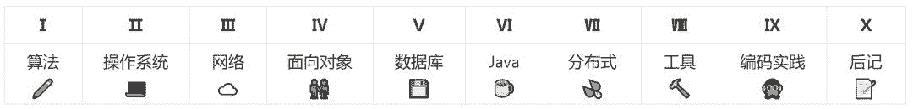

# 资源 | 这是一份收藏量超过 2 万 6 的计算机科学学习笔记

机器之心整理

**作者****：****郑永川**

**参与：思源**

> 这是一份收藏量超过 2 万 6、Fork 量超过 7 千的学习笔记。近日，中山大学郑永川构建了一个「准备秋招学习笔记」的项目，该项目包含了计算机科学的大量精要知识与教程。该项目从基础排序算法到编程理念展示了计算机科学的应知应会，该项目对机器学习开发者及入门读者也非常有用，例如 Linux 系统、面向对象的编程、Git 工具和代码可读性等。这些笔记都是作者根据对各类书籍的理解，并记录重要知识点而完成。

项目地址：https://github.com/CyC2018/Interview-Notebook

该项目的主体内容可分为 9 部分，其中算法介绍了基础的栈和队列、并查集、排序和查找等，操作系统介绍了现代计算机系统与 Linux 系统。其它如介绍了设计模式和基本思想的面向对象编程、世界上最先进的分布式版本控制系统 Git、以及 Java 和编程实践等都有涉及。



如下是该项目各类别的基本目录与内容，因为机器学习可能会常用到面向对象的编程方法，因此我们在后面简要介绍了这一章节中面向对象的基本思想。

**算法 **

*   剑指 Offer 题解（目录根据原书第二版进行编排）

*   Leetcode 题解（做了一个大致分类，并对每种分类题型的解题思路做了总结）

*   算法（主要参考 Robert Sedgewick 的算法书进行实现，源代码以及测试代码可在另一个仓库获取）

**操作系统 **

*   计算机操作系统（参考 现代操作系统、Unix 环境高级编程、深入理解计算机系统）

*   Linux（参考 鸟哥的 Linux 私房菜）

**网络 **

*   计算机网络（参考 谢希仁的计算机网络、计算机网络 自顶向下方法、TCP/IP 详解）

*   HTTP（参考 图解 HTTP，更多的是参考网上的文档，比如 MDN、维基百科等）

*   Socket（参考 Unix 网络编程）

**面向对象 **

*   设计模式（参考 Head First 设计模式、设计模式 可复用面向对象软件的基础，实现了 Gof 的 23 种设计模式）

*   面向对象思想（内容包括三大原则（继承、封装、多态）、类图、设计原则）

**数据库 **

*   数据库系统原理（参考 数据库系统原理）

*   SQL（参考 SQL 必知必会）

*   Leetcode-Database 题解（Leetcode 上数据库题目的解题记录）

*   MySQL（参考 高性能 MySQL）

*   Redis（参考 Redis 设计与实现、Redis 实战）

**Java **

*   Java 基础（参考 Effective Java、Java 编程思想，也有部分内容参考官方文档以及 StackOverflow）

*   Java 虚拟机（参考 深入理解 Java 虚拟机）

*   Java 并发（参考 Java 编程思想、深入理解 Java 虚拟机）

*   Java 容器（包含容器源码的分析）

*   Java I/O（包含 NIO 的原理以及实例）

**分布式 **

*   一致性（CAP、BASE、Paxos、Raft）

*   分布式问题分析（分布式事务、分布式锁、分布式 Session、负载均衡）

**工具 **

*   Git（一些 Git 的使用和概念）

*   正则表达式（参考 正则表达式必知必会）

**编码实践 **

*   重构（参考 重构 改善既有代码的设计）

*   代码可读性（参考 编写可读代码的艺术）

*   代码风格规范（Google 开源项目的代码风格规范）

**面向对象思想**

具体而言例如在面向对象的基本思想中，作者介绍了封装、继承和多态三大特性，此外还有类图和设计原则。这里摘取了原项目中展开的面向对象三大特性，更信息的内容请查看原 GitHub 项目。

面向对象的编程在实现想法乃至系统的过程中都非常重要，我们不论是使用 TensorFlow 还是 PyTorch 来构建模型都或多或少需要使用类和方法。若能了解面向对象的三大特性并使用类和方法来构建模型，那么它们可以让我们的机器学习代码更加美丽迷人。

**封装**

利用抽象数据类型将数据和基于数据的操作封装在一起，使其构成一个不可分割的独立实体。数据被保护在抽象数据类型的内部，尽可能地隐藏内部的细节，只保留一些对外接口使之与外部发生联系。用户无需知道对象内部的细节，但可以通过对象对外提供的接口来访问该对象。

优点：

*   减少耦合：可以独立地开发、测试、优化、使用、理解和修改

*   减轻维护的负担：可以更容易被程序员理解，并且在调试的时候可以不影响其他模块

*   有效地调节性能：可以通过剖析确定哪些模块影响了系统的性能

*   提高软件的可重用性

*   降低了构建大型系统的风险：即使整个系统不可用，但是这些独立的模块却有可能是可用的

以下 Person 类封装 name、gender、age 等属性，外界只能通过 get() 方法获取一个 Person 对象的 name 属性和 gender 属性，而无法获取 age 属性，但是 age 属性可以供 work() 方法使用。

注意到 gender 属性使用 int 数据类型进行存储，封装使得用户注意不到这种实现细节。并且在需要修改 gender 属性使用的数据类型时，也可以在不影响客户端代码的情况下进行。

```py
public class Person {
    private String name;
    private int gender;
    private int age;

    public String getName() {
        return name;
    }

    public String getGender() {
        return gender == 0 ? "man" : "woman";
    }

    public void work() {
        if (18 <= age && age <= 50) {
            System.out.println(name + " is working very hard!");
        } else {
            System.out.println(name + " can't work any more!");
        }
    }
} 
```

**继承**

继承实现了 IS-A 关系，例如 Cat 和 Animal 就是一种 IS-A 关系，因此 Cat 可以继承自 Animal，从而获得 Animal 非 private 的属性和方法。

Cat 可以当做 Animal 来使用，也就是说可以使用 Animal 引用 Cat 对象。父类引用指向子类对象称为 向上转型。

```py
Animal animal = new Cat(); 
```

继承应该遵循里氏替换原则，子类对象必须能够替换掉所有父类对象。

**多态**

多态分为编译时多态和运行时多态。编译时多态主要指方法的重载，运行时多态指程序中定义的对象引用所指向的具体类型在运行期间才确定。

运行时多态有三个条件：

*   继承

*   覆盖（重写）

*   向上转型

下面的代码中，乐器类（Instrument）有两个子类：Wind 和 Percussion，它们都覆盖了父类的 play() 方法，并且在 main() 方法中使用父类 Instrument 来引用 Wind 和 Percussion 对象。在 Instrument 引用调用 play() 方法时，会执行实际引用对象所在类的 play() 方法，而不是 Instrument 类的方法。

```py
public class Instrument {
    public void play() {
        System.out.println("Instument is playing...");
    }
}

public class Wind extends Instrument {
    public void play() {
        System.out.println("Wind is playing...");
    }
}

public class Percussion extends Instrument {
    public void play() {
        System.out.println("Percussion is playing...");
    }
}

public class Music {
    public static void main(String[] args) {
        List<Instrument> instruments = new ArrayList<>();
        instruments.add(new Wind());
        instruments.add(new Percussion());
        for(Instrument instrument : instruments) {
            instrument.play();
        }
    }
} 
```

****本文为机器之心整理，**转载请联系本公众号获得授权****。**

✄------------------------------------------------

**加入机器之心（全职记者 / 实习生）：hr@jiqizhixin.com**

**投稿或寻求报道：**content**@jiqizhixin.com**

**广告 & 商务合作：bd@jiqizhixin.com**