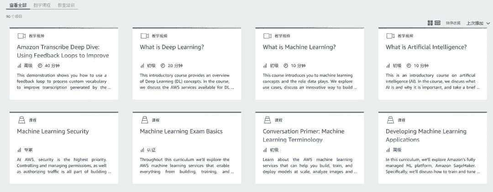
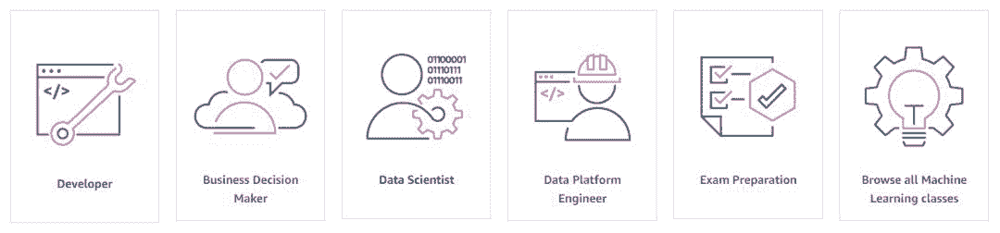
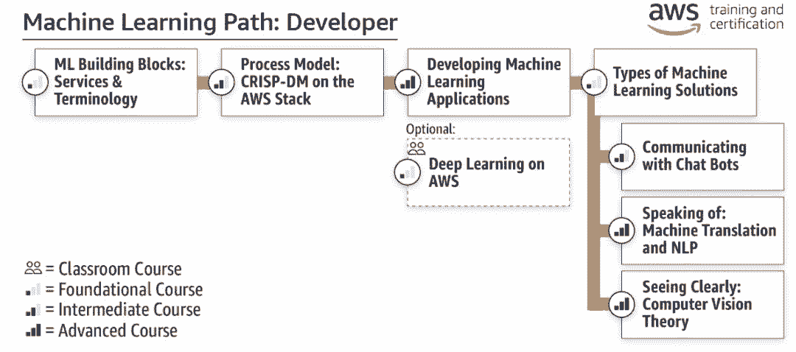
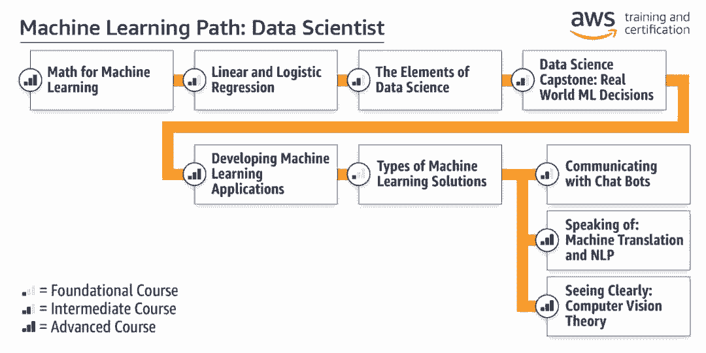
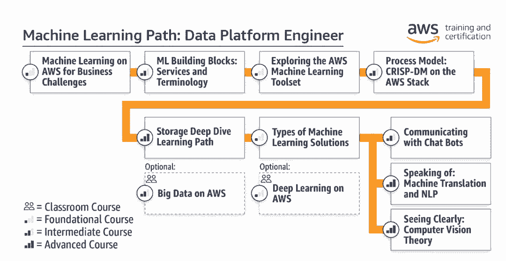
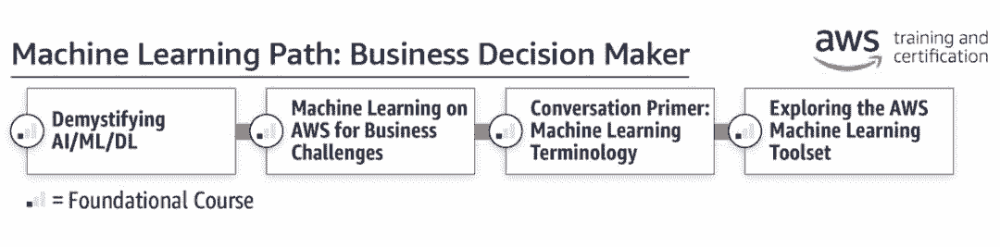

# 奔走相告！亚马逊内部机器学习课程现向大众免费开放

选自 aws.amazon

**机器之心编译**

**参与：****思源、王淑婷**

> 从今天开始，任何人都可以从 AWS 上获取亚马逊用来训练内部工程师的机器学习课程。其 90 项课程分别为开发者、企业决策者、数据科学家和数据平台工程师设置了不同的学习路径，你要不要来试一下。

课程地址：https://aws.amazon.com/cn/training/learning-paths/machine-learning/

该课程已经实施了 20 多年。公司内部上千的工程师都专于机器学习，因此亚马逊的零售页面、产品、实现技术和商店少有不提升的。很多 AWS 客户都从中受益，现在，亚马逊打算向所有开发者开放这些课程，而不是只提供给那些最强大的、资金充足的技术公司。

<mp-miniprogram class="miniprogram_element" data-miniprogram-appid="wxf424e2f3e2f94500" data-miniprogram-path="pages/institution/institution?id=02bd5504-054e-4aed-b4cb-5fed6ac8154a&amp;from=weapp" data-miniprogram-nickname="机器之心 Synced" data-miniprogram-avatar="http://mmbiz.qpic.cn/mmbiz_png/f3g058loLBj0Pib4UhuCFagffSB1RHImwskFzvic6mSp2LDhuerbXxeqqv0b63wSt2Pas7MicNWIcia358rlnhiaVag/640?wx_fmt=png&amp;wxfrom=200" data-miniprogram-title="AWS" data-miniprogram-imageurl="http://mmbiz.qpic.cn/mmbiz_jpg/KmXPKA19gWicIiaDNSktzJ9lNn22cqKlibXlbK5CueKWjyyZUf0uLibG9DS5oP6aoL9a7xq2SvtMSJyZUXep5sSQmQ/0?wx_fmt=jpeg"></mp-miniprogram>

不管其机器学习水平如何，亚马逊的客户总是会问这样一个问题：「我们团队该如何加快机器学习技能的提升？」这些开放的课程是新 AWS 培训和机器学习课程认证的一部分，现在也是这个问题的答案之一。

总共有 30 多门自助、自定进度的数字课程，有超过 45 小时的课程、视频和实验，这些都面向四个关键人群：开发者、数据科学家、数据平台工程师和商务人士。每个课程都从基础开始，且基于现实世界案例和实验室，允许开发者通过亚马逊已经解决的一些有趣问题来探索机器学习。这些包括预测礼品包装的合格性、优化快递路线或利用亚马逊子公司 IMDb 的数据预测娱乐奖项提名。这些课程有助于巩固最佳实践，并展示如何开始一系列 AWS 机器学习服务，包括 Amazon SageMaker、AWS DeepLens、Amazon Rekognition、Amazon Lex、Amazon Polly 和 Amazon Comprehend。

上图展示了课程示例，其中数字课程有 89 项，每一个课程的目标和主题都有所不同，因此将特定的课程串起来就能形成特定的学习路径。

**选择你的学习路径**

AWS 的机器学习课程主要有 5 条学习路径，其分别为开发者、企业决策者、数据科学家、数据平台工程师准备了四条学习路径，同时也为希望快速获得 AWS 认证的工程师提供「考试」路径，当然这会需要工程师本身有一定的功底。

当然，开发者也可以直接查看 90 项课程，并选择自己感兴趣的领域学习，例如模型安全、应用部署、异常值检测或神经机器翻译等。以下简要介绍了各学习路径的特点，不同的读者可以根据需求选择。

**开发者**

这条学习路径是为那些想用机器学习和人工智能来更好地与数据科学家合作并利用机器学习技术进行创新的建设者和软件开发者设计的。课程从基础的机器学习解决方案开始，逐步转到高级课程，你还可以选择选修课程来补充培训。

**数据科学家**

这条路径是为那些擅长数学、统计和分析并想成为机构或公司内部机器学习主题专家的人士设计的。这些人可以通过基础、中级和高级课程学习如何将机器学习框架和分析工具用于工作并改善协作。

**数据平台工程师**

这条路径主要能帮助数据偏态工程师明晰机器学习会如何改变数据获取、系统配置、系统性能，以及系统、服务和应用的用户体验。该学习路径前面主要明确机器学习的概念与工具，后面则重点关注机器学习的解决方案与应用实践。

**企业决策者**

这条学习路径主要是为希望利用机器学习技术来进行产品化，或者为实现辅助管理的企业决策者而制定的。下面的课程主要是明晰机器学习的概念或术语，从而帮助决策者明晰机器学习的真正商业价值。

**优势**

**免费数字教育**：你可以根据需求开始构建自己的 ML 技能，现在可以免费获得灵活的数字教育。

**量身定制的学习路径**：参加与自己特定 ML 目标和新学习路径相匹配的训练。亚马逊还创建了一条路径来帮助开发人员和数据科学家为新的 AWS ML 认证做准备。

**获得 AWS 认证**：新推出的 AWS 机器学习特长认证（AWS Certified Machine Learning – Specialty）——测试可以验证你的专业技能，并帮助你在行业中获得认可。

目前，用户已经可以参加新的 AWS 机器学习认证测试，当然这会有一些费用。最后，该数字化课程现在可以在线免费获取，不过培训期间在实验室和考试中用到的服务需要付费，因此用 AWS 的计算服务或其它资源还是要收费的。********

****参考链接：https://aws.amazon.com/cn/blogs/machine-learning/amazons-own-machine-learning-university-now-available-to-all-developers/****

****本文为机器之心编译，**转载请联系本公众号获得授权****。**

✄------------------------------------------------

**加入机器之心（全职记者 / 实习生）：hr@jiqizhixin.com**

**投稿或寻求报道：**content**@jiqizhixin.com**

**广告 & 商务合作：bd@jiqizhixin.com**