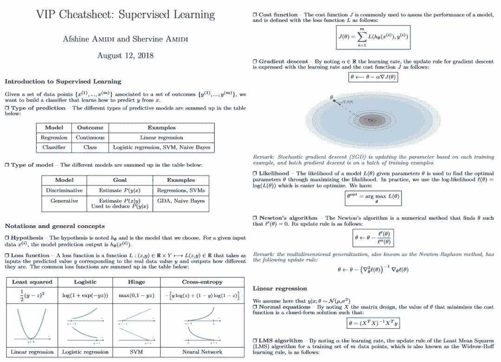

# 资源 | 源自斯坦福 CS229，机器学习备忘录在集结

机器之心整理

**参与：思源、李亚洲**

> 在 Github 上，afshinea 贡献了一个备忘录对经典的斯坦福 CS229 课程进行了总结，内容包括监督学习、无监督学习，以及进修所用的概率与统计、线性代数与微积分等知识。机器之心简要介绍了该项目的主要内容，读者可点击「阅读原文」下载所有的备忘录。

项目地址：https://github.com/afshinea/stanford-cs-229-machine-learning

据项目介绍，该 repository 旨在总结斯坦福 CS 229 机器学习课程的所有重要概念，包括：

*   学习该课程所需的重要预备知识，例如概率与统计、代数与微积分等进修课程。

*   对每个机器学习领域知识的备忘录，以及在训练模型时需要的提示与技巧。

*   上面所有的元素最终汇编进来一个备忘录里。

**VIP Cheatsheets**

在这一部分中，该项目根据 CS 229 提供了监督学习、无监督学习、深度学习、机器学习技巧等重点内容。其中监督学习主要介绍了回归、分类和生成，无监督主要介绍了聚类与降维算法，深度学习概述了三种神经网络。

**监督学习**

如下所示监督学习介绍了非常多基础概念，包括损失函数、梯度下降和最大似然估计等。其中损失函数展示了常用的最小二乘损失函数、折页损失函数和交叉熵损失函数等，每一种损失函数的图像、定义和应用的算法都展示在其中。

监督学习部分一共有四页备忘录，除了一般的线性与 Logistic 回归，还重点介绍了 SVM、朴素贝叶斯和 K 近邻等其它一些非参模型。这些基本上都是直接给出的定义，因此不会有过多的冗余信息，这对于机器学习开发者与研究者作为参考还是非常有帮助的。

除了标准的定义外，很多重点概念还会用形象的图示表达出来，如下展示了监督学习中的支持向量机：

上述定义清楚地描述了 SVM 的定义，它希望能根据「支持向量」最大化分类边界之间的间隔，这样的分类模型将更稳定。基本上着一幅图就讲述了 SVM 的基本想法，同时也展现了分类原理，根据它再「回忆起」合页损失函数也就更容易了。

**无监督学习**

无监督学习主要记录了 EM 算法、聚类算法和降维算法等，其中聚类又详细介绍了 K 均值聚类、层级聚类和其他聚类距离度量方法等，而降维算法则主要展示了主成分分析法和独立成分分析法这两种。

除了标准的定义，这些算法的原理图也非常重要，如上所示在 K 均值聚类中，四幅图展示了该算法的具体过程。首先随机初始化均值，然后将离均值近的样本分配为均值所代表的那一类，随后根据误差更新均值的位置，并直到模型收敛。主成分分析同样有非常好的可视化，如下 PCA 会先归一化数据特征，然后根据奇异值分解找出主成分，最后再将所有数据映射到主成分而实现降维。

**深度学习**

很多读者已经比较了解深度学习了，尤其是全连接网络、卷积网络和循环网络。这一份备忘录同样也展示了这三种网络重要的概念与定义，且同时描述了强化学习的一些基本概念，如马尔可夫决策过程、贝尔曼方程价值迭代算法和 Q 学习等。

我们认为在图 CNN 中，非常重要的是计算输出特征图大小的公式，即 N = (W-F+2P)/S + 1。其中 W 表示输入特征图的长宽，F 表示卷积核大小，P 表示在每一端填补零值的数量，S 表示卷积步幅，因此计算出来的 N 就表示输出特征图的尺寸。这对于设计卷积网络非常重要，我们经常需要该公式控制网络中间的特征图大小。

**机器学习技巧**

这一份备忘录从分类、回归、模型选择和模型诊断出发展示了 ML 中的一些技巧。其中分类与回归主要从度量方法的角度探讨，也就是说到底什么样的方法才能确定模型的好坏，以及它们的特定属性。同样模型选择与诊断也都希望判断模型的好坏，只不过一个是从交叉验证与正则化的角度考虑，另一个是从偏差与方差的角度考虑。

**VIP Refreshers**

这一部分作者提供了进修课程的备忘录，包括对概率与统计、代数与微积分的介绍。

**概率与统计**

从排列与组合开始，这一部分介绍了概率与统计的概念定义。包括条件概率、贝叶斯法则、概率密度函数、概率分布函数与随机变量的均值和方差等。后面的统计也展示了非常多的定义与规则，包括分布的 K 阶矩、常见的离散型与连续型随机变量分布，以及样本均值、方差、协方差等数据特征。

最后，该备忘录同样记录了参数估计，这对于机器学习来说是最为关键的概念之一，因为本质上机器学习就是需要通过大量样本对模型的参数进行估计，或者称为「学习」。此外，之所以高斯分布如此重要，最后面的中心极限定理可以给我们答案。也就是说，如果采样 n 个服从独立同分布的样本，那么当 n 趋近于无穷大的时候，这个未知的分布一定是接近于高斯分布的。

**线性代数与微积分**

矩阵运算与微分在实际搭建模型时非常重要，因为不论是传统的机器学习还是深度学习，我们实际都是使用矩阵甚至是张量进行运算，了解它们的法则才能理解模型的实际过程。在这一份备忘录中，作者描述了向量与矩阵的定义、各种常见矩阵运算的定义，以及大量的矩阵概念，例如矩阵的迹、矩阵的逆、矩阵的秩、矩阵的正定和特征值与特征向量等。

矩阵微分的基本概念也展示在上面，因为我们在根据反向传播更新参数时，基本使用的都是矩阵微分。这也就需要我们了解 Jacobian 矩阵和 Hessian 矩阵。**

****本文为机器之心整理，**转载请联系本公众号获得授权****。**

✄------------------------------------------------

**加入机器之心（全职记者 / 实习生）：hr@jiqizhixin.com**

**投稿或寻求报道：**content**@jiqizhixin.com**

**广告 & 商务合作：bd@jiqizhixin.com**