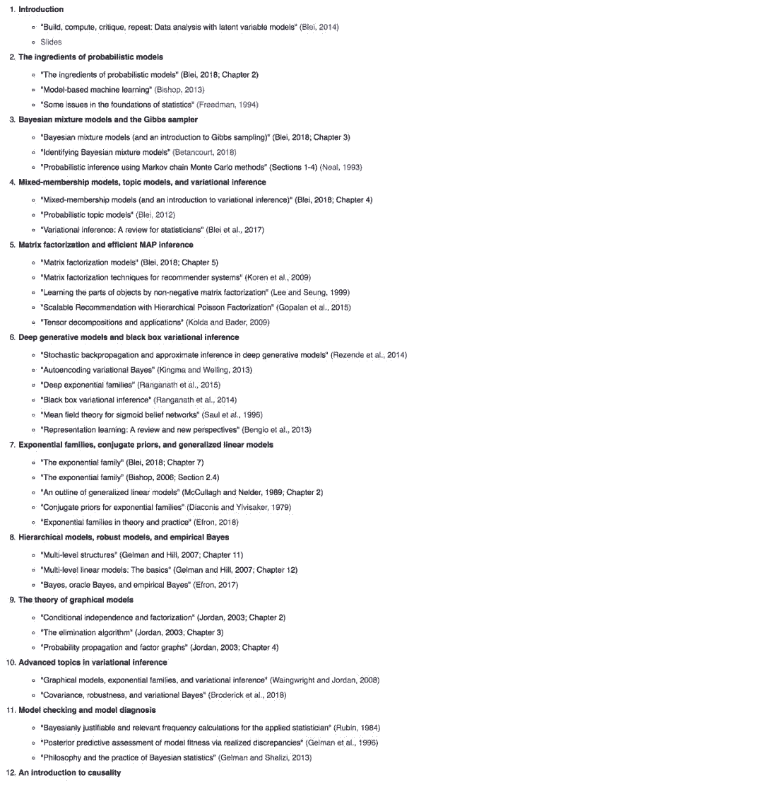
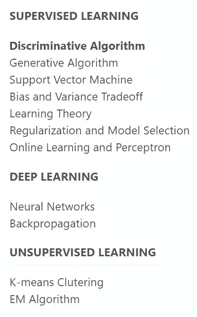
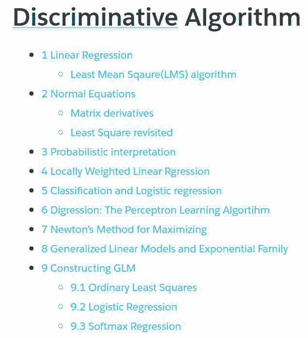

# 资源 | 吴恩达《机器学习》笔记，哥大研究生献上

选自 wei2624

**机器之心整理**

> 今天介绍一份机器学习的笔记，由哥伦比亚大学研究生张威整理。张威同学本科毕业于加拿大滑铁卢大学电子工程系，曾经联合带队参加 2016 年 IEEE 数字信号处理大赛获得前 10 的名次，也曾在微软亚洲研究院副院长郭百宁老师研究组和首席研究员曾文军老师研究组实习。在哥伦比亚大学，张威同学也担任过《Bayesian Model Machine Learning》这门机器学习进阶课程的助教。

笔记地址：https://wei2624.github.io/machine%20learning/Machine-Learning-Notes/

张威同学主要根据吴恩达在斯坦福教授的《机器学习》（CS 229）的最新课程笔记进行梳理，这门课要比 Coursera 上的更全面和进阶。他同时结合了在哥大所选的机器学习相关课程，比如 David Blei 老师的《Foundations of Graphical Models》。

David Blei 是哥伦比大学计算机系和统计系的教授，曾在 UC Berkeley 获得博士学位，导师是迈克尔乔丹，和吴恩达算是同门师兄。每年秋季 Blei 教授都会教授《Foundations of Graphical Models》这门研究生课程。这门课程主要涉及到利用最新的机器模型建模，并解决现实问题。课程大纲如下：

课程地址：http://www.cs.columbia.edu/~blei/fogm/2018F/index.html

关于这份笔记，作者主要目的是：（1）多角度切入，能够让有一些基础的同学从不同的角度理解相同的定理。（2）解释数学，复现证明步骤，对于原笔记里面较复杂的推导步骤给出详细的步骤分解。（3）内容整合，整合多个高质量课程的笔记内容，加入自己的理解，从学生的角度出发让内容更好理解。

尽管作者并没有覆盖课程的所有内容，但根据自己的思考对课程内容提取精华，并将在之后继续补充。作者的关注点还在于用大白话解释理论概念，并给出定理的证明。

对于想通过自学机器学习的读者或者计算机专业的同学在复习的时候，都还是很不错的参考资料。后续也会有会中文版推出。

在阅读笔记之前，建议读者先掌握一些关于概率、线性代数和向量微积分的基本知识。阅读可以从头开始一直到结束顺序完成，也可以根据需要跳读。有什么意见或建议，可以直接在笔记页面上留言或和作者互动。

笔记目录如下：

每个主题下还有更详细的子目录，如下图所示，判别式算法的子目录。

****本文为机器之心整理，**转载请联系本公众号获得授权****。**

✄------------------------------------------------

**加入机器之心（全职记者 / 实习生）：hr@jiqizhixin.com**

**投稿或寻求报道：**content**@jiqizhixin.com**

**广告 & 商务合作：bd@jiqizhixin.com**