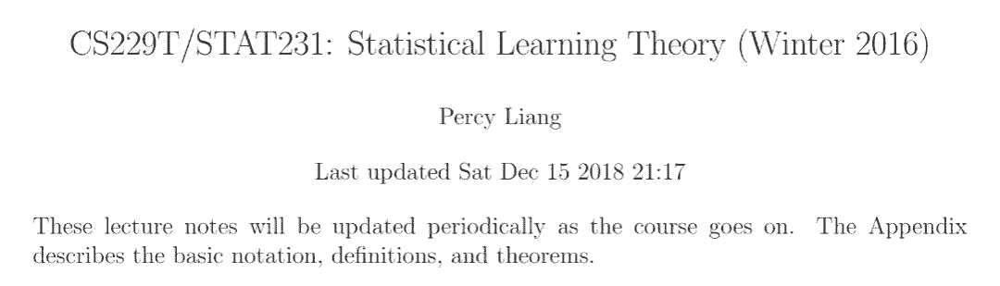
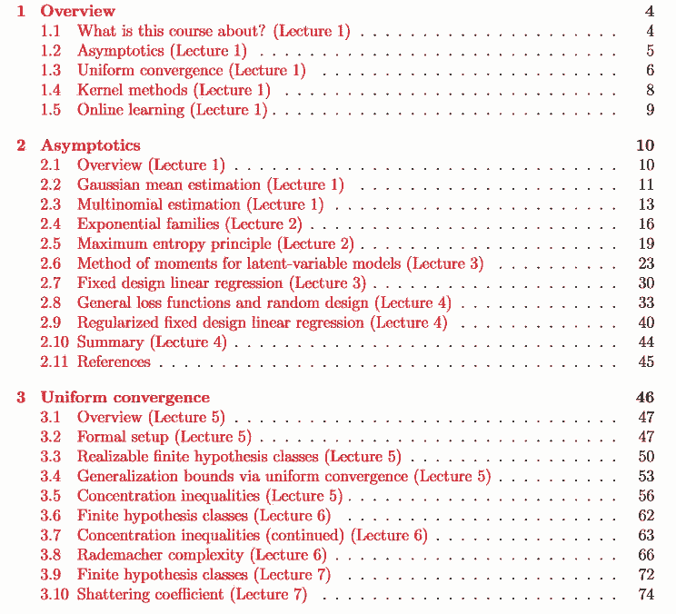
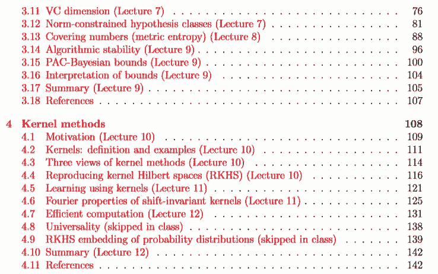
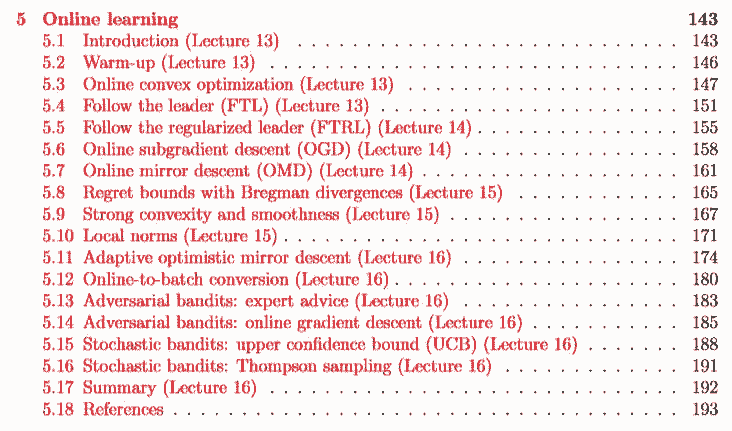
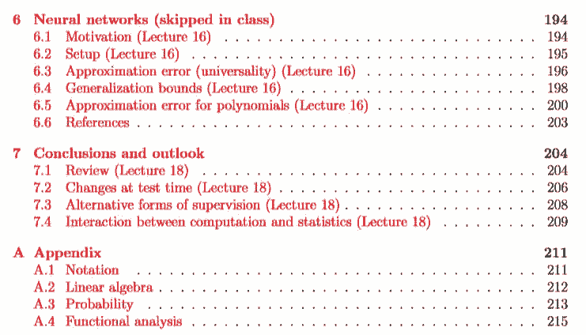
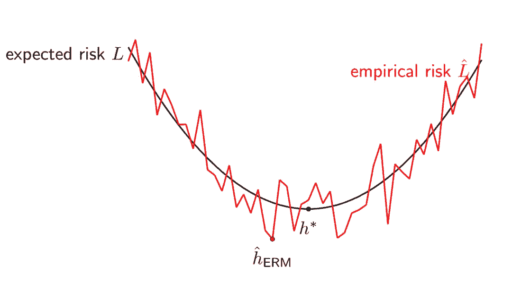
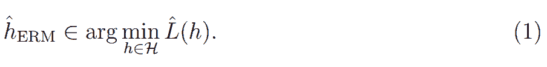
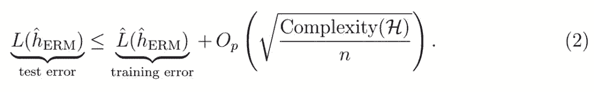
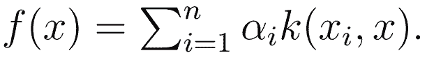
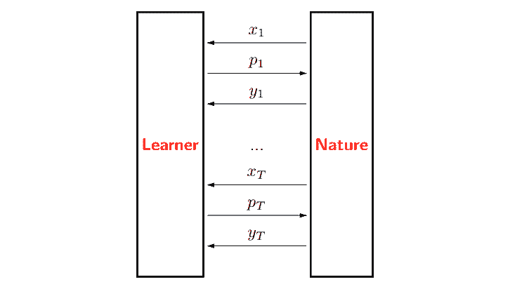

# 斯坦福统计学习理论笔记：Percy Liang 带你搞定「贼难」的理论基础

选自 GitHub

******机器之心整理******

 ******参与：刘晓坤、思源****

> CS229T/STAT231 是由斯坦福大学开设的统计学习理论课程，着重于对机器学习算法统计特性的理论理解，涉及机器学习算法何时起作用和原因、如何形式化算法从数据中学习的含义、如何使用数学思维来设计更好的机器学习方法等基本课题。今天要介绍由斯坦福大学计算机系教授 Percy Liang 近期公布的 CS229T/STAT231 的学习笔记。

笔记地址：https://github.com/percyliang/cs229t/blob/master/lectures/notes.pdf

**课程 topic**

*   一致收敛（VC 维度，Rademacher 复杂性等）

*   隐式/算法正则化，神经网络的泛化理论

*   内核方法

*   在线学习和 bandits 问题

*   无监督学习：指数族，矩方法，GAN 的统计理论

**预备知识**

*   熟悉线性代数、实分析、概率论和进行数学证明的基本能力

*   机器学习（CS229）或统计学（STATS315A）

*   推荐学习凸优化（EE364A）

**笔记目录**

**1 课程概述**

**1.1 这门课程是关于什么的？**

机器学习已成为许多应用领域中不可或缺的一部分，包括科学（生物学、神经科学、心理学、天文学等）和工程学（自然语言处理、计算机视觉、机器人学等）。但机器学习不是一种单一的方法；相反，它包含一系列看似完全不同的框架和范例，包括分类、回归、聚类、矩阵分解、贝叶斯网络、马尔可夫随机场等。本课程旨在揭示这些不同技术背后的共同统计学原理。

本课程是关于学习算法的理论分析。课程中介绍的许多分析技术（包括概率、线性代数和最优化的完美结合）值得研究，并且在机器学习之外也是有用的。

更深入的理论理解可以提供新的视角，并且可以帮助对现有算法进行修改和优化，也有助于提出新的算法。如果没有理论提供的概念性分析，这些新算法可能很难发现。

理论依赖的假设可能同时太强（例如，数据服从独立同分布条件）又太弱（例如，任何分布）。实际上，理论的目的不是为了简化成只需插入数字的公式。相反，理论应该改变思维方式。

本课程分为四个部分：渐近性、一致性收敛、核方法和在线学习。我们将从非常强的假设（假设数据是高斯的、渐近的）转变为非常弱的假设（假设数据可以对抗地在在线学习中生成）。在这方面，核方法有点不同；它更重要的在于提供表达能力，而不是统计学习。

**1.2 渐近**

给定基于一些未知参数向量θ*提取的数据，我们从数据中计算出θ hat，θ hat 和θ*有多接近？

对于简单的模型例如高斯均值估计和固定设计的线性回归，我们可以求出θ hat -θ*的闭式解。

对于大多数模型，例如 logistic 回归，我们不能这样做。但我们可以使用统计学中的常用工具即渐近分析。其基本思想是做泰勒级数展开以得到渐近正态性：即，sqrt(n)*(θ^−θ*) 的分布随着样本数量 n 的增加逼近于高斯分布。渐近的意义是即使θ hat 很复杂，我们也可以得到简单的结果。

我们的大多数分析都将使用最大似然估计，这种估计具有很好的统计特性（它们具有所有估计量中最小的渐近方差）。但是对于大多数隐变量模型而言，最大似然在计算上很困难，并且需要进行非凸优化。这些优化问题通常由 EM 算法解决，只能保证收敛到局部最优。我们将展示矩方法（一种可以追溯到 Pearson（1894）的参数估计经典方法）如何解决这个问题，得到能够产生全局最优解的有效算法（Anandkumar et al.，2012b）。

*图 1：在渐近分析中，我们研究当一个参数估计θ hat 接近真实参数θ*时，θ hat 的行为。*

**1.3 一致性收敛**

渐进线提供了一个很好的初值分析，并且适用于许多场景。但它有两个主要的缺点：它需要目标函数是平滑的；在渐进线开始逼近前无法确定要选择多大的样本数量 n。

一致性收敛提供了另一种视角，若考虑一个标准的监督学习问题：给定训练集 (x, y)，学习算法会从所有假设 H 中选择一个最优的预测器 h : X → Y，然后我们在测试数据评估该预测器。现在有一个简单的问题：训练误差 Lˆ(h) 和测试误差 L(h) 之间的关系是什么样的？

*图 2：我们希望最小化期望风险 L 以获得最优的 h*，但是我们实际上只能最小化经验风险 L ^以获得 h^。*

对于固定的 h ∈ H，训练误差 Lˆ(h) 为独立同分布随机变量（每一个样本的损失）的均值，它将收敛到测试误差 L(h)，且收敛率由 Hoeffding 不等式或中心极限定理决定。

但问题是我们假设基于训练数据选择一个最佳的假设，并不是使用固定的 h。具体而言，如果考虑经验风险最小化（ERM），我们需要最小化训练误差，从而获得最优的经验预测器：

直观而言，训练误差应该比测试误差小，因此可靠性也低一些。我们可以使用一致性收敛将这一直观理解形式化为：

这些泛化边界在某种意义上是统计学习理论的核心。但是在这个过程中，我们可以发展出广泛有用的不等式，它的应用范围甚至超越了机器学习。

**1.4 核方法**

现在我们先绕过学习算法的误差分析，并考虑我们到底应该学习什么样的模型。现实数据非常复杂，所以我们需要极具表达能力的模型。核方法提供了一种严格的数学框架，它可以构建复杂、非线性的模型，而且还只需要基于线性模型的机制。

核方法提供了另一种方法定义函数。我们一般定义一个半正定的核函数 k(x, x' )，它将捕捉 x 和 x'之间的相似性，并通过对比一组样本而定义整个函数：

核方法允许我们构建复杂的非线性函数，例如高斯核函数和径向基核函数等。它们是通用的方法，且能逼近任意连续的函数。而对于序列、树型及图等数据结构，我们可以定义核函数以利用动态规划实现高效计算。

最后，核方法都是在函数层面上进行操作的，我们可以定义函数的整体空间为再生核希尔伯特空间（RKHS），它允许我们将函数视为向量并执行线性代数的计算规则。

事实证明，所有这三个概念都在描述相同的东西，它们之间相互有联系：

*图 3：核方法中的三个关键数学概念。*

**1.5 在线学习（Lecture 1）**

真实世界是动态的，使用基于渐近和一致性收敛的早期分析会错失某些重要性质。在线学习试图以两种方式解决这个问题：

目前为止，为了分析一个学习算法的误差，我们必须假设训练样本是独立同分布的。然而在实践中，数据点可能是互相依赖的，甚至更糟，即它们可能是对抗生成的。

此外，我们目前考虑的都是批量学习设置，即拿到一个训练集，学习一个模型，然后部署模型。但在实践中，数据可能是以流的形式存在的，此时我们需要交替学习和预测。********

*图 4：在线学习游戏。*

****