# 演讲 | 技术讲解概率机器学习——深度学习革命之后 AI 道路

机器之心整理

**参与****：机器之心编辑部**

> 概率理论为理解学习，建立合理的智能系统提供了数学框架。在此演讲中，Uber 首席科学家、剑桥大学教授 Zoubin Ghahramani 回顾了概率学 AI 领域的基础，然后重点介绍了该领域的研究前沿，涉及到了贝叶斯深度学习、概率编程、贝叶斯优化、数据科学中的 AI 等主题。他认为，在深度学习革命之后，下一个前进的方向会是概率机器学习。

Zoubin Ghahramani 是英国皇家学会会士，剑桥大学信息工程系教授，Uber 首席科学家，英国国家数据科学研究所图灵研究所剑桥主任。Zoubin Ghahramani 教授曾工作或学习于宾夕法尼亚大学、MIT、多伦多大学、伦敦大学学院盖茨比组、卡耐基梅隆大学。他的研究聚焦于机器学习/人工智能概率方法，在这些主题上已经发表了超过 250 篇论文。他曾是 Geometric Intelligence（被 Uber 收购，成为了 Uber AI Labs）的联合创始人，指导众多人工智能与机器学习公司。2015 年，因其对机器学习的贡献，被选为英国皇家学会会士。

[`v.qq.com/iframe/preview.html?vid=t0754f8wqf8&width=500&height=375&auto=0`](https://v.qq.com/iframe/preview.html?vid=t0754f8wqf8&width=500&height=375&auto=0)

如今人工智能与机器学习的发展令人振奋。这几年，我们在游戏中取得了各种突破，例如玩 Atari 游戏、围棋、扑克。更重要的是，如今这个时代对应用机器学习与人工智能非常感兴趣，例如语音识别、计算机视觉、推荐系统、自动驾驶等。

当我们思考人工智能时，会想到我们当前处于什么状态？离我们想要的人工智能还有多远？我们是否有解决未来挑战的理论基础？为了解决赋有挑战性的 AI 任务，我们需要关于感知、学习、推理与决策的理论。这也是我们建立 AI 系统的方式。

**深度学习的火热与缺陷**

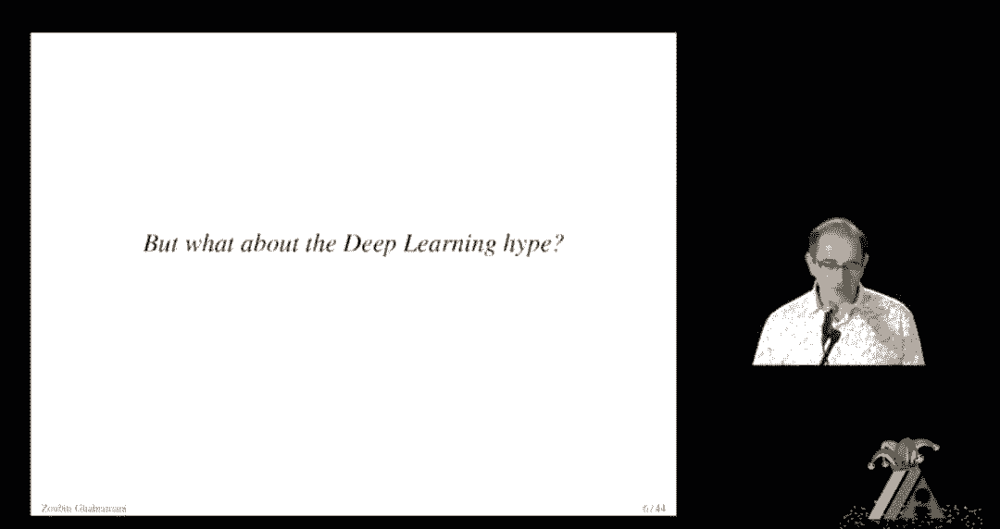

如今深度学习是最为最为火热的学习方法。很多人，特别是刚进入 AI 领域不久的人会认为深度学习可以解决所有问题，是建立智能系统的有力工具。所以，什么是深度学习系统？

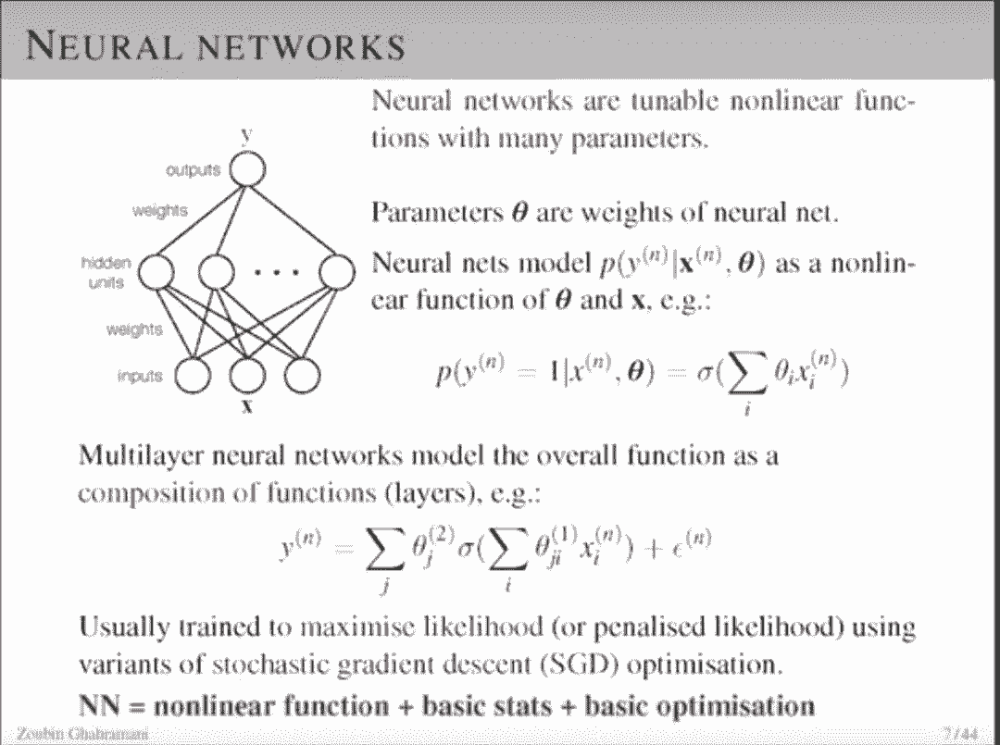

深度学习就是神经网络，而神经网络是带有许多参数的可调非线性函数。上图中，参数θ是神经网络的权重。神经网络是特别有趣的函数，因为输入 x 和参数θ都是非线性的。现在神经网络所做的是，通过一个函数组合从输入 x 到输出 y 表示这一函数，也就是神经网络中的层。总结来说，神经网络的核心是非线性函数+基础统计+基础优化。

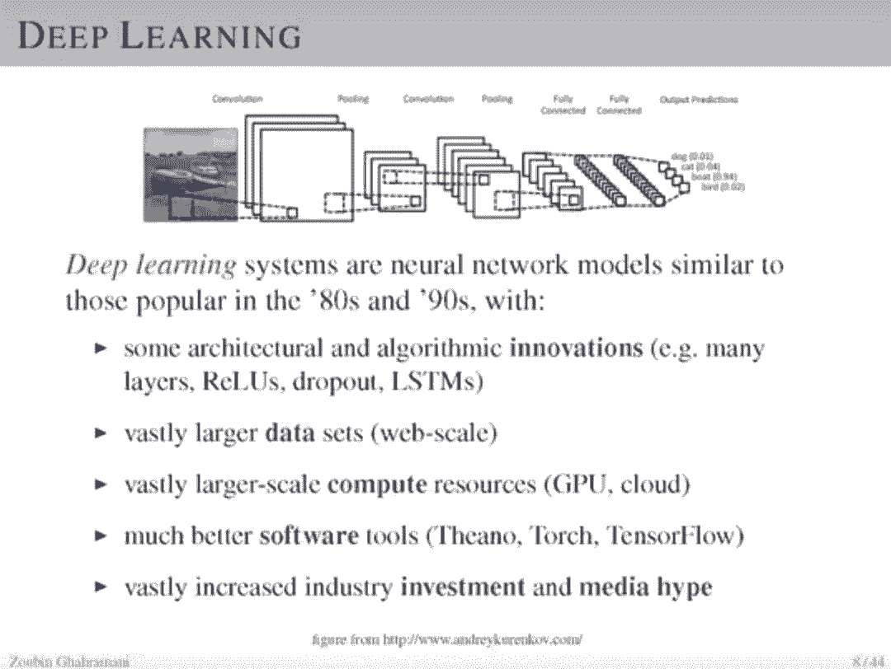

深度学习可以说是神经网络的重新包装。现代深度学习系统非常类似于 80 、90 年代流行的神经网络模型，也有一些重要的变化：

1\. 新的架构与算法上的创新（例如多层网络、ReLU、dropput、LSTM 等）；

2\. 非常重要的是我们当前有非常大的数据集；

3\. 非常大规模的计算资源（GPU、云）；

4\. 更好的软件工具（Theano、Torch、TensorFlow），更方便的建立神经网络；

5\. 还有产业越来越大的投资也媒体关注；

以上使得越来越多的人进入到 AI 领域，发展也越来越快。因此，深度学习领域可以说去的了非常大的发展，也对人工智能非常重要。

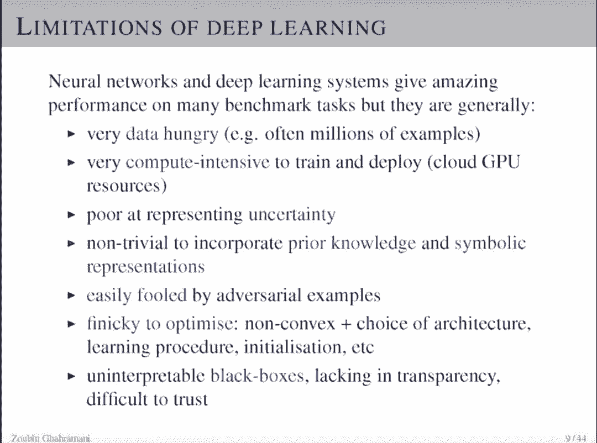

但深度学习系统也有缺陷。虽然这些系统在许多基准任务上有非常好的表现，但它们也有缺陷：

1\. 需要大量数据，例如总需要数百万的样本（data hungry）；

2\. 需要大量计算资源来训练以及部署深度学习系统；

3\. 表征不确定性的能力极差；

4\. 融合先验知识与符号表征对深度学习非常重要，这也是许多人在研究的；

5\. 易受对抗样本的影响；

6\. 过于繁琐的优化：非凸的，找到最好的架构选择，学习流程，初始化等；

7\. 深度学习是难以解释的黑箱，缺乏透明度，难以令人信任，使得深度学习难以部署到一些非常重要的任务上。

这些事深度学习的挑战，也是研究员们想要战胜的难题。

**模型的概率视角**

尽管深度学习非常流行，但接下来我们需要考虑的是机器学习下一步的发展是什么。因此，我们需要将机器学习视为概率建模问题。在机器学习中，模型表述了从某个系统中能观察到的所有数据，也就是说模型不仅可以描述所有我们收集到的某种数据，同时它还能描述那些没收集到的同类数据。

概率是推理不确定性的数学，正如微积分是推理变化率的数学。概率语言模型能够捕捉复杂的推理，发现未知，无需监督即可揭开数据的结构。并且，概率可使得专家通过先验信念的形式把知识注入到 AI 系统。

如果当我们对世界的某种数据建模时，我们需要预测那些没观察到的数据以及它们之间的不确定性，因此我们可以使用数学中概率论描述这种不确定性并完成「模型」的构建。

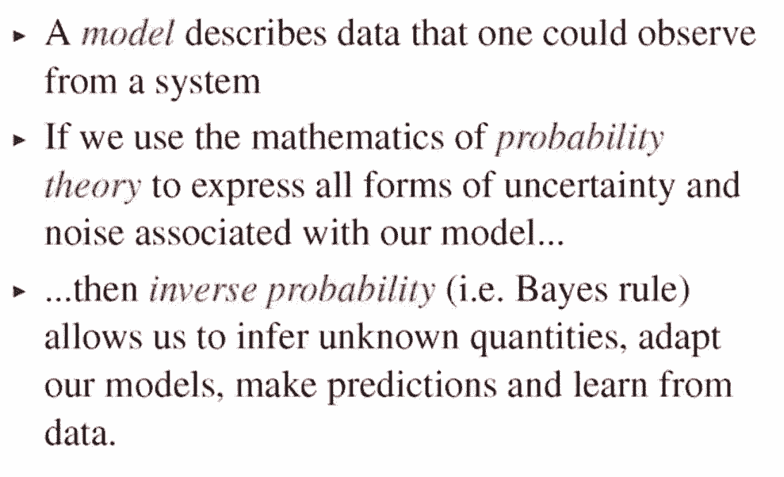

在使用概率论描述模型中的不确定性后，贝叶斯概率能允许我们推断未知量，并调整模型以从数据中学习。Zoubin Ghahramani FRS 表示机器学习中的很多问题都能归结到这一个贝叶斯框架内，或者至少需要归结到这一框架。

为了进一步解释贝叶斯推断，Zoubin 进一步解释了贝叶斯法则。简单而言，贝叶斯法则可以描述为「执果索因」，即知道某个事件发生了后，求得该事件最可能是在什么情况下发生的。在 ML 中，贝叶斯法则会告诉我们如何更新对未知世界或假设（hypothesis）的知识与信念，且更新假设或信念的信息从我们已知的观察或数据（data）中获取。

如下所示若需要在给定数据的条件下判断假设存在的可能性，我们只需要根据该贝叶斯法则就能求出。

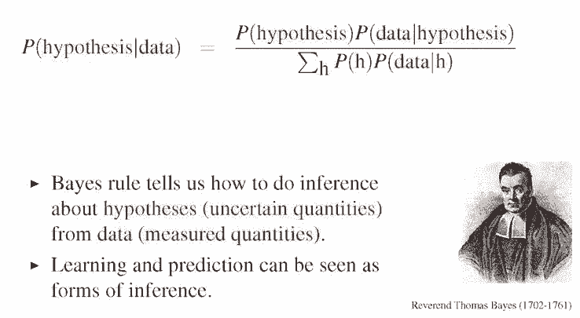

在贝叶斯法法则中，总体数据是未知的，也就是说我们需要使用概率分布表征这种不确定性。在观察到数据之前，我们有先验概率 P(hypothesis)，它表示我们事先认为任意一个假设及其所出现的概率。此外，对于任意一个假设，我们需要评估根据它能观察到数据的概率，即 P(data|hypothesis)。这与似然度非常相似，当我们乘上这两个概率项，并通过除上所有可能的假设来做归一化，我们就可以得到后验概率 P(hypothesis|data)。

这是一种通用的法则来根据数据更新我们对假设的信念，这一个法则同样告诉我们该如何执行学习过程。学习其实就是将先验知识迁移到后验知识，如果我们获得更多的数据，那么仅仅只是反复对当前的状态应用这一个法则以更新获得新的后验知识。

若将基本贝叶斯法则应用到机器学习中，我们就可以得到以下三个非常基础的方程，即学习、预测和模型对比。此外，值得注意的是，贝叶斯法则并不是最基本的公理，它是由由概率的加法原则与乘法原则组合而成。

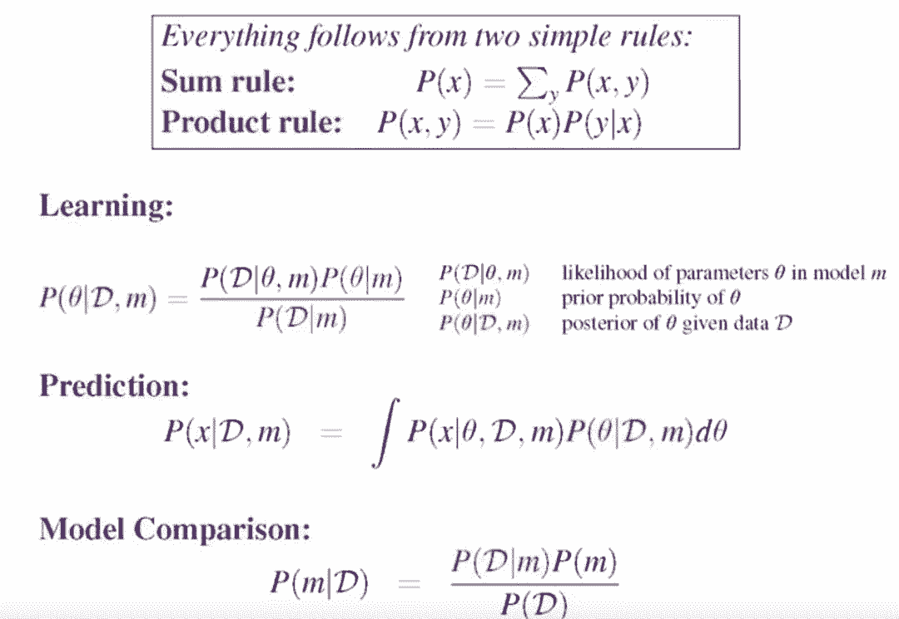

其中学习即给定数据与模型预测最可能的参数θ，这样在确定了参数θ后就能确定整个模型，学习后的系统也就确定了。为了计算后验概率 P(θ|D, m)，根据贝叶斯法则需要使用θ的先验概率 P(θ|m) 和似然度 P(D|θ, m)。预测即在给定数据 D 和模型 m 的情况下预测出现样本 x 的概率，它可以用一个积分或数学期望表示。

你可能会想，当前深度学习如此成功，基本上任何复杂任务都只需要套入这种端到端的方法就能取得不错的效果，那么我们还需要概率与贝叶斯法则吗？还是说贝叶斯法则只是 18 世纪的老旧研究而跟不上当前 21 世纪的深度方法？Zoubin 非常推崇为任务与模型引入概率，它展示了以下一些原因来说明为什么概率对于机器学习非常重要。

首先我们希望系统能校准模型与预测不确定性，因为我们希望系统明确地知道它到底不知道什么。例如在自动驾驶中，当系统遇到了和以前都不一样或者不合理的场景，我们希望系统能给出回答表示它不知道怎么处理，而不是如同当前深度模型那样给出一个错误的回答。此外，概率框架同样允许我们实现非常优雅的模型复杂度控制或者结构搜索。这表明基于贝叶斯概率，我们都不再需要正则化或其它防止过拟合的方法，因为它能自动调整和控制模型复杂度。

对于 AI 来说，我们希望构建的系统能执行合理的决策。这表明我们希望系统能通过连贯的方式根据数据更新信念，并且根据效用论最大化效用来做出合理与理性的决策。同样，我们需要将先验知识嵌入到学习系统中，并且随着我们获得越来越多的数据，先验知识应该以连续和鲁棒的方式得到更新。

此外，对于 AI 系统来说非常重要的就是基于小数据集进行训练与推断。在实际生活中，很多任务都只有非常少量的数据，深度学习明显并不能解决这样的问题，因为模型复杂度过高或过低分别会导致过拟合或性能不佳等问题。贝叶斯概率能利用先验知识，从而只需要更少的数据就能推断出合理的决策。

下面 Zoubin 具体介绍了一些将概率引入到 AI 所需要的概率论基础，首先即如何表征 AI 系统中的信念。我们希望以数值的方式表示智能体某个信念的强度，也希望能使用某些数学运算对这些信念做一些操作。

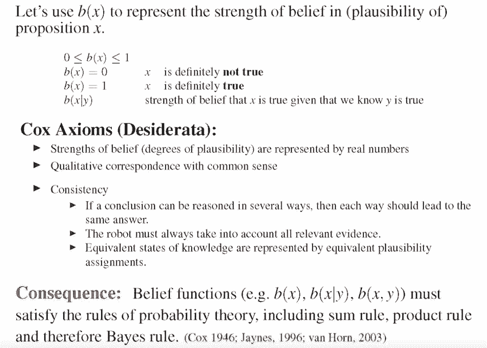

若使用 b(x) 表征命题 x 中的信念强度，那么它的取值应该在 0 到 1 之间，且只有在系统完全确信 x 会发生或完全不确信才能取到 1 和 0。此外，b(x|y) 表示在给定 y 可能会出现的信念下，x 会发生的信念强度。早在 1946 年，Cox Axioms 就写下了一些如何表示信念的定理。如上所示信念的强度应该由一个实数表示，信念应该与常识具有定性的一致性等等。此外，信念函数还应该满足概率定理，包括概率加法、乘法和贝叶斯法则。

Zoubin 表示信念函数并不是表示传统概率论中重复实验与频率等的不确定性，它仅仅表示信念的强度，这对于 AI 系统有非常重要的作用。为了说明这种重要性，他进一步从决策论与博弈论中引入一个观点以说明如何根据信念做更好的决策，即 Dutch Book 定理。

根据 Zoubin 在 UberAI 研究院的经历，他发现很多学习与智能过程都依赖于对不确定性的概率表示，例如车主供给与乘客需求关系的预测、对交通和城市的建模以及自动驾驶等。尽管 Uber 在处理这些问题时同样需要使用深度学习拟合适当的函数，但概率是构建能执行理性决策的智能体所必需的。

介绍了概率在机器学习中的重要性后，Zoubin 在后面重点讨论了他在这一领域的研究方向与成果。以下展示了他主要涉及的领域，且都以自动化机器学习为中心。之所以在机器学习前加上「自动化」，是应为他认为目前的机器学习并不是那么合理，它还能在很多地方变得更加高效与自动化。

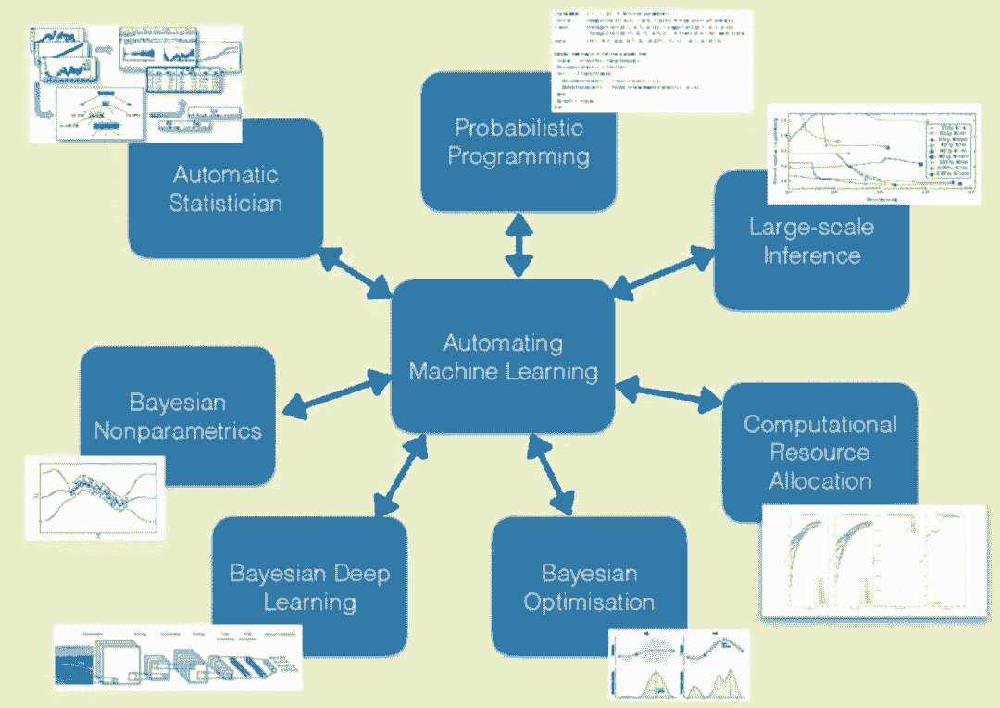

**贝叶斯深度学习**

在这一个视频中，Zoubin 并不会介绍全部领域，他只会重点讨论三个方向，即贝叶斯深度学习、概率编程和自动化统计学。首先对于贝叶斯深度学习，他表示前面很多地方都将深度学习与贝叶斯统计立在对立面，但其实它们并不是对立的。深度学习旨在构建不同类型的模型，而贝叶斯推断旨在关注学习的方法，它们是可以相互结合的。

那么到底深度学习中的贝叶斯指的是什么呢？如果我们重新思考深度神经网络，一般的方法会根据损失函数更新模型的权重和偏置项，这也就表示参数上的不确定性。但我们应该同时解决结构上的不确定性，例如神经网络层级的结构或层级数等。目前结构上的不确定性比较难解决，但参数上的不确定性要好解决地多。

如下给定一个神经网络，其中 X、y 和θ分别为输入、输出和模型参数。如果从贝叶斯的角度观察该神经网络，那么先验概率 P(θ|α) 就是说在没有观察到数据之前，给定某些超参数α下神经网络参数θ可能是什么。后验概率 P(θ|α, D) 则表示在观察到数据后，给定某些超参数α下神经网络参数θ的分布应该是什么样的。

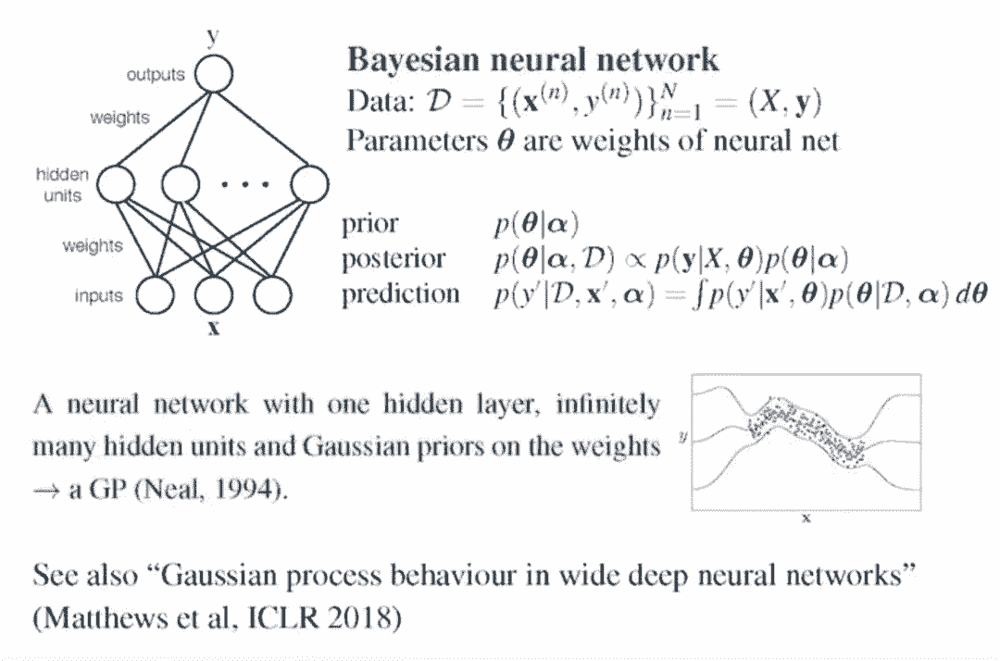

有趣的是，Radford Neal 在 1994 年表示如果从贝叶斯的角度观察带有单个隐藏层的神经网络，那么当该隐藏层的神经元数量可以无限增长，那么模型就会收敛到高斯过程，所有权重都会服从高斯分布。当时很多研究者对这一过程非常感兴趣，但是由于神经网络有非常多的局部极小值且很难优化，因此很多研究者转而关注能优雅使用凸优化的支持向量机。同时，由于单个隐藏层需要无限的神经元才能近似高斯过程，那么我们为什么不直接使用高斯过程呢，这也是当时很多研究者的心声。

到了现在，Alexander 等研究者在 ICLR 2018 的论文中重新探讨了高斯过程与深度神经网络之间的关系。他们表示在广义条件下，随着我们神经网络架构越来越宽，隐含的随机函数会收敛为高斯过程，这也就是将 Neal 在 1994 年的研究成果扩展到了深度神经网络。研究者们严格证明了多层有限全连接网络最终能收敛到高斯过程，其中隐藏层的数量可以是定值，而隐藏层的单元数需要根据层级的增长严格地以不同的增长率增加。

如下 Zoubin 表示贝叶斯深度学习可以以多种方式实现，它们的关键计算问题是在参数上做贝叶斯推断，并在给定神经网络数据的情况下构建所有参数的概率分布。

如上早期的贝叶斯深度学习主要在于很多研究者并不希望研究神经网络。而自 2011 年以后，很多研究者重新开始关注神经网络中的推断过程，并尝试令贝叶斯推断更快与更简洁。在上图中，神经网络尝试在给定数据的情况下拟合一些参数，而当没有数据点的时候，神经网络那种点估计会出现很大的误差，因此贝叶斯神经网络一般在这种情况下能做得更好。

当然，近来也有将深度学习结合高斯过程的研究，例如 17 年 Bradshaw 等人提出的 GPDNN，它结合了深度神经网络与高斯过程良好的属性，并对于对抗样本有非常好的属性。对于 GPDNN 来说，当我们测试对抗样本时，它输出的最高熵类别概率对应于「don't know」。该网络知道什么时候给定的样本是系统无法判断的，因此 GPDNN 是一种更好的深度架构来表示未见过的潜在数据。

**概率编程与自动化统计学**

Zoubin 重点展示的第二个方向是概率编程，概率编程让用户可以将生成概率模型指定为程序（program），然后将这些模型「编译（compile）」为推理过程。概率模型本质上也是组合式的，而之前的大部分工作都集中在通过组合随机变量来构建丰富的概率程序上。

首先对于传统模型而言，概率性模型开发与推断算法的推导式非常耗时与容易出错的，因此我们可以借助概率编程语言将概率模型表述为能生成数据的计算机程序。例如概率编程语言 Edward，它构建于两种组合表示的基础上，即随机变量和推理。Edward 可以集成到 TensorFlow，它让我们轻松使用从点估计到变分推理和 MCMC 等各种可组合的推理方法来拟合相同的模型。

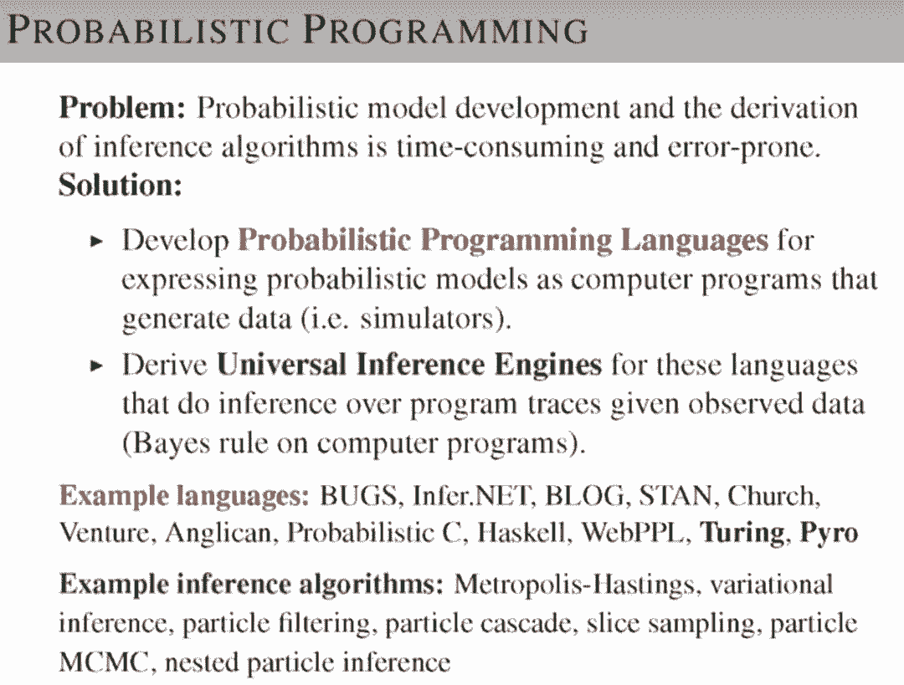

Zoubin 随后展示了用概率编程语言所写的隐马尔可夫模型，它只需要不到 10 行的代码就能完成整个模型。他认为概率编程最大的优势是对科学建模的变革，而 Uber 构建的概率编程语言 Pyro 就是这样的尝试。

Pyro 基于 Python 与 PyTorch 之上，专注于变分推理，同时支持可组合推理算法。Pyro 的目标是更加动态（通过使用 PyTorch）和通用（允许递归）。

Zoubin 表示直接指定概率模型是笨重的，其执行也容易出错。概率编程语言（PPL）通过联合概率与编程语言的表征力量来解决上述问题。概率程序是一般确定性计算和随机采样值的混合，随机计算表征了数据的生成性。这一表征中隐含着概率，且这一规范也是通用的：通过这种方式可以编写任意的可计算概率模型。Pyro 全部使用 Python 作为基础语言，清晰而令人熟悉。

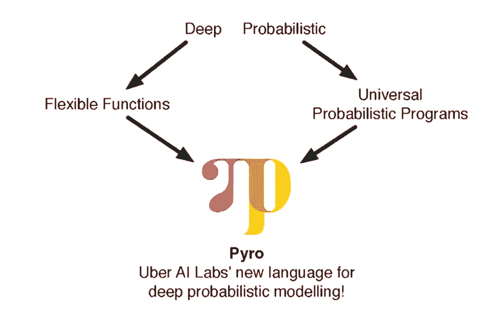

Pyro 构建在优秀的 PyTorch 库之上，后者包括使用非常快速、GPU 加速的张量数学的自动微分。PyTorch 动态构建梯度，使得 Pyro 程序包含随机控制结构，即 Pyro 程序中的随机选择能够控制其他随机选择的出现。随机控制结构是 PPL 通用的关键。因此，Pyro 能够表征任意概率模型，同时提供灵活、可扩展到大型数据集的自动优化推断。

最后，Zoubin 展示了一种自动化统计学。因为现在到处都存在数据，那么理解数据、构建模型并作决策会有非常大的价值。但是问题是目前没有那么多合格的数据科学家，因此可能的方向是开发一种自动从数据中构建模型的方法。

那么对于构建 AI 系统，我们到底要遵循什么样的规则？以下展示了感知、学习、推理和决策制定等 AI 系统应该遵循的原则，我们构建自动 AI 系统也应该遵循这些规则。

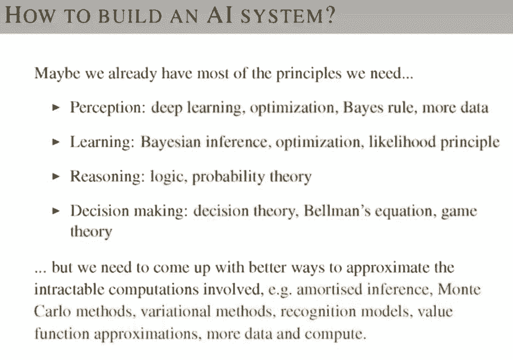

如上借助深度学习、ReLU 激活函数和各种结构，我们的系统能感知到真实世界中的数据。而贝叶斯法则和最大似然等规则可以让系统以更小的成本学习知识，其它如推理和决策也应该根据概率论、决策论和博弈论等领域的方法完成构建。

对于整个演讲的总结，Zoubin 表示概率建模为构建理性的 AI 系统提供了非常好的框架，在这个框架下我们能将现实世界中的不确定表示出来，并从数据中学习。

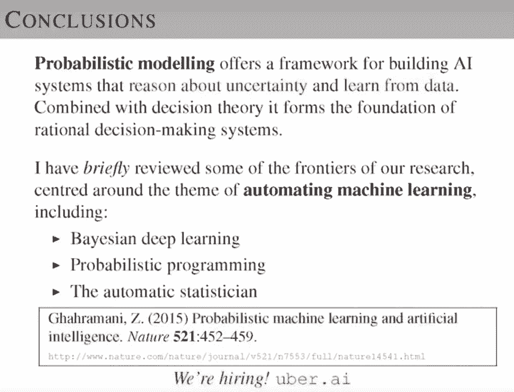

以上是 Zoubin 演讲的简要内容，前面主要介绍了为什么概率建模非常重要，后面则讲述了他所关注领域，包括贝叶斯深度学习、概率编程和自动化模型构建等。

****本文为机器之心整理，**转载请联系本公众号获得授权****。**

✄------------------------------------------------

**加入机器之心（全职记者 / 实习生）：hr@jiqizhixin.com**

**投稿或寻求报道：**content**@jiqizhixin.com**

**广告 & 商务合作：bd@jiqizhixin.com**