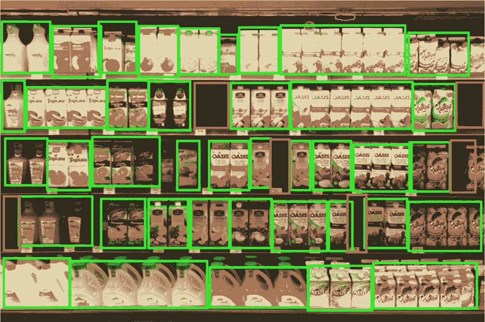
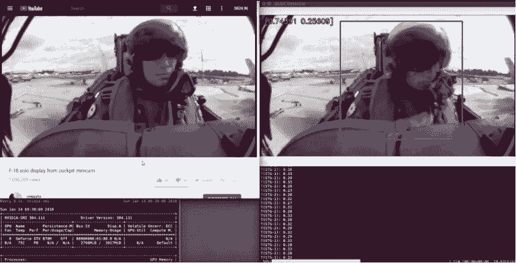

# 举两个栗子：如何正确建立个人的机器学习项目集

选自 Towards Data Science

**作者：****Edouard Harris**

****机器之心编译****

> 面试机器学习方面的工作时，在简历的个人项目那块，你会写什么？建模？做机器学习项目？项目数据从哪儿来？在 SharpestMinds 创始人 Edouard Harris 介绍的两个成功例子中，人家是从基础的收集数据开始一步步做项目的：目标明确，做到极致。

我是一名物理学家，在 YC startup 工作。我们的任务是帮应届生找到自己的第一份机器学习工作。

要找到第一份机器学习工作，你要做的一件事就是建立自己的机器学习项目集（portfolio）。现在，我来告诉你答案。

你可能会奇怪为什么这很重要，那是因为招聘经理通常会通过你的履历来了解你，如果你没有履历，个人项目就是最接近的替代品。

因为职业原因，我见过数百份个人项目的案例，有做得极好的，也有做得极差的。我将向你展示两个极好的案例。

**全力以赴型**

接下来要说的是一件真实的故事，只不过隐私起见我改了主人公的名字。

公司 X 使用 AI 提醒杂货店何时该订购新的库存。我们这边有个学生——Ron，很想去 X 公司工作，所以他建立了个人项目，该项目完全是针对去该公司面试用的。

我们通常不建议这样对着一家公司全力以赴做准备。这有点冒险。不过，像 Ron 这样真的非常想去这家公司就另当别论了。

*红色边框标出了缺失项。*

1.  Ron 刚开始把手机贴到购物车上。然后，他推着购物车在过道来回走动，同时用相机记录。他在不同的杂货店做了 10 到 12 次。

2.  回到家后，Ron 开始建立一个机器学习模型。他的模型发现了杂货店货架上的空缺点：货架上缺少玉米片（或其他东西）的位置。

3.  Ron 在 GitHub 上实时建立了他的模型，完全公开。每天，他都会改进他的 repo（提高准确率，并在他的 repo 的 README 中记录项目变化。）

4.  当 X 公司意识到 Ron 正在这样做时，X 公司很感兴趣，而且不止是感兴趣，事实上，X 公司有点紧张。他们为什么会紧张？因为 Ron 在不知不觉中，在几天内复制了他们专有技术堆栈的一部分。

当然，Ron 所做的远远不够完美：X 公司已经投入了比 Ron 多几个数量级的资源来解决这个问题。但由于太相似，他们很快就叫 Ron 将他的 repo 私有化。

X 公司的技术在同行业中名列前茅。尽管如此，在 4 天内，Ron 的项目得到了 X 公司首席执行官的直接个人关注。

**飞行员项目**

以下是另一个真实故事：

Alex 是一名历史专业大学生，主修俄语（真的），同时他对机器学习感兴趣。更为不同寻常的是，尽管他从未编写过 Python 代码，但他还是决定学习它。

Alex 选择通过构建实用项目来学习。他决定建立一个分类器，以检测战斗机飞行员是否在飞机上失去意识。Alex 希望通过观察飞行员的视频来发现这一点。他知道一个人很容易通过观察，在一名飞行员失去知觉时告诉他，所以 Alex 认为机器也应该可以做到。

这是 Alex 在几个月中所做的事情：

*Alex 的 G-force 诱导失去意识探测器的演示。*

1.  Alex 在 YouTube 上下载了从驾驶舱中拍摄的飞行员驾驶飞机的所有视频片段（大约数十个）。

2.  接下来他开始标记数据。Alex 构建了一个 UI，让他可以滚动浏览数千个视频帧，按一个按钮表示「有意识」，另一个按钮表示「无意识」，并自动将该帧保存在正确标记的文件夹中。这个标记过程非常非常无聊，花了他很多天时间。

3.  Alex 为图像构建了一个数据管道，可以将飞行员从驾驶舱背景中剪裁出来，使他的分类器更容易专注于飞行员。最后，他建立了他的意识丧失分类器。

4.  在他做所有这些事情的同时，Alex 也在社交活动中向招聘经理展示他的项目快照。每当他拿出他的项目并在手机上展示时，他们会问他是如何做到的，他如何建造管道，以及如何收集数据。但他们从来没有询问他的模型准确率（低于 50％）。

当然，Alex 也计划提高其准确率，但在动手之前就被录用了。结果证明，公司更看重他项目的视觉效果以及他在数据收集过程中表现出的疯狂与智慧，而不是他的模型的准确率。

**他们之间的共同点**

Ron 和 Alex 为什么如此成功？因为他们做对了以下四件事：

1.  他们没有在建模上浪费太多精力。我知道这听起来很奇怪，但对于今天的很多用例来说，建模是一个已经解决的问题。在实际工作中，除非你做的是最前沿的研究，否则你的时间 80%~90% 都会花在清洗数据上。你的个人项目又怎能例外？

2.  他们自己收集数据。正因为如此，他们得到的最终数据比 Kaggle 或 UCI 数据库中的数据更混乱。但也正是这些混乱的数据提高了他们处理混乱数据的能力。比起从学术服务器上下载数据，这种做法让他们能够更好地理解自己的数据。

3.  他们将做出的东西可视化。所谓面试，并不是说由一位无所不知的裁判对你的能力做出客观的评估，而是将你自己推销给另一个人。人是视觉动物。如果你掏出手机向面试官展示你的作品，那么你要确保自己做的东西看起来有趣，这点非常值得。

4.  他们的所作所为看起来确实有点疯狂。正常人不会用胶带把自己的手机绑在购物车上。正常人也不会花那么长时间从 YouTube 上裁剪飞行员视频。什么人才会做这种事？那些不顾一切完成目标的人才会这么干。公司最想雇佣的就是这种人。

Ron 和 Alex 的所作所为可能看起来太夸张，但实际上，这和你在真正的工作中要做的事差不多。这就是要点：当你没有做某事的工作经验时，招聘经理会看你做过的和某事相类似的经历。

幸运的是，这种程度的项目你只要做一两次就好——Ron 和 Alex 就在所有的面试中重复使用之前准备的项目。

因此，如果用一句话来概括伟大 ML 项目的秘密的话，那就是：用一个有趣的数据集来构建一个项目，这个数据集需要很大的努力来收集，并且尽可能地在视觉上有影响力。 ********

*原文链接：https://towardsdatascience.com/the-cold-start-problem-how-to-build-your-machine-learning-portfolio-6718b4ae83e9*

