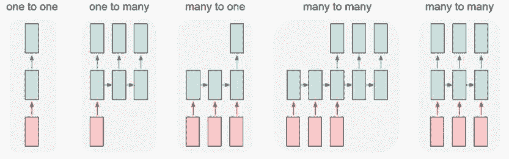
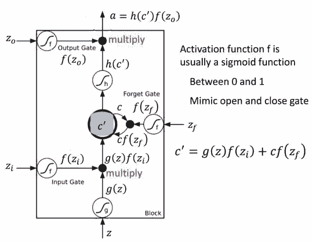

# 资源 | 吴恩达 deeplearning.ai 五项课程完整笔记了解一下？

机器之心整理

**机器之心编译**

**参与：思源、路雪**

> 自吴恩达发布 deeplearning.ai 课程以来，很多学习者陆续完成了所有专项课程并精心制作了课程笔记，在此过程中机器之心也一直在为读者推荐优质的笔记。上个月，deep learning.ai 第五课发布，该系列课程最终结课。Mahmoud Badry 在 GitHub 上开源了五项课程的完整笔记，介绍了包括序列模型在内的详细知识点。机器之心简要介绍了该项目，并重点描述了第五项课程序列模型。

项目地址：https://github.com/mbadry1/DeepLearning.ai-Summary

上周吴恩达在推特上展示了一份由 TessFerrandez 完成的深度学习专项课程信息图，这套信息图优美地记录了深度学习课程的知识与亮点。这一份信息图的详细介绍请查看：[这是一份优美的信息图，吴恩达点赞的 deeplearning.ai 课程总结](http://mp.weixin.qq.com/s?__biz=MzA3MzI4MjgzMw==&mid=2650738808&idx=1&sn=950b3a51af28a0434018343a2810bc82&chksm=871ad406b06d5d1000a246ea73acb9bec34e9b1de8f19fc90e473f071a2c40667676a174eb1b&scene=21#wechat_redirect) 。

Deeplearning.ai 课程开课以来，一直受到大家的关注，也有众多读者积极的参与到学习中。机器之心在这段时间内也介绍了多篇该系列课程的学习笔记，以下为前四课的笔记与学习心得：

*   [吴恩达 Deeplearning.ai 课程学习全体验：深度学习必备课程（已获证书）](http://mp.weixin.qq.com/s?__biz=MzA3MzI4MjgzMw==&mid=2650729826&idx=1&sn=9efa4e62ae2456cc509b85a66a376be4&chksm=871b291cb06ca00ac758954e0d76301490af5d5f4d6ab5824f0e46ae0b0dbfa891fb9b210036&scene=21#wechat_redirect)

*   [入门 | 吴恩达 Deeplearning.ai 全部课程学习心得分享](http://mp.weixin.qq.com/s?__biz=MzA3MzI4MjgzMw==&mid=2650732373&idx=2&sn=a9e7e73cf7341e82ab8b803bbcc9a4b0&chksm=871b332bb06cba3d7568b77e5a9067d3e57ab066044cd2617958987805dd2b070feb0c4360a9&scene=21#wechat_redirect)

*   [资源 | 吴恩达 deeplearning.ai 第四课学习心得：卷积神经网络与计算机视觉 ](http://mp.weixin.qq.com/s?__biz=MzA3MzI4MjgzMw==&mid=2650733632&idx=2&sn=12ded354c742dfda520c8da72df9766a&chksm=871b383eb06cb128fc60e7de8a31bba2cf3ca7b9d98b4c34c2d0ae2ff67942ec63295903cf4b&scene=21#wechat_redirect)

Mahmoud Badry 完成的笔记主要分为五部分，分别对应神经网络与深度学习基础、提升 DNN 性能的技巧与方法等、结构化机器学习项目、卷积神经网络和序列模型五门课程。值得注意的是，该项目完成的笔记十分详细，基本上五门课程的知识点全都覆盖到了。例如第一项课程以每周不同主题为序记录了从神经网络简介到 Goodfellow 采访等基本知识点。

由于前四课很多知识点都已经介绍过，因此本文我们着重介绍第五课的笔记概要，读者可自行查阅 GitHub 阅读完整的笔记，也可查看机器之心往期发过的一些课程资料。

**第五课序列模型简介**

本课程将讲授如何构建自然语言、音频和其他序列数据的模型。在深度学习的帮助下，序列算法比两年前效果更好，用于大量有趣的应用，如语音识别、音乐合成、聊天机器人、机器翻译、自然语言理解等。学完本课，你将：

*   了解如何构建和训练循环神经网络（RNN）及其常用变体，如 GRU 和 LSTM。

*   使用序列模型处理自然语言问题，如文本合成。

*   将序列模型应用到音频应用中，如语音识别和音乐合成。

*   这是 Deep Learning Specialization 课程的第五课，也是最后一课。

适用人群：

*   学完第一、二、四课的学习者。同样推荐大家学习第三课。

*   已经对神经网络（包括 CNN）具备深厚理解，并想学习如何开发循环神经网络的人。

该课程介绍循环神经网络（RNN）、自然语言处理和词嵌入还有序列模型和注意力机制等，以下将简要介绍 Mahmoud Badry 所完成的序列模型笔记。

**序列模型**

序列模型（如 RNN 和 LSTM）极大地改变了序列学习，序列模型可通过注意力机制获得增强。序列模型在语音识别、音乐生成、情感分类、DNA 序列分析、机器翻译、视频活动识别、命名实体识别等方面得到应用。

**循环神经网络模型（RNN）**

循环神经网络出现于 20 世纪 80 年代，最近由于网络设计的推进和图形处理单元上计算能力的提升，循环神经网络变得越来越流行。这种网络尤其是对序列数据非常有用，因为每个神经元或者单元能用它的内部存储来保存之前输入的相关信息。在语言的案例中，「I had washed my house」这句话的意思与「I had my house washed」大不相同。这就能让网络获取对该表达更深的理解。

RNN 有很多应用，在自然语言处理（NLP）领域表现良好。下图是一个用于解决命名实体识别任务的 RNN 网络。

*用于解决命名实体识别任务的 RNN 网络。*

*简化版 RNN 表示法。*

**沿时间的反向传播（BPTT）**

RNN 架构中的反向传播，w_a、b_a、w_y、b_y 被序列中的所有元素共享。

这里使用交叉熵损失函数：

其中第一个公式是序列中一个元素的损失函数，整个序列的损失是每个元素的损失之和。

在上图中沿时间反向传播中，激活值 a 从一个序列元素向另一个元素传播。

**RNN 的类型**

*RNN 的不同类型。*

**RNN 的梯度消失**

「梯度消失」指的是随着网络深度增加，参数的梯度范数指数式减小的现象。梯度很小，意味着参数的变化很缓慢，从而使得学习过程停滞。循环神经网络在语言建模等序列问题上有非常强大的力量，但同时它也存在很严重的梯度消失问题。因此像 LSTM 和 GRU 等基于门控的 RNN 有非常大的潜力，它们使用门控机制保留或遗忘前面时间步的信息，并形成记忆以提供给当前的计算过程。

**门控循环单元（GRU）**

GRU 旨在解决标准 RNN 中出现的梯度消失问题。GRU 背后的原理与 LSTM 非常相似，即用门控机制控制输入、记忆等信息而在当前时间步做出预测，表达式如下：

GRU 有两个有两个门，即一个重置门（reset gate）和一个更新门（update gate）。从直观上来说，重置门决定了如何将新的输入信息与前面的记忆相结合，更新门定义了前面记忆保存到当前时间步的量。如果我们将重置门设置为 1，更新门设置为 0，那么我们将再次获得标准 RNN 模型。使用门控机制学习长期依赖关系的基本思想和 LSTM 一致，但还是有一些关键区别：

*   GRU 有两个门（重置门与更新门），而 LSTM 有三个门（输入门、遗忘门和输出门）。

*   GRU 并不会控制并保留内部记忆（c_t），且没有 LSTM 中的输出门。

*   LSTM 中的输入与遗忘门对应于 GRU 的更新门，重置门直接作用于前面的隐藏状态。

*   在计算输出时并不应用二阶非线性。

为了解决标准 RNN 的梯度消失问题，GRU 使用了更新门（update gate）与重置门（reset gate）。基本上，这两个门控向量决定了哪些信息最终能作为门控循环单元的输出。这两个门控机制的特殊之处在于，它们能够保存长期序列中的信息，且不会随时间而清除或因为与预测不相关而移除。

*带有门控循环单元的循环神经网络*

以下展示了单个门控循环单元的具体结构。

*门控循环单元*

**LSTM**

使用传统的通过时间的反向传播（BPTT）或实时循环学习（RTTL/Real Time Recurrent Learning），在时间中反向流动的误差信号往往会爆炸（explode）或消失（vanish）。但 LSTM 可以通过遗忘和保留记忆的机制减少这些问题。

LSTM 单元一般会输出两种状态到下一个单元，即单元状态和隐藏状态。记忆块负责记忆各个隐藏状态或前面时间步的事件，这种记忆方式一般是通过三种门控机制实现，即输入门、遗忘门和输出门。

以下是 LSTM 单元的详细结构，其中 Z 为输入部分，Z_i、Z_o 和 Z_f 分别为控制三个门的值，即它们会通过激活函数 f 对输入信息进行筛选。一般激活函数可以选择为 Sigmoid 函数，因为它的输出值为 0 到 1，即表示这三个门被打开的程度。

*图片来源于李弘毅机器学习讲义。*

若我们输入 Z，那么该输入向量通过激活函数得到的 g(Z) 和输入门 f(Z_i ) 的乘积 g(Z) f(Z_i ) 就表示输入数据经筛选后所保留的信息。Z_f 控制的遗忘门将控制以前记忆的信息到底需要保留多少，保留的记忆可以用方程 c*f（z_f）表示。以前保留的信息加上当前输入有意义的信息将会保留至下一个 LSTM 单元，即我们可以用 c' = g(Z)f(Z_i) + cf(z_f) 表示更新的记忆，更新的记忆 c' 也表示前面与当前所保留的全部有用信息。我们再取这一更新记忆的激活值 h(c') 作为可能的输出，一般可以选择 tanh 激活函数。最后剩下的就是由 Z_o 所控制的输出门，它决定当前记忆所激活的输出到底哪些是有用的。因此最终 LSTM 的输出就可以表示为 a = h(c')f(Z_o)。

**双向 RNN（BRNN）**

双向 RNN 和深度 RNN 是构建强大序列模型的有效方法。下图是一个命名实体识别任务的 RNN 模型：

BRNN 架构

BRNN 的缺点是在处理之前需要整个序列。

**深度 RNN**

深度 RNN 可帮助构建强大的序列模型。

*3 层深度 RNN 图示。*

**RNN 的反向传播**

> 在现代深度学习框架中，你只需实现前向传播，框架会执行反向传播，因此大部分机器学习工程师不需要担心反向传播。但是，如果你是微积分专家，想了解 RNN 中反向传播的细节，可参考该 notebook：https://www.coursera.org/learn/nlp-sequence-models/notebook/X20PE/building-a-recurrent-neural-network-step-by-step。

**自然语言处理与词表征**

词表征在自然语言处理中是必不可少的部分，从早期的 One-Hot 编码到现在流行的词嵌入，研究者一直在寻找高效的词表征方法。Mahmoud Badry 在笔记中详细记录了词嵌入方法，包括用于命名实体识别、人脸识别和翻译系统的词嵌入等，下图展示了用于人脸识别的词嵌入结构：

在这种词嵌入方法中，我们可以将不同的人脸编码压缩为一个向量，进而根据该向量比较是不是同一张脸。

词嵌入有非常多的优秀属性，例如给定一张词嵌入表。该笔记用案例来解释词嵌入的语义相近关系，如下图所示，男性变化到女性与国王变化到女王的反向在嵌入空间内是相同的，这意味着词嵌入捕捉到了词与词之间的语义相关性。

一般来说，Word2Vec 方法由两部分组成。首先是将高维 one-hot 形式表示的单词映射成低维向量。例如将 10,000 列的矩阵转换为 300 列的矩阵，这一过程被称为词嵌入。第二个目标是在保留单词上下文的同时，从一定程度上保留其意义。Word2Vec 实现这两个目标的方法有 skip-gram 和 CBOW 等，skip-gram 会输入一个词，然后尝试估计其它词出现在该词附近的概率。还有一种与此相反的被称为连续词袋模型（Continuous Bag Of Words，CBOW），它将一些上下文词语作为输入，并通过评估概率找出最适合（概率最大）该上下文的词。

对于连续词袋模型而言，Mikolov 等人运用目标词前面和后面的 n 个词来同时预测这个词。他们称这个模型为连续的词袋（CBOW），因为它用连续空间来表示词，而且这些词的先后顺序并不重要。CBOW 可以看作一个具有先知的语言模型，而 skip-gram 模型则完全改变将语言模型的目标：它不像 CBOW 一样从周围的词预测中间的词；恰恰相反，它用中心语去预测周围的词。

Mahmoud Badry 还展示了另一种学习词嵌入的方法 GloVe，该方法虽然不像语言模型那样使用广泛，但它精简的结构非常容易理解：

**序列模型与注意力机制**

最后一部分作者着重介绍了注意力机制，包括编码器解码器架构的缺陷和引入注意力机制的解决方案。下图展示了使用语境向量 C 或注意力权重编码信息的过程。

其实当我们翻译一个句子时，会尤其关注于正在翻译的单词。神经网络可以通过注意力来实现同样的行为，即关注所收到信息子集的一部分。

我们通常是使用基于上下文的注意力生成注意力分布。参与的 RNN 会生成一个描述它想关注内容的查询。每一个条目和这个查询做点乘来产生一个分数，这个分数描述这个条目与查询匹配程度。这些分数被输入一个 softmax 来生成注意力分布。

****本文为机器之心整理，**转载请联系本公众号获得授权****。**

✄------------------------------------------------

**加入机器之心（全职记者/实习生）：hr@jiqizhixin.com**

**投稿或寻求报道：editor@jiqizhixin.com**

**广告&商务合作：bd@jiqizhixin.com**