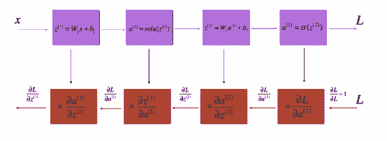

# 三百零二页吴恩达 Deeplearning.ai 课程笔记，详记基础知识与作业代码

机器之心整理

**作者****：Wan Zhen**

**参与：机器之心编辑部**

> 吴恩达的 DeepLearning.ai 已经于 1 月 31 日[发布了最后一门课程](http://mp.weixin.qq.com/s?__biz=MzA3MzI4MjgzMw==&mid=2650737028&idx=1&sn=5229847549c4beb32a3502fcced4322c&chksm=871acdfab06d44ec66aea7ead7fe44fad66cfc42b5460c7203554cd894aa8bdfcadf9e4459df&scene=21#wechat_redirect)。近日，来自重庆大学的 Wan Zhen 制作了一份深度学习专项课程笔记，该笔记从神经网络与深度学习基础、提升深度神经网络性能和卷积神经网络三门课程出发详细解释了关键概念与作业代码。本文概括性地介绍了这三课的主要内容，并选择每个课程主题比较有意思的知识点进行介绍。

*   资源链接：https://pan.baidu.com/s/1oAqpmUe 提取密码（已失效）

在这份笔记中，Wan Zhen 不仅介绍了每个课程的关键知识点，同时还详细解释了各课程的编程作业。在第一门课程《神经网络与深度学习基础》中，该课程笔记不仅提供了最基础的 Python 和 NumPy 操作笔记，同时还从最基础的 Logistic 回归推导到最一般的深度全连接网络。当然，还介绍了必要的损失函数与反向传播方法。而在第二门课程中，该笔记详细记录了提升深度网络性能所需要的技巧与基础，例如初始化、正则化和梯度检验等在实践上大大提升模型性能的方法，以及一般 SGD、动量法和适应性学习率方法等常见的最优化方法。最后，第二门课程重点介绍了 TensorFlow，包括该框架的常用函数和实际构建网络的过程等。最后一章节主要记录了卷积神经网络，包括基本的卷积运算、残差网络和目标检测框架等。

以下是该课程笔记的简要框架与一些详细的知识点。

**1\. 神经网络与深度学习**

这一部分对应的是吴恩达深度学习课程的第一课，主要介绍必要的编程语言和编程工具，并逐步进阶介绍线性网络、非线性网络、隐藏层网络到深度网络的实现方法，细节详尽，附有完整的代码。通过这一部分的学习，你将理解神经网络的结构和数据流（前向传播和反向传播），非线性激活函数和隐藏层对学习复杂函数的作用，并知道如何一步步构建完整的（任意结构的、自定义的）神经网络，体会向量化和模块化编程思想的妙处。

**1.1 Python 基础和 Numpy**

本章第一节介绍了如何使用 Python 的 Numpy 工具包、iPython Notebook 等基本的编程工具。然后介绍如何用这些工具构建神经网络，特别是理解神经网络计算的向量化思想和 Python 广播的使用。

**1.2 logistic 回归**

第 2 节介绍如何构建一个准确率为 70% 的 logistic 回归神经网络分类器（图像识别网络）来识别猫，并介绍如何进一步将准确率提高的方法，以及损失函数的偏导数更新参数的过程。其中特别强调了尽量用向量化结构而不要用循环结构，除非有必要（比如 epoch 的迭代就必须使用循环结构）。

1.2.1 介绍必要的 Python 工具包；1.2.2 介绍数据集的结构；1.2.3 介绍整个学习算法的宏观架构；1.2.4 介绍构建算法的基本步骤；1.2.5 和 1.2.6 总结前述内容进行代码实现，并进行了可视化分析；1.2.7 介绍如何用自己的数据集训练该神经网络；1.2.8 展示了 logistic 回归神经网络的完整代码。

其中 1.2.4 介绍的构建算法的基本步骤为：

*   定义模型结构；

*   初始化模型参数；

*   循环迭代结构：

*   计算当前损失函数值（前向传播）

*   计算当前梯度值（反向传播）

*   更新参数（梯度下降）

通常 1—3 部分是分开构建的，然后整合到一个函数 model() 中。

1.2.5 对 model() 进行了代码实现，并画出了损失函数和梯度的图像。


*图 1.2.3：损失函数*


*图 1.2.4：三种不同学习率的学习曲线对比*

**1.3 用隐藏层分类平面数据点**

第 3 节介绍如何在神经网络中添加隐藏层以对平面数据点进行分类，本节将教你理解反向传播的工作过程、隐藏层对捕捉非线性关系的作用，以及构建辅助函数的方法。

重点内容包括：用单个隐藏层实现二分类器；使用非线性激活函数；计算交叉熵损失；实现前向和反向传播。

1.3.1 介绍必要的工具包；1.3.2 介绍数据集的构成（平面上的红点和蓝点）；1.3.3 介绍无隐藏层的 logistic 回归对该数据集的分类结果；1.3.4 介绍添加了隐藏层的完整模型的实现过程和对该数据集的分类；1.3.5 展示了完整代码。

其中 1.3.3 的分类结果如下图所示：


*图 1.3.3：logistic 回归*

1.3.4 中使用的神经网络的架构：


*图 1.3.4：神经网络模型*

1.3.4 构建神经网络的方法和 1.2.4 基本相同，重点强调了如何定义隐藏层结构和非线性激活函数的使用，实现代码后，得到的运行结果为：


*图 1.3.6：有隐藏层分类器的决策边界*

其中，添加了隐藏层之后，必须使用非线性激活函数，因为不使用非线性激活函数的线性层堆叠是无意义的，无法增大模型的复杂度和容量。

**1.4 一步步构建完整的深度神经网络**

第 4 节介绍深度神经网络的完整架构，以及如何构建自定义的模型。完成这部分后，你将学会：使用 ReLU 激活函数提升模型的性能、构建更深的模型（隐藏层数大于 1），以及实现易用的神经网络（模块化思想）。

1.4.1 介绍必要的工具包；1.4.2 介绍任务概述；1.4.3 介绍从 2 层网络到 L 层网络的初始化过程；1.4.4 介绍前向传播模块的构建，从线性前向传播、线性+非线性激活前向传播，再到 L 层网络的前向传播；1.4.5 介绍损失函数；1.4.6 介绍反向传播模块的构建，从线性反向传播、线性+非线性激活反向传播，再到 L 层网络的反向传播；1.4.7 展示了深度神经网络的完整代码。


*图 1.4.1：任务概述*



*图 1.4.3：前向传播和反向传播的线性—ReLU—线性—sigmoid 的过程图示。上方表示前向传播，下方表示反向传播。*

**1.5 深度神经网络的图像分类应用**

通过前面四节的学习，你已学会如何一步一步构建完整的深度神经网络。第 5 节介绍如何用深度神经网络构建猫识别分类器。此前在 logistic 回归网络中，识别准确率只能达到 68%，而在完整的深度网络中，识别准确率能达到 80%！

完成本节后，你将学会：用前面介绍的所有辅助函数构建任意结构的神经网络；试验不同结构的神经网络，并进行分析；理解构建辅助函数对构建网络的好处（对比从零开始）。

1.5.1 介绍必要的工具包；1.5.2 介绍数据集（猫 vs. 非猫）；1.5.3 介绍模型架构，其中分别构建了 2 层和 L 层的神经网络；1.5.4 介绍 2 层神经网络的训练和测试结果；1.5.5 介绍 2 层神经网络的训练和测试结果；1.5.6 对结果进行分析；1.5.7 介绍如何用你自己的图像训练分类模型；1.5.8 展示了完整代码。

其中，2 层神经网络的运行结果：


*图 1.5.4：2 层神经网络的损失函数*

运行结果：


*图 1.5.5：L 层神经网络的损失函数*

运行结果：


通过比较可知，更深的网络有助于提高识别准确率（0.72 vs. 0.8；2 层 vs. 5 层）。

1.5.6 简单总结了影响识别错误的因素：

*   猫出现在非常规的位置；

*   猫的颜色和背景相似；

*   非常规的猫毛色和品种；

*   拍摄角度；

*   照片的亮度；

*   猫的占图比例太小或太大。

这些识别错误可能跟全连接网络自身的局限性有关，包括参数共享、过拟合倾向（参数数量）和层级特征方面，而这些问题将在卷积神经网络里得到改善。

**2\. 提升深度神经网络性能**

这一部分对应吴恩达 deeplearning.ai 的第二门课程，重点从超参数调整、随机和 Xavier 等参数初始化方法、Dropout 和 L2 范数等正则化方法、以及 1 维和 N 维梯度检验方法来描述深度学习在实践上的性能提升方法。当然，这一部分不仅包含课程知识点，还展示了课后问答与实现作业。

最优化在这一部分课程中也得到了重点讲解，Wan Zhen 的课程笔记从最基本的最速下降法到小批量随机梯度下降介绍了基本的一阶梯度法，然后再探讨动量法与适应性学习率方法来利用历史梯度获得更好的下降方向。值得注意的是，该笔记详细介绍了 Adam 最优化方法的更新过程与实现代码。

这门课程最后一部分主要展现了 TensorFlow 的基本函数与实际构建神经网络的过程。

在参数初始化、正则化和梯度检验中，比较有意思的是 He 初始化和 Dropout 的机制，下面我们将详细探讨这两个组件。

He 初始化（He Initialization，He et al., 2015）是根据第一作者的名字而确定的。如果读者了解 Xavier 初始化，那么其实它们是非常相似的，只不过 Xavier 初始化会为权重 W^l 使用标量元素 sqrt(1./layers_dim[l-1])，而 He 初始化会使用 sqrt(2./layers_dims[l-1])。以下展示了如何实现 He 初始化，这一部分是课程作业的答案：

```py
1.  # GRADED FUNCTION: initialize_parameters_he

2.  def initialize_parameters_he(layers_dims):

3.  """

4.  Arguments:

5.  layer_dims -- python array (list) containing the size of each

6.  ,→ layer.

7.  Returns:

8.  parameters -- python dictionary containing your parameters "W1",

9.  ,→ "b1", ..., "WL", "bL":

10.  W1 -- weight matrix of shape (layers_dims[1],

11.  ,→ layers_dims[0])

12.  b1 -- bias vector of shape (layers_dims[1], 1)

13.  ...

14.  WL -- weight matrix of shape (layers_dims[L],

15.  ,→ layers_dims[L-1])

16.  bL -- bias vector of shape (layers_dims[L], 1)

17.  """

18.  np.random.seed(3)

19.  parameters = {}

20.  L = len(layers_dims) - 1 # integer representing the number of

21.  ,→ layers

22.  for l in range(1, L + 1):

23.  ### START CODE HERE ### (

24.  2 lines of code)

25.  parameters['W' + str(l)] = np.random.randn(layers_dims[l],

26.  ,→ layers_dims[l-1]) * np.sqrt(2./layers_dims[l-1])

27.  parameters['b' + str(l)] = np.zeros((layers_dims[l], 1))

28.  ### END CODE HERE ###

29.  return parameters

```

最后，该文档还总结了三种初始化的效果。如下所示，它们都在相同迭代数、相同的超参数和相同网络架构下进行测试：


**Dropout**

在正则化方法中，Dropout 是非常有用和成功的一种技术。虽然近来有研究者发现把它和批归一化（BN）一起使用会产生一些冲突，但仍然不影响它作为一种强大的技术来控制模型过拟合。一般来说，Dropout 会随机删除一些神经元，以在不同批量上训练不同的神经网络架构。

Bagging 是通过结合多个模型降低泛化误差的技术，主要的做法是分别训练几个不同的模型，然后让所有模型表决测试样例的输出。而 Dropout 可以被认为是集成了大量深层神经网络的 Bagging 方法，因此它提供了一种廉价的 Bagging 集成近似方法，能够训练和评估值数据数量的神经网络。


*图：在第一层和第三层采用 Dropout。*

在每一个批量的前向传播与反向更新中，我们关闭每个神经元的概率为 1-keep_prob，且关闭的神经元不参与前向传播计算与参数更新。每当我们关闭一些神经元，我们实际上修改了原模型的结构，那么每次迭代都训练一个不同的架构，参数更新也更加关注激活的神经元。这种正则化方法可以看成是一种集成方法，即集成每个批量所训练的不同网络架构。

在正则化方法中，该笔记也比较了 L2 正则化和 Dropout 的效果：


在后面的最优化方法中，我们比较感兴趣的是 Adam 方法，因此下面我们也将重点描述该方法。

**Adam**

Adam 算法和传统的随机梯度下降不同。随机梯度下降保持单一的学习率（即 alpha）更新所有的权重，学习率在训练过程中并不会改变。而 Adam 通过计算梯度的一阶矩估计和二阶矩估计，为不同的参数设计独立的自适应性学习率。

Adam 算法的提出者描述其为两种随机梯度下降扩展式的优点集合，即：

*   适应性梯度算法（AdaGrad）为每一个参数保留一个学习率，以提升在稀疏梯度（即自然语言和计算机视觉问题）上的性能。

*   均方根传播（RMSProp）基于权重梯度最近量级的均值为每一个参数适应性地保留学习率。这意味着算法在非稳态和在线问题上有很优秀的性能。

Adam 算法同时具备 AdaGrad 和 RMSProp 算法的优点。Adam 不仅如 RMSProp 算法那样基于一阶矩均值计算适应性参数学习率，它同时还充分利用了梯度的二阶矩均值（即有偏方差/uncentered variance）。具体来说，算法计算了梯度的指数移动均值（exponential moving average），超参数 beta1 和 beta2 控制了这些移动均值的衰减率。

移动均值的初始值和 beta1、beta2 值接近于 1（推荐值），因此矩估计的偏差接近于 0。该偏差通过首先计算带偏差的估计而后计算偏差修正后的估计而得到提升。


正如该笔记所总结的，Adam 的计算更新过程可分为三部分：

1\. 计算历史梯度的指数加权平均值，并将它储存在变量 v 中（有偏估计），然后再计算 v^corrected（修正后得出的无偏估计）。

2\. 计算历史梯度平方的指数加权平均值，并将它储存为变量 s（有偏估计），然后计算 s^corrected（修正的无偏估计）。

3\. 然后结合前两步的信息更新参数。

这一更新过程如笔记所述可表示为：


其中 t 会计算 Adam 所迭代更新的次数、L 为层级数、β_1 和β_1 为控制指数加权平均值得超参数、α 为学习率，而 ε 为避免分母为零的小常数。

Wan Zhen 同样给出了 Adam 的实现代码或作业解读：

```py
1.  # GRADED FUNCTION: initialize_adam

2.  def initialize_adam(parameters) :

3.  """

4.  Initializes v and s as two python dictionaries with:

5.  - keys: "dW1", "db1", ..., "dWL", "dbL"

6.  - values: numpy arrays of zeros of the same shape as

7.  ,→ the corresponding gradients/parameters.

8.  Arguments:

9.  parameters -- python dictionary containing your parameters.

10.  parameters["W" + str(l)] = Wl

11.  parameters["b" + str(l)] = bl

12.  Returns:

13.  v -- python dictionary that will contain the exponentially weighted

14.  ,→ average of the gradient.

15.  v["dW" + str(l)] = ...

16.  v["db" + str(l)] = ...

17.  s -- python dictionary that will contain the exponentially weighted

18.  ,→ average of the squared gradient.

19.  s["dW" + str(l)] = ...

20.  s["db" + str(l)] = ...

21.  """

22.  L = len(parameters) // 2 # number of layers in the neural networks

23.  v = {}

24.  s = {}

25.  # Initialize v, s. Input: "parameters". Outputs: "v, s".

26.  for l in range(L):

27.  ### START CODE HERE ### (approx. 4 lines)

28.  v["dW" + str(l+1)] = np.zeros(parameters["W" + str(l+1)].shape)

29.  v["db" + str(l+1)] = np.zeros(parameters["b" + str(l+1)].shape)

30.  s["dW" + str(l+1)] = np.zeros(parameters["W" + str(l+1)].shape)

31.  s["db" + str(l+1)] = np.zeros(parameters["b" + str(l+1)].shape)

32.  ### END CODE HERE ###

33.  return v, s

```

以下实现了上面描述的参数更新过程：

```py
1.  # GRADED FUNCTION: update_parameters_with_adam

2.  def update_parameters_with_adam(parameters, grads, v, s, t, learning_rate = 0.01, beta1 = 0.9, beta2 = 0.999, epsilon = 1e-8):

 *   L = len(parameters) // 2 # number of layers in the neural networks

*   v_corrected = {} # Initializing first moment estimate, python, dictionary

 *   s_corrected = {} # Initializing second moment estimate, python

*   ,→ dictionary

*   # Perform Adam update on all parameters

*   for l in range(L):

*   # Moving average of the gradients. Inputs: "v, grads, beta1".

*   ,→ Output: "v".

*   v["dW" + str(l+1)] = beta1*v["dW" +

*   ,→ str(l+1)]+(1-beta1)*grads['dW' + str(l+1)]

*   v["db" + str(l+1)] = beta1*v["db" + str(l+1)]+(1-beta1)*grads['db' + str(l+1)]

*   # Compute bias-corrected first moment estimate. Inputs: "v, beta1, t". Output: "v_corrected".

*   v_corrected["dW" + str(l+1)] = v["dW" + str(l+1)]/(1-math.pow(beta1,t))

*   v_corrected["db" + str(l+1)] = v["db" + str(l+1)]/(1-math.pow(beta1,t))

*   # Moving average of the squared gradients. Inputs: "s, grads, beta2". Output: "s".

*   s["dW" + str(l+1)] = beta2*s["dW" + str(l+1)]+(1-beta2)*(grads['dW' + str(l+1)]**2)

*   s["db" + str(l+1)] = beta2*s["db" + str(l+1)]+(1-beta2)*(grads['db' + str(l+1)]**2)

*   # Compute bias-corrected second raw moment estimate. Inputs: "s, beta2, t". Output: "s_corrected".

*   s_corrected["dW" + str(l+1)] = s["dW" + str(l+1)]/(1-math.pow(beta2,t))

*   s_corrected["db" + str(l+1)] = s["db" + str(l+1)]/(1-math.pow(beta2,t))

*   # Update parameters. Inputs: "parameters, learning_rate, v_corrected, s_corrected, epsilon". Output: "parameters".

*   parameters["W" + str(l+1)] = parameters["W" + str(l+1)]-learning_rate * v_corrected["dW" + str(l+1)]/(np.sqrt(s_corrected["dW" + str(l+1)])+epsilon)

*   parameters["b" + str(l+1)] = parameters["b" + str(l+1)]-learning_rate * v_corrected["db" + str(l+1)]/(np.sqrt(s_corrected["db" + str(l+1)])+epsilon)

 *   return parameters, v, s 
```

该章节同样介绍和对比了这几个最优化方法的优势：


**TensorFlow **

最后一部分重点介绍了 TensorFlow 的函数与实践。TensorFlow 是一种采用数据流图（data flow graphs），用于数值计算的开源软件库。其中 Tensor 代表传递的数据为张量（多维数组），Flow 代表使用计算图进行运算。数据流图用「结点」（nodes）和「边」（edges）组成的有向图来描述数学运算。「结点」一般用来表示施加的数学操作，但也可以表示数据输入的起点和输出的终点，或者是读取/写入持久变量（persistent variable）的终点。边表示结点之间的输入/输出关系。这些数据边可以传送维度可动态调整的多维数据数组，即张量（tensor）。

这一部分笔记重点介绍了课程的测试和实现代码，例如以下构建了简单的占位符：

```
1.  ### START CODE HERE ### (approx. 2 lines)

2.  X = tf.placeholder(tf.float32, [n_x, None], name = 'X')

3.  Y = tf.placeholder(tf.float32, [n_y, None], name = 'Y')

4.  ### END CODE HERE ###

5.  return X, Y

 *   return parameters, v, spy 
```

定义变量和常量的方法：

```py
1.  a = tf.constant(2, tf.int16)

2.  b = tf.constant(4, tf.float32)

3.  g = tf.constant(np.zeros(shape=(2,2), dtype=np.float32))

 *   d = tf.Variable(2, tf.int16)

*   e = tf.Variable(4, tf.float32)

 *   h = tf.zeros([11], tf.int16)

*   i = tf.ones([2,2], tf.float32)

 *   k = tf.Variable(tf.zeros([2,2], tf.float32))

*   l = tf.Variable(tf.zeros([5,6,5], tf.float32))

 *   return parameters, v, spy 
```

初始化参数的方法：

```py
1.  W1 = tf.get_variable("W1", [25,12288], initializer = tf.contrib.layers.xavier_initializer(seed = 1))

2.  b1 = tf.get_variable("b1", [25,1], initializer = tf.zeros_initializer())

 *   return parameters, v, s 
```

运行计算图：

```py
1.  a = tf.constant(2, tf.int16)

2.  b = tf.constant(4, tf.float32)

 *   graph = tf.Graph()

*   with graph.as_default():

*   a = tf.Variable(8, tf.float32)

*   b = tf.Variable(tf.zeros([2,2], tf.float32))

 *   with tf.Session(graph=graph) as session:

*   tf.global_variables_initializer().run()

*   print(f)

*   print(session.run(a))

*   print(session.run(b))

 *   #输出：

 *   >>> <tf.Variable 'Variable_2:0' shape=() dtype=int32_ref>

*   >>> 8

*   >>> [[ 0\.  0.]

*   >>>  [ 0\.  0.]]

 *   return parameters, v, spy 
```

**3\. 卷积神经网络**

在大神吴恩达的第四课里我们学习的是卷积神经网络也就是 CNN，这一章的习题是让你用 Numpy 实现一个卷积层和一个池化层同时还有前馈和反向传播。你所能用到的包有：

*   Numpy：一个基本的在 Python 里用来做科学计算的包。

*   Matplotlib：用来画图。

列举一下你将要学习实现的函数：

1\. 卷积函数，包括：

*   零填充（zero padding）

*   卷积窗（convolve window)

*   前向卷积（convolution forward）

*   反向卷积（convolution backward）

2\. 池化函数，包括：

*   前向池化（Pooling forward)

*   创建掩码（create mask)

*   分布值（distribute value）

*   反向池化（Pooling backward)

第一个作业要求用 Numpy 一点点实现这些函数，下一个作业要求用 TensorFlow 里的函数建立模型。

第三章里讲了卷积神经网络、池化层和卷积神经网络的反向传播。卷积神经网络这部分讲了零填充、单步卷积和前馈卷积网络；池化层这部分讲了前向池化；卷积神经网络的反向传播这部分讲了卷积层反传和池化层反传。

**3.1.3 卷积网络**

虽然编程框架使卷积易于使用，但卷积仍是深度学习里最难懂的一部分。卷积网络大致上会像下图一样把输入转化成输出：


为了帮助大家进一步理解卷积，小编在这里着重写一下卷积的操作。

在这部分，我们会实现一个单步的卷积，就是你用一个滤波器（filter）在输入的单个位置上执行一下，然后整个的卷积结果就是不断地拖动这个滤波器在输入值的所有位置上执行。我们要做的：

1：拿到输入数据；

2：使用滤波器在输入数据的每一个位置上执行一下；

3：输出另一个数据（一般和输入数据大小不一样）。

在计算机视觉里，矩阵中每一个值对应的都是单个的像素值，我们用一个 3*3 大小的滤波器去卷图片，就是在每一个位置上，用滤波器里的每一个值去乘原始矩阵里对应位置上的值，然后求和之后再加上一个偏差数值，然后再拖动这个滤波器去下一个位置上，这就是卷积，每一次拖动的距离叫做步长。在第一步练习里，你将要实现一个一步的卷积，这个一步的卷积是使用一个滤波器在输入数据一个位置上卷积得到的单个的实数输出。

练习：实现 conv_single_step() 函数

代码：

```
1.  # GRADED FUNCTION: conv_single_step

2.  def conv_single_step(a_slice_prev, W, b): """

3.  Apply one filter defined by parameters W on a single slice

4.  → (a_slice_prev)oftheoutputactivation

5.  of the previous layer.

6.  Arguments:

7.  a_slice_prev -- slice of input data of shape (f, f, n_C_prev)

8.  W -- Weight parameters contained in a window - matrix of shape (f,

9.  → f,n_C_prev)

10.  b -- Bias parameters contained in a window - matrix of shape (1, 1,

11.  → 1)

12.  Returns:

13.  Z -- a scalar value, result of convolving the sliding window (W, b)

14.  → onaslicexoftheinputdata

15.  """

16.  ### START CODE HERE ### (  2 lines of code)

17.  # Element-wise product between a_slice and W. Add bias. s = a_slice_prev * W + b

18.  # Sum over all entries of the volume s

19.  Z = np.sum(s)

20.  ### END CODE HERE ###

21.  return Z

 *   return parameters, v, spy 
```

再大致讲一下卷积神经网络前传（Forward pass）。

之前我们讲了怎样用一个滤波器去做卷积，在前传里是用好多个滤波器一个一个地卷积然后把结果（2D 的）一层一层地堆成一个 3D 的结构。


详细信息更有意思，请学习吴恩达的课程。

3.1.4 池化层

池化层很好玩，为了降低输入数据的大小，减少计算量，就有了池化层，同时池化层也会帮助特征检测器更独立于位置信息。这里介绍两种池化层：

*   最大池化层

滑动一个 (f,f) 大小的窗口到输入的数据上，在窗口里取最大的一个值为输出然后把这个值存到准备输出的数据里。

*   平均池化层

从名字就可以看出它需要同样地滑动一个 (f,f) 大小的窗口到输入数据上面，然后求窗口中数据的平均值，再把这个值储存到要输出的值里。


这些池化层没有参数可以被训练，但对于窗口的大小 f，你可以自己去尝试然后选择最好的。

**3.2 卷积神经网络应用**

在这一部分里吴老师讲了 TensorFlow 模型、创建占位符、初始参数、前向传播、计算损失及模型。

在这里我们聊一聊怎么初始化参数吧。你需要用 tf.contrib.layers.xavier_initializer(seed=0) 来初始化权重/滤波器 W1 和 W2。你不需要担心偏重值因为很快你就能发现 TensorFlow 函数已经解决了这一点。注意，你只需初始 conv2d 函数的权重/滤波器，TensorFlow 会自动初始全连接部分的层。我们会在之后的作业里看到更多。

练习：实现 initialize_parameters(). 每一组滤波器/权重的维度已经提供给大家。记住，在 TensorFlow 里初始化一个形状为 [1,2,3,4] 的参数 W 用：

```py
1.  W = tf.get_variable("W", [1,2,3,4], initializer = ...)

```

More Info. 更多的信息：

```py
1.  More Info.更多的信息：

2.  # GRADED FUNCTION: initialize_parameters

3.  def initialize_parameters(): """

4.  Initializes weight parameters to build a neural network with  → tensorflow.Theshapesare:

5.  W1 : [4, 4, 3, 8]

6.  W2 : [2, 2, 8, 16]

7.  Returns:

8.  parameters -- a dictionary of tensors containing W1, W2

9.  """

10.  tf.set_random_seed(1) # so that your  → "random"numbersmatchours

11.  ### START CODE HERE ### (approx. 2 lines of code)

12.  W1 = tf.get_variable("W1", [4, 4, 3, 8], initializer  → =tf.contrib.layers.xavier_initializer(seed=0)) W2 = tf.get_variable("W2", [2, 2, 8, 16], initializer  → =tf.contrib.layers.xavier_initializer(seed=0))

13.  ### END CODE HERE ###

14.  parameters = {"W1": W1,

15.  "W2": W2}

16.  return parameters

```

**3.3 Keras 教程：幸福家（Happy House）**

这一部分讲了一个作业（幸福家），怎样用 Keras 建模型、总结、用自己的图片去测试其他非常有用的 Keras 函数。在这里我们着重讲一下幸福家是什么：

3.3.1 幸福家

下一次放假旅行，你决定和你的 5 个在学校认识的朋友一起度过一周。这附近有一个非常方便的房子可以做很多事情。但最重要的福利是在房子里的时候每个人都必须要快乐。所以每个想进房间的人都要提供他们现在的幸福情形。


作为一个深度学习专家，要确保「开心」这一规则被坚决的执行了，你要去建一个算法来通过前门的摄像头得到的照片来检查这个人是不是开心。

你已经收集到了你和朋友在前门照的照片，数据库已经被标注了。0 代表不开心，1 代表开心。


跑一下下面的程序让数据库更加标准化，然后学习一下它的形态。

```py
1.  X_train_orig, Y_train_orig, X_test_orig, Y_test_orig, classes =  → load_dataset()

2.  # Normalize image vectors

3.  X_train = X_train_orig/255.

4.  X_test = X_test_orig/255.

5.  # Reshape

6.  Y_train = Y_train_orig.T

7.  Y_test = Y_test_orig.T

8.  print ("number of training examples = " + str(X_train.shape[0])) print ("number of test examples = " + str(X_test.shape[0])) print ("X_train shape: " + str(X_train.shape))

9.  print ("Y_train shape: " + str(Y_train.shape))

10.  print ("X_test shape: " + str(X_test.shape)) print ("Y_test shape: " + str(Y_test.shape))

11.  #output

12.  number of training examples = 600

13.  number of test examples = 150

14.  X_train shape: (600, 64, 64, 3)

15.  Y_train shape: (600, 1)

16.  X_test shape: (150, 64, 64, 3)

17.  Y_test shape: (150, 1)

```

幸福家数据库的细节：

*   图片数据大小为 (64, 64, 3) 

*   训练数据：600

*   测试数据：150

现在去解决「快乐」挑战吧！

**3.4 残差网络**

这一部分介绍了非常深的深度神经网络的问题，如何构建残差模块、残差连接、卷积块等，并组合它们而建造第一个残差网络模型以及用自己的图片去实验。

残差网络可以解决一些非常深的深度神经网络所具有的问题，我们在这里着重谈一下非常深的深度网络的问题。

近几年，神经网络变得越来越深了，最前沿的网络有几层的，也有超过一百层的。

深度神经网络最主要的优势是它可以表示非常复杂的函数。它也可以从不同的抽象等级去学习从边缘特征（浅层）到复杂的特征（深层）。但是，用一个更深的神经网络不总是有效。一个大缺点是训练模型的时候梯度会消失：非常深的网络经常会非常快地梯度下降到 0。这样会让梯度下降变得不可忍受的慢，因为每一次只会更新一点点。更具体地，在梯度下降的时候，当你反向传播从最后一层一直到第一层的时候，每一步都在乘以权重矩阵，所以梯度会以指数函数的速率下降到 0（或者在有些极少的情况里，梯度以指数函数的速率产生爆炸）。

在训练的时候，你也能看到前面层的梯度数值非常快地下降到 0。


你现在可以用残差网络解决这个问题。

**3.5 用 YOLOv2 检测车辆**

这一部分讲了：问题叙述、YOLO、模型细节、用一个门槛来过滤一个班的分数、非最大抑制、包装过滤器、在图片上测试 YOLO 模型、定义类、转折点和图片大小、加载一个训练好的模型、转化输出模型到一个可用的边界盒张量、过滤盒及对图片跑计算图。

在这里我们讲一下问题是什么：

你现在在做一个自动驾驶车，作为一个重要的部分，你想先建一个车辆检测系统，当你开车时候这个系统会每隔几秒照一下前面的路。


你现在已经收集了所有的这些图片到一个文件夹里然后也已经用框标注出了每一个你可以找到的车。这里是例子：


p 代表了你有多自信圈出来的是什么，c 代表了你认为圈出来的是什么。

如果你想让 YOLO 认出 80 种类别, 你可以让 c 表示 1 到 80 中的一个数，或者 c 是一个 80 长度的矢量。视频课里已经用了后一种表示。在这个笔记里，我们两种都用了，这取决于哪种更好用。在这个练习里，你将要学习 YOLO 怎样工作，怎样运用这个区检测车。因为 YOLO 训练的时候非常耗费计算量，我们将会加载训练好的权重来用。

**3.6 快乐家中的脸部识别**

在这一张里我们可以看到：简略脸部识别，脸部图片编成一个人 128 维度的矢量，使用 ConvNet 来计算编码，三联损失，加载训练好的模型和运用训练好的模型。

我们着重介绍一下简略脸部识别：

在脸部识别里，给你两张图片然后你必须告诉我两个人是否是同一个。最简单的做法是比较两张图片中的每一个像素，如果两张原始图片的比较结果小于一个门槛值则可以说两张图片是一个人。


当然，这个算法的性能非常差，因为像素的值会随着光的改变，方向的改变，甚至镜像改变头的位置而剧烈的改变。你将看到除了用原始图片你更愿意编码一个 f(image) 来比较每一个像素这样会给你一个关于两张照片是不是一个人的问题更准确的答案。

**3.7 通过神经风格迁移生成艺术**

在这一章节中，我们将尝试实现神经风格迁移，并使用算法生成新颖的艺术风格图像。在神经风格迁移中，重点是我们需要优化成本函数获得像素的值。如下所示，我们使用某张图像的风格，并迁移到需要这种风格的图像中：


神经风格迁移主要使用预训练的卷积神经网络，并在它的顶部构建新的层级。这种使用预训练模型，并将其应用到新任务的方法可以称为迁移学习。卷积网络的迁移学习非常简单，一般来说，我们可以将最后几个分类层的权重随机初始化，再在新的数据集上训练而快速获得优秀的性能。

在 NST 原论文中，我们会使用 VGG-19 网络，它会预先在 ImageNet 上实现训练。因此在 Wan Zhen 的笔记中，我们可以运行以下命令下载模型及参数;

```py
1.  `model = load_vgg_model("pretrained-model/imagenet-vgg-verydeep-19.mat")`

2.  `print(model)`

```

然后使用 assign 方法将图像作为模型的输入：

```py
1.  model["input"].assign(image)

```

随后，我们就能使用以下代码获取特定层级的激活值;

```py
1.  sess.run(model["conv4_2"])

```

在神经风格迁移中，重点是以下三个步骤：

*   构建需要迁移风格的图片损失函数 J_content(C, G)

*   构建风格损失函数 J_style(S, G)

*   将它们组合为最终的损失函数 J(G) =α J_content(C, G) +β J_style(S, G)

使用这样的损失函数，最终我们能以迁移学习的方法实现神经风格迁移。

****本文为机器之心整理，**转载请联系原作者获得授权****。**

✄------------------------------------------------

**加入机器之心（全职记者/实习生）：hr@jiqizhixin.com**

**投稿或寻求报道：editor@jiqizhixin.com**

**广告&商务合作：bd@jiqizhixin.com**