# 吴恩达授课，斯坦福 CS230 深度学习课程资源开放

机器之心整理

**参与：刘晓坤、雪、思源**

> 近日由吴恩达与 Kian Katanforoosh 指导的 CS230（深度学习）课程已经结束并放出了课程资料。这一门课程结合 Coursera 课外教学与课内教学展示了深度学习的基本概念与完整结构，机器之心简要介绍了该课程及基本内容。

课程地址：https://web.stanford.edu/class/cs230/

**课程简介**：深度学习是 AI 领域中最受欢迎的技能之一。这门课程将帮助你学好深度学习。你将学到深度学习的基础，理解如何构建神经网络，并学习如何带领成功的机器学习项目。你将学到卷积神经网络（CNN）、循环神经网络（RNN）、长短期记忆网络（LSTM）、Adam 优化器、Dropout 方法、BatchNorm 方法、Xavier/He 初始化方法等。你将在医疗、自动驾驶、手语识别、音乐生成和自然语言处理等领域中进行案例研究。你不仅能掌握理论，还能看到深度学习如何应用到产业中。我们将需要使用 Python 和 TensorFlow 来实现所有的项目，课程中也会教这一部分。完成这门课程后，你将能以创新的方式将深度学习应用到你的工作中。该课程是以翻转课堂的形式教学的。你将先在家里观看 Coursera 视频、完成编程任务以及在线测验，然后来到课堂上做进一步讨论和完成项目。该课程将以开放式的最终项目结束，教学团队会在过程中提供帮助。

CS230 采取课内和 Coursera 在线课程相结合的形式，其中每一个课程的模块都需要在 Coursera 上观看视频、做测试并完成编程作业。一周的课程约需要在 Cousera 上在线学习两个模块再加上 80 分钟的课内时间。

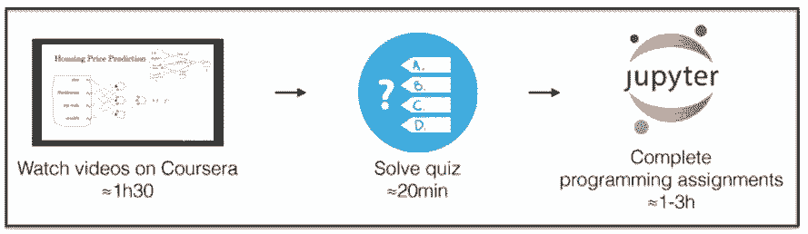

这门课程要求学生有一些背景知识，首先学生需要了解计算机科学基本原理与技能，并且能写合理、简洁的计算机程序。其次学生需要熟悉概率论与线性代数等基本的数学知识。

目前 CS230 的结课项目报告与 Poster 展示都已经发布，包含多种主题，如音乐生成、情绪检测、电影情感分类、癌症检测等。课程报告和 Poster 前三名已经公布：

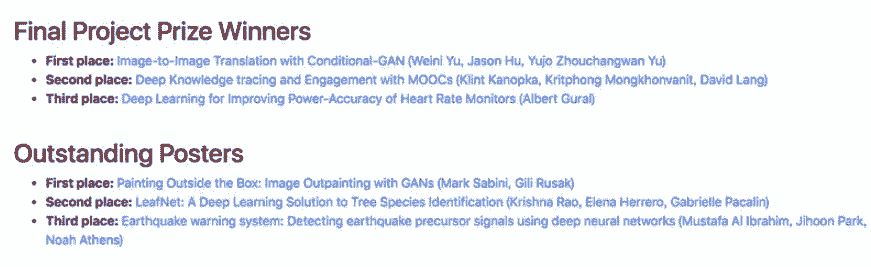

报告第一名：Image-to-Image Translation with Conditional-GAN (Weini Yu, Jason Hu, Yujo Zhouchangwan Yu)

该报告使用条件生成对抗网络（C-GAN）研究航空图图像翻译。参与者首先复现了 Isola 等人提出的 C-GAN 模型，然后探索了不同的网络架构、损失函数和训练策略。对不同模型进行了定性和定量评估，得出结论：基于残差的模型在仅使用 1000 个训练样本的情况下得到了非常高质量的图像。

*C-GAN 网络架构*

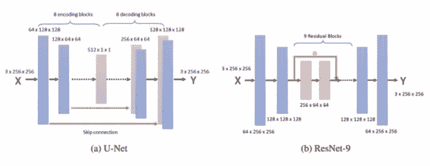

*生成器网络架构*

报告第二名：Deep Knowledge tracing and Engagement with MOOCs (Klint Kanopka, Kritphong Mongkhonvanit, David Lang)

该报告利用深度知识追踪网络以及 MOOC 课程互动协变量，计算学生的课程参与度，发现该方法能够以超过 88% 的准确率预测学生的下一个项目反应。利用这些预测可以向学生提供针对性的干预，也可以对课程进行针对性的改进。

*模型结构*

报告第三名：Deep Learning for Improving Power-Accuracy of Heart Rate Monitors (Albert Gural)

该报告利用深度学习方法解决从低采样率 PPG 中确定心率以及如何确定运动伪影中的加速度计信号的问题。

Poster 第一名：Painting Outside the Box: Image Outpainting with GANs (Mark Sabini, Gili Rusak)

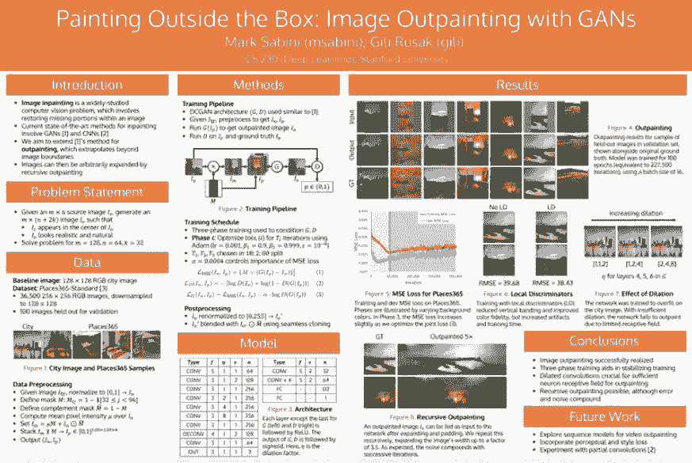

Poster 第二名：LeafNet: A Deep Learning Solution to Tree Species Identification (Krishna Rao, Elena Herrero, Gabrielle Pacalin)

该 Poster 使用残差网络基于图像对北美 185 个树种进行分类。

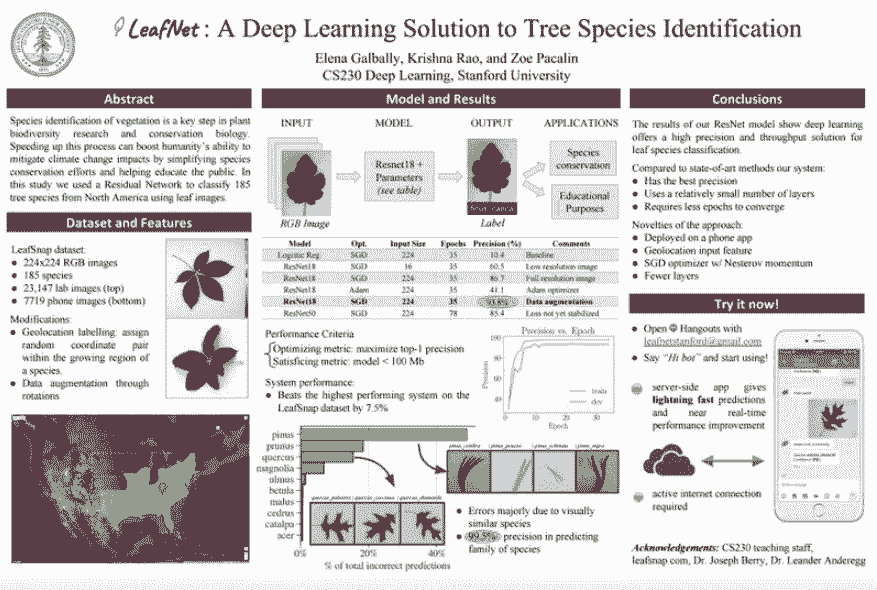

Poster 第三名：Earthquake warning system: Detecting earthquake precursor signals using deep neural networks (Mustafa Al Ibrahim, Jihoon Park, Noah Athens)

该 Poster 对 1D CNN、2D CNN、RNN 的地震预测性能进行了评估。

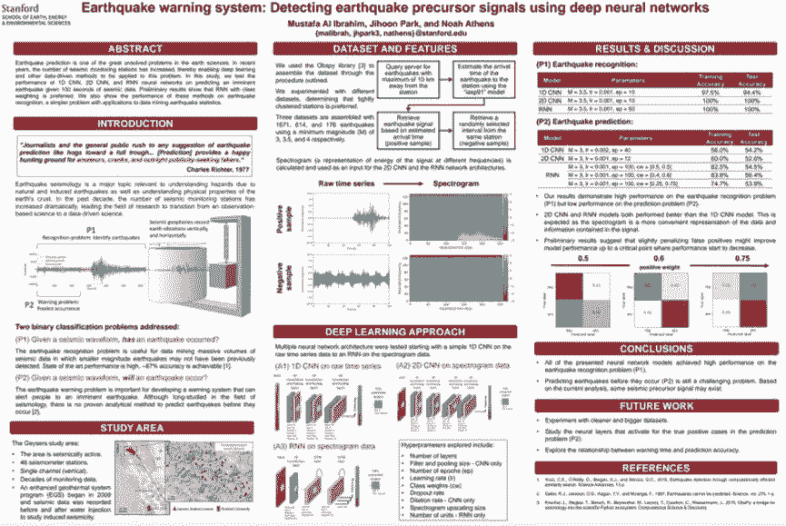

**课程主要内容**

CS230 与吴恩达在 Coursera 上的深度学习专项课程一样分 5 部分，即神经网络与深度学习、提升深度神经网络、机器学习项目的策略、卷积神经网络及序列模型。

在第一课中介绍了神经网络和深度学习的基础。主要在课堂内介绍了深度学习的直观概念，并借助两个模块从头开始学习神经网络到底是什么。

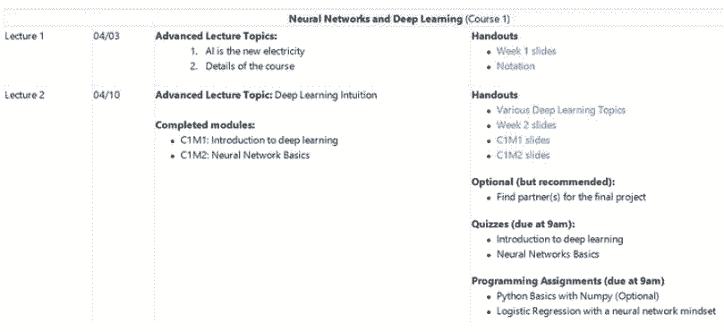

其中第一课的第一个模块 C1M1 主要从线性回归与房价预测引出神经网络，并着重介绍了监督式深度学习的基本概念。如下 C1M1 展示了基本神经网络的类别：

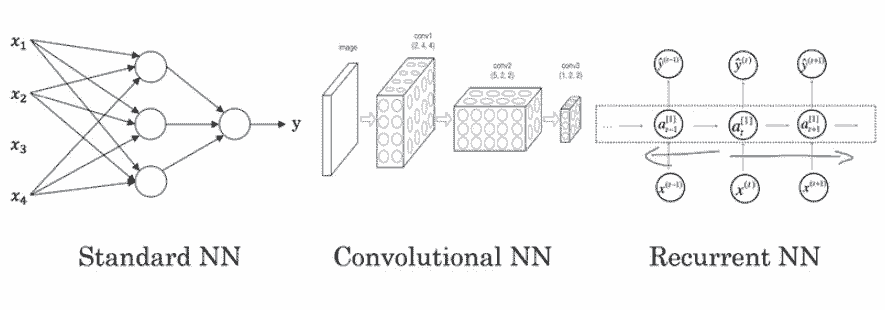

其中标准神经网络即我们常见的全连接网络，它是最基础也是最本质的「神经网络式」层级表征方法。标准神经网络简单而言即后一层的单个神经元接收前一层所有神经元激活值的加权和，并判断本神经元是不是需要激活。而卷积网络与全连接网络最大的区别是后一层的神经元只与前一层神经元部分连接，且神经元之间存在权重共享，这样的神经网络减少了冗余参数，并有利于建模如图像那样有局部结构的数据。最后的循环网络又与前两个前馈网络不同，它在不同时间步上使用相同的神经网络函数，并每一个时间步都利用前面时间步的必要信息，这样的网络能有效处理自然语言等序列问题。

随后在 C1M2 中，该课程开始具体介绍神经网络。当然理解神经网络还是需要从 Logistic 回归与感知机算法开始，而最基础的梯度下降与如何计算导数也是必须的。

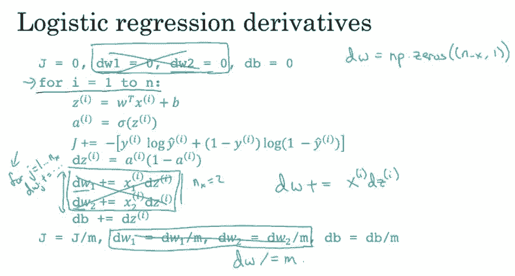

如上所示为 Logistic 回归的主要过程，我们先根据初始化的参数计算激活值 a，再根据预测值与标注值之间的差距计算损失函数，最后推导损失函数对各参数的梯度就能使用梯度下降更新参数。

第二课介绍深度学习模型的内部数学结构，从浅层网络逐步过渡到深度网络，理解「深度」的重要意义。掌握了这些概念之后，对于如何从零开始构建深度学习网络，能有一个基本的思路。

然后是深度模型的优化或调参技巧，例如初始化、正则化、数据集划分、Dropout、归一化、梯度检查等，和各种经典的学习率衰减方法，如动量算法、Adam 等。

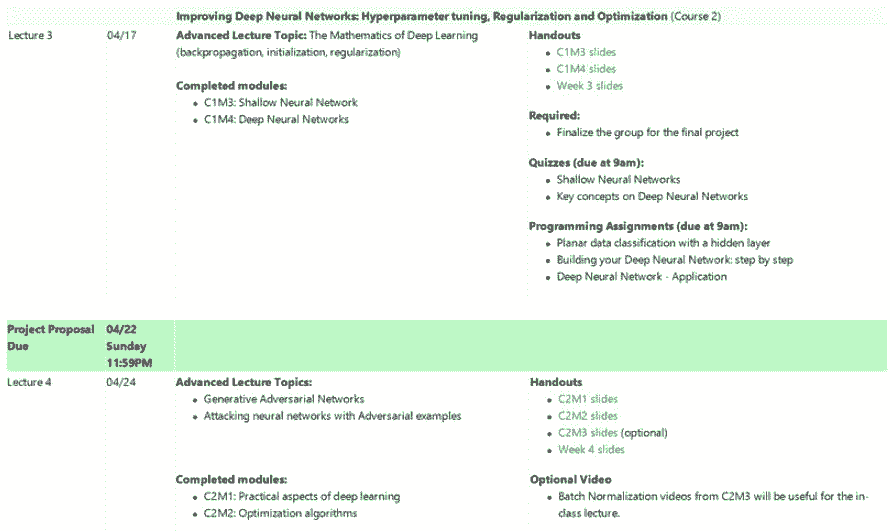

在 C1M3 中，吴恩达主要描述了感知机与神经网络的表征方法，这里仍需要推导大量的表达式。但只要理解了多层感知机的表达方法，那么深度全连接网络与其它深度神经网络的理解就会变得容易得多。如下所示为感知机向量化的表达式，其中主要是将前一层激活值的加权和 z 表示为矩阵运算。

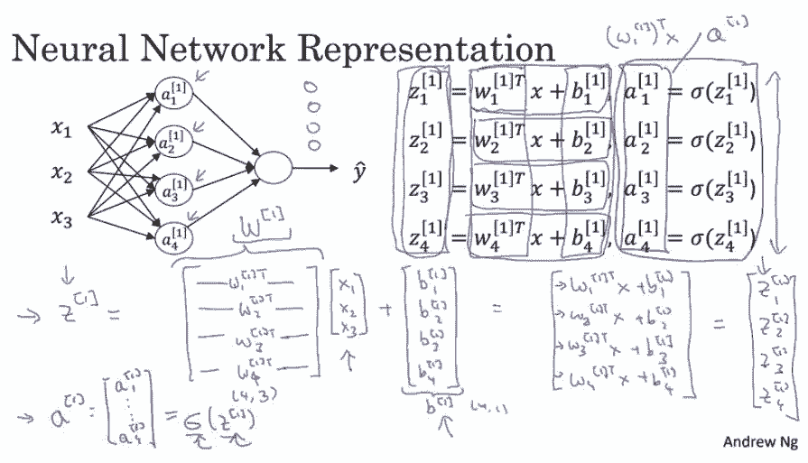

若理解的感知机或浅层网络的计算过程与表达式，那么深度前馈网络的推断过程就能轻松掌握。不过对于深度前馈网络，另一个非常重要的过程是反向传播。因为模型参数需要梯度才能更新，因此将根据损失函数计算出来的梯度反向传递到各个层级就非常有必要了。如下，C1M4 主要就介绍了这种反向传播：

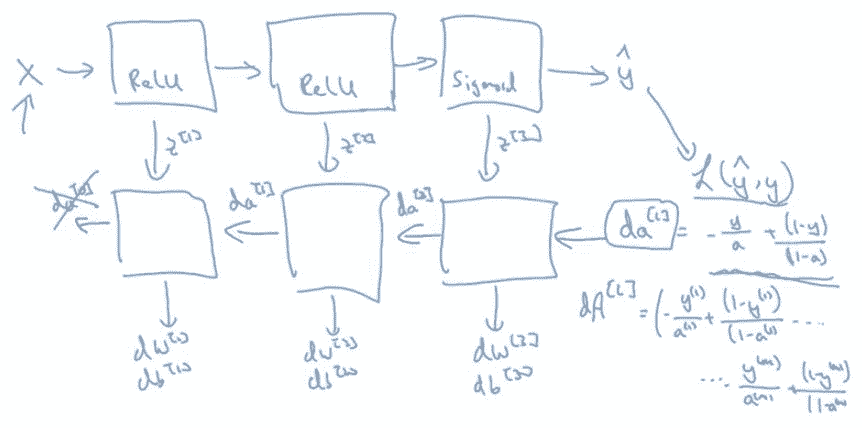

如上所示，当我们根据损失函数 L(y hat, y) 计算出最后一层的梯度，我们需要根据求导的链式法则将梯度反向传递到前层。

此外，这一部分 C2M1 和 C2M2 分别介绍了深度学习的技巧与基本的最优化方法。其中虽优化方法从批量梯度下降和小批量梯度下降开始到 Adam 最优化方法介绍了基本的学习过程。如下是手推的小批量梯度下降，但我们更常见的称呼是随机梯度下降。

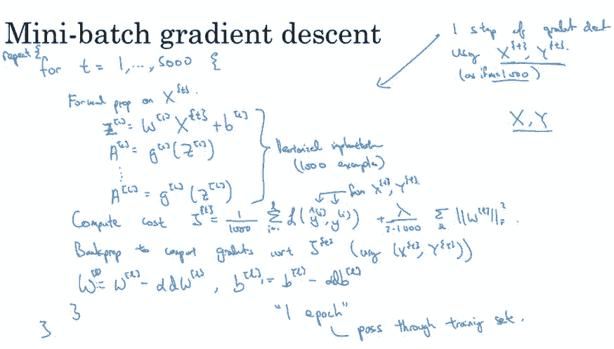

小批量与批量的不同在于计算梯度的样本比较少，一般是 32、64 等。这样每一次迭代所需要的计算量就大大减少，且还能通过引入噪声增加收敛结果的鲁棒性。

第三课介绍结构化机器学习项目。基础部分涉及超参数调整、批规一化方法等，以及深度学习框架（如 TensorFlow、PyTorch）的应用。然后是机器学习策略，包括垂直化调参、评估指标设置、数据集划分等。

这一课会介绍如何在实际案例中应用深度学习，Pranav Rajpurkar 将教你构建医疗领域的深度学习应用，即吴恩达团队开发的 Chest X-Rays 项目。

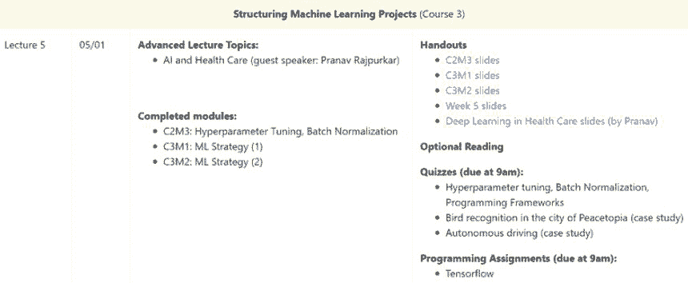

在这个项目中，你将以 DenseNet 为骨干网络架构，实现对肺部 X 射线图像的分类（是否有肺炎）。其中涉及了数据集构建、模型训练和模型评估等，可以体验深度学习产业化的完整过程。

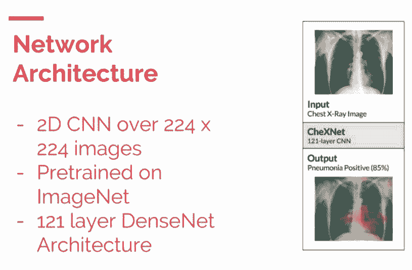

在这一课的几个模块中，C3M1 和 C3M2 都介绍了机器学习中的策略。机器学习中的策略主要关注于如何训练模型，例如什么时候需要调整样本数、怎么样算过拟合以及度量方法等。这里最经典的就是偏差与方差问题，我们常常需要根据偏差与方差确定我们的模型到底出现了什么状况，例如过拟合与欠拟合等。

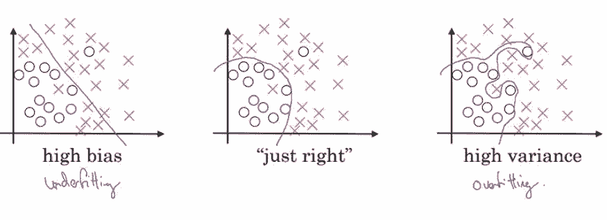

其中高偏差代表拟合数据集的函数集合并不包含真正的那个，即偏离正确答案有点远。而高方差表示拟合数据集的函数集合确实包含了真正的那个，但这个函数集合太大了，以至于每次搜索的都不准。

第四课介绍卷积神经网络，卷积神经网络主要用于处理空间型数据，如图像、视频等，因此在计算机视觉中应用甚广。在这一部分课程期间有一个期中测验，可以帮助你重温之前学习过的内容。

CNN 的基础部分涉及卷积运算、步幅、池化等，然后进一步介绍了几个经典的 CNN 架构，如 LeNet-5、AlexNet、VGG、ResNet、Inception 等。之后给出了几个 CNN 开发过程中的建议，涉及迁移学习、数据增强等。最后介绍了 CNN 领域的当前研究现状。

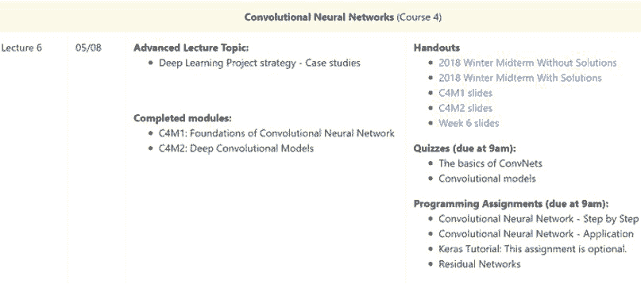

这一部分以目标检测应用为主，详细介绍了目标检测的整个工作流，并在最后以 YOLO 算法为例进行整合。之后还介绍了一些特殊的应用，例如人脸识别、神经风格迁移（画风迁移）等，其中神经风格迁移有更为详细的工作流介绍。

在 C4M1 中，吴恩达重点介绍了 CNN 及各个模块，包括卷积层、池化层、卷积步幅和 Padding 等。其中卷积层试图将神经网络中的每一小块进行更加深入的分析，从而得出抽象程度更高的特征。一般来说通过卷积层处理的神经元结点矩阵会变得更深，即神经元的组织在第三个维度上会增加。

以上展示了经典的 LeNet-5 架构，正如 LeCun 在 LeNet-5 原论文中所说，卷积网络结合了三种关键性思想来确保模型对图像的平移、缩放和扭曲具有一定程度的不变性，这三种关键思想即局部感受野、权重共享和空间/时间子采样。其中局部感受野表示卷积核只关注图像的局部特征，而权重共享表示一个卷积核在整张图像上都使用相同的权值，最后的子采样即我们常用的池化操作，它可以精炼抽取的特征。

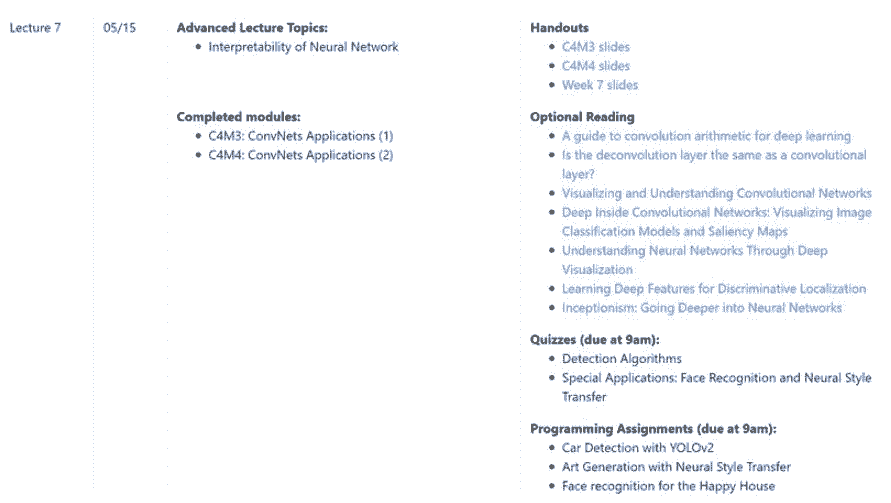

第五课介绍序列模型。序列模型主要用于处理序列型数据，如音乐、语音、文本等。序列模型主要以循环神经网络为代表，本课将介绍 RNN 的基础结构、类型、计算过程等，并以语言建模作为典型案例进行分析。之后是一些著名的 RNN 变体，例如 GRU、LSTM、双向 RNN、深度 RNN 等。

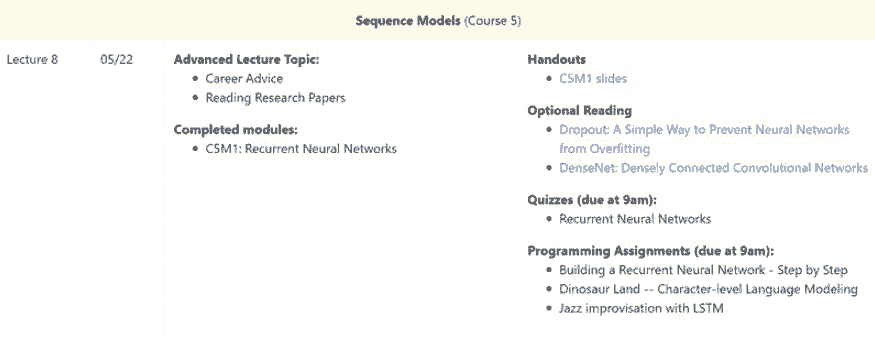

这一部分先简单概述深度强化学习，然后开始以自然语言处理和词嵌入为主题，进一步讲解 RNN 的进阶应用。词嵌入是很多自然语言处理模型的基础，这一部分以词嵌入为主，强调了词嵌入技术的迁移学习作用，然后介绍几个经典的词嵌入模型，例如 Word2Vec、GloVe word vectors 等，最后以情感分类作为应用案例。

在 C5M1 中，吴恩达重点解释了循环神经网络，循环神经网络是一类用于处理序列问题的神经网络，它可以扩展到更长的序列。循环网络相比经典的全连接网络有非常大的提升，例如参数共享和构建长期依赖关系等。对于语句的序列建模，全连接网络会给每个输入特征分配一个单独的参数，所以它需要分别学习句子每个位置的所有语言规则。而循环神经网络会在多个时间步内共享相同的参数，因此不必学习句子每个位置的所有语言规则。此外，循环网络会有一个记忆机制为当前时间步的预测提供前面时间步的信息。

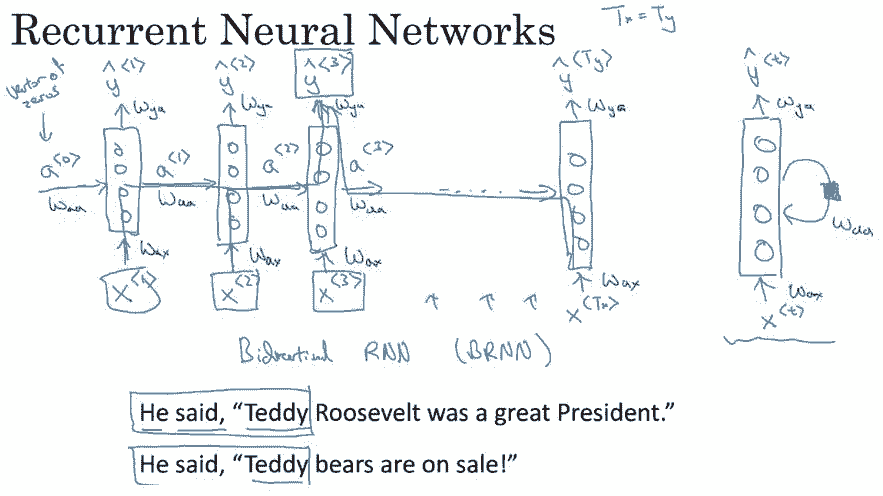

如上展示了循环网络的基本结构，它只使用前一个时间步的隐藏单元信息和当前时间步的输入信息，并利用相同的函数计算下一个隐藏单元的值。

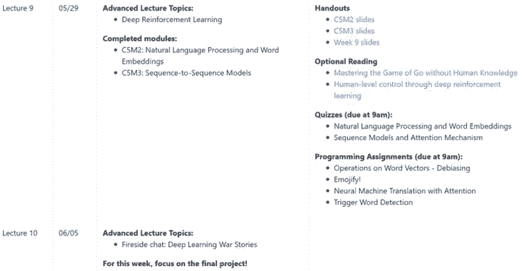

完成这些课程后，就可以开始准备最终项目了。

****本文为机器之心整理，**转载请联系本公众号获得授权****。**

✄------------------------------------------------

**加入机器之心（全职记者 / 实习生）：hr@jiqizhixin.com**

**投稿或寻求报道：**content**@jiqizhixin.com**

**广告 & 商务合作：bd@jiqizhixin.com**