# 深度学习贝叶斯，这是一份密集的 6 天速成课程（视频与 PPT）

选自 GitHub

**Bayesian Methods Research Group**

**机器之心整理**

> 在 Deep|Bayes 夏季课程中，授课人将讨论贝叶斯方法如何结合深度学习，并在机器学习应用中实现更好的结果。近期研究表明贝叶斯方法的利用可以带来许多好处。学生将学到对理解当前机器学习研究非常重要的方法和技术。他们还将体会贝叶斯方法和强化学习之间的联系，学习神经网络的现代随机优化方法和正则化技术。在课程之后，授课人还设置了实践环节。

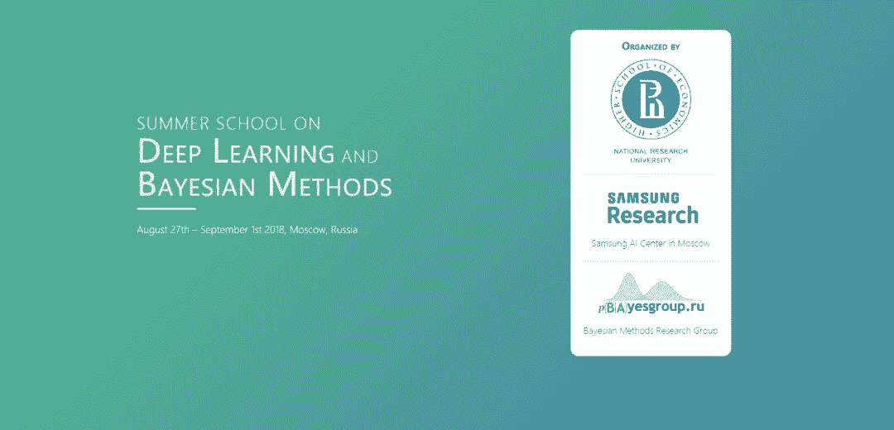

*   项目地址：https://github.com/bayesgroup/deepbayes-2018

*   视频地址：https://www.youtube.com/playlist?list=PLe5rNUydzV9Q01vWCP9BV7NhJG3j7mz62

*   PPT 地址：https://drive.google.com/drive/folders/1rJ-HTN3sNTvhJXPoXEEhfGlZWtjNY26C

**教师**

多数讲师和助教都是贝叶斯方法研究团队的成员以及来自世界顶级研究中心的研究者。很多讲师曾经在顶级国际机器学习会议例如 NIPS、ICML、ICCV、CVPR、ICLR、AISTATS 等发表过论文。贝叶斯方法研究团队已经开发了一系列的大学课程，包括贝叶斯方法、深度学习、优化以及概率图模型，拥有大量的教学经验。

**学生**

该夏季课程面向：

*   本科生（最好已完成至少两年的大学课程），以及拥有很强数学背景、具备足够机器学习知识（包括深度学习）的硕士生。

*   想要扩展知识和技能的机器学习领域或相关领域研究者和行业专家。

**学习本课程的必备基础**

1.  机器学习的扎实基础，熟悉深度学习。

2.  数学：熟练线性代数和概率论（很重要）。

3.  编程：Python、PyTorch 和 NumPy。

4.  Deep|Bayes 2018 夏季课程中使用英语，因此学生应该熟悉技术英语。

**我在 Deep|Bayes 能学到什么？**

*   贝叶斯方法为什么（在机器学习和日常生活中）这么有用？随机性到底是什么？

*   隐变量模型。如何训练模型识别在训练前未知的模式？

*   可扩展的概率模型。为什么将概率推断问题转换为优化问题是有用的？

*   强化学习和贝叶斯方法之间的联系。如何训练随机计算图？

*   自动 Dropout 率的微调。神经网络会过拟合吗？（会的）

*   随机优化。如何以比计算一个点的函数值更快的速度来优化函数？

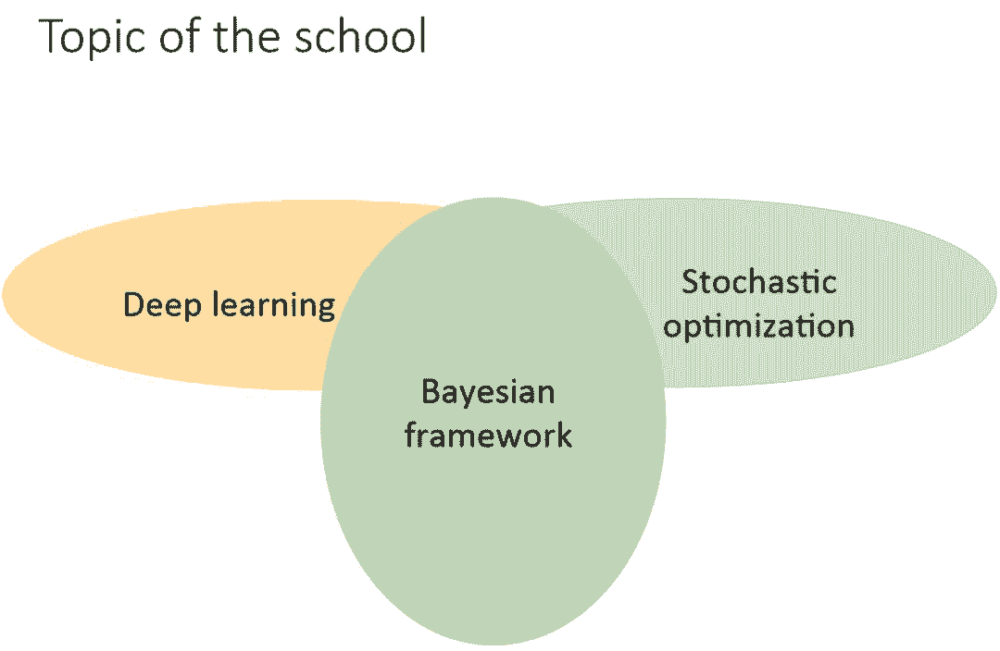

该课程的目标是展示在深度学习中使用贝叶斯方法可以扩展其应用范围，并提升性能。尽管机器学习中有很多不同的问题设定，但贝叶斯网络的概率推断可以用相似的方式来解决它们。你，心动了吗？

**课程主要内容**

整个课程涉及贝叶斯学习的方方面面，从最基础的贝叶斯原理到比较难的变分推断和马尔可夫链蒙特卡洛方法。以下展示了整个课程的主题列表，机器之心将简要介绍部分课程内容。

**第一天：**

*   贝叶斯方法简介

*   贝叶斯推理

*   隐变量模型和 EM 算法

*   EM 算法

**第二天：**

*   随机优化简介

*   可扩展贝叶斯方法

*   变分自编码器

*   狄利克雷隐变量

**第三天：**

*   变分推断高级方法

*   变分推断视角下的强化学习

*   强化学习

*   分布式强化学习

**第四天：**

*   生成模型

*   对抗学习

*   扩展再参数化的技巧

**第五天：**

*   高斯过程

*   贝叶斯优化

*   深度高斯过程

*   马尔可夫链蒙特卡洛方法

*   随机马尔可夫链蒙特卡洛方法

**第六天：**

*   贝叶斯神经网络和变分 Dropout

*   稀疏变分 Dropout 和方差网络

*   信息瓶颈

整个课程需要六天才能完成，且每一天的的课程量都非常大，因此机器之心只简要介绍最基本的贝叶斯方法和隐变量模型，其中贝叶斯方法是整个课程的核心思想，而隐变量模型又是生成模型等很多高级方法的基础。

**贝叶斯方法简介**

我们首先围绕「盲人摸象」的例子来介绍贝叶斯定理，然后简单描述频率学派和贝叶斯学派的区别。

1 贝叶斯定理：

首先贝叶斯定理的基本形式为

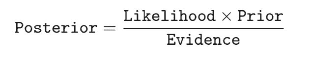

即后验=似然度 x 先验/证据

形式化的样子是

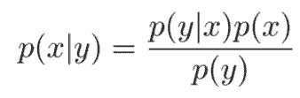

现在我们开始讨论「盲人摸象」问题。

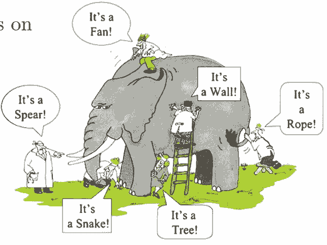

一群「盲人」在摸一头大象，试图猜测摸的是什么东西，然而没有一个人猜的是正确的。在不确定的世界里，这就是我们在用概率论理解世界时的样子。

为简单起见，我们把问题设置得简单一些：一群「盲人」在摸一头大象，并且知道这是一头大象，他们希望根据摸到的东西猜测大象的重量。

贝叶斯方法是怎么解决这个问题的呢？

我们假设这些盲人之间会互相交流观察结果，并且都拥有一定的共同常识，也就是对大象重量的最初猜测：

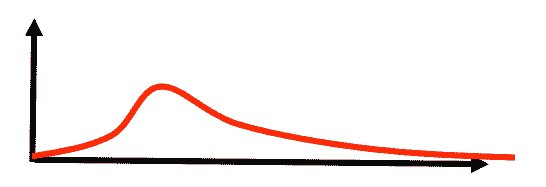

然后他们可以这样：

第一个人的观察结果是摸到了尾巴，以及尾巴的长度 y1，然后重新猜测大象的重量；

第二个人将第一个人的猜测作为先验，并且观察结果是摸到了肚子，以及肚子的面积 y2，然后再次猜测大象的重量；

第三个人同理，根据第二个人的猜测，继续观察、猜测……

在此过程中，他们一开始的共有常识、大象的猜测重量即先验 P(x)，第一个人的观察结果即似然度 P(y1|x)，观察结果本身出现的可能性就是证据 P(y1)，最后就得到的是 P(x|y1)，也就是根据观察结果 y 得到的大象重量为 x 的可能性（概率分布）：

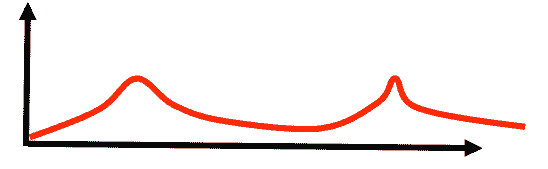

而第二个人在此基础上，将能得到 P(x|y1,y2)：

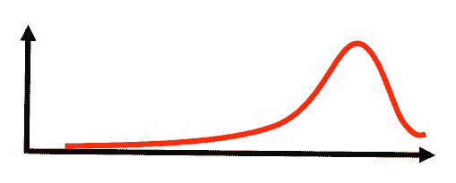

第三个人将能得到 P(x|y1,y2,y3)……

好了，随着观察报告的增加，这头大象的重量也越来越藏不住了（峰值变得尖锐）：

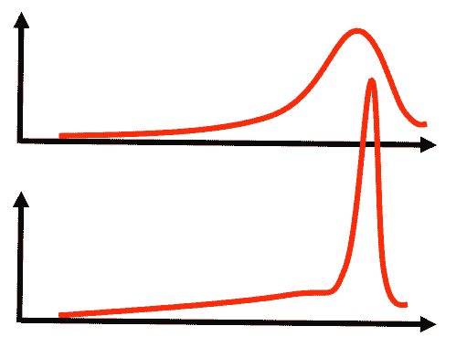

当然，授课人在课程中会很详细地把概念一步一步讲清楚，包括条件分布、联合分布、边缘分布之间的关系，以及乘积规则、和规则的介绍，可以把上面这个例子涉及的各个概念串联起来，帮助学生理解得更加透彻。

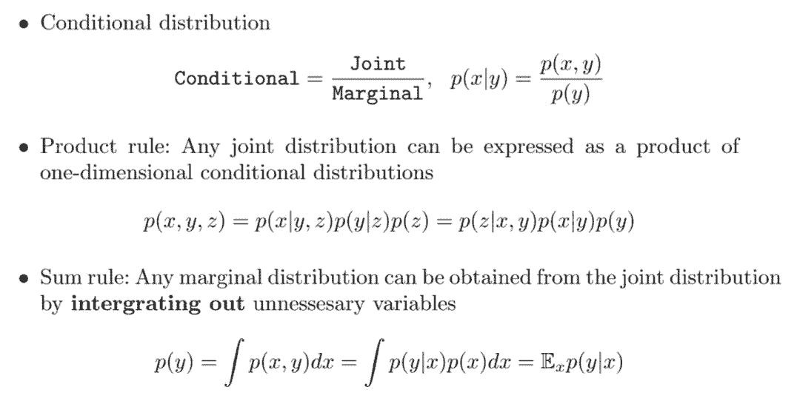

2 频率学派和贝叶斯学派的联系和区别：

频率学派不假设任何的先验知识，不参照过去的经验，只按照当前已有的数据进行概率推断。而贝叶斯学派会假设先验知识的存在（猜测大象的重量），然后再用采样逐渐修改先验知识并逼近真实知识。但实际上，在数据量趋近无穷时，频率学派和贝叶斯学派得到的结果是一样的，也就是说频率方法是贝叶斯方法的极限。

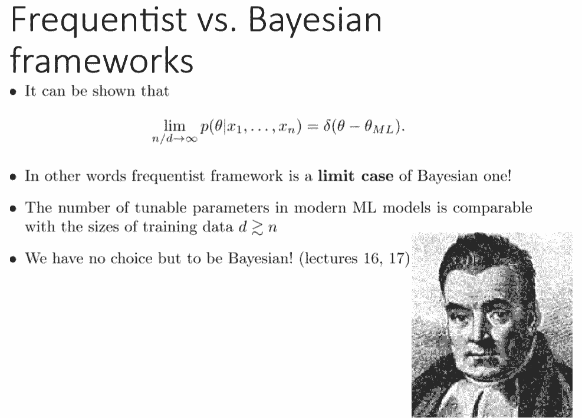

以上就是贝叶斯方法的基础理论部分的大致内容，之后还有生成、判别模型的区别，贝叶斯训练过程以及贝叶斯方法优势的讨论。

**隐变量模型**

前面简要介绍了贝叶斯方法的核心思想贝叶斯定理，而在这一章节中，Dmitry Vetrov 重点介绍了隐变量模型。隐变量模型是很多复杂方法的基础，例如在变分自编码器这一生成模型中，我们希望将图像压缩为一系列的隐变量，这些隐变量表示了图像的高级语义信息，例如图像主体的倾角、颜色和位置等。

这一部分我们会根据 Dmitry Vetrov 介绍的内容讨论隐变量模型的直观概念、KL 散度、混合分布和变分下界等。

如前所述，VAE 最大的优势即中间编码的短向量代表了图像的某些语义特征，但又因为我们不能明确地知道具体是哪些图像特征，因此我们可以把这个短向量称之为隐变量。直观上来说，完全从整体上一个个像素生成图像是非常困难的，因为我们需要考虑的可能性太多。而如果先决定要生成图像的特征，再根据这幅蓝图生成图像就会容易很多。

VAE 正是这样，先学习如何将图像正确地压缩为一组隐变量，然后再学习如何根据隐变量生成图像。当模型完成学习后，我们给定任意一组隐变量，模型都会尝试生成正确的图像。这也就是隐变量模型的直观概念。

KL 散度一般作为两个分布间距离的度量方法，它常用于生成模型的损失函数。以下展示了 KL 散度的直观理解，即分布 Q(z) 与分布 P(Z) 之间越重合，那么 KL 散度就越小，两个分布之间的距离就越近。

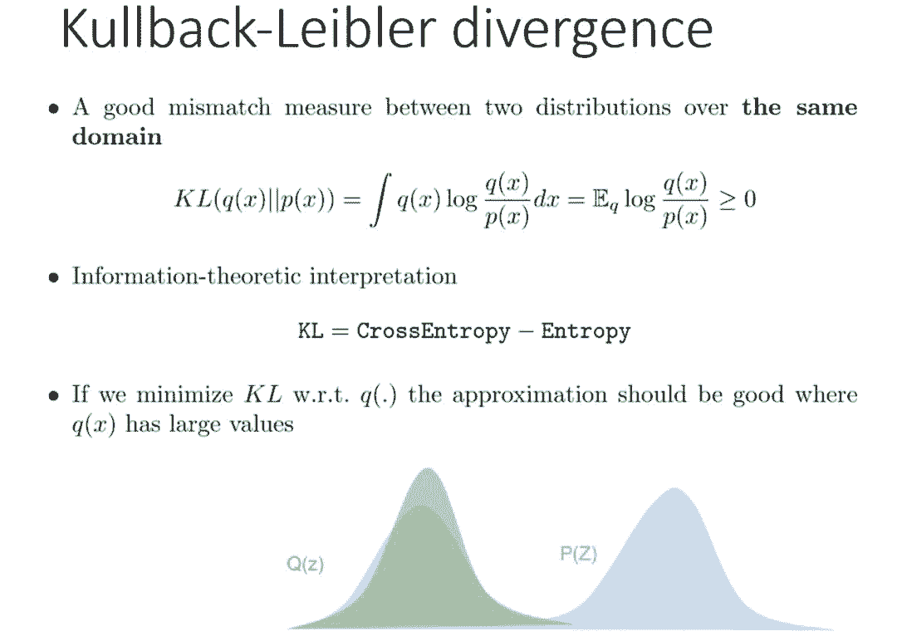

在离散型变量的情况下，KL 散度衡量的是，当我们使用一种被设计成能够使概率分布 Q 产生的消息的长度最小的编码，发送包含由概率分布 P 产生的符号的消息时，所需要的额外信息量。KL 散度有很多有用的性质，最重要的是它是非负的。KL 散度为 0 当且仅当 P 和 Q 在离散型变量的情况下是相同的分布，或者在连续型变量的情况下是 『几乎处处』相同的。

随后 Dmitry Vetrov 展示了隐变量建模的案例，如果我们有一些服从未知高斯分布的样本，那么我们可以用最大似然估计或点估计等方法将该未知分布的均值和方差推断出来。

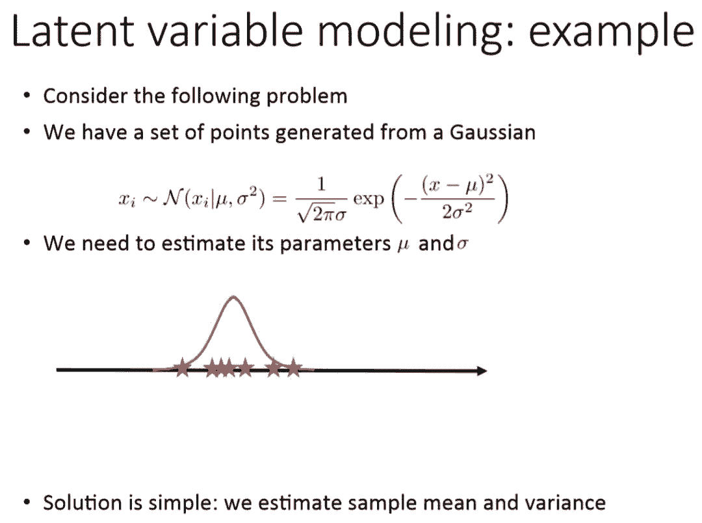

而现在如果我们假设有一组采自不同高斯分布的样本，且我们需要估计这些高斯分布的参数。这个问题看上去不能解决，但如果我们知道哪些样本是从具体哪一个高斯分布中采样，这个问题就比较容易解决。

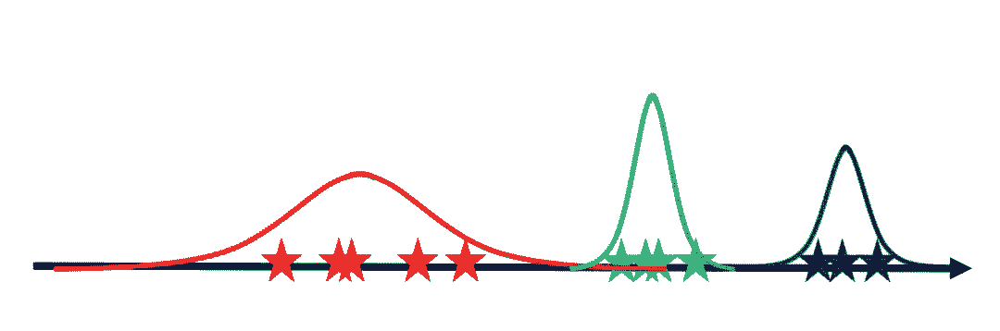

但是如果我们不知道样本是从哪个高斯分布中采样的，那么我们就只能使用隐变量模型。它主要的思想即先估计这些样本属于哪一个高斯分布，也就是将样本映射到隐变量「均值」和「方差」。然后再基于隐变量完成对三个高斯分布的建模。

随后顺着这个想法，我们可以构建一个混合高斯模型，并希望将数据编码为隐变量 Z，再根据该隐变量完成建模。如下所示当我们不知道隐变量 Z 的情况下，最大化从 Z 中采样出样本 X 的概率，就能推导出最大化变分下界，这也是变分自编码器最核心的表达式。

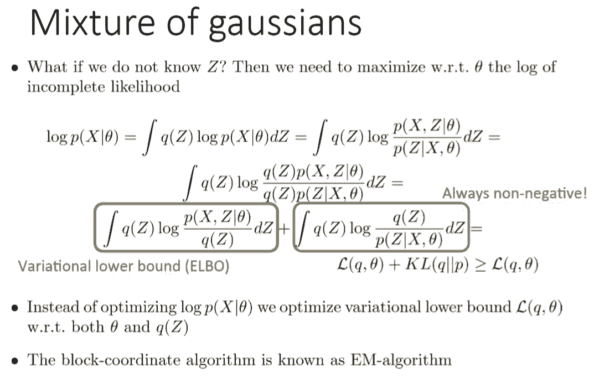

变分自编码器中最大化变分下界（ELBO）就可以作为整个模型的优化目标，或者说整个模型的损失函数。在上面的案例中，最大化这个变分下界就代表着找出一些高斯分布，且每一个样本都最可能属于某个高斯分布。

整个课程介绍了非常多的理论知识，尤其是关于贝叶斯学派的各种理论。如果读者对数学比较有自信的话，可以详细学一学该系列教程。

**扫描下图二维码，参与 Arm 人工智能开发者全球峰会↓**

