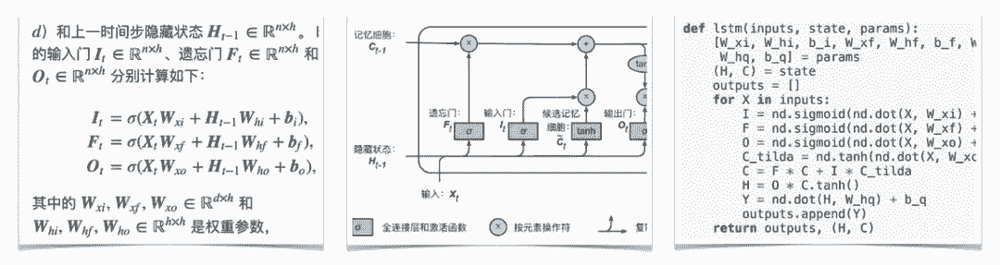

# 资源 | 李沐等人开源中文书《动手学深度学习》预览版上线

机器之心报道

**参与：李泽南、张倩**

> 获得这本实体书最好的方法就是成为贡献者。

近日，由 Aston Zhang、李沐等人所著图书《动手学深度学习》放出了在线预览版，以供读者自由阅读。这是一本面向在校学生、工程师和研究人员的交互式深度学习书籍。

*   在线书地址：https://zh.diveintodeeplearning.org/index.html

*   GitHub 项目：https://github.com/diveintodeeplearning/d2l-zh

这本书是亚马逊 MXNet 零基础深度学习课程的重要组成部分。课程内容推荐使用 Apache MXNet 的前端工具 Gluon 进行开发，可指导你在动手实践的过程中学会使用简单易读的代码，写出产品级的应用。

值得一提的是，该书以 Jupyter 记事本的形式呈现，读者可以操作其中的代码和超参数来获取及时反馈，以此提高学习效率。

**贡献者**

本书的贡献者包括多位供职于亚马逊的科学家：

李沐：亚马逊首席科学家，美国卡内基梅隆大学计算机系博士。

阿斯顿·张：亚马逊应用科学家，美国伊利诺伊大学香槟分校计算机科学博士。

扎卡里 C. 立顿：亚马逊应用科学家，美国卡内基梅隆大学助理教授，加州大学圣迭戈分校计算机科学博士。

亚历山大 J. 斯莫拉：亚马逊 ML 总监，德国柏林工业大学计算机科学博士。

此外，本书在开源社区还有 100 余位贡献者。作者表示，这一在线书「项目」仍然在不断发展当中，成为贡献者将可以获得专享版赠书，并被致谢。

**交互：Jupyter 记事本+活跃的社区支持**

每一小节都是可以运行的 Jupyter 记事本，你可以自由修改代码和超参数来获取及时反馈，从而积累深度学习的实战经验。

*   Jupyter 记事本下载地址：http://zh.diveintodeeplearning.org/d2l-zh.zip

[`v.qq.com/iframe/preview.html?width=500&height=375&auto=0&vid=b13531to52r`](https://v.qq.com/iframe/preview.html?width=500&height=375&auto=0&vid=b13531to52r)

本书还有活跃的社区支持，可以通过每个章节最后的链接来同社区的数千名小伙伴一起讨论学习。

[`v.qq.com/iframe/preview.html?width=500&height=375&auto=0&vid=s13530z3c2m`](https://v.qq.com/iframe/preview.html?width=500&height=375&auto=0&vid=s13530z3c2m)

**结构：公式 + 图示 + 代码**

本书不仅结合文字、公式和图示来阐明深度学习里常用的模型和算法，还提供代码来演示如何从零开始实现它们，并使用真实数据来提供一个交互式的学习体验。

这三种展示方法能相互补充，很多算法可以通过图示加深对结构的理解，而如上图所示的 LSTM 等算法却需要公式才能理解具体结构。此外，不论是表达式还是图例，它们都不能包含完整的细节，很多具体细节不用代码是展示不出来的。

**目录**

引言

*   前言

*   深度学习简介

*   如何使用本书

预备知识

*   获取和运行本书代码

*   数据操作

*   自动求梯度

*   查阅 MXNet 文档

深度学习基础

*   线性回归

*   线性回归的从零开始实现

*   线性回归的 Gluon 实现

*   Softmax 回归

*   图像分类数据集（Fashion-MNIST）

*   Softmax 回归的从零开始实现

*   Softmax 回归的 Gluon 实现

*   多层感知机

*   多层感知机的从零开始实现

*   多层感知机的 Gluon 实现

*   模型选择、欠拟合和过拟合

*   权重衰减

*   丢弃法

*   正向传播、反向传播和计算图

*   数值稳定性和模型初始化

*   实战 Kaggle 比赛：房价预测

深度学习计算

*   模型构造

*   模型参数的访问、初始化和共享

*   模型参数的延后初始化

*   自定义层

*   读取和存储

*   GPU 计算

卷积神经网络

*   二维卷积层

*   填充和步幅

*   多输入通道和多输出通道

*   池化层

*   卷积神经网络（LeNet）

*   深度卷积神经网络（AlexNet）

*   使用重复元素的网络（VGG）

*   网络中的网络（NiN）

*   含并行连结的网络（GoogLeNet）

*   批量归一化

*   残差网络（ResNet）

*   稠密连接网络（DenseNet）

循环神经网络

*   语言模型

*   循环神经网络

*   语言模型数据集（周杰伦专辑歌词）

*   循环神经网络的从零开始实现

*   循环神经网络的 Gluon 实现

*   通过时间反向传播

*   门控循环单元（GRU）

*   长短期记忆（LSTM）

*   深度循环神经网络

*   双向循环神经网络

优化算法

*   优化与深度学习

*   梯度下降和随机梯度下降

*   小批量随机梯度下降

*   动量法

*   Adagrad

*   RMSProp

*   Adadelta

*   Adam

计算性能

*   命令式和符号式混合编程

*   异步计算

*   自动并行计算

*   多 GPU 计算

*   多 GPU 计算的 Gluon 实现

计算机视觉

*   图像增广

*   微调

*   目标检测和边界框

*   锚框

*   多尺度目标检测

*   目标检测数据集（皮卡丘）

*   单发多框检测（SSD）

*   区域卷积神经网络（R-CNN）系列

*   语义分割和数据集

*   全卷积网络（FCN）

*   样式迁移

*   实战 Kaggle 比赛：图像分类（CIFAR-10）

*   实战 Kaggle 比赛：狗的品种识别 (ImageNet Dogs)

自然语言处理

*   词嵌入（word2vec）

*   近似训练

*   Word2vec 的实现

*   子词嵌入（fastText）

*   全局向量的词嵌入（GloVe）

*   求近义词和类比词

*   文本情感分类：使用循环神经网络

*   文本情感分类：使用卷积神经网络（textCNN）

*   编码器—解码器（seq2seq）

*   束搜索

*   注意力机制

*   机器翻译

附录

*   主要符号一览

*   数学基础

*   使用 Jupyter 笔记本

*   使用 AWS 运行代码

*   GPU 购买指南

*   如何为本书贡献

*   gluonbook 包索引

<mp-miniprogram class="miniprogram_element" data-miniprogram-appid="wxf424e2f3e2f94500" data-miniprogram-path="pages/resource/resource?id=17c37e82-3601-4770-a8e7-3b88f8d8680a&amp;from=weapp" data-miniprogram-nickname="机器之心 Synced" data-miniprogram-avatar="http://mmbiz.qpic.cn/mmbiz_png/f3g058loLBj0Pib4UhuCFagffSB1RHImwskFzvic6mSp2LDhuerbXxeqqv0b63wSt2Pas7MicNWIcia358rlnhiaVag/640?wx_fmt=png&amp;wxfrom=200" data-miniprogram-title="GluonCV" data-miniprogram-imageurl="http://mmbiz.qpic.cn/mmbiz_jpg/KmXPKA19gWicYUdbXDYIOy8r86xy1F25AeUY3VW3grlDqFBuTHDoa6HmfElzKx5EmLdOa0lHOib3YibJjw10TEJ8Q/0?wx_fmt=jpeg"></mp-miniprogram>

在本书上线之前，李沐等人还推出了《动手学深度学习》系列视频，这门课程的第一季已经于今年 2 月份结束，共 19 课。李沐博士对此系列视频进行了整理，有需求的同学可通过以下视频学习。

*   课程视频：https://space.bilibili.com/209599371/#/channel/detail?cid=23541

****本文为机器之心报道，**转载请联系本公众号获得授权****。**

✄------------------------------------------------

**加入机器之心（全职记者 / 实习生）：hr@jiqizhixin.com**

**投稿或寻求报道：**content**@jiqizhixin.com**

**广告 & 商务合作：bd@jiqizhixin.com**